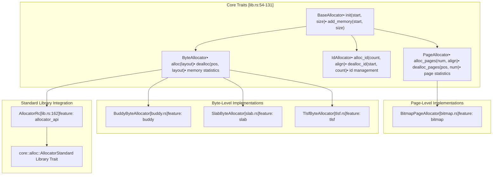
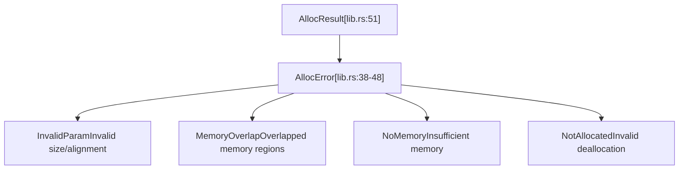

# Allocator Implementations

> **Relevant source files**
> * [src/lib.rs](https://github.com/arceos-org/allocator/blob/1d5b7a1b/src/lib.rs)

This document provides an overview of the different memory allocator implementations available in the allocator crate. It explains how each implementation relates to the trait system and their intended use cases within the unified allocator interface.

For detailed information about the core trait architecture that these implementations use, see [Architecture and Design](/arceos-org/allocator/2-architecture-and-design). For usage guidance and feature configuration, see [Usage and Configuration](/arceos-org/allocator/4-usage-and-configuration).

## Implementation Overview

The allocator crate provides four distinct allocator implementations, each optimized for different allocation patterns and granularities. These implementations are feature-gated, allowing users to compile only the allocators they need.

### Implementation Categories

The implementations are organized according to the three main allocator trait categories:

|Implementation|Trait Category|Granularity|Feature Gate|Use Case|
| --- | --- | --- | --- | --- |
|BitmapPageAllocator|PageAllocator|Page-level|bitmap|Large contiguous allocations|
|BuddyByteAllocator|ByteAllocator|Byte-level|buddy|General-purpose with low fragmentation|
|SlabByteAllocator|ByteAllocator|Byte-level|slab|Fixed-size object allocation|
|TlsfByteAllocator|ByteAllocator|Byte-level|tlsf|Real-time systems requiring deterministic allocation|

### Implementation Architecture



Sources: [src/lib.rs(L1 - L197)&emsp;](https://github.com/arceos-org/allocator/blob/1d5b7a1b/src/lib.rs#L1-L197)

### Feature-Gated Compilation

```

```

Sources: [src/lib.rs(L14 - L32)&emsp;](https://github.com/arceos-org/allocator/blob/1d5b7a1b/src/lib.rs#L14-L32) [src/lib.rs(L151 - L196)&emsp;](https://github.com/arceos-org/allocator/blob/1d5b7a1b/src/lib.rs#L151-L196)

## Allocator Characteristics

### Memory Granularity Comparison

The implementations operate at different levels of granularity, affecting their suitability for different use cases:

#### Byte-Level Allocators

* **`BuddyByteAllocator`**: Uses buddy system algorithm for efficient memory management with power-of-two sized blocks
* **`SlabByteAllocator`**: Optimized for allocating many objects of the same size with minimal overhead
* **`TlsfByteAllocator`**: Two-Level Segregated Fit algorithm providing constant-time allocation suitable for real-time systems

#### Page-Level Allocators

* **`BitmapPageAllocator`**: Manages memory at page granularity using bitmap tracking for large contiguous allocations

### Error Handling

All implementations use the unified error handling system defined in the core traits:



Sources: [src/lib.rs(L37 - L51)&emsp;](https://github.com/arceos-org/allocator/blob/1d5b7a1b/src/lib.rs#L37-L51)

## Implementation Selection Guide

### Performance Characteristics

|Allocator|Allocation Speed|Deallocation Speed|Memory Overhead|Fragmentation Resistance|
| --- | --- | --- | --- | --- |
|BuddyByteAllocator|O(log n)|O(log n)|Moderate|Good|
|SlabByteAllocator|O(1)|O(1)|Low|Excellent (same-size)|
|TlsfByteAllocator|O(1)|O(1)|Low|Good|
|BitmapPageAllocator|O(n)|O(1)|Very low|Excellent|

### Use Case Recommendations

* **General-purpose applications**: `BuddyByteAllocator` provides good balance of performance and memory efficiency
* **Object-oriented systems with many same-sized allocations**: `SlabByteAllocator` excels at allocating uniform objects
* **Real-time systems**: `TlsfByteAllocator` offers deterministic allocation times
* **Systems requiring large contiguous memory blocks**: `BitmapPageAllocator` efficiently manages page-sized allocations

## Standard Library Integration

The `AllocatorRc` wrapper enables integration with Rust's standard library allocator API when the `allocator_api` feature is enabled. This allows byte allocators to be used with standard collections and memory management primitives.

The wrapper implements the `core::alloc::Allocator` trait by wrapping any `ByteAllocator` implementation in `Rc<RefCell<_>>` for shared access patterns typical in standard library usage.

Sources: [src/lib.rs(L151 - L196)&emsp;](https://github.com/arceos-org/allocator/blob/1d5b7a1b/src/lib.rs#L151-L196)

## Implementation Details

For detailed documentation of each allocator implementation, including algorithm specifics, configuration options, and usage examples:

* [Bitmap Page Allocator](/arceos-org/allocator/3.1-bitmap-page-allocator) - Page-granularity allocation using bitmap tracking
* [Buddy System Allocator](/arceos-org/allocator/3.2-buddy-system-allocator) - Binary tree-based allocation with buddy merging
* [Slab Allocator](/arceos-org/allocator/3.3-slab-allocator) - Cache-friendly allocation for uniform object sizes
* [TLSF Allocator](/arceos-org/allocator/3.4-tlsf-allocator) - Two-level segregated fit for real-time constraints