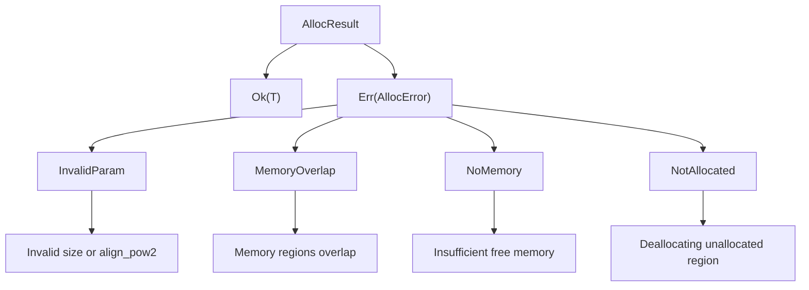
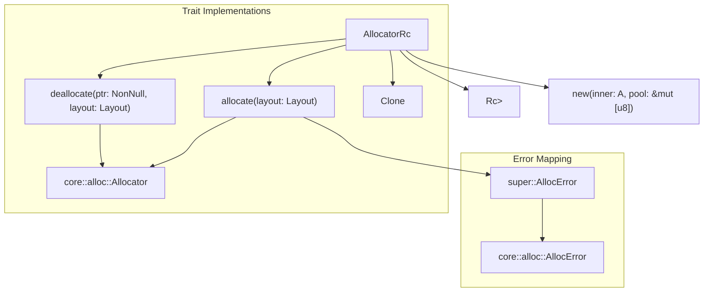
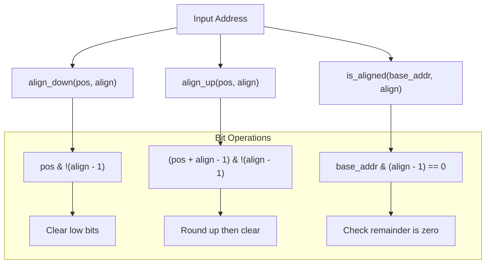

# Architecture and Design

> **Relevant source files**
> * [src/lib.rs](https://github.com/arceos-org/allocator/blob/1d5b7a1b/src/lib.rs)

This page documents the core architectural design of the allocator crate, including its trait-based interface system, error handling mechanisms, and feature-gated compilation model. The design provides a unified API for different memory allocation algorithms while maintaining modularity and minimal dependencies.

For implementation details of specific allocators, see [Allocator Implementations](/arceos-org/allocator/3-allocator-implementations). For practical usage guidance, see [Usage and Configuration](/arceos-org/allocator/4-usage-and-configuration).

## Core Trait Hierarchy

The allocator crate employs a trait-based architecture that separates allocation concerns by granularity and use case. All allocators inherit from a common `BaseAllocator` trait and specialize into three distinct categories.

### Trait System Overview

```mermaid
flowchart TD
subgraph Methods["Methods"]
    BaseAllocator["BaseAllocator"]
    ByteAllocator["ByteAllocator"]
    PageAllocator["PageAllocator"]
    IdAllocator["IdAllocator"]
    init["init(start, size)"]
    add_memory["add_memory(start, size)"]
    alloc["alloc(layout)"]
    dealloc["dealloc(pos, layout)"]
    total_bytes["total_bytes()"]
    used_bytes["used_bytes()"]
    available_bytes["available_bytes()"]
    alloc_pages["alloc_pages(num_pages, align_pow2)"]
    dealloc_pages["dealloc_pages(pos, num_pages)"]
    total_pages["total_pages()"]
    alloc_id["alloc_id(count, align_pow2)"]
    dealloc_id["dealloc_id(start_id, count)"]
    is_allocated["is_allocated(id)"]
end
BuddyByteAllocator["BuddyByteAllocator"]
SlabByteAllocator["SlabByteAllocator"]
TlsfByteAllocator["TlsfByteAllocator"]
BitmapPageAllocator["BitmapPageAllocator"]

BaseAllocator --> ByteAllocator
BaseAllocator --> IdAllocator
BaseAllocator --> PageAllocator
BaseAllocator --> add_memory
BaseAllocator --> init
ByteAllocator --> BuddyByteAllocator
ByteAllocator --> SlabByteAllocator
ByteAllocator --> TlsfByteAllocator
ByteAllocator --> alloc
ByteAllocator --> available_bytes
ByteAllocator --> dealloc
ByteAllocator --> total_bytes
ByteAllocator --> used_bytes
IdAllocator --> alloc_id
IdAllocator --> dealloc_id
IdAllocator --> is_allocated
PageAllocator --> BitmapPageAllocator
PageAllocator --> alloc_pages
PageAllocator --> dealloc_pages
PageAllocator --> total_pages
```



**Sources:** [src/lib.rs(L54 - L131)&emsp;](https://github.com/arceos-org/allocator/blob/1d5b7a1b/src/lib.rs#L54-L131)

### BaseAllocator Trait

The `BaseAllocator` trait provides fundamental memory management operations shared by all allocator types:

|Method|Purpose|Parameters|
| --- | --- | --- |
|init()|Initialize allocator with initial memory region|start: usize, size: usize|
|add_memory()|Add additional memory regions|start: usize, size: usize→AllocResult|

**Sources:** [src/lib.rs(L54 - L60)&emsp;](https://github.com/arceos-org/allocator/blob/1d5b7a1b/src/lib.rs#L54-L60)

### ByteAllocator Trait

The `ByteAllocator` trait handles byte-granularity allocation using Rust's `Layout` type for size and alignment specification:

|Method|Purpose|Return Type|
| --- | --- | --- |
|alloc()|Allocate memory with layout constraints|AllocResult<NonNull<u8>>|
|dealloc()|Deallocate previously allocated memory|()|
|total_bytes()|Query total memory pool size|usize|
|used_bytes()|Query currently allocated bytes|usize|
|available_bytes()|Query remaining available bytes|usize|

**Sources:** [src/lib.rs(L62 - L78)&emsp;](https://github.com/arceos-org/allocator/blob/1d5b7a1b/src/lib.rs#L62-L78)

### PageAllocator Trait

The `PageAllocator` trait manages memory at page granularity with configurable page sizes:

|Method|Purpose|Parameters|
| --- | --- | --- |
|alloc_pages()|Allocate contiguous pages|num_pages: usize, align_pow2: usize|
|alloc_pages_at()|Allocate pages at specific address|base: usize, num_pages: usize, align_pow2: usize|
|dealloc_pages()|Deallocate page range|pos: usize, num_pages: usize|

**Sources:** [src/lib.rs(L80 - L107)&emsp;](https://github.com/arceos-org/allocator/blob/1d5b7a1b/src/lib.rs#L80-L107)

### IdAllocator Trait

The `IdAllocator` trait provides unique identifier allocation with support for fixed ID assignment:

|Method|Purpose|Return Type|
| --- | --- | --- |
|alloc_id()|Allocate contiguous ID range|AllocResult<usize>|
|alloc_fixed_id()|Reserve specific ID|AllocResult|
|is_allocated()|Check ID allocation status|bool|

**Sources:** [src/lib.rs(L109 - L131)&emsp;](https://github.com/arceos-org/allocator/blob/1d5b7a1b/src/lib.rs#L109-L131)

## Error Handling System

The crate implements a comprehensive error handling system using custom error types that map to common allocation failure scenarios.

### AllocError Enumeration



**Sources:** [src/lib.rs(L37 - L51)&emsp;](https://github.com/arceos-org/allocator/blob/1d5b7a1b/src/lib.rs#L37-L51)

### Error Categories

|Error Variant|Trigger Condition|Usage Context|
| --- | --- | --- |
|InvalidParam|Invalid size or alignment parameters|Input validation|
|MemoryOverlap|Overlapping memory regions inadd_memory()|Memory pool expansion|
|NoMemory|Insufficient free memory for allocation|Runtime allocation|
|NotAllocated|Deallocation of unallocated memory|Memory safety|

The `AllocResult<T>` type alias simplifies error handling throughout the API by defaulting to `Result<T, AllocError>`.

**Sources:** [src/lib.rs(L37 - L51)&emsp;](https://github.com/arceos-org/allocator/blob/1d5b7a1b/src/lib.rs#L37-L51)

## Feature-Gated Architecture

The crate uses Cargo features to enable conditional compilation of allocator implementations, minimizing binary size and dependencies for applications that only need specific allocation algorithms.

### Feature-Based Compilation

```

```

**Sources:** [src/lib.rs(L14 - L32)&emsp;](https://github.com/arceos-org/allocator/blob/1d5b7a1b/src/lib.rs#L14-L32) [src/lib.rs(L151 - L196)&emsp;](https://github.com/arceos-org/allocator/blob/1d5b7a1b/src/lib.rs#L151-L196)

### Conditional Compilation Strategy

The feature system works through conditional compilation attributes:

* Each allocator implementation resides in a separate module
* Module inclusion controlled by `#[cfg(feature = "name")]` attributes
* Public re-exports controlled by the same feature flags
* External dependencies only included when corresponding features are enabled

This design allows applications to include only required allocators, reducing binary size and compilation time.

**Sources:** [src/lib.rs(L14 - L32)&emsp;](https://github.com/arceos-org/allocator/blob/1d5b7a1b/src/lib.rs#L14-L32)

## Standard Library Integration

The optional `allocator_api` feature provides integration with Rust's standard library allocator infrastructure through the `AllocatorRc` wrapper.

### AllocatorRc Implementation



**Sources:** [src/lib.rs(L151 - L196)&emsp;](https://github.com/arceos-org/allocator/blob/1d5b7a1b/src/lib.rs#L151-L196)

### Integration Mechanics

The `AllocatorRc` wrapper provides:

|Component|Purpose|Implementation|
| --- | --- | --- |
|Rc<RefCell<A>>|Shared ownership and interior mutability|Enables cloning while maintaining mutable access|
|Allocatortrait|Standard library compatibility|Mapsallocate()/deallocate()to trait methods|
|Error conversion|Error type compatibility|ConvertsAllocErrortocore::alloc::AllocError|
|Zero-size handling|Standard compliance|Returns dangling pointer for zero-size allocations|

**Sources:** [src/lib.rs(L162 - L186)&emsp;](https://github.com/arceos-org/allocator/blob/1d5b7a1b/src/lib.rs#L162-L186)

## Utility Functions

The crate provides alignment utility functions that support the core allocation operations:

### Alignment Operations



**Sources:** [src/lib.rs(L133 - L149)&emsp;](https://github.com/arceos-org/allocator/blob/1d5b7a1b/src/lib.rs#L133-L149)

### Function Specifications

|Function|Purpose|Algorithm|Constraints|
| --- | --- | --- | --- |
|align_down()|Round address down to alignment boundary|pos & !(align - 1)|alignmust be power of two|
|align_up()|Round address up to alignment boundary|(pos + align - 1) & !(align - 1)|alignmust be power of two|
|is_aligned()|Check if address meets alignment requirement|base_addr & (align - 1) == 0|alignmust be power of two|

These functions are marked `const fn` to enable compile-time evaluation and are used throughout the allocator implementations for address calculations.

**Sources:** [src/lib.rs(L133 - L149)&emsp;](https://github.com/arceos-org/allocator/blob/1d5b7a1b/src/lib.rs#L133-L149)