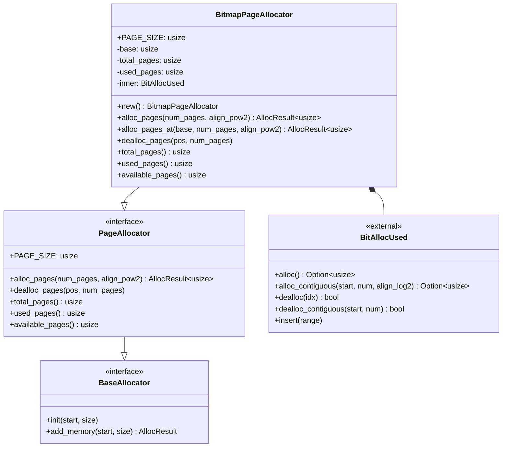
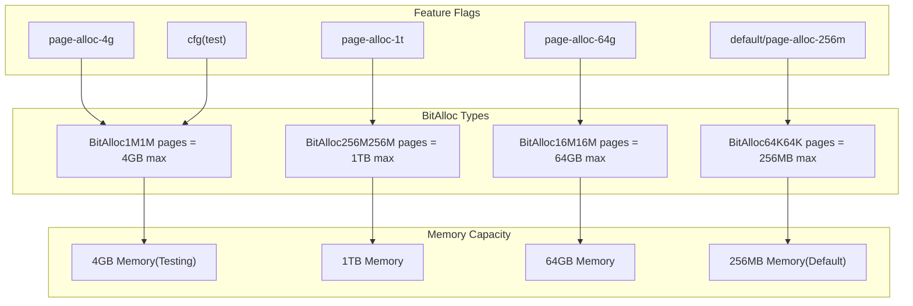
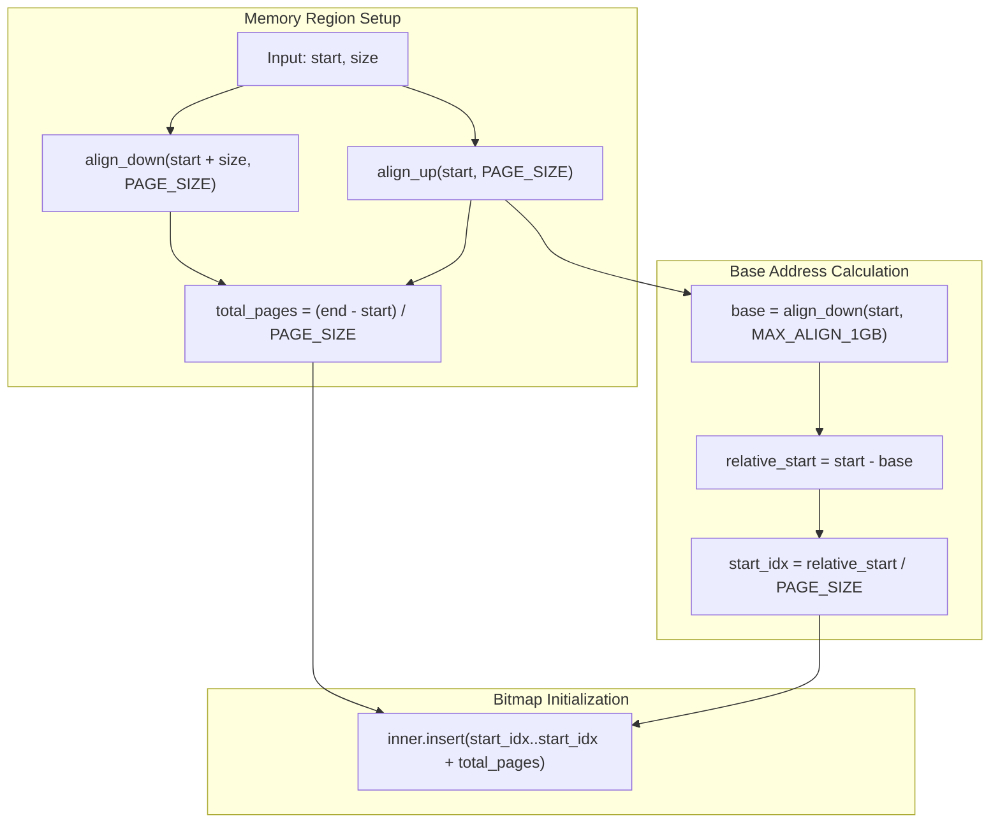
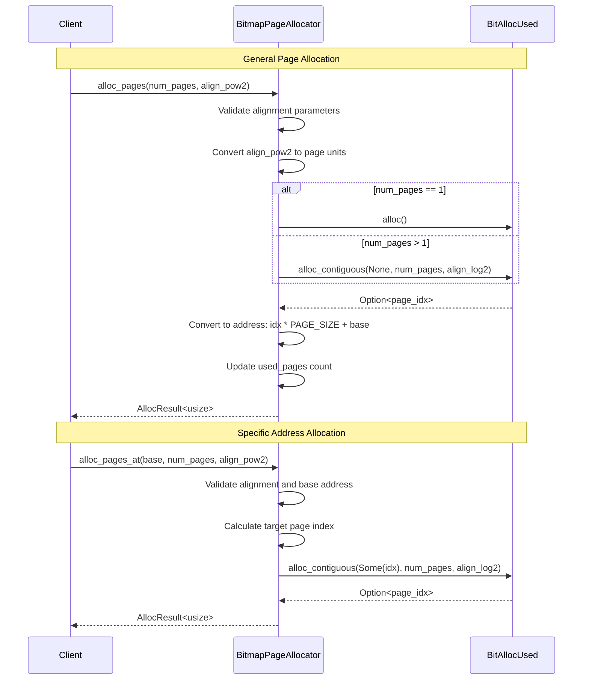
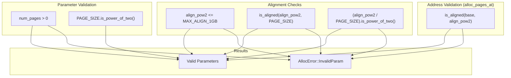
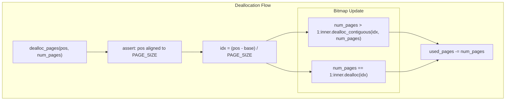
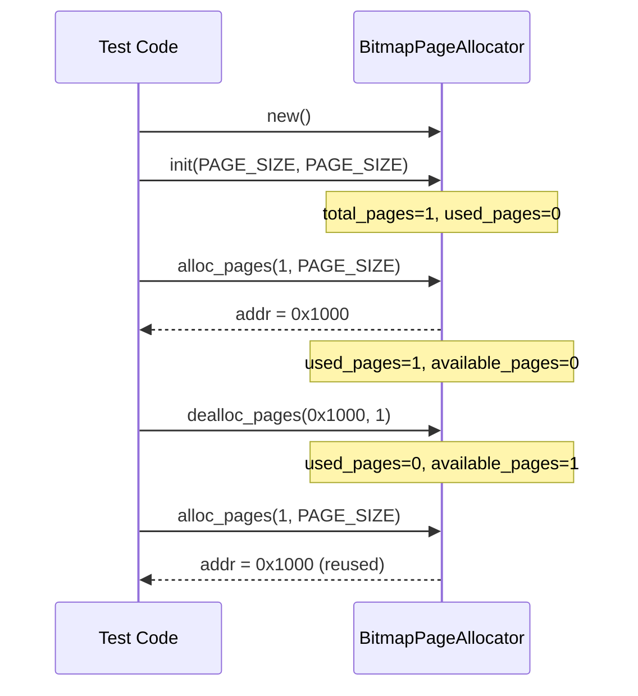

# Bitmap Page Allocator

> **Relevant source files**
> * [src/bitmap.rs](https://github.com/arceos-org/allocator/blob/1d5b7a1b/src/bitmap.rs)

This document covers the `BitmapPageAllocator` implementation, which provides page-granularity memory allocation using a bitmap-based approach. The allocator manages memory in fixed-size pages and uses an external bitmap data structure to track allocation status.

For byte-granularity allocation algorithms, see [Buddy System Allocator](/arceos-org/allocator/3.2-buddy-system-allocator), [Slab Allocator](/arceos-org/allocator/3.3-slab-allocator), and [TLSF Allocator](/arceos-org/allocator/3.4-tlsf-allocator). For broader architectural concepts and trait definitions, see [Architecture and Design](/arceos-org/allocator/2-architecture-and-design).

## Overview and Purpose

The `BitmapPageAllocator` is a page-granularity allocator that internally uses a bitmap where each bit indicates whether a page has been allocated. It wraps the external `bitmap_allocator` crate and implements the `PageAllocator` and `BaseAllocator` traits defined in the core library.

### Core Allocator Structure

Sources: [src/bitmap.rs(L34 - L50)&emsp;](https://github.com/arceos-org/allocator/blob/1d5b7a1b/src/bitmap.rs#L34-L50) [src/bitmap.rs(L53 - L75)&emsp;](https://github.com/arceos-org/allocator/blob/1d5b7a1b/src/bitmap.rs#L53-L75) [src/bitmap.rs(L77 - L160)&emsp;](https://github.com/arceos-org/allocator/blob/1d5b7a1b/src/bitmap.rs#L77-L160)

## Memory Size Configuration

The allocator uses feature flags to configure the maximum memory size it can manage. Different `BitAlloc` implementations from the external `bitmap_allocator` crate are selected based on compilation features.

### Feature-Based BitAlloc Selection

Sources: [src/bitmap.rs(L9 - L26)&emsp;](https://github.com/arceos-org/allocator/blob/1d5b7a1b/src/bitmap.rs#L9-L26)

The configuration table shows the relationship between features and memory limits:

|Feature Flag|BitAlloc Type|Max Pages|Max Memory (4KB pages)|
| --- | --- | --- | --- |
|test|BitAlloc1M|1,048,576|4GB|
|page-alloc-1t|BitAlloc256M|268,435,456|1TB|
|page-alloc-64g|BitAlloc16M|16,777,216|64GB|
|page-alloc-4g|BitAlloc1M|1,048,576|4GB|
|page-alloc-256m(default)|BitAlloc64K|65,536|256MB|

## Core Implementation Details

### Memory Layout and Base Address Calculation

The allocator manages memory regions by calculating a base address aligned to 1GB boundaries and tracking page indices relative to this base.

Sources: [src/bitmap.rs(L54 - L70)&emsp;](https://github.com/arceos-org/allocator/blob/1d5b7a1b/src/bitmap.rs#L54-L70) [src/bitmap.rs(L7)&emsp;](https://github.com/arceos-org/allocator/blob/1d5b7a1b/src/bitmap.rs#L7-L7)

### Page Allocation Process

The allocator provides two allocation methods: general allocation with alignment requirements and allocation at specific addresses.

Sources: [src/bitmap.rs(L80 - L100)&emsp;](https://github.com/arceos-org/allocator/blob/1d5b7a1b/src/bitmap.rs#L80-L100) [src/bitmap.rs(L103 - L131)&emsp;](https://github.com/arceos-org/allocator/blob/1d5b7a1b/src/bitmap.rs#L103-L131)

## Allocation Constraints and Validation

The allocator enforces several constraints to ensure correct operation:

### Alignment Validation Process

Sources: [src/bitmap.rs(L82 - L88)&emsp;](https://github.com/arceos-org/allocator/blob/1d5b7a1b/src/bitmap.rs#L82-L88) [src/bitmap.rs(L111 - L121)&emsp;](https://github.com/arceos-org/allocator/blob/1d5b7a1b/src/bitmap.rs#L111-L121) [src/bitmap.rs(L55)&emsp;](https://github.com/arceos-org/allocator/blob/1d5b7a1b/src/bitmap.rs#L55-L55)

Key constraints include:

* `PAGE_SIZE` must be a power of two
* Maximum alignment is 1GB (`MAX_ALIGN_1GB = 0x4000_0000`)
* Alignment must be a multiple of `PAGE_SIZE`
* Alignment (in page units) must be a power of two
* For `alloc_pages_at`, the base address must be aligned to the requested alignment

## Memory Management Operations

### Deallocation Process

Sources: [src/bitmap.rs(L133 - L147)&emsp;](https://github.com/arceos-org/allocator/blob/1d5b7a1b/src/bitmap.rs#L133-L147)

### Statistics Tracking

The allocator maintains three key statistics accessible through the `PageAllocator` interface:

|Method|Description|Implementation|
| --- | --- | --- |
|total_pages()|Total pages managed|Returnsself.total_pages|
|used_pages()|Currently allocated pages|Returnsself.used_pages|
|available_pages()|Free pages remaining|Returnstotal_pages - used_pages|

Sources: [src/bitmap.rs(L149 - L159)&emsp;](https://github.com/arceos-org/allocator/blob/1d5b7a1b/src/bitmap.rs#L149-L159)

## Usage Patterns and Testing

The test suite demonstrates typical usage patterns and validates the allocator's behavior across different scenarios.

### Single Page Allocation Example

Sources: [src/bitmap.rs(L168 - L190)&emsp;](https://github.com/arceos-org/allocator/blob/1d5b7a1b/src/bitmap.rs#L168-L190)

### Large Memory Region Testing

The test suite validates operation with large memory regions (2GB) and various allocation patterns:

* Sequential allocation/deallocation of 1, 10, 100, 1000 pages
* Alignment testing with powers of 2 from `PAGE_SIZE` to `MAX_ALIGN_1GB`
* Multiple concurrent allocations with different alignments
* Specific address allocation using `alloc_pages_at`

Sources: [src/bitmap.rs(L193 - L327)&emsp;](https://github.com/arceos-org/allocator/blob/1d5b7a1b/src/bitmap.rs#L193-L327)

The allocator demonstrates robust behavior across different memory sizes and allocation patterns while maintaining efficient bitmap-based tracking of page allocation status.