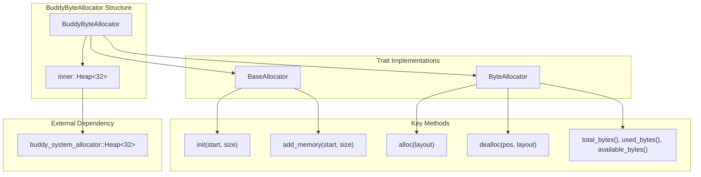
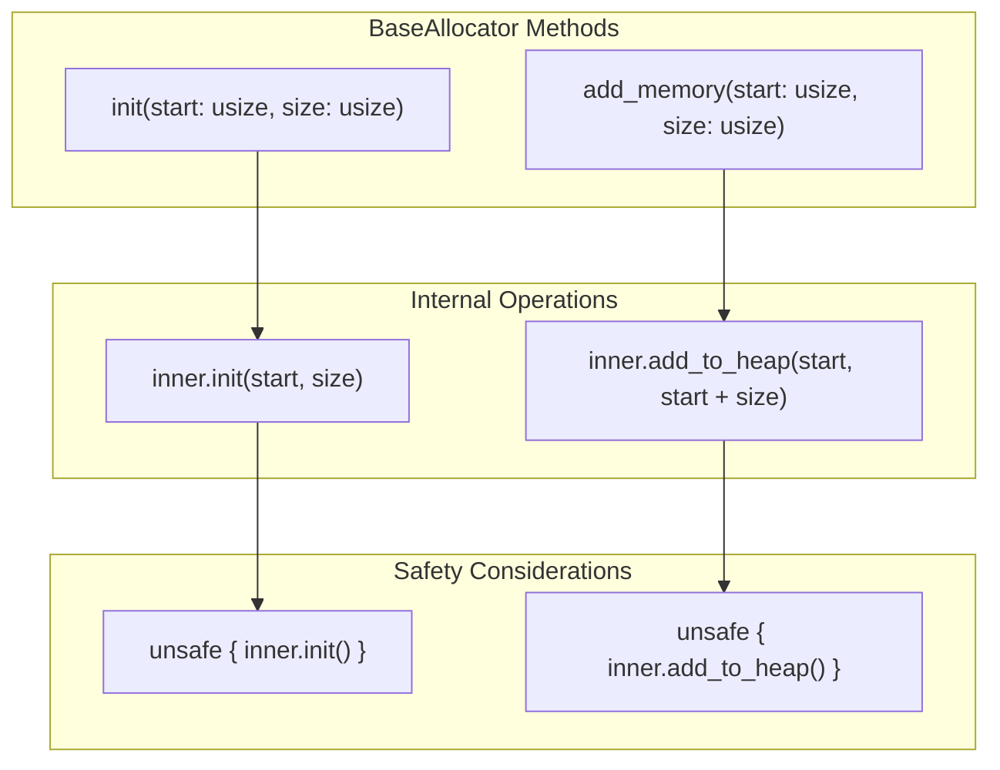
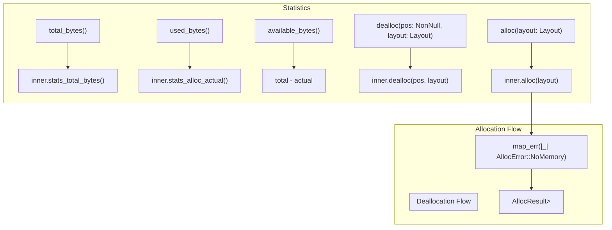

# Buddy System Allocator

> **Relevant source files**
> * [src/buddy.rs](https://github.com/arceos-org/allocator/blob/1d5b7a1b/src/buddy.rs)

This document covers the `BuddyByteAllocator` implementation, which provides byte-granularity memory allocation using the buddy system algorithm. This allocator is one of several byte-level allocators available in the crate and is enabled through the `buddy` feature flag.

For information about the overall trait architecture and how allocators integrate with the system, see [Architecture and Design](/arceos-org/allocator/2-architecture-and-design). For other byte-level allocator implementations, see [Slab Allocator](/arceos-org/allocator/3.3-slab-allocator) and [TLSF Allocator](/arceos-org/allocator/3.4-tlsf-allocator).

## Implementation Overview

The `BuddyByteAllocator` serves as a wrapper around the external `buddy_system_allocator::Heap` crate, adapting it to the crate's trait-based interface. The implementation focuses on providing a consistent API while leveraging the performance characteristics of the buddy system algorithm.

### Core Structure

Sources: [src/buddy.rs(L14 - L25)&emsp;](https://github.com/arceos-org/allocator/blob/1d5b7a1b/src/buddy.rs#L14-L25)

The allocator uses a fixed const generic parameter of 32, which determines the maximum order of buddy blocks that can be allocated from the underlying `Heap<32>` implementation.

|Component|Type|Purpose|
| --- | --- | --- |
|BuddyByteAllocator|Struct|Main allocator wrapper|
|inner|Heap<32>|Underlying buddy system implementation|
|Generic Parameter|32|Maximum buddy block order|

## Trait Implementation Details

### BaseAllocator Implementation

The `BaseAllocator` trait provides fundamental memory management operations for initializing and expanding the allocator's memory pool.

Sources: [src/buddy.rs(L27 - L36)&emsp;](https://github.com/arceos-org/allocator/blob/1d5b7a1b/src/buddy.rs#L27-L36)

The `init` method performs initial setup of the memory region, while `add_memory` allows dynamic expansion of the allocator's available memory pool. Both operations delegate to the underlying `Heap` implementation using unsafe blocks.

### ByteAllocator Implementation

The `ByteAllocator` trait provides the core allocation and deallocation interface along with memory usage statistics.

Sources: [src/buddy.rs(L38 - L58)&emsp;](https://github.com/arceos-org/allocator/blob/1d5b7a1b/src/buddy.rs#L38-L58)

|Method|Return Type|Description|
| --- | --- | --- |
|alloc|AllocResult<NonNull<u8>>|Allocates memory according to layout requirements|
|dealloc|()|Deallocates previously allocated memory|
|total_bytes|usize|Total memory managed by allocator|
|used_bytes|usize|Currently allocated memory|
|available_bytes|usize|Calculated as total minus used bytes|

## Memory Management Characteristics

### Buddy System Algorithm

The buddy system algorithm manages memory by maintaining blocks in powers of two sizes. When a block is split, it creates two "buddy" blocks that can be efficiently merged when both become free.

### Error Handling

The allocator implements a simple error mapping strategy where allocation failures from the underlying `Heap` are converted to `AllocError::NoMemory`. This provides a consistent error interface across all allocator implementations in the crate.

### Memory Statistics

The implementation provides three key statistics through delegation to the underlying heap:

* **Total bytes**: Complete memory pool size managed by the allocator
* **Used bytes**: Currently allocated memory tracked by the heap
* **Available bytes**: Computed difference representing allocatable memory

Sources: [src/buddy.rs(L47 - L57)&emsp;](https://github.com/arceos-org/allocator/blob/1d5b7a1b/src/buddy.rs#L47-L57)

## Integration with Feature System

The `BuddyByteAllocator` is conditionally compiled based on the `buddy` feature flag defined in the crate's feature system. When enabled, it provides byte-granularity allocation as an alternative to page-based or other allocation strategies.

The allocator integrates with the crate's unified interface through the trait implementations, allowing it to be used interchangeably with other `ByteAllocator` implementations depending on the application's requirements.

Sources: [src/buddy.rs(L1 - L59)&emsp;](https://github.com/arceos-org/allocator/blob/1d5b7a1b/src/buddy.rs#L1-L59)