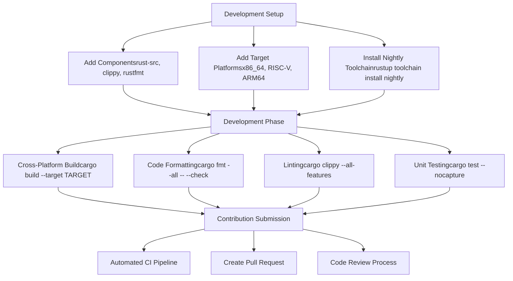
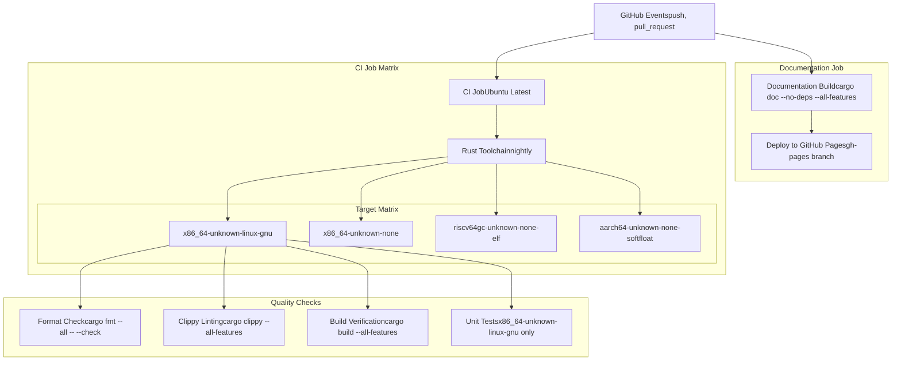
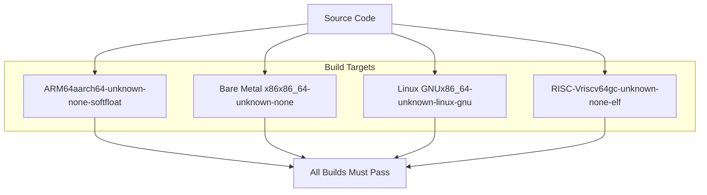
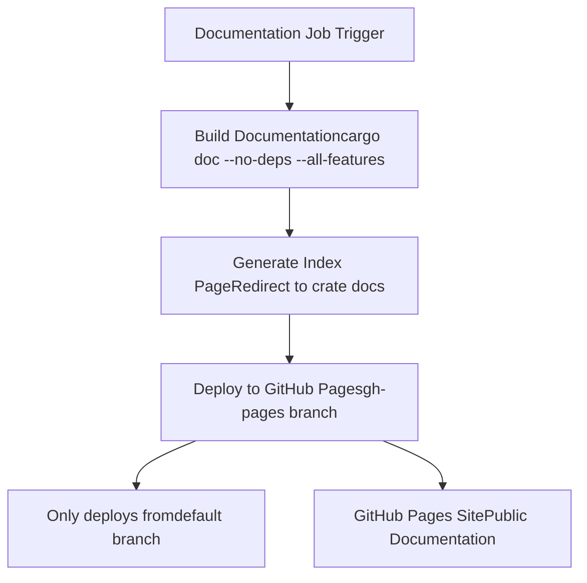

# Development and Contributing

> **Relevant source files**
> * [.github/workflows/ci.yml](https://github.com/arceos-org/allocator/blob/1d5b7a1b/.github/workflows/ci.yml)
> * [.gitignore](https://github.com/arceos-org/allocator/blob/1d5b7a1b/.gitignore)

This document provides comprehensive guidance for developers who want to contribute to the allocator crate, including development environment setup, code quality standards, testing procedures, and the CI/CD pipeline. It covers the technical requirements and workflows necessary for maintaining the project's high standards of quality and cross-platform compatibility.

For information about using the allocators in your projects, see [Usage and Configuration](/arceos-org/allocator/4-usage-and-configuration). For details about the testing infrastructure from a user perspective, see [Testing and Benchmarks](/arceos-org/allocator/5-testing-and-benchmarks).

## Development Environment Setup

The allocator crate requires a specific development environment to ensure consistency across all contributors and maintain compatibility with the supported target platforms.

### Required Toolchain

The project exclusively uses the Rust nightly toolchain with specific components and target platforms. The nightly toolchain is required for `no_std` compatibility and advanced allocation features.

**Required Components:**

* `rust-src` - Source code for cross-compilation
* `clippy` - Linting tool for code quality
* `rustfmt` - Code formatting tool

**Supported Target Platforms:**

* `x86_64-unknown-linux-gnu` - Standard Linux development
* `x86_64-unknown-none` - Bare metal x86_64
* `riscv64gc-unknown-none-elf` - RISC-V bare metal
* `aarch64-unknown-none-softfloat` - ARM64 bare metal

### Development Workflow



Sources: [.github/workflows/ci.yml(L11 - L19)&emsp;](https://github.com/arceos-org/allocator/blob/1d5b7a1b/.github/workflows/ci.yml#L11-L19)

## CI/CD Pipeline Overview

The project uses GitHub Actions for continuous integration and deployment, ensuring code quality and cross-platform compatibility for every contribution.

### CI Pipeline Architecture



### Pipeline Configuration Details

The CI pipeline is configured with fail-fast disabled to ensure all target platforms are tested even if one fails. This comprehensive testing approach ensures the allocator implementations work correctly across all supported embedded and hosted environments.

**Quality Gate Requirements:**

* All code must pass `rustfmt` formatting checks
* All code must pass `clippy` linting with `all-features` enabled
* All target platforms must build successfully
* Unit tests must pass on the Linux target
* Documentation must build without broken links or missing docs

Sources: [.github/workflows/ci.yml(L5 - L31)&emsp;](https://github.com/arceos-org/allocator/blob/1d5b7a1b/.github/workflows/ci.yml#L5-L31)

## Code Quality Standards

The project maintains strict code quality standards enforced through automated tooling and CI pipeline checks.

### Formatting Standards

All code must adhere to the standard Rust formatting rules enforced by `rustfmt`. The CI pipeline automatically rejects any code that doesn't meet these formatting requirements.

**Formatting Command:**

```
cargo fmt --all -- --check
```

### Linting Requirements

The project uses `clippy` with all features enabled to catch potential issues and enforce best practices. One specific clippy warning is allowed: `clippy::new_without_default`, which is common in allocator implementations where `Default` trait implementation may not be appropriate.

**Linting Configuration:**

* Target: All supported platforms
* Features: `--all-features` enabled
* Allowed warnings: `clippy::new_without_default`

Sources: [.github/workflows/ci.yml(L23 - L25)&emsp;](https://github.com/arceos-org/allocator/blob/1d5b7a1b/.github/workflows/ci.yml#L23-L25)

### Cross-Platform Compatibility

All contributions must build successfully on all supported target platforms. This ensures the allocator implementations work correctly in both hosted and bare-metal environments.

**Build Verification Process:**



Sources: [.github/workflows/ci.yml(L12)&emsp;](https://github.com/arceos-org/allocator/blob/1d5b7a1b/.github/workflows/ci.yml#L12-L12) [.github/workflows/ci.yml(L27)&emsp;](https://github.com/arceos-org/allocator/blob/1d5b7a1b/.github/workflows/ci.yml#L27-L27)

## Testing Procedures

The project includes comprehensive testing procedures that run automatically in the CI pipeline and can be executed locally during development.

### Unit Test Execution

Unit tests are executed only on the `x86_64-unknown-linux-gnu` target platform, as this provides the most complete testing environment while still ensuring the code works correctly.

**Test Command:**

```
cargo test --target x86_64-unknown-linux-gnu -- --nocapture
```

The `--nocapture` flag ensures that all test output is visible, which is essential for debugging allocator behavior and performance characteristics.

### Local Testing Workflow

For local development, contributors should run the complete test suite that mirrors the CI pipeline:

1. **Format Check:** `cargo fmt --all -- --check`
2. **Lint Check:** `cargo clippy --all-features`
3. **Build All Targets:** `cargo build --target <TARGET> --all-features`
4. **Run Tests:** `cargo test -- --nocapture`

Sources: [.github/workflows/ci.yml(L28 - L30)&emsp;](https://github.com/arceos-org/allocator/blob/1d5b7a1b/.github/workflows/ci.yml#L28-L30)

## Documentation Requirements

The project maintains high documentation standards with automated enforcement through the CI pipeline.

### Documentation Standards

All public APIs must include comprehensive documentation. The CI pipeline enforces these standards through specific `rustdoc` flags that treat documentation issues as errors.

**Documentation Requirements:**

* No broken intra-doc links (`-D rustdoc::broken_intra_doc_links`)
* No missing documentation (`-D missing-docs`)
* All features must be documented (`--all-features`)

### Automated Documentation Deployment

Documentation is automatically built and deployed to GitHub Pages for the default branch. This ensures that the latest documentation is always available to users and contributors.

**Documentation Build Process:**



The documentation build includes a custom index page that automatically redirects to the main crate documentation, providing a seamless user experience.

Sources: [.github/workflows/ci.yml(L40)&emsp;](https://github.com/arceos-org/allocator/blob/1d5b7a1b/.github/workflows/ci.yml#L40-L40) [.github/workflows/ci.yml(L44 - L55)&emsp;](https://github.com/arceos-org/allocator/blob/1d5b7a1b/.github/workflows/ci.yml#L44-L55)

## Contributing Guidelines

### Contribution Workflow

1. **Fork and Clone:** Fork the repository and clone your fork locally
2. **Setup Environment:** Install nightly toolchain with required components and targets
3. **Create Branch:** Create a feature branch for your changes
4. **Develop:** Make changes following the code quality standards
5. **Test Locally:** Run the complete test suite locally
6. **Submit PR:** Create a pull request with a clear description of changes
7. **CI Validation:** Ensure all CI checks pass
8. **Code Review:** Participate in the code review process

### Submission Requirements

All contributions must:

* Pass automated formatting and linting checks
* Build successfully on all supported platforms
* Include appropriate unit tests where applicable
* Maintain or improve documentation coverage
* Follow the existing code style and architecture patterns

### Project Maintenance

The project uses specific ignore patterns to maintain a clean repository structure:

**Ignored Files and Directories:**

* `/target` - Build artifacts
* `/.vscode` - IDE-specific configuration
* `.DS_Store` - macOS system files
* `Cargo.lock` - Lock file (library project)

Sources: [.gitignore(L1 - L4)&emsp;](https://github.com/arceos-org/allocator/blob/1d5b7a1b/.gitignore#L1-L4)