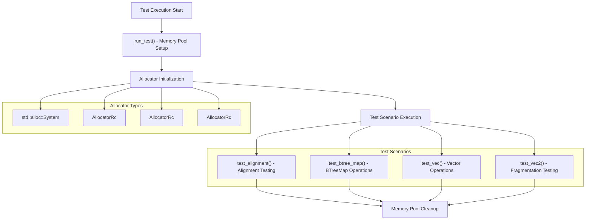
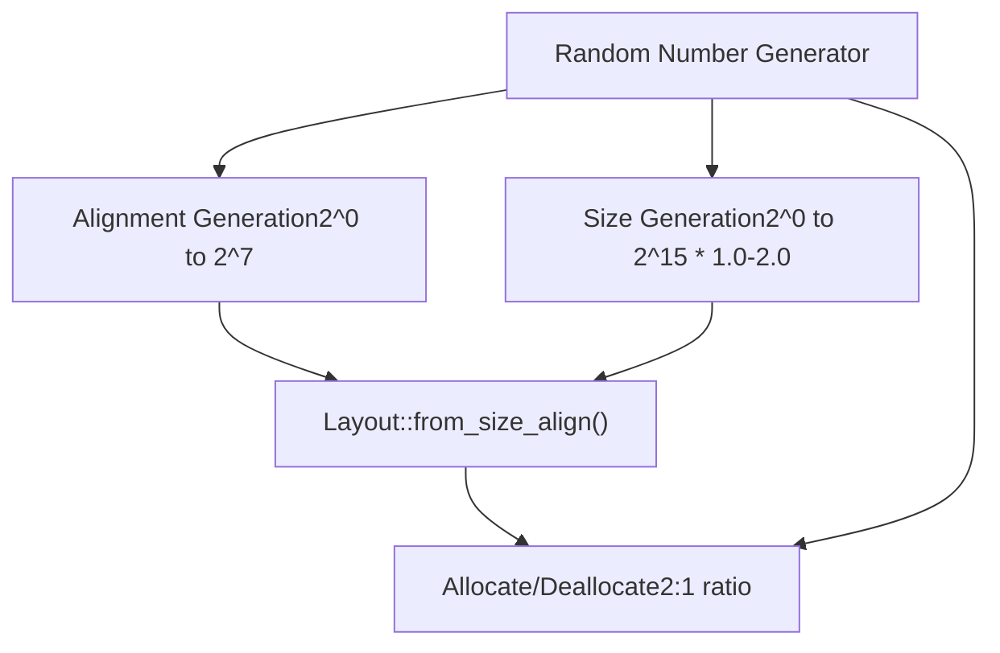
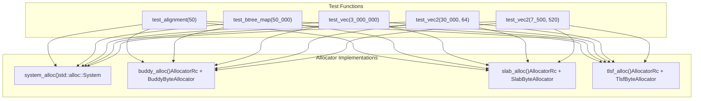
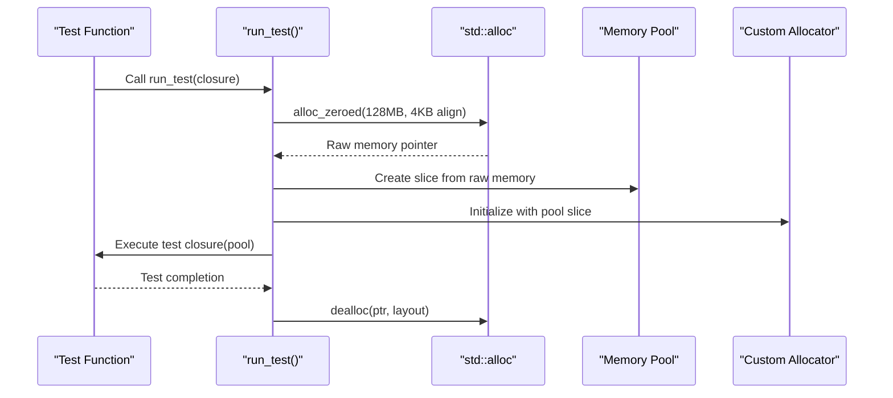

# Integration Tests

> **Relevant source files**
> * [tests/allocator.rs](https://github.com/arceos-org/allocator/blob/1d5b7a1b/tests/allocator.rs)

## Purpose and Scope

The integration tests validate that all allocator implementations in the crate correctly implement the standard library's `Allocator` trait and can handle real-world allocation patterns. These tests ensure that each allocator (`BuddyByteAllocator`, `SlabByteAllocator`, `TlsfByteAllocator`) functions correctly when used with standard Rust collections and various allocation scenarios.

For information about the specific allocator implementations being tested, see the allocator-specific documentation in section [3](/arceos-org/allocator/3-allocator-implementations). For performance benchmarking information, see [Performance Benchmarks](/arceos-org/allocator/5.2-performance-benchmarks).

## Test Architecture

The integration test suite follows a systematic approach where each allocator is tested against the same set of scenarios to ensure consistent behavior across implementations.

**Test Execution Flow**



Sources: [tests/allocator.rs(L87 - L95)&emsp;](https://github.com/arceos-org/allocator/blob/1d5b7a1b/tests/allocator.rs#L87-L95) [tests/allocator.rs(L97 - L143)&emsp;](https://github.com/arceos-org/allocator/blob/1d5b7a1b/tests/allocator.rs#L97-L143)

## Test Scenarios

Each test scenario validates different aspects of allocator behavior and memory management patterns.

### Vector Operations Test (test_vec)

This test validates basic allocation and collection growth by creating a vector with a specified capacity, filling it with random data, and performing operations that require memory reallocation.

|Test Parameter|Value|
| --- | --- |
|Vector Size|3,000,000 elements|
|Element Type|u32|
|Operations|Push, sort, comparison|

The test exercises the allocator's ability to handle large contiguous allocations and validates that the allocated memory remains accessible and correctly manages data integrity.

Sources: [tests/allocator.rs(L13 - L22)&emsp;](https://github.com/arceos-org/allocator/blob/1d5b7a1b/tests/allocator.rs#L13-L22)

### Fragmentation Testing (test_vec2)

This test creates intentional memory fragmentation by allocating numerous small vectors and then deallocating them in random order, simulating real-world fragmentation scenarios.

|Test Configuration|Small Blocks|Large Blocks|
| --- | --- | --- |
|Block Count|30,000|7,500|
|Block Size|64 elements|520 elements|
|Element Type|u64|u64|

The test validates the allocator's ability to handle fragmented memory and efficiently reuse deallocated blocks.

Sources: [tests/allocator.rs(L24 - L40)&emsp;](https://github.com/arceos-org/allocator/blob/1d5b7a1b/tests/allocator.rs#L24-L40)

### BTreeMap Operations Test (test_btree_map)

This test exercises complex allocation patterns through BTreeMap operations, including node allocation, key-value storage, and tree rebalancing operations.

|Test Parameter|Value|
| --- | --- |
|Operations|50,000|
|Deletion Probability|20% (1 in 5)|
|Key Type|Vec<u8>(dynamic strings)|
|Value Type|u32|

The test validates that allocators can handle the complex allocation patterns required by balanced tree data structures.

Sources: [tests/allocator.rs(L42 - L61)&emsp;](https://github.com/arceos-org/allocator/blob/1d5b7a1b/tests/allocator.rs#L42-L61)

### Alignment Testing (test_alignment)

This test validates that allocators correctly handle various alignment requirements and allocation sizes, which is critical for systems programming.



|Test Parameter|Range|
| --- | --- |
|Allocation Size|1 to 131,072 bytes|
|Alignment|1 to 128 bytes|
|Operations|50|
|Allocation Probability|66%|

Sources: [tests/allocator.rs(L63 - L85)&emsp;](https://github.com/arceos-org/allocator/blob/1d5b7a1b/tests/allocator.rs#L63-L85)

## Allocator Test Matrix

The test suite validates four different allocator implementations using identical test scenarios to ensure behavioral consistency.

**Allocator Implementation Matrix**



### System Allocator Test (system_alloc)

Tests the standard library allocator as a baseline reference implementation. This test validates that the test scenarios themselves are correct and provides performance/behavior comparison data.

### Custom Allocator Tests

Each custom allocator test follows the same pattern:

1. Initialize the allocator using `AllocatorRc::new()`
2. Execute all test scenarios with the wrapped allocator
3. Validate correct behavior across all scenarios

The `AllocatorRc` wrapper enables the custom byte allocators to implement the standard `Allocator` trait required by Rust collections.

Sources: [tests/allocator.rs(L97 - L143)&emsp;](https://github.com/arceos-org/allocator/blob/1d5b7a1b/tests/allocator.rs#L97-L143)

## Memory Pool Management

The test infrastructure uses a dedicated memory pool to isolate allocator testing from system memory management.

**Memory Pool Setup Process**



|Pool Parameter|Value|
| --- | --- |
|Size|128 MB (POOL_SIZE)|
|Alignment|4096 bytes|
|Initialization|Zero-filled|
|Layout|Contiguous memory block|

The `run_test` helper function manages the complete lifecycle of the memory pool, ensuring proper cleanup regardless of test outcomes.

Sources: [tests/allocator.rs(L11)&emsp;](https://github.com/arceos-org/allocator/blob/1d5b7a1b/tests/allocator.rs#L11-L11) [tests/allocator.rs(L87 - L95)&emsp;](https://github.com/arceos-org/allocator/blob/1d5b7a1b/tests/allocator.rs#L87-L95)

## Running and Interpreting Tests

### Execution Commands

```markdown
# Run all integration tests
cargo test

# Run tests for a specific allocator
cargo test buddy_alloc
cargo test slab_alloc
cargo test tlsf_alloc
cargo test system_alloc

# Run with specific features enabled
cargo test --features "buddy,slab,tlsf,allocator_api"
```

### Test Requirements

The integration tests require several unstable Rust features:

|Feature|Purpose|
| --- | --- |
|btreemap_alloc|Enable BTreeMap with custom allocators|
|allocator_api|Enable Allocator trait implementation|

These features are enabled via the feature gates at the top of the test file.

### Expected Behavior

All tests should pass for all allocator implementations, demonstrating that:

* Each allocator correctly implements the `Allocator` trait
* Memory allocation and deallocation work correctly
* Collections can be used with custom allocators
* Alignment requirements are respected
* Memory fragmentation is handled appropriately
* Large allocations are supported

Test failures indicate potential issues with allocator implementation, memory corruption, or alignment violations.

Sources: [tests/allocator.rs(L1 - L2)&emsp;](https://github.com/arceos-org/allocator/blob/1d5b7a1b/tests/allocator.rs#L1-L2) [tests/allocator.rs(L8)&emsp;](https://github.com/arceos-org/allocator/blob/1d5b7a1b/tests/allocator.rs#L8-L8)