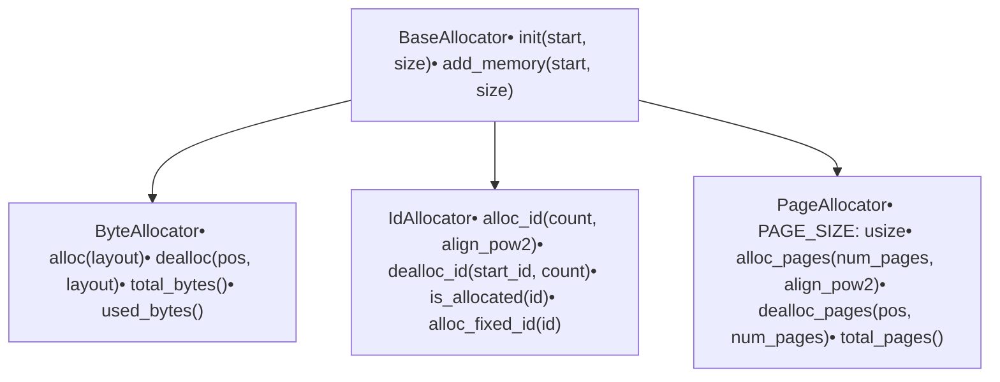
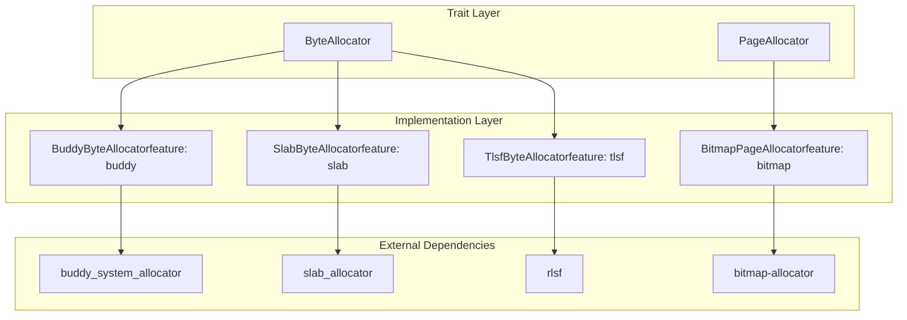
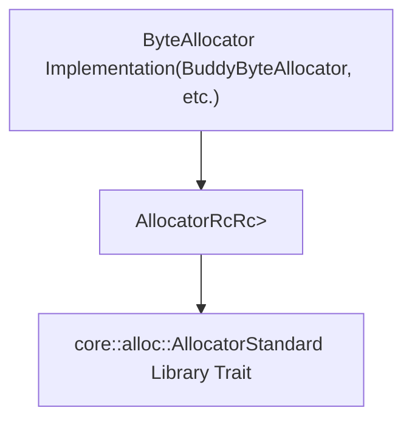

# Overview

> **Relevant source files**
> * [Cargo.toml](https://github.com/arceos-org/allocator/blob/1d5b7a1b/Cargo.toml)
> * [src/lib.rs](https://github.com/arceos-org/allocator/blob/1d5b7a1b/src/lib.rs)

## Purpose and Scope

The `allocator` crate provides a unified interface for various memory allocation algorithms in Rust. It abstracts different allocation strategies behind common traits, allowing users to select the most appropriate allocator for their use case through feature flags. The crate serves as a wrapper around specialized external allocator implementations, providing consistent APIs and error handling across all variants.

This document covers the core architecture, trait system, and high-level design of the allocator crate. For detailed information about specific allocator implementations, see [Allocator Implementations](/arceos-org/allocator/3-allocator-implementations). For usage examples and configuration guidance, see [Usage and Configuration](/arceos-org/allocator/4-usage-and-configuration).

## Core Architecture

The allocator crate is built around a trait-based architecture that defines three primary allocator categories, each serving different memory management needs:

### Primary Allocator Traits



**Sources:** [src/lib.rs(L54 - L131)&emsp;](https://github.com/arceos-org/allocator/blob/1d5b7a1b/src/lib.rs#L54-L131)

### Concrete Implementation Mapping



**Sources:** [src/lib.rs(L14 - L32)&emsp;](https://github.com/arceos-org/allocator/blob/1d5b7a1b/src/lib.rs#L14-L32) [Cargo.toml(L16 - L34)&emsp;](https://github.com/arceos-org/allocator/blob/1d5b7a1b/Cargo.toml#L16-L34)

## Feature-Gated Compilation System

The crate uses Cargo features to enable selective compilation of allocator implementations, minimizing binary size when only specific allocators are needed:

### Feature Configuration

|Feature|Purpose|External Dependency|
| --- | --- | --- |
|bitmap|EnableBitmapPageAllocator|bitmap-allocator v0.2|
|buddy|EnableBuddyByteAllocator|buddy_system_allocator v0.10|
|slab|EnableSlabByteAllocator|slab_allocator v0.3.1|
|tlsf|EnableTlsfByteAllocator|rlsf v0.2|
|allocator_api|EnableAllocatorRcwrapper|None (stdlib integration)|
|page-alloc-*|Configure page allocator size limits|None|

**Sources:** [Cargo.toml(L12 - L27)&emsp;](https://github.com/arceos-org/allocator/blob/1d5b7a1b/Cargo.toml#L12-L27)

### Conditional Compilation Flow

```

```

**Sources:** [src/lib.rs(L14 - L32)&emsp;](https://github.com/arceos-org/allocator/blob/1d5b7a1b/src/lib.rs#L14-L32) [src/lib.rs(L151 - L196)&emsp;](https://github.com/arceos-org/allocator/blob/1d5b7a1b/src/lib.rs#L151-L196)

## Error Handling System

The crate defines a unified error handling approach through the `AllocError` enum and `AllocResult` type alias:

```python
// Core error types from the codebase
pub enum AllocError {
    InvalidParam,    // Invalid size or align_pow2
    MemoryOverlap,   // Memory regions overlap
    NoMemory,        // Insufficient memory
    NotAllocated,    // Deallocation of unallocated region
}

pub type AllocResult<T = ()> = Result<T, AllocError>;
```

**Sources:** [src/lib.rs(L37 - L51)&emsp;](https://github.com/arceos-org/allocator/blob/1d5b7a1b/src/lib.rs#L37-L51)

## Standard Library Integration

When the `allocator_api` feature is enabled, the crate provides `AllocatorRc<A>`, which wraps any `ByteAllocator` implementation in `Rc<RefCell<A>>` and implements the standard library's `core::alloc::Allocator` trait:



**Sources:** [src/lib.rs(L151 - L196)&emsp;](https://github.com/arceos-org/allocator/blob/1d5b7a1b/src/lib.rs#L151-L196)

## Key Components Summary

|Component|File|Purpose|
| --- | --- | --- |
|Core traits|src/lib.rs54-131|Define allocator interfaces|
|Error types|src/lib.rs37-51|Unified error handling|
|Alignment utilities|src/lib.rs133-149|Memory alignment helpers|
|Standard library bridge|src/lib.rs151-196|Integration withcore::alloc::Allocator|
|Feature configuration|Cargo.toml12-34|Conditional compilation setup|

The crate architecture emphasizes modularity through feature gates, consistency through shared traits, and flexibility through multiple allocation strategies while maintaining a minimal footprint when only specific allocators are needed.

**Sources:** [Cargo.toml(L1 - L44)&emsp;](https://github.com/arceos-org/allocator/blob/1d5b7a1b/Cargo.toml#L1-L44) [src/lib.rs(L1 - L197)&emsp;](https://github.com/arceos-org/allocator/blob/1d5b7a1b/src/lib.rs#L1-L197)