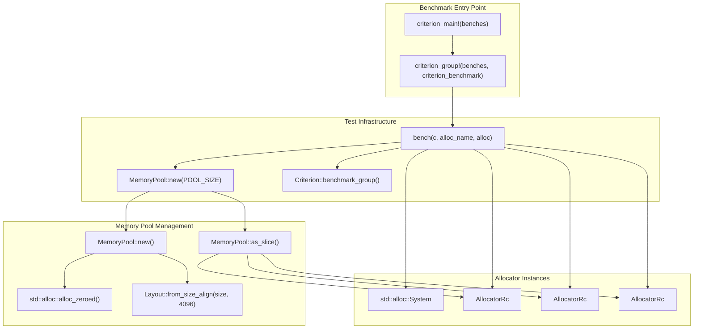
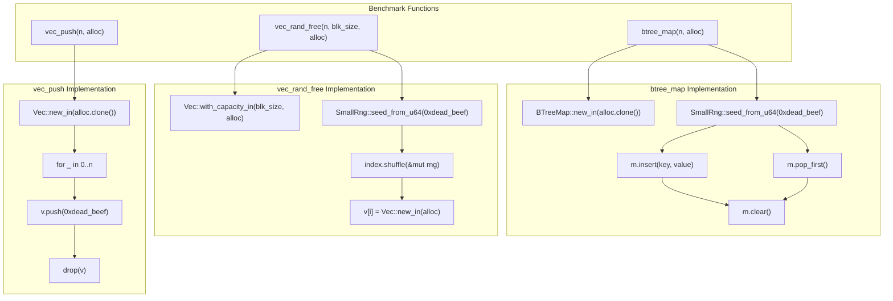
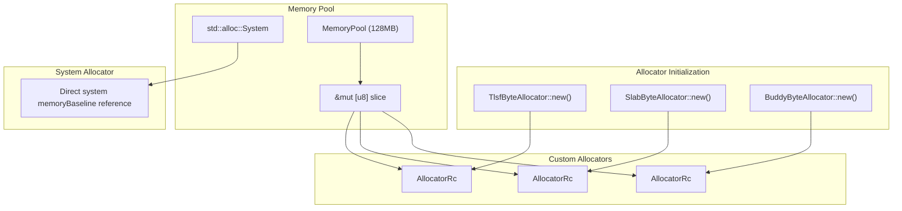

# Performance Benchmarks

> **Relevant source files**
> * [benches/collections.rs](https://github.com/arceos-org/allocator/blob/1d5b7a1b/benches/collections.rs)
> * [benches/utils/mod.rs](https://github.com/arceos-org/allocator/blob/1d5b7a1b/benches/utils/mod.rs)

This document covers the performance benchmark suite for the allocator crate, which provides standardized testing methodology to compare the performance characteristics of different memory allocation implementations. The benchmarks evaluate allocation patterns commonly found in real-world applications and measure relative performance against the system allocator baseline.

For information about the individual allocator implementations being tested, see [Allocator Implementations](/arceos-org/allocator/3-allocator-implementations). For details about the integration test suite, see [Integration Tests](/arceos-org/allocator/5.1-integration-tests).

## Benchmark Architecture

The benchmark infrastructure is built using the Criterion benchmarking framework and provides a controlled testing environment for evaluating allocator performance across different workload patterns.

### Benchmark Framework Overview



The benchmark system creates a 128MB memory pool (`POOL_SIZE = 1024 * 1024 * 128`) for testing custom allocators, while the system allocator operates directly on system memory. Each allocator is wrapped in `AllocatorRc` to provide the standard library `Allocator` trait interface.

Sources: [benches/collections.rs(L16)&emsp;](https://github.com/arceos-org/allocator/blob/1d5b7a1b/benches/collections.rs#L16-L16) [benches/collections.rs(L80 - L98)&emsp;](https://github.com/arceos-org/allocator/blob/1d5b7a1b/benches/collections.rs#L80-L98) [benches/utils/mod.rs(L9 - L18)&emsp;](https://github.com/arceos-org/allocator/blob/1d5b7a1b/benches/utils/mod.rs#L9-L18)

### Test Scenario Implementation



Each benchmark function implements a specific allocation pattern designed to stress different aspects of allocator performance. The functions use deterministic random seeds to ensure reproducible results across benchmark runs.

Sources: [benches/collections.rs(L18 - L24)&emsp;](https://github.com/arceos-org/allocator/blob/1d5b7a1b/benches/collections.rs#L18-L24) [benches/collections.rs(L26 - L44)&emsp;](https://github.com/arceos-org/allocator/blob/1d5b7a1b/benches/collections.rs#L26-L44) [benches/collections.rs(L46 - L61)&emsp;](https://github.com/arceos-org/allocator/blob/1d5b7a1b/benches/collections.rs#L46-L61)

## Test Scenarios

The benchmark suite includes four distinct test scenarios that evaluate different aspects of allocator performance:

|Benchmark|Function|Parameters|Purpose|
| --- | --- | --- | --- |
|vec_push_3M|vec_push|n=3,000,000|Sequential allocation stress test|
|vec_rand_free_25K_64|vec_rand_free|n=25,000, blk_size=64|Small block fragmentation test|
|vec_rand_free_7500_520|vec_rand_free|n=7,500, blk_size=520|Large block fragmentation test|
|btree_map_50K|btree_map|n=50,000|Mixed allocation/deallocation pattern|

### Sequential Allocation Test

The `vec_push_3M` benchmark evaluates pure allocation performance by pushing 3 million `u32` values into a vector. This test measures:

* Allocation throughput for growing data structures
* Memory reallocation efficiency during vector growth
* Allocator overhead for sequential memory requests

### Fragmentation Tests

The `vec_rand_free` tests evaluate allocator behavior under fragmentation stress:

**Small Block Test (`vec_rand_free_25K_64`)**:

* Allocates 25,000 blocks of 64 bytes each
* Randomly deallocates blocks using shuffled indices
* Tests small allocation efficiency and fragmentation handling

**Large Block Test (`vec_rand_free_7500_520`)**:

* Allocates 7,500 blocks of 520 bytes each
* Randomly deallocates blocks using shuffled indices
* Tests allocator behavior with larger allocation sizes

### Mixed Workload Test

The `btree_map_50K` benchmark simulates realistic application behavior:

* Performs 50,000 operations on a `BTreeMap`
* 20% probability of removal operations (`rng.next_u32() % 5 == 0`)
* 80% probability of insertion operations
* Uses string keys with dynamic allocation
* Tests allocator performance under mixed allocation patterns

Sources: [benches/collections.rs(L65 - L77)&emsp;](https://github.com/arceos-org/allocator/blob/1d5b7a1b/benches/collections.rs#L65-L77) [benches/collections.rs(L26 - L44)&emsp;](https://github.com/arceos-org/allocator/blob/1d5b7a1b/benches/collections.rs#L26-L44) [benches/collections.rs(L46 - L61)&emsp;](https://github.com/arceos-org/allocator/blob/1d5b7a1b/benches/collections.rs#L46-L61)

## Allocator Testing Matrix

The benchmark system tests four different allocators to provide comprehensive performance comparison:

### Allocator Configuration



Each custom allocator is initialized with the same 128MB memory pool to ensure fair comparison. The `AllocatorRc` wrapper provides reference counting and the standard library `Allocator` trait implementation.

Sources: [benches/collections.rs(L82 - L97)&emsp;](https://github.com/arceos-org/allocator/blob/1d5b7a1b/benches/collections.rs#L82-L97) [benches/utils/mod.rs(L10 - L14)&emsp;](https://github.com/arceos-org/allocator/blob/1d5b7a1b/benches/utils/mod.rs#L10-L14)

## Memory Pool Utility

The `MemoryPool` utility provides controlled memory management for benchmark testing:

### MemoryPool Implementation

The `MemoryPool` struct manages a fixed-size memory region for allocator testing:

```javascript
// Memory pool allocation with 4KB alignment
let layout = Layout::from_size_align(size, 4096).unwrap();
let ptr = NonNull::new(unsafe { std::alloc::alloc_zeroed(layout) }).unwrap();
```

**Key characteristics:**

* **Size**: 128MB (`POOL_SIZE = 1024 * 1024 * 128`)
* **Alignment**: 4KB page alignment for optimal performance
* **Initialization**: Zero-filled memory using `alloc_zeroed`
* **Lifetime**: Automatic cleanup through `Drop` implementation

The pool provides a mutable slice interface (`as_slice()`) that allocators use for their internal memory management, ensuring all custom allocators operate within the same controlled memory environment.

Sources: [benches/utils/mod.rs(L9 - L18)&emsp;](https://github.com/arceos-org/allocator/blob/1d5b7a1b/benches/utils/mod.rs#L9-L18) [benches/utils/mod.rs(L21 - L25)&emsp;](https://github.com/arceos-org/allocator/blob/1d5b7a1b/benches/utils/mod.rs#L21-L25) [benches/collections.rs(L16)&emsp;](https://github.com/arceos-org/allocator/blob/1d5b7a1b/benches/collections.rs#L16-L16)

## Running Benchmarks

The benchmark suite uses the Criterion framework for statistical analysis and result reporting. To execute the benchmarks:

```
cargo bench --features full
```

The `--features full` flag enables all allocator implementations for comprehensive testing. The benchmark configuration includes:

* **Sample size**: 10 iterations per test for statistical significance
* **Measurement**: Wall clock time for complete test scenarios
* **Output**: Statistical analysis including mean, standard deviation, and confidence intervals

Individual allocator benchmarks can be run using Criterion's filtering capability:

```markdown
cargo bench -- tlsf        # Run only TLSF allocator benchmarks
cargo bench -- vec_push    # Run only vector push benchmarks
```

Sources: [benches/collections.rs(L68)&emsp;](https://github.com/arceos-org/allocator/blob/1d5b7a1b/benches/collections.rs#L68-L68) [benches/collections.rs(L100 - L101)&emsp;](https://github.com/arceos-org/allocator/blob/1d5b7a1b/benches/collections.rs#L100-L101)

## Benchmark Results Interpretation

The benchmark results provide comparative performance metrics across allocators:

### Performance Metrics

**Throughput Comparison**: Results show relative performance against the system allocator baseline, helping identify which allocators perform best for specific workload patterns.

**Fragmentation Behavior**: The random free tests reveal how effectively each allocator handles memory fragmentation and reuses freed blocks.

**Mixed Workload Performance**: The BTreeMap benchmark demonstrates allocator behavior under realistic application usage patterns with mixed allocation and deallocation operations.

### Expected Performance Characteristics

* **TLSF**: Consistent O(1) allocation/deallocation with good fragmentation resistance
* **Slab**: Optimal for fixed-size allocations, may show overhead for variable sizes
* **Buddy**: Good general-purpose performance with power-of-two block sizes
* **System**: Reference baseline representing operating system allocator performance

Sources: [benches/collections.rs(L63 - L78)&emsp;](https://github.com/arceos-org/allocator/blob/1d5b7a1b/benches/collections.rs#L63-L78)