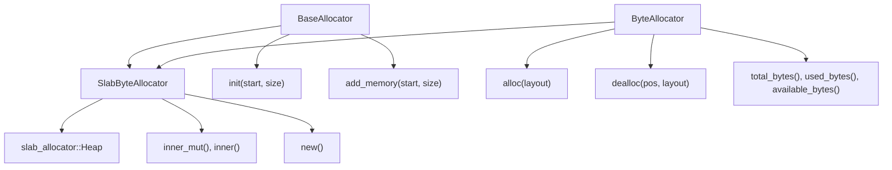
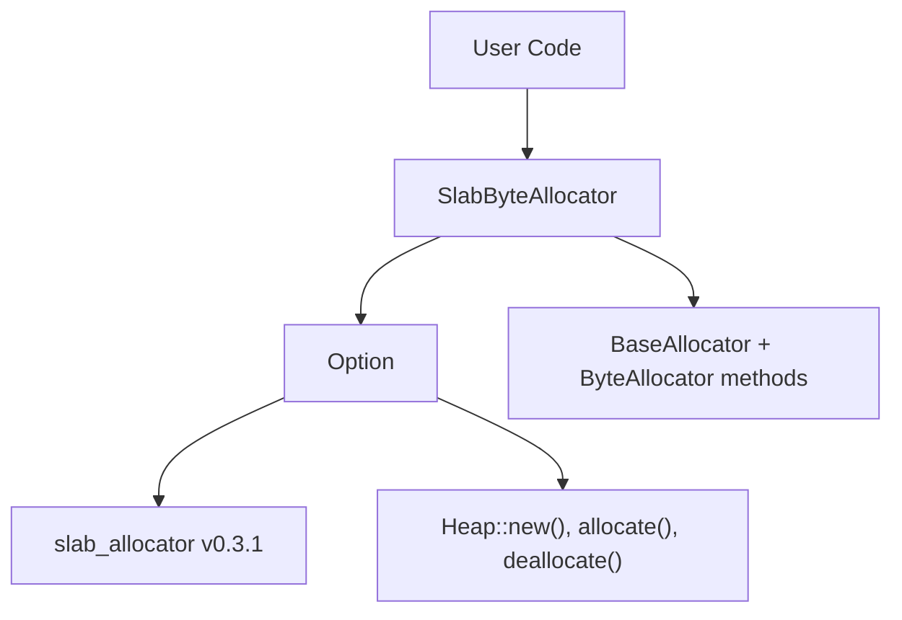
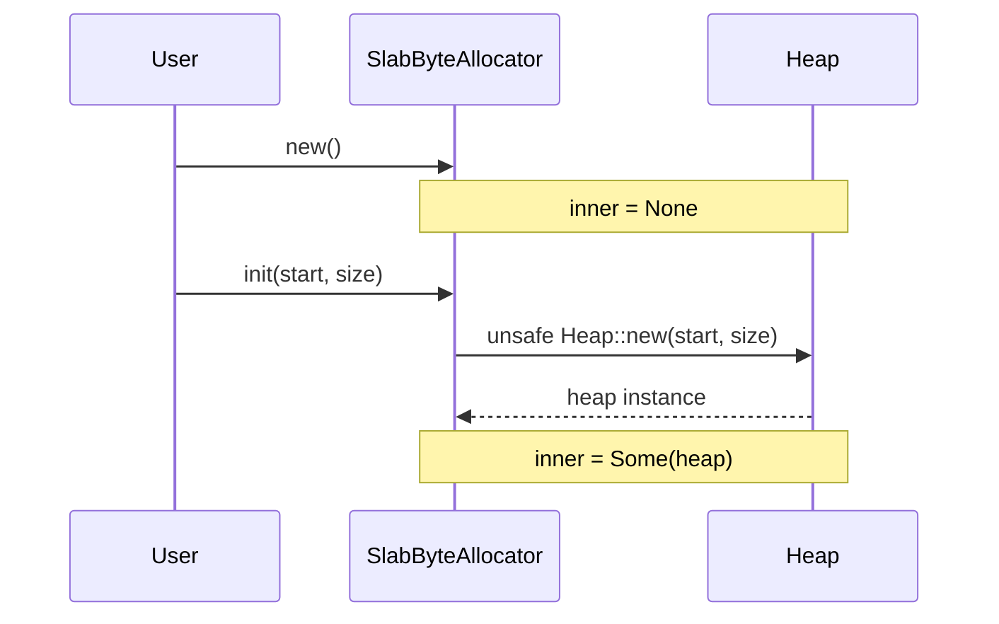
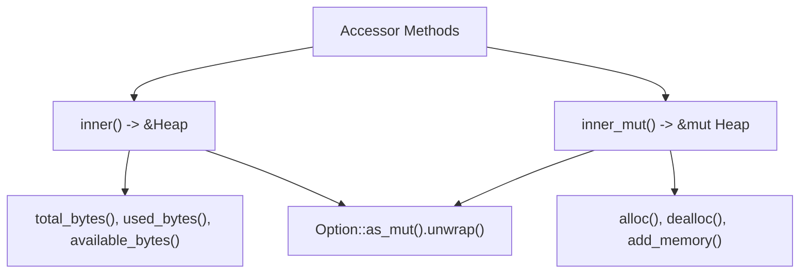
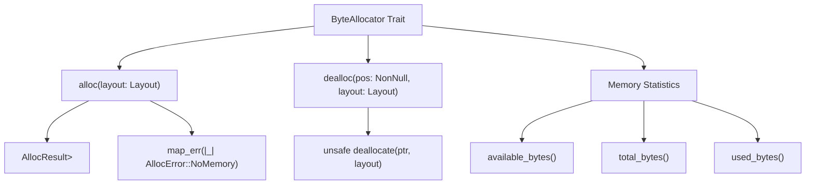

# Slab Allocator

> **Relevant source files**
> * [src/slab.rs](https://github.com/arceos-org/allocator/blob/1d5b7a1b/src/slab.rs)

This document covers the `SlabByteAllocator` implementation, which provides byte-granularity memory allocation using the slab allocation algorithm. The slab allocator is designed for efficient allocation and deallocation of fixed-size objects by pre-allocating chunks of memory organized into "slabs."

For information about other byte-level allocators, see [Buddy System Allocator](/arceos-org/allocator/3.2-buddy-system-allocator) and [TLSF Allocator](/arceos-org/allocator/3.4-tlsf-allocator). For page-granularity allocation, see [Bitmap Page Allocator](/arceos-org/allocator/3.1-bitmap-page-allocator). For the overall trait architecture that this allocator implements, see [Architecture and Design](/arceos-org/allocator/2-architecture-and-design).

## Architecture and Design

### Trait Implementation Hierarchy

The `SlabByteAllocator` implements both core allocator traits defined in the crate's trait system:

**Sources:** [src/slab.rs(L5 - L68)&emsp;](https://github.com/arceos-org/allocator/blob/1d5b7a1b/src/slab.rs#L5-L68)

### External Dependency Integration

The `SlabByteAllocator` serves as a wrapper around the external `slab_allocator` crate, specifically the `Heap` type:

**Sources:** [src/slab.rs(L8)&emsp;](https://github.com/arceos-org/allocator/blob/1d5b7a1b/src/slab.rs#L8-L8) [src/slab.rs(L14)&emsp;](https://github.com/arceos-org/allocator/blob/1d5b7a1b/src/slab.rs#L14-L14)

## Implementation Details

### Struct Definition and State Management

The `SlabByteAllocator` maintains minimal internal state, delegating the actual allocation logic to the wrapped `Heap`:

|Component|Type|Purpose|
| --- | --- | --- |
|inner|Option<Heap>|Wrapped slab allocator instance|

The `Option` wrapper allows for lazy initialization through the `BaseAllocator::init` method.

**Sources:** [src/slab.rs(L13 - L15)&emsp;](https://github.com/arceos-org/allocator/blob/1d5b7a1b/src/slab.rs#L13-L15)

### Construction and Initialization

The allocator follows a two-phase initialization pattern:

1. `new()` creates an uninitialized allocator with `inner = None`
2. `init(start, size)` creates the underlying `Heap` instance

**Sources:** [src/slab.rs(L18 - L21)&emsp;](https://github.com/arceos-org/allocator/blob/1d5b7a1b/src/slab.rs#L18-L21) [src/slab.rs(L33 - L35)&emsp;](https://github.com/arceos-org/allocator/blob/1d5b7a1b/src/slab.rs#L33-L35)

### Memory Management Operations

The allocator provides internal accessor methods for safe access to the initialized heap:

**Sources:** [src/slab.rs(L23 - L29)&emsp;](https://github.com/arceos-org/allocator/blob/1d5b7a1b/src/slab.rs#L23-L29)

## Memory Allocation API

### BaseAllocator Implementation

The `BaseAllocator` trait provides fundamental memory region management:

|Method|Parameters|Behavior|
| --- | --- | --- |
|init|start: usize, size: usize|Creates newHeapinstance for memory region|
|add_memory|start: usize, size: usize|Adds additional memory region to existing heap|

Both methods work with raw memory addresses and sizes in bytes.

**Sources:** [src/slab.rs(L32 - L43)&emsp;](https://github.com/arceos-org/allocator/blob/1d5b7a1b/src/slab.rs#L32-L43)

### ByteAllocator Implementation

The `ByteAllocator` trait provides fine-grained allocation operations:

### Error Handling

The allocation method converts internal allocation failures to the standardized `AllocError::NoMemory` variant, providing consistent error semantics across all allocator implementations in the crate.

**Sources:** [src/slab.rs(L45 - L68)&emsp;](https://github.com/arceos-org/allocator/blob/1d5b7a1b/src/slab.rs#L45-L68)

### Memory Statistics

The allocator exposes three memory statistics through delegation to the underlying `Heap`:

|Statistic|Description|
| --- | --- |
|total_bytes()|Total memory managed by allocator|
|used_bytes()|Currently allocated memory|
|available_bytes()|Free memory available for allocation|

**Sources:** [src/slab.rs(L57 - L67)&emsp;](https://github.com/arceos-org/allocator/blob/1d5b7a1b/src/slab.rs#L57-L67)

## Slab Allocation Characteristics

The slab allocator is particularly efficient for workloads involving:

* Frequent allocation and deallocation of similar-sized objects
* Scenarios where memory fragmentation needs to be minimized
* Applications requiring predictable allocation performance

The underlying `slab_allocator::Heap` implementation handles the complexity of slab management, chunk organization, and free list maintenance, while the wrapper provides integration with the crate's trait system and error handling conventions.

**Sources:** [src/slab.rs(L1 - L3)&emsp;](https://github.com/arceos-org/allocator/blob/1d5b7a1b/src/slab.rs#L1-L3) [src/slab.rs(L10 - L12)&emsp;](https://github.com/arceos-org/allocator/blob/1d5b7a1b/src/slab.rs#L10-L12)