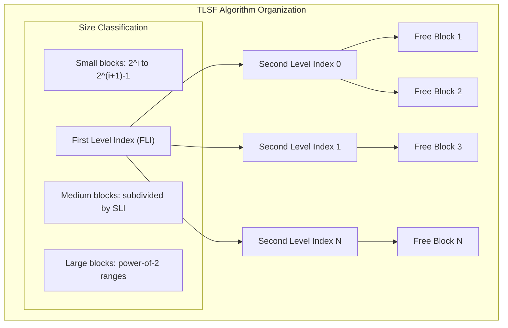
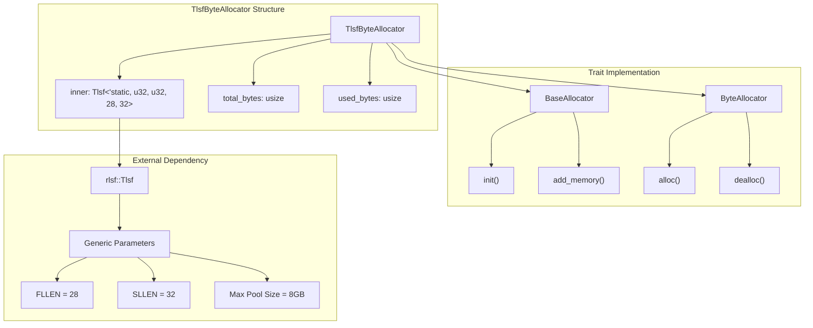
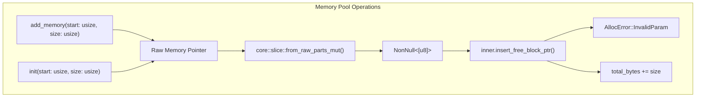
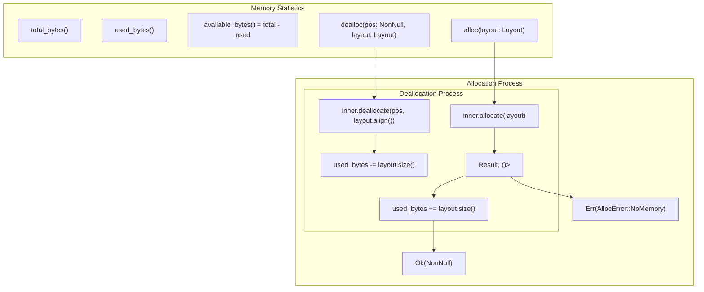

# TLSF Allocator

> **Relevant source files**
> * [src/tlsf.rs](https://github.com/arceos-org/allocator/blob/1d5b7a1b/src/tlsf.rs)

This document covers the TLSF (Two-Level Segregated Fit) byte allocator implementation in the allocator crate. The `TlsfByteAllocator` provides real-time memory allocation with O(1) time complexity for both allocation and deallocation operations.

For information about other byte-level allocators, see [Buddy System Allocator](/arceos-org/allocator/3.2-buddy-system-allocator) and [Slab Allocator](/arceos-org/allocator/3.3-slab-allocator). For page-level allocation, see [Bitmap Page Allocator](/arceos-org/allocator/3.1-bitmap-page-allocator).

## TLSF Algorithm Overview

The Two-Level Segregated Fit (TLSF) algorithm is a real-time memory allocator that maintains free memory blocks in a two-level segregated list structure. It achieves deterministic O(1) allocation and deallocation performance by organizing free blocks into size classes using a first-level index (FLI) and second-level index (SLI).

### Algorithm Structure

Sources: [src/tlsf.rs(L1 - L18)&emsp;](https://github.com/arceos-org/allocator/blob/1d5b7a1b/src/tlsf.rs#L1-L18)

## Implementation Structure

The `TlsfByteAllocator` is implemented as a wrapper around the `rlsf::Tlsf` external crate with specific configuration parameters optimized for the allocator crate's use cases.

### Core Components

Sources: [src/tlsf.rs(L10 - L18)&emsp;](https://github.com/arceos-org/allocator/blob/1d5b7a1b/src/tlsf.rs#L10-L18) [src/tlsf.rs(L31 - L77)&emsp;](https://github.com/arceos-org/allocator/blob/1d5b7a1b/src/tlsf.rs#L31-L77)

### Configuration Parameters

The implementation uses fixed configuration parameters that define the allocator's capabilities:

|Parameter|Value|Purpose|
| --- | --- | --- |
|FLLEN|28|First-level index length, supporting up to 2^28 byte blocks|
|SLLEN|32|Second-level index length for fine-grained size classification|
|Max Pool Size|8GB|Theoretical maximum: 32 * 2^28 bytes|
|Generic Types|u32, u32|Index types for FLI and SLI bitmaps|

Sources: [src/tlsf.rs(L15)&emsp;](https://github.com/arceos-org/allocator/blob/1d5b7a1b/src/tlsf.rs#L15-L15)

## BaseAllocator Implementation

The `TlsfByteAllocator` implements the `BaseAllocator` trait to provide memory pool initialization and management capabilities.

### Memory Pool Management

The implementation converts raw memory addresses into safe slice references before inserting them into the TLSF data structure. Both `init()` and `add_memory()` follow the same pattern but with different error handling strategies.

Sources: [src/tlsf.rs(L31 - L51)&emsp;](https://github.com/arceos-org/allocator/blob/1d5b7a1b/src/tlsf.rs#L31-L51)

## ByteAllocator Implementation

The `ByteAllocator` trait implementation provides the core allocation and deallocation functionality with automatic memory usage tracking.

### Allocation Flow

Sources: [src/tlsf.rs(L54 - L77)&emsp;](https://github.com/arceos-org/allocator/blob/1d5b7a1b/src/tlsf.rs#L54-L77)

### Memory Usage Tracking

The allocator maintains accurate memory usage statistics by tracking:

* **`total_bytes`**: Total memory pool size across all added memory regions
* **`used_bytes`**: Currently allocated memory, updated on each alloc/dealloc operation
* **`available_bytes`**: Computed as `total_bytes - used_bytes`

This tracking is performed at the wrapper level rather than delegating to the underlying `rlsf` implementation.

Sources: [src/tlsf.rs(L66 - L77)&emsp;](https://github.com/arceos-org/allocator/blob/1d5b7a1b/src/tlsf.rs#L66-L77)

## Performance Characteristics

The TLSF allocator provides several performance advantages:

### Time Complexity

|Operation|Complexity|Description|
| --- | --- | --- |
|Allocation|O(1)|Constant time regardless of pool size|
|Deallocation|O(1)|Constant time with immediate coalescing|
|Memory Addition|O(1)|Adding new memory pools|
|Statistics|O(1)|Memory usage queries|

### Memory Efficiency

The two-level segregated fit approach minimizes fragmentation by:

* Maintaining precise size classes for small allocations
* Using power-of-2 ranges for larger allocations
* Immediate coalescing of adjacent free blocks
* Good-fit allocation strategy to reduce waste

Sources: [src/tlsf.rs(L1 - L3)&emsp;](https://github.com/arceos-org/allocator/blob/1d5b7a1b/src/tlsf.rs#L1-L3)

## Configuration and Limitations

### Size Limitations

The current configuration imposes several limits:

* **Maximum single allocation**: Limited by `FLLEN = 28`, supporting up to 2^28 bytes (256MB)
* **Maximum total pool size**: 8GB theoretical limit (32 * 2^28)
* **Minimum allocation**: Determined by underlying `rlsf` implementation constraints

### Integration Requirements

The allocator requires:

* Feature gate `tlsf` to be enabled in `Cargo.toml`
* External dependency on `rlsf` crate version 0.2
* Unsafe operations for memory pool management
* `'static` lifetime for the internal TLSF structure

Sources: [src/tlsf.rs(L15)&emsp;](https://github.com/arceos-org/allocator/blob/1d5b7a1b/src/tlsf.rs#L15-L15) [src/tlsf.rs(L32 - L51)&emsp;](https://github.com/arceos-org/allocator/blob/1d5b7a1b/src/tlsf.rs#L32-L51)