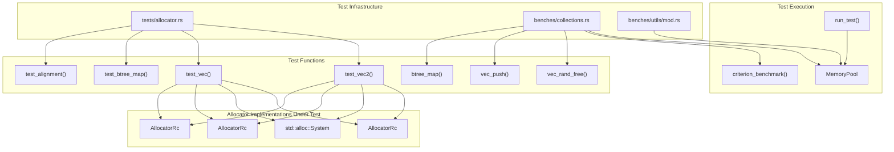
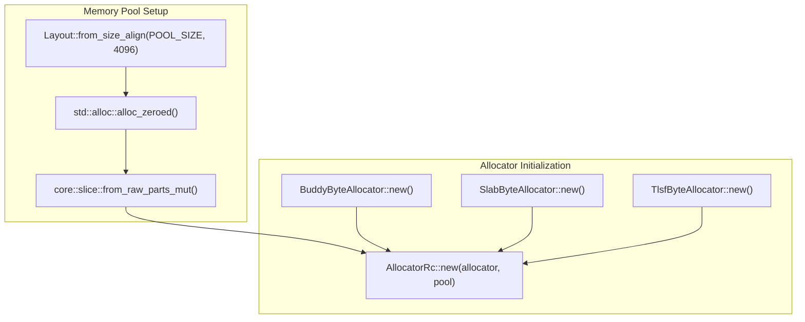
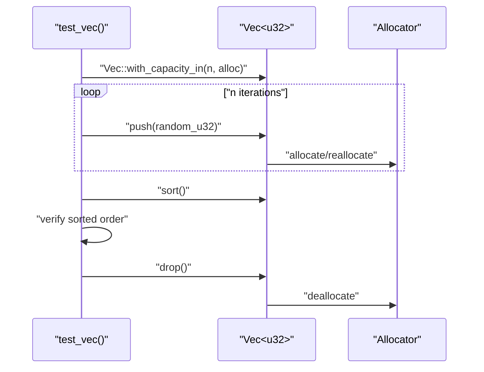
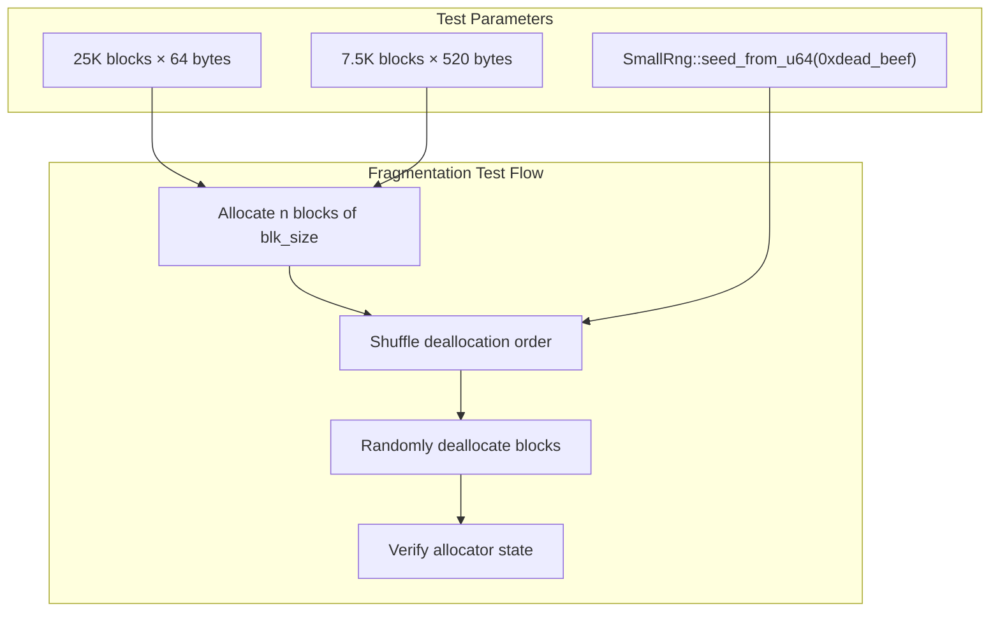
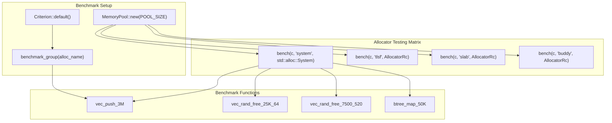

# Testing and Benchmarks

> **Relevant source files**
> * [benches/collections.rs](https://github.com/arceos-org/allocator/blob/1d5b7a1b/benches/collections.rs)
> * [tests/allocator.rs](https://github.com/arceos-org/allocator/blob/1d5b7a1b/tests/allocator.rs)

This document covers the testing infrastructure and performance evaluation framework for the allocator crate. The testing system validates correctness and measures performance across all supported allocator implementations through comprehensive integration tests and benchmarks.

For information about specific allocator implementations being tested, see [Allocator Implementations](/arceos-org/allocator/3-allocator-implementations). For details on individual test scenarios, see [Integration Tests](/arceos-org/allocator/5.1-integration-tests) and [Performance Benchmarks](/arceos-org/allocator/5.2-performance-benchmarks).

## Testing Infrastructure Overview

The allocator crate provides a comprehensive testing framework that validates both correctness and performance across all allocator implementations. The testing infrastructure consists of integration tests and performance benchmarks that exercise the allocators through realistic usage patterns.

### Testing Architecture



The testing architecture separates integration testing from performance benchmarking while using consistent test scenarios across both. Each allocator implementation is tested through the same set of operations to ensure behavioral consistency and enable performance comparison.

**Sources:** [tests/allocator.rs(L1 - L144)&emsp;](https://github.com/arceos-org/allocator/blob/1d5b7a1b/tests/allocator.rs#L1-L144) [benches/collections.rs(L1 - L102)&emsp;](https://github.com/arceos-org/allocator/blob/1d5b7a1b/benches/collections.rs#L1-L102)

### Test Environment Configuration

The testing framework uses a standardized memory pool configuration to ensure consistent and reproducible results across all test runs.

|Configuration|Value|Purpose|
| --- | --- | --- |
|POOL_SIZE|128 MB|Standard memory pool size for custom allocators|
|Memory Layout|4096-byte aligned|Ensures proper page alignment for testing|
|Random Seed|0xdead_beef|Deterministic randomization for benchmarks|
|Sample Size|10 iterations|Benchmark measurement accuracy|



**Sources:** [tests/allocator.rs(L11)&emsp;](https://github.com/arceos-org/allocator/blob/1d5b7a1b/tests/allocator.rs#L11-L11) [tests/allocator.rs(L87 - L95)&emsp;](https://github.com/arceos-org/allocator/blob/1d5b7a1b/tests/allocator.rs#L87-L95) [benches/collections.rs(L16)&emsp;](https://github.com/arceos-org/allocator/blob/1d5b7a1b/benches/collections.rs#L16-L16)

## Test Scenarios and Methodology

The testing framework implements several key scenarios that exercise different allocation patterns and stress test the allocators under various conditions.

### Core Test Scenarios

|Test Function|Purpose|Parameters|Stress Pattern|
| --- | --- | --- | --- |
|test_vec|Vector growth and sorting|3M elements|Sequential allocation|
|test_vec2|Fragmentation testing|30K/7.5K blocks|Random deallocation|
|test_btree_map|Complex data structures|50K operations|Mixed insert/remove|
|test_alignment|Alignment validation|50 iterations|Variable size/alignment|

### Vector Operation Testing

The `test_vec` function validates basic allocation behavior through vector operations that require continuous memory growth and reallocation.



**Sources:** [tests/allocator.rs(L13 - L22)&emsp;](https://github.com/arceos-org/allocator/blob/1d5b7a1b/tests/allocator.rs#L13-L22) [benches/collections.rs(L18 - L24)&emsp;](https://github.com/arceos-org/allocator/blob/1d5b7a1b/benches/collections.rs#L18-L24)

### Fragmentation Testing

The `test_vec2` and `vec_rand_free` functions specifically target memory fragmentation by creating many small allocations and then randomly deallocating them.



**Sources:** [tests/allocator.rs(L24 - L40)&emsp;](https://github.com/arceos-org/allocator/blob/1d5b7a1b/tests/allocator.rs#L24-L40) [benches/collections.rs(L26 - L44)&emsp;](https://github.com/arceos-org/allocator/blob/1d5b7a1b/benches/collections.rs#L26-L44)

### Alignment and Layout Testing

The `test_alignment` function validates that allocators properly handle various size and alignment requirements, which is critical for compatibility with different data types.

**Sources:** [tests/allocator.rs(L63 - L85)&emsp;](https://github.com/arceos-org/allocator/blob/1d5b7a1b/tests/allocator.rs#L63-L85)

## Performance Measurement Framework

The benchmark suite uses the `criterion` crate to provide statistically rigorous performance measurements across all allocator implementations.

### Benchmark Execution Flow



**Sources:** [benches/collections.rs(L63 - L98)&emsp;](https://github.com/arceos-org/allocator/blob/1d5b7a1b/benches/collections.rs#L63-L98)

### Benchmark Scenarios

The benchmark suite measures performance across scenarios that represent common real-world allocation patterns:

|Benchmark|Operation Count|Block Size|Pattern Type|
| --- | --- | --- | --- |
|vec_push_3M|3,000,000 pushes|Variable|Sequential growth|
|vec_rand_free_25K_64|25,000 blocks|64 bytes|Random fragmentation|
|vec_rand_free_7500_520|7,500 blocks|520 bytes|Large block fragmentation|
|btree_map_50K|50,000 operations|Variable|Complex data structure|

**Sources:** [benches/collections.rs(L65 - L77)&emsp;](https://github.com/arceos-org/allocator/blob/1d5b7a1b/benches/collections.rs#L65-L77)

## Running Tests and Interpreting Results

### Integration Test Execution

Integration tests are executed using standard Rust testing tools and validate allocator correctness across all implementations:

```markdown
# Run all integration tests
cargo test

# Run tests for specific allocator
cargo test buddy_alloc
cargo test slab_alloc
cargo test tlsf_alloc
cargo test system_alloc
```

Each test function follows the pattern `{allocator}_alloc()` and executes the complete test suite against that allocator implementation.

**Sources:** [tests/allocator.rs(L97 - L143)&emsp;](https://github.com/arceos-org/allocator/blob/1d5b7a1b/tests/allocator.rs#L97-L143)

### Benchmark Execution

Performance benchmarks are run using the `criterion` framework, which provides detailed statistical analysis:

```markdown
# Run all benchmarks
cargo bench

# Generate HTML report
cargo bench -- --output-format html
```

The benchmark results compare allocator performance against the system allocator baseline, providing insights into:

* Allocation speed for different patterns
* Memory fragmentation behavior
* Overhead of custom allocator implementations

**Sources:** [benches/collections.rs(L100 - L101)&emsp;](https://github.com/arceos-org/allocator/blob/1d5b7a1b/benches/collections.rs#L100-L101)