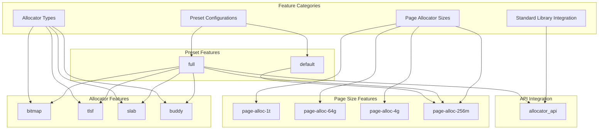
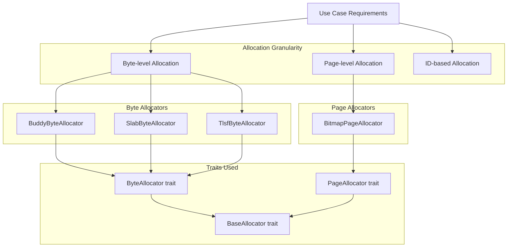
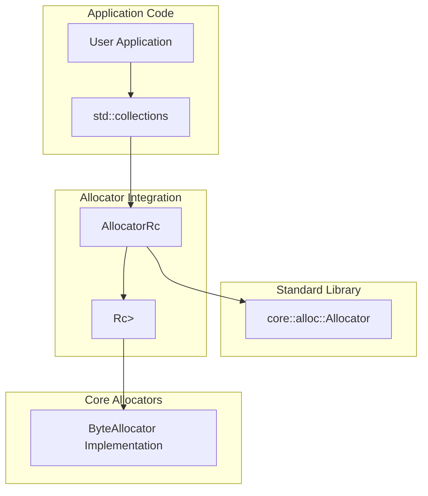

# Usage and Configuration

> **Relevant source files**
> * [Cargo.toml](https://github.com/arceos-org/allocator/blob/1d5b7a1b/Cargo.toml)

This document provides a comprehensive guide for integrating and configuring the allocator crate in your projects. It covers dependency management, feature selection, basic usage patterns, and integration with Rust's standard library allocator API.

For detailed information about specific allocator implementations and their algorithms, see [Allocator Implementations](/arceos-org/allocator/3-allocator-implementations). For testing and performance evaluation, see [Testing and Benchmarks](/arceos-org/allocator/5-testing-and-benchmarks).

## Adding the Dependency

The allocator crate is designed as a feature-gated library that allows you to compile only the allocator implementations you need. Add it to your `Cargo.toml` dependencies section:

```
[dependencies]
allocator = "0.1.1"
```

By default, this enables only the bitmap page allocator with 256MB memory space support through the `page-alloc-256m` feature as defined in [Cargo.toml(L13)&emsp;](https://github.com/arceos-org/allocator/blob/1d5b7a1b/Cargo.toml#L13-L13)

## Feature Configuration

The crate provides a flexible feature system that allows selective compilation of allocator types and memory space configurations.

### Feature Selection Overview



**Sources:** [Cargo.toml(L12 - L27)&emsp;](https://github.com/arceos-org/allocator/blob/1d5b7a1b/Cargo.toml#L12-L27)

### Available Features

|Feature|Purpose|Dependencies|
| --- | --- | --- |
|default|Enables bitmap page allocator with 256MB support|page-alloc-256m|
|full|Enables all allocator types and API integration|All features|
|bitmap|Bitmap-based page allocator|bitmap-allocator v0.2|
|tlsf|Two-Level Segregated Fit byte allocator|rlsf v0.2|
|slab|Slab-based byte allocator|slab_allocator v0.3.1|
|buddy|Buddy system byte allocator|buddy_system_allocator v0.10|
|allocator_api|Standard library allocator trait integration|None|
|page-alloc-1t|1TB memory space support|None|
|page-alloc-64g|64GB memory space support|None|
|page-alloc-4g|4GB memory space support|None|
|page-alloc-256m|256MB memory space support|None|

### Common Configuration Patterns

**Minimal Configuration (Default):**

```
[dependencies]
allocator = "0.1.1"
```

**All Allocators Enabled:**

```
[dependencies]
allocator = { version = "0.1.1", features = ["full"] }
```

**Specific Allocator Selection:**

```
[dependencies]
allocator = { version = "0.1.1", features = ["buddy", "tlsf", "allocator_api"] }
```

**Large Memory Space Configuration:**

```
[dependencies]
allocator = { version = "0.1.1", features = ["bitmap", "page-alloc-1t"] }
```

**Sources:** [Cargo.toml(L12 - L34)&emsp;](https://github.com/arceos-org/allocator/blob/1d5b7a1b/Cargo.toml#L12-L34)

## Basic Usage Patterns

The crate provides a trait-based interface that allows uniform interaction with different allocator implementations. The core traits are defined in [src/lib.rs](https://github.com/arceos-org/allocator/blob/1d5b7a1b/src/lib.rs) and enable polymorphic usage of allocators.

### Allocator Type Selection



**Sources:** [src/lib.rs](https://github.com/arceos-org/allocator/blob/1d5b7a1b/src/lib.rs) [src/bitmap.rs](https://github.com/arceos-org/allocator/blob/1d5b7a1b/src/bitmap.rs) [src/buddy.rs](https://github.com/arceos-org/allocator/blob/1d5b7a1b/src/buddy.rs) [src/slab.rs](https://github.com/arceos-org/allocator/blob/1d5b7a1b/src/slab.rs) [src/tlsf.rs](https://github.com/arceos-org/allocator/blob/1d5b7a1b/src/tlsf.rs)

### Integration Patterns

The allocators follow a consistent initialization and usage pattern:

1. **Initialization**: Call `init()` with memory region parameters
2. **Memory Addition**: Use `add_memory()` to register additional memory regions
3. **Allocation**: Use type-specific allocation methods (`alloc`, `alloc_pages`, etc.)
4. **Deallocation**: Use corresponding deallocation methods
5. **Statistics**: Query memory usage through built-in statistics methods

### Error Handling

All allocator operations return `AllocResult<T>`, which is a type alias for `Result<T, AllocError>`. The error types include:

* `InvalidParam`: Invalid parameters passed to allocator functions
* `MemoryOverlap`: Attempt to add overlapping memory regions
* `NoMemory`: Insufficient memory for allocation request
* `NotAllocated`: Attempt to deallocate memory that wasn't allocated

**Sources:** [src/lib.rs](https://github.com/arceos-org/allocator/blob/1d5b7a1b/src/lib.rs)

## Standard Library Integration

When the `allocator_api` feature is enabled, the crate provides integration with Rust's standard library allocator interface through the `AllocatorRc` wrapper.

### AllocatorRc Usage



The `AllocatorRc` provides:

* Reference-counted access to byte allocators
* Implementation of `core::alloc::Allocator` trait
* Thread-safe usage through `RefCell` interior mutability
* Compatibility with standard library collections

**Sources:** [src/lib.rs](https://github.com/arceos-org/allocator/blob/1d5b7a1b/src/lib.rs) [Cargo.toml(L22)&emsp;](https://github.com/arceos-org/allocator/blob/1d5b7a1b/Cargo.toml#L22-L22)

## Memory Space Configuration

The page allocator supports different maximum memory space configurations through mutually exclusive features:

|Feature|Maximum Memory|Use Case|
| --- | --- | --- |
|page-alloc-256m|256 MB|Small embedded systems, testing|
|page-alloc-4g|4 GB|Desktop applications, moderate memory|
|page-alloc-64g|64 GB|Server applications, large memory|
|page-alloc-1t|1 TB|High-performance computing, very large memory|

These features control the underlying bitmap allocator size and should be selected based on your application's maximum memory requirements. Using a smaller configuration reduces memory overhead of the allocator itself.

**Sources:** [Cargo.toml(L24 - L27)&emsp;](https://github.com/arceos-org/allocator/blob/1d5b7a1b/Cargo.toml#L24-L27)

## Development Dependencies

When developing with or testing the allocator crate, additional dependencies are available:

* **Testing**: The `full` feature is automatically enabled for development builds
* **Benchmarking**: `criterion` with HTML reports for performance testing
* **Randomization**: `rand` with `small_rng` feature for test data generation

These are configured as dev-dependencies and don't affect production builds.

**Sources:** [Cargo.toml(L36 - L43)&emsp;](https://github.com/arceos-org/allocator/blob/1d5b7a1b/Cargo.toml#L36-L43)