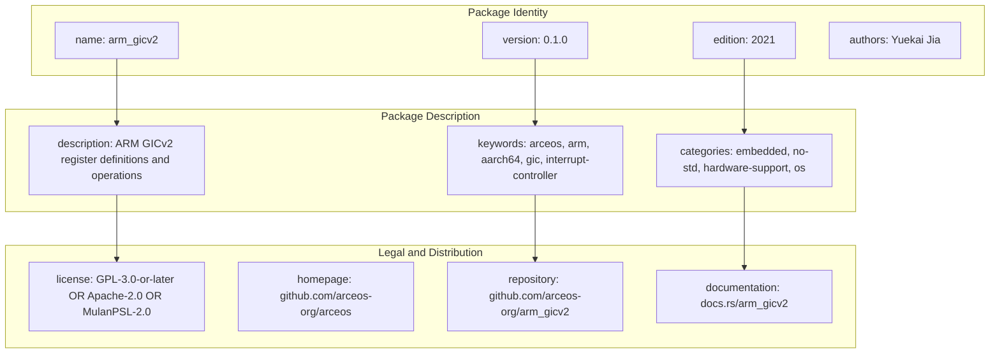
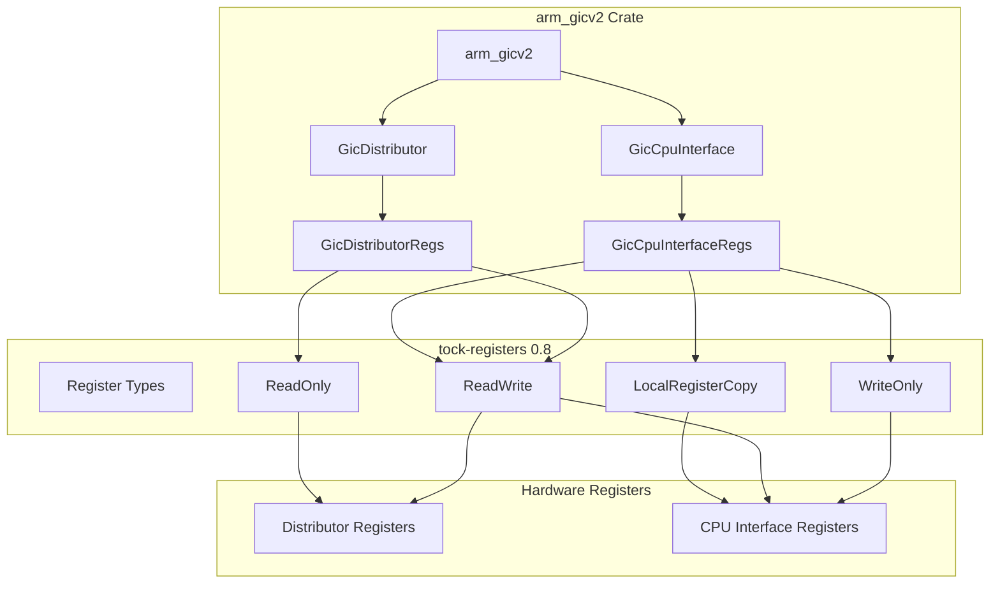
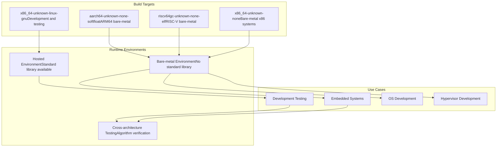
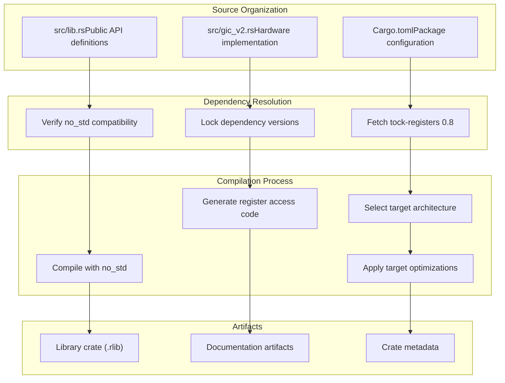

# Build System and Dependencies

> **Relevant source files**
> * [.gitignore](https://github.com/arceos-org/arm_gicv2/blob/cf756f76/.gitignore)
> * [Cargo.toml](https://github.com/arceos-org/arm_gicv2/blob/cf756f76/Cargo.toml)

This page covers the build system configuration, dependency management, and target architecture support for the `arm_gicv2` crate. It explains the Cargo package configuration, the `tock-registers` dependency choice, `no_std` compatibility requirements, and multi-target build support that enables the crate to work across embedded systems and operating system development environments.

For information about the CI/CD automation and testing infrastructure, see [CI/CD Pipeline](/arceos-org/arm_gicv2/4.2-cicd-pipeline). For development environment setup and contribution workflows, see [Development Environment](/arceos-org/arm_gicv2/4.3-development-environment).

## Package Configuration

The `arm_gicv2` crate is configured as a Rust library package that targets embedded systems and operating system development. The package metadata defines its purpose as providing ARM Generic Interrupt Controller version 2 register definitions and basic operations.

### Package Metadata Structure

Sources: [Cargo.toml(L1 - L12)&emsp;](https://github.com/arceos-org/arm_gicv2/blob/cf756f76/Cargo.toml#L1-L12)

The package uses Rust edition 2021, which provides modern language features while maintaining compatibility with embedded and `no_std` environments. The triple licensing approach (GPL-3.0-or-later, Apache-2.0, MulanPSL-2.0) ensures broad compatibility with different project licensing requirements.

### Target Categories and Keywords

The crate is categorized for four primary use cases:

|Category|Purpose|
| --- | --- |
|embedded|IoT devices and microcontroller applications|
|no-std|Environments without standard library support|
|hardware-support|Low-level hardware abstraction and drivers|
|os|Operating system kernel and hypervisor development|

Sources: [Cargo.toml(L12)&emsp;](https://github.com/arceos-org/arm_gicv2/blob/cf756f76/Cargo.toml#L12-L12)

## Dependency Management

The crate has a minimal dependency footprint, using only the `tock-registers` crate for type-safe register access. This design choice prioritizes compatibility with resource-constrained environments while providing safe hardware register manipulation.

### Core Dependency: tock-registers

Sources: [Cargo.toml(L15)&emsp;](https://github.com/arceos-org/arm_gicv2/blob/cf756f76/Cargo.toml#L15-L15)

The `tock-registers` dependency provides:

* Type-safe register field access with compile-time guarantees
* Memory-mapped register abstractions that prevent undefined behavior
* Zero-cost abstractions that compile to direct memory operations
* Support for read-only, write-only, and read-write register semantics

### Dependency Version Strategy

The crate pins `tock-registers` to version `0.8`, ensuring API stability while allowing patch-level updates. This approach balances security updates with build reproducibility across different development environments.

Sources: [Cargo.toml(L14 - L15)&emsp;](https://github.com/arceos-org/arm_gicv2/blob/cf756f76/Cargo.toml#L14-L15)

## Target Architecture Support

The build system supports multiple target architectures to enable deployment across different ARM-based systems and development environments. The `no_std` compatibility ensures the crate works in resource-constrained embedded environments.

### Supported Target Architectures

Sources: Referenced from high-level architecture diagrams

The multi-target support enables:

* **Development targets**: Linux-based development and unit testing
* **Bare-metal targets**: Direct hardware deployment without operating system
* **Cross-architecture validation**: Algorithm correctness verification across platforms

### no_std Compatibility Requirements

The crate maintains `no_std` compatibility through:

|Requirement|Implementation|
| --- | --- |
|Core library only|No standard library dependencies|
|Minimal allocations|Stack-based data structures only|
|Hardware-direct access|Memory-mapped register operations|
|Deterministic behavior|No dynamic memory allocation|

This design ensures the crate works in interrupt handlers, kernel space, and resource-constrained embedded environments where the standard library is unavailable or inappropriate.

## Build Configuration

The build system uses Cargo's default configuration with specific optimizations for embedded and systems programming use cases.

### Build Process Flow

Sources: [Cargo.toml(L1 - L16)&emsp;](https://github.com/arceos-org/arm_gicv2/blob/cf756f76/Cargo.toml#L1-L16) [.gitignore(L1 - L4)&emsp;](https://github.com/arceos-org/arm_gicv2/blob/cf756f76/.gitignore#L1-L4)

### Development Artifacts Management

The `.gitignore` configuration excludes build artifacts and development-specific files:

|Ignored Path|Purpose|
| --- | --- |
|/target|Cargo build artifacts and intermediate files|
|/.vscode|Visual Studio Code workspace configuration|
|.DS_Store|macOS file system metadata|
|Cargo.lock|Dependency lock file (excluded for library crates)|

Sources: [.gitignore(L1 - L4)&emsp;](https://github.com/arceos-org/arm_gicv2/blob/cf756f76/.gitignore#L1-L4)

The exclusion of `Cargo.lock` follows Rust library conventions, allowing downstream projects to resolve their own dependency versions while maintaining compatibility with the specified version ranges.