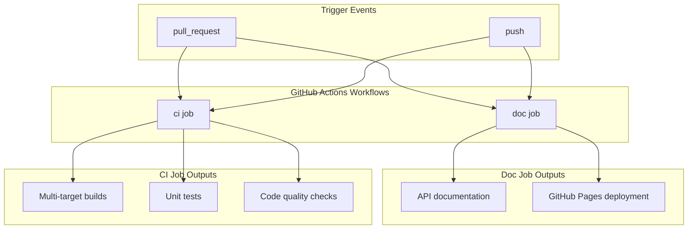
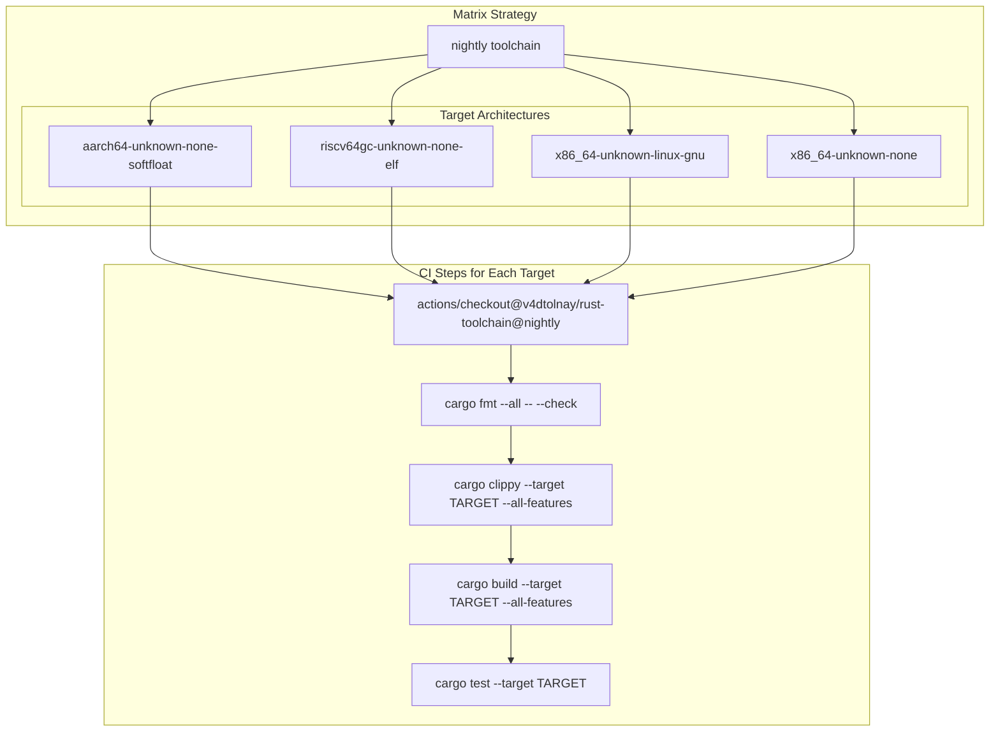
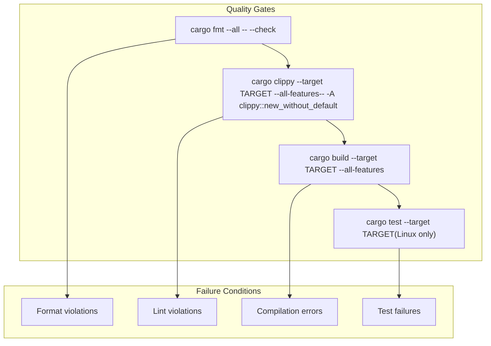
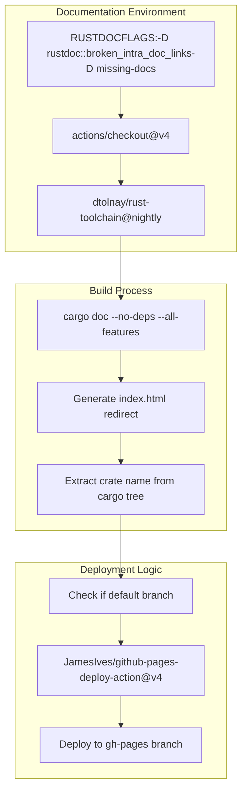

# CI/CD Pipeline

> **Relevant source files**
> * [.github/workflows/ci.yml](https://github.com/arceos-org/arm_gicv2/blob/cf756f76/.github/workflows/ci.yml)

This document describes the automated continuous integration and continuous deployment (CI/CD) pipeline for the arm_gicv2 crate. The pipeline is implemented using GitHub Actions and handles code quality assurance, multi-target builds, testing, and automated documentation deployment.

For information about the build system configuration and dependencies, see [Build System and Dependencies](/arceos-org/arm_gicv2/4.1-build-system-and-dependencies). For development environment setup, see [Development Environment](/arceos-org/arm_gicv2/4.3-development-environment).

## Pipeline Overview

The CI/CD pipeline consists of two primary workflows that execute on every push and pull request, ensuring code quality and maintaining up-to-date documentation.

**CI/CD Pipeline Overview**

Sources: [.github/workflows/ci.yml(L1 - L56)&emsp;](https://github.com/arceos-org/arm_gicv2/blob/cf756f76/.github/workflows/ci.yml#L1-L56)

## CI Job Configuration

The main `ci` job runs quality assurance checks and builds across multiple target architectures using a matrix strategy.

### Matrix Strategy

The pipeline uses a fail-fast matrix configuration to test across multiple target platforms:

|Target Architecture|Purpose|
| --- | --- |
|x86_64-unknown-linux-gnu|Standard Linux development and testing|
|x86_64-unknown-none|Bare-metal x86_64 environments|
|riscv64gc-unknown-none-elf|RISC-V embedded systems|
|aarch64-unknown-none-softfloat|ARM64 embedded systems|

**CI Job Matrix and Execution Flow**

Sources: [.github/workflows/ci.yml(L6 - L30)&emsp;](https://github.com/arceos-org/arm_gicv2/blob/cf756f76/.github/workflows/ci.yml#L6-L30)

### Quality Assurance Steps

The CI pipeline enforces code quality through multiple automated checks:

1. **Code Formatting**: Uses `cargo fmt` with the `--check` flag to ensure consistent code formatting
2. **Linting**: Runs `cargo clippy` with all features enabled, specifically allowing the `clippy::new_without_default` lint
3. **Building**: Compiles the crate for each target architecture with all features enabled
4. **Testing**: Executes unit tests, but only for the `x86_64-unknown-linux-gnu` target

**Quality Assurance Gate Sequence**

Sources: [.github/workflows/ci.yml(L22 - L30)&emsp;](https://github.com/arceos-org/arm_gicv2/blob/cf756f76/.github/workflows/ci.yml#L22-L30)

## Documentation Job

The `doc` job handles API documentation generation and deployment to GitHub Pages.

### Documentation Build Process

The documentation build process includes strict documentation standards and automated deployment:

**Documentation Build and Deployment Flow**

Sources: [.github/workflows/ci.yml(L32 - L56)&emsp;](https://github.com/arceos-org/arm_gicv2/blob/cf756f76/.github/workflows/ci.yml#L32-L56)

### Documentation Standards

The pipeline enforces strict documentation requirements through `RUSTDOCFLAGS`:

* **Broken Links**: `-D rustdoc::broken_intra_doc_links` treats broken documentation links as errors
* **Missing Documentation**: `-D missing-docs` requires all public items to have documentation

### Deployment Configuration

Documentation deployment occurs automatically under specific conditions:

* **Branch Condition**: Only deploys when the push is to the default branch
* **Target Branch**: Deploys to the `gh-pages` branch
* **Single Commit**: Uses `single-commit: true` to maintain a clean deployment history
* **Source Folder**: Deploys the `target/doc` directory containing generated documentation

Sources: [.github/workflows/ci.yml(L38 - L55)&emsp;](https://github.com/arceos-org/arm_gicv2/blob/cf756f76/.github/workflows/ci.yml#L38-L55)

## Toolchain and Component Configuration

The pipeline uses the Rust nightly toolchain with specific components required for the complete CI/CD process:

|Component|Purpose|
| --- | --- |
|rust-src|Source code for cross-compilation|
|clippy|Linting and code analysis|
|rustfmt|Code formatting|

The toolchain setup includes automatic target installation for all matrix targets, ensuring consistent build environments across all supported architectures.

Sources: [.github/workflows/ci.yml(L15 - L19)&emsp;](https://github.com/arceos-org/arm_gicv2/blob/cf756f76/.github/workflows/ci.yml#L15-L19)