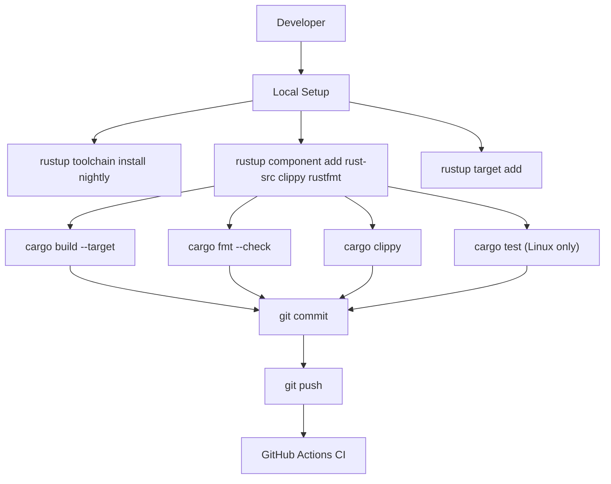
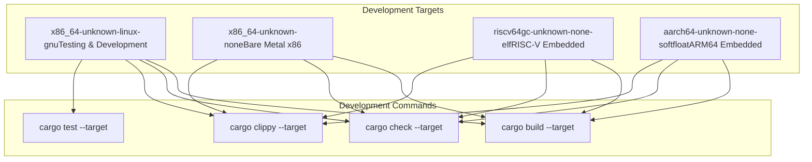
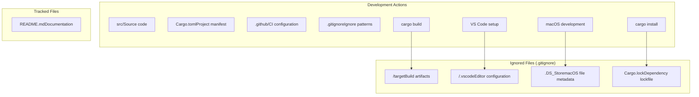
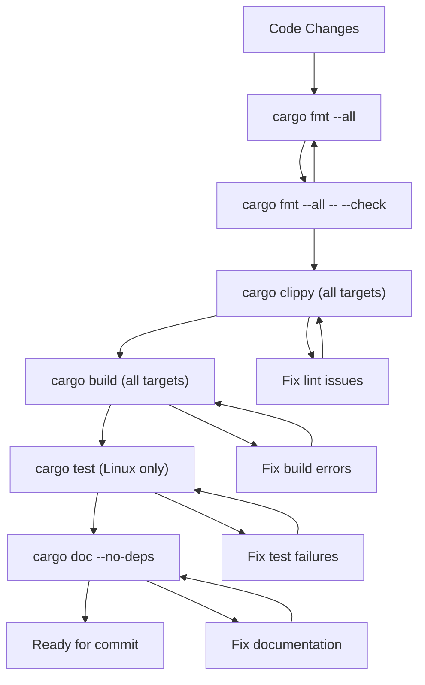

# Development Environment

> **Relevant source files**
> * [.github/workflows/ci.yml](https://github.com/arceos-org/arm_gicv2/blob/cf756f76/.github/workflows/ci.yml)
> * [.gitignore](https://github.com/arceos-org/arm_gicv2/blob/cf756f76/.gitignore)

This document covers setting up and configuring a local development environment for contributing to the arm_gicv2 crate. It focuses on developer tooling, project organization, and recommended workflows for contributors.

For information about the build system configuration and dependency management, see [Build System and Dependencies](/arceos-org/arm_gicv2/4.1-build-system-and-dependencies). For details about the automated CI/CD pipeline, see [CI/CD Pipeline](/arceos-org/arm_gicv2/4.2-cicd-pipeline).

## Local Development Setup

The arm_gicv2 crate requires specific toolchain configurations to support its target embedded systems. The development environment must accommodate multiple target architectures and maintain compatibility with `no_std` environments.

### Required Toolchain Components

The project uses Rust nightly toolchain with specific components as defined in the CI configuration:

|Component|Purpose|Usage Context|
| --- | --- | --- |
|rust-src|Source code for cross-compilation|Required forno_stdtargets|
|clippy|Linting and code analysis|Code quality enforcement|
|rustfmt|Code formatting|Style consistency|

**Development Workflow Diagram**



Sources: [.github/workflows/ci.yml(L15 - L19)&emsp;](https://github.com/arceos-org/arm_gicv2/blob/cf756f76/.github/workflows/ci.yml#L15-L19)

### Target Architecture Support

The development environment must support multiple target architectures for cross-compilation testing:



Sources: [.github/workflows/ci.yml(L12)&emsp;](https://github.com/arceos-org/arm_gicv2/blob/cf756f76/.github/workflows/ci.yml#L12-L12) [.github/workflows/ci.yml(L25 - L30)&emsp;](https://github.com/arceos-org/arm_gicv2/blob/cf756f76/.github/workflows/ci.yml#L25-L30)

## Development Tools and Editor Configuration

### Editor Support

The project includes VS Code in its gitignore patterns, indicating that some developers use VS Code but configuration is not standardized across the team.

**File Organization and Ignored Paths**



Sources: [.gitignore(L1 - L4)&emsp;](https://github.com/arceos-org/arm_gicv2/blob/cf756f76/.gitignore#L1-L4)

### Ignored Development Artifacts

The `.gitignore` configuration reveals important aspects of the development environment:

|Pattern|Purpose|Rationale|
| --- | --- | --- |
|/target|Rust build artifacts|Generated bycargo buildcommands|
|/.vscode|VS Code workspace settings|Developer-specific editor configuration|
|.DS_Store|macOS file system metadata|Platform-specific system files|
|Cargo.lock|Dependency version lockfile|Library crate - consumers control versions|

The exclusion of `Cargo.lock` is particularly significant as it indicates this is a library crate where downstream consumers should control dependency versions rather than the library itself.

Sources: [.gitignore(L1 - L4)&emsp;](https://github.com/arceos-org/arm_gicv2/blob/cf756f76/.gitignore#L1-L4)

## Quality Assurance Integration

### Local Development Commands

The development environment should replicate CI checks locally before committing:

```markdown
# Format check (matches CI)
cargo fmt --all -- --check

# Linting (matches CI with specific allowances) 
cargo clippy --target <target> --all-features -- -A clippy::new_without_default

# Build verification
cargo build --target <target> --all-features

# Unit testing (Linux target only)
cargo test --target x86_64-unknown-linux-gnu -- --nocapture
```

### Documentation Development

Local documentation building follows the same process as CI deployment:

```markdown
# Build documentation with strict link checking
RUSTDOCFLAGS="-D rustdoc::broken_intra_doc_links -D missing-docs" cargo doc --no-deps --all-features
```

Sources: [.github/workflows/ci.yml(L23 - L30)&emsp;](https://github.com/arceos-org/arm_gicv2/blob/cf756f76/.github/workflows/ci.yml#L23-L30) [.github/workflows/ci.yml(L40)&emsp;](https://github.com/arceos-org/arm_gicv2/blob/cf756f76/.github/workflows/ci.yml#L40-L40) [.github/workflows/ci.yml(L47)&emsp;](https://github.com/arceos-org/arm_gicv2/blob/cf756f76/.github/workflows/ci.yml#L47-L47)

## Contribution Workflow

### Pre-commit Verification

Before submitting changes, developers should verify their code passes all CI checks locally:

**Local Testing Workflow**



### Platform-Specific Considerations

Since unit tests only run on `x86_64-unknown-linux-gnu`, developers working on other platforms should ensure access to a Linux environment for complete testing.

The multi-target build verification ensures that changes maintain compatibility across all supported embedded platforms without requiring developers to have access to physical hardware.

Sources: [.github/workflows/ci.yml(L28 - L30)&emsp;](https://github.com/arceos-org/arm_gicv2/blob/cf756f76/.github/workflows/ci.yml#L28-L30) [.github/workflows/ci.yml(L12)&emsp;](https://github.com/arceos-org/arm_gicv2/blob/cf756f76/.github/workflows/ci.yml#L12-L12)