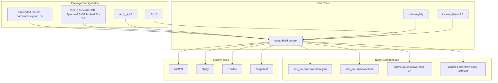
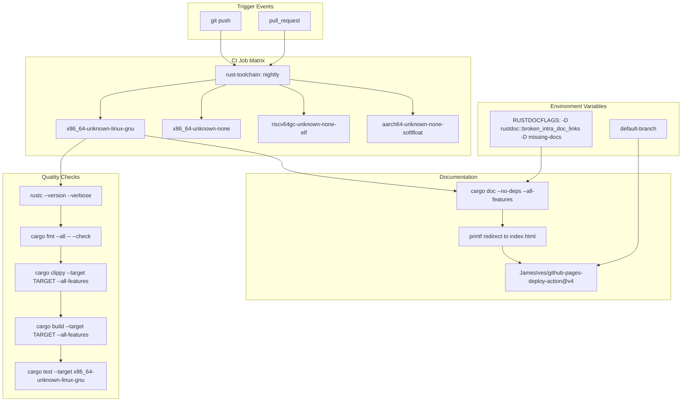

# Development Guide

> **Relevant source files**
> * [.github/workflows/ci.yml](https://github.com/arceos-org/arm_gicv2/blob/cf756f76/.github/workflows/ci.yml)
> * [Cargo.toml](https://github.com/arceos-org/arm_gicv2/blob/cf756f76/Cargo.toml)

This page provides an overview of the development workflow, tools, and processes for contributing to the `arm_gicv2` crate. It covers the essential information developers need to understand the build system, quality assurance processes, and deployment pipeline.

For detailed information about specific aspects of development, see the following sub-sections:

* Build system configuration and dependency management: [Build System and Dependencies](/arceos-org/arm_gicv2/4.1-build-system-and-dependencies)
* Automated testing and deployment processes: [CI/CD Pipeline](/arceos-org/arm_gicv2/4.2-cicd-pipeline)
* Setting up your local development environment: [Development Environment](/arceos-org/arm_gicv2/4.3-development-environment)

## Development Overview

The `arm_gicv2` crate follows modern Rust development practices with automated quality assurance and documentation deployment. The development workflow centers around a `no_std` compatible library that provides hardware abstraction for ARM Generic Interrupt Controller v2 across multiple target architectures.

## Core Development Tools and Dependencies

The development ecosystem relies on several key components that work together to ensure code quality and compatibility:

### Development Tool Chain

**Sources:** [Cargo.toml(L1 - L16)&emsp;](https://github.com/arceos-org/arm_gicv2/blob/cf756f76/Cargo.toml#L1-L16) [.github/workflows/ci.yml(L11 - L19)&emsp;](https://github.com/arceos-org/arm_gicv2/blob/cf756f76/.github/workflows/ci.yml#L11-L19)

## Automated Development Lifecycle

The project implements a comprehensive CI/CD pipeline that ensures code quality and deploys documentation automatically:

### CI/CD Workflow

**Sources:** [.github/workflows/ci.yml(L1 - L56)&emsp;](https://github.com/arceos-org/arm_gicv2/blob/cf756f76/.github/workflows/ci.yml#L1-L56)

## Package Metadata and Configuration

The crate is configured as a library package with specific metadata that defines its purpose and compatibility:

|Configuration|Value|Purpose|
| --- | --- | --- |
|name|arm_gicv2|Crate identifier for Cargo registry|
|version|0.1.0|Semantic versioning for API compatibility|
|edition|2021|Rust language edition features|
|authors|Yuekai Jia <equation618@gmail.com>|Primary maintainer contact|
|description|ARM Generic Interrupt Controller version 2 (GICv2) register definitions and basic operations|Crate purpose summary|
|license|GPL-3.0-or-later OR Apache-2.0 OR MulanPSL-2.0|Multi-license compatibility|
|keywords|arceos, arm, aarch64, gic, interrupt-controller|Discovery and categorization|
|categories|embedded, no-std, hardware-support, os|Cargo registry classification|

**Sources:** [Cargo.toml(L1 - L12)&emsp;](https://github.com/arceos-org/arm_gicv2/blob/cf756f76/Cargo.toml#L1-L12)

## Key Development Characteristics

### No-std Compatibility

The crate is designed for `no_std` environments, making it suitable for bare-metal development, embedded systems, and operating system kernels. This is reflected in the target architecture support and category classifications.

### Multi-target Support

Development and testing occur across four distinct target architectures:

* `x86_64-unknown-linux-gnu`: Standard Linux development and testing
* `x86_64-unknown-none`: Bare-metal x86_64 systems
* `riscv64gc-unknown-none-elf`: RISC-V 64-bit bare-metal systems
* `aarch64-unknown-none-softfloat`: ARM64 bare-metal with software floating point

### Single Dependency

The crate maintains minimal external dependencies with only `tock-registers = "0.8"` providing type-safe register access abstractions. This design choice supports the embedded and bare-metal use cases where dependency minimization is critical.

**Sources:** [Cargo.toml(L14 - L15)&emsp;](https://github.com/arceos-org/arm_gicv2/blob/cf756f76/Cargo.toml#L14-L15) [.github/workflows/ci.yml(L12)&emsp;](https://github.com/arceos-org/arm_gicv2/blob/cf756f76/.github/workflows/ci.yml#L12-L12)