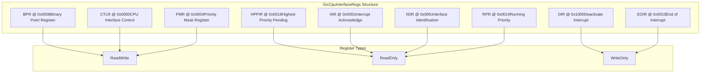
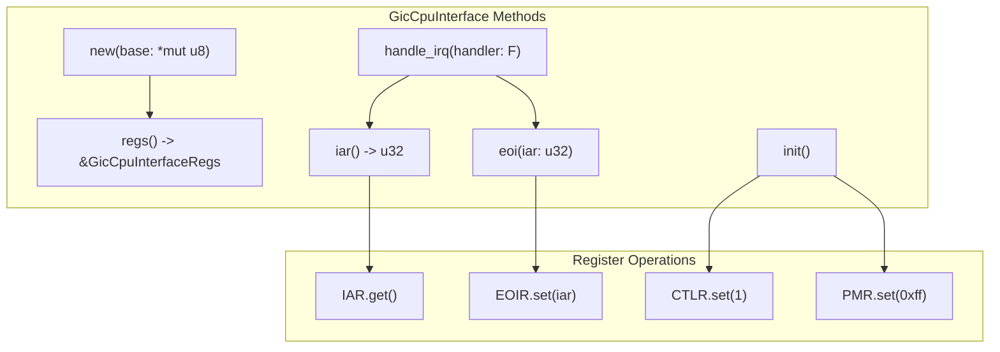
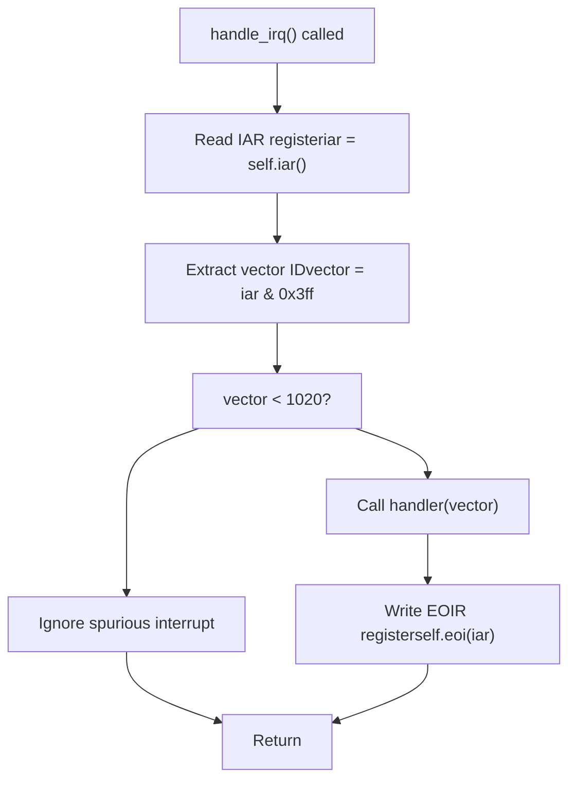
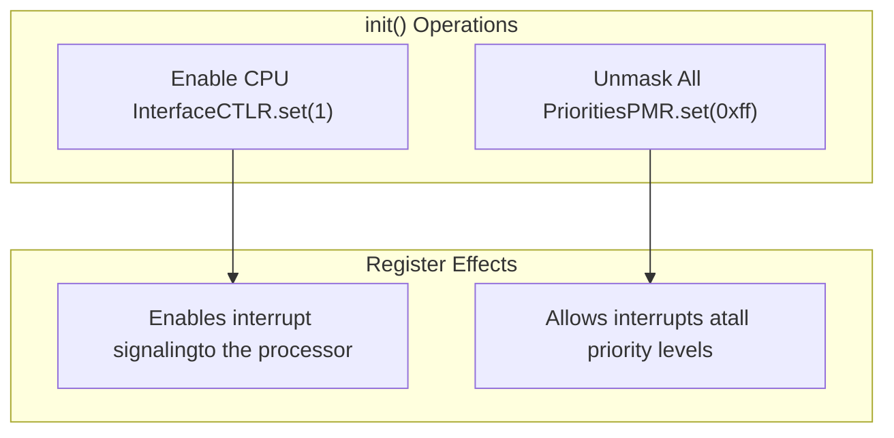

# GIC CPU Interface

> **Relevant source files**
> * [src/gic_v2.rs](https://github.com/arceos-org/arm_gicv2/blob/cf756f76/src/gic_v2.rs)

This document covers the `GicCpuInterface` implementation, which provides per-CPU interrupt handling functionality for ARM GICv2 controllers. The CPU interface handles interrupt acknowledgment, completion signaling, priority masking, and preemption control for individual processor cores.

For system-wide interrupt distribution and configuration, see [GIC Distributor](/arceos-org/arm_gicv2/3.1-gic-distributor). For the overall interrupt classification system, see [Interrupt System Architecture](/arceos-org/arm_gicv2/2-interrupt-system-architecture).

## CPU Interface Register Structure

The `GicCpuInterfaceRegs` struct defines the memory-mapped register layout for the CPU interface, providing type-safe access to hardware registers that control per-CPU interrupt processing.



Sources: [src/gic_v2.rs(L50 - L76)&emsp;](https://github.com/arceos-org/arm_gicv2/blob/cf756f76/src/gic_v2.rs#L50-L76)

## Core Interface Implementation

The `GicCpuInterface` struct wraps the register structure and provides safe methods for interrupt handling operations.

|Component|Type|Purpose|
| --- | --- | --- |
|base|NonNull<GicCpuInterfaceRegs>|Pointer to memory-mapped registers|
|Thread Safety|Send + Sync|Safe for multi-threaded access|



Sources: [src/gic_v2.rs(L114 - L116)&emsp;](https://github.com/arceos-org/arm_gicv2/blob/cf756f76/src/gic_v2.rs#L114-L116) [src/gic_v2.rs(L214 - L222)&emsp;](https://github.com/arceos-org/arm_gicv2/blob/cf756f76/src/gic_v2.rs#L214-L222)

## Interrupt Acknowledgment and Completion

The CPU interface provides a two-phase interrupt handling protocol: acknowledgment via `iar()` and completion via `eoi()`.

### Interrupt Acknowledge Register (IAR)

The `iar()` method reads the `GICC_IAR` register to obtain the interrupt ID of the highest priority pending interrupt. This operation atomically acknowledges the interrupt and changes its state from pending to active.

```rust
pub fn iar(&self) -> u32 {
    self.regs().IAR.get()
}
```

**Spurious Interrupt Handling**: The method returns interrupt ID `1023` when no valid interrupt is pending, the distributor is disabled, or the CPU interface is disabled.

Sources: [src/gic_v2.rs(L230 - L232)&emsp;](https://github.com/arceos-org/arm_gicv2/blob/cf756f76/src/gic_v2.rs#L230-L232)

### End of Interrupt (EOI)

The `eoi()` method writes to the `GICC_EOIR` register to signal completion of interrupt processing. The value written must match the value previously read from `iar()`.

```rust
pub fn eoi(&self, iar: u32) {
    self.regs().EOIR.set(iar);
}
```

Sources: [src/gic_v2.rs(L238 - L240)&emsp;](https://github.com/arceos-org/arm_gicv2/blob/cf756f76/src/gic_v2.rs#L238-L240)

## High-Level Interrupt Handling

The `handle_irq()` method provides a complete interrupt handling flow that combines acknowledgment, handler execution, and completion in a single operation.



The method masks the interrupt ID to 10 bits (`iar & 0x3ff`) to extract the vector number, as the upper bits of the IAR register contain additional status information.

Sources: [src/gic_v2.rs(L250 - L262)&emsp;](https://github.com/arceos-org/arm_gicv2/blob/cf756f76/src/gic_v2.rs#L250-L262)

## CPU Interface Initialization

The `init()` method configures the CPU interface for operation by enabling interrupt delivery and setting priority masking.



**Initialization Requirements**:

* Must be called exactly once per CPU
* Should be called after distributor initialization
* Priority mask value `0xff` represents the lowest priority threshold, allowing all interrupts

Sources: [src/gic_v2.rs(L269 - L275)&emsp;](https://github.com/arceos-org/arm_gicv2/blob/cf756f76/src/gic_v2.rs#L269-L275)

## Thread Safety and Memory Management

The `GicCpuInterface` implements `Send` and `Sync` traits, enabling safe usage across thread boundaries in multi-core systems.

|Safety Aspect|Implementation|
| --- | --- |
|Memory Safety|NonNull<GicCpuInterfaceRegs>prevents null pointer dereference|
|Thread Safety|unsafe impl Send + Syncallows cross-thread usage|
|Register Access|const fn regs()provides immutable reference to registers|
|Hardware Synchronization|Hardware ensures atomic register operations|

The `unsafe` implementations of `Send` and `Sync` are justified because:

* Hardware registers are designed for concurrent access from multiple CPUs
* Each CPU interface instance manages a separate set of memory-mapped registers
* Register operations are atomic at the hardware level

Sources: [src/gic_v2.rs(L121 - L122)&emsp;](https://github.com/arceos-org/arm_gicv2/blob/cf756f76/src/gic_v2.rs#L121-L122)