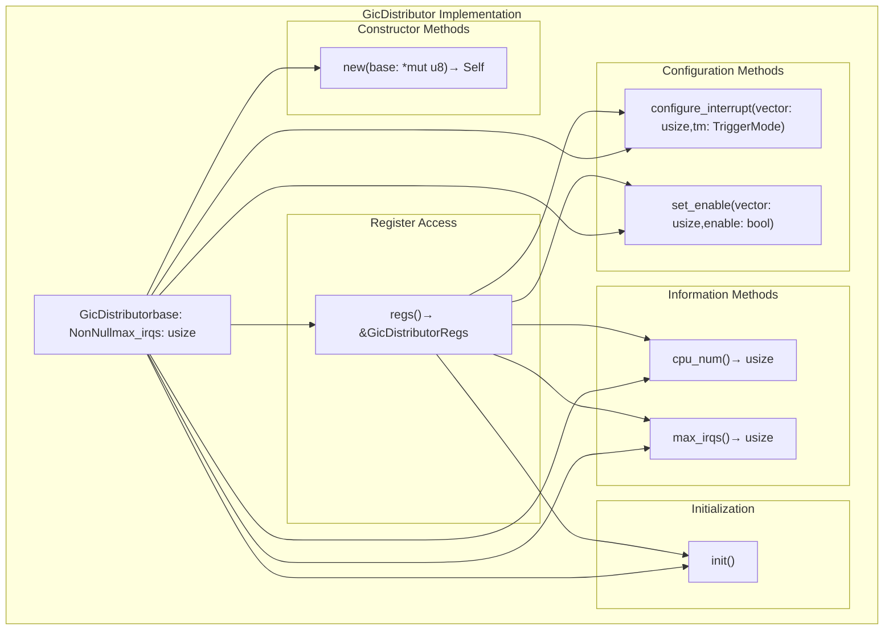
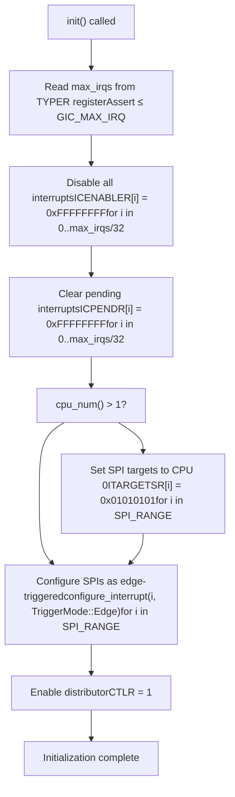
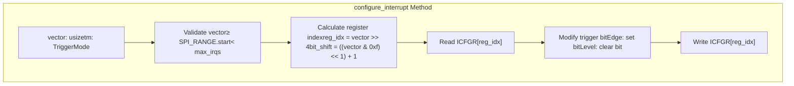
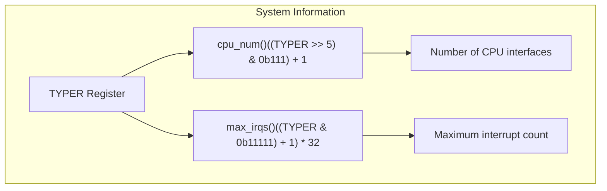

# GIC Distributor

> **Relevant source files**
> * [src/gic_v2.rs](https://github.com/arceos-org/arm_gicv2/blob/cf756f76/src/gic_v2.rs)

The GIC Distributor provides system-wide interrupt configuration and routing capabilities for the ARM GICv2 interrupt controller. This component manages interrupt prioritization, distribution to CPU interfaces, and global interrupt settings across all processors in the system.

For per-CPU interrupt handling and acknowledgment, see [GIC CPU Interface](/arceos-org/arm_gicv2/3.2-gic-cpu-interface). For background on interrupt types and ranges, see [Interrupt Types and Ranges](/arceos-org/arm_gicv2/2.1-interrupt-types-and-ranges).

## Register Structure and Memory Layout

The GIC Distributor is accessed through a memory-mapped register interface defined by the `GicDistributorRegs` structure. This provides type-safe access to all distributor control registers.

### Distributor Register Layout

```

```

Sources: [src/gic_v2.rs(L12 - L48)&emsp;](https://github.com/arceos-org/arm_gicv2/blob/cf756f76/src/gic_v2.rs#L12-L48)

## Core Implementation Structure

The `GicDistributor` struct provides the main interface for distributor operations, encapsulating the register base address and maximum interrupt count.

### Distributor Component Architecture



Sources: [src/gic_v2.rs(L96 - L210)&emsp;](https://github.com/arceos-org/arm_gicv2/blob/cf756f76/src/gic_v2.rs#L96-L210)

## Initialization Process

The distributor initialization follows a specific sequence to establish a known state and configure default interrupt routing.

### Initialization Sequence

|Step|Operation|Register(s)|Purpose|
| --- | --- | --- | --- |
|1|Disable all interrupts|ICENABLER[*]|Clear existing enables|
|2|Clear pending interrupts|ICPENDR[*]|Reset pending state|
|3|Set SPI targets to CPU 0|ITARGETSR[*]|Default routing|
|4|Configure SPIs as edge-triggered|ICFGR[*]|Set trigger mode|
|5|Enable distributor|CTLR|Activate GICD|



Sources: [src/gic_v2.rs(L186 - L209)&emsp;](https://github.com/arceos-org/arm_gicv2/blob/cf756f76/src/gic_v2.rs#L186-L209)

## Interrupt Configuration

The distributor provides methods to configure interrupt properties including trigger modes and enable/disable states.

### Trigger Mode Configuration

The `configure_interrupt` method sets the trigger mode for SPI interrupts using the `ICFGR` registers:



### Enable/Disable Control

The `set_enable` method controls interrupt enable state using dedicated enable/disable registers:

|Operation|Register Used|Bit Effect|
| --- | --- | --- |
|Enable|ISENABLER[reg]|Set bit atvector % 32|
|Disable|ICENABLER[reg]|Set bit atvector % 32|

Where `reg = vector / 32`.

Sources: [src/gic_v2.rs(L147 - L178)&emsp;](https://github.com/arceos-org/arm_gicv2/blob/cf756f76/src/gic_v2.rs#L147-L178)

## System Information Interface

The distributor provides methods to query system configuration determined by hardware implementation.

### Hardware Detection Methods



Sources: [src/gic_v2.rs(L138 - L145)&emsp;](https://github.com/arceos-org/arm_gicv2/blob/cf756f76/src/gic_v2.rs#L138-L145)

## Thread Safety and Memory Access

The `GicDistributor` implements `Send` and `Sync` traits for safe concurrent access across threads, with register access performed through unsafe memory operations wrapped in safe interfaces.

The register access uses `NonNull<GicDistributorRegs>` to ensure the base pointer is always valid and uses the tock-registers crate for type-safe memory-mapped I/O operations.

Sources: [src/gic_v2.rs(L5 - L135)&emsp;](https://github.com/arceos-org/arm_gicv2/blob/cf756f76/src/gic_v2.rs#L5-L135)