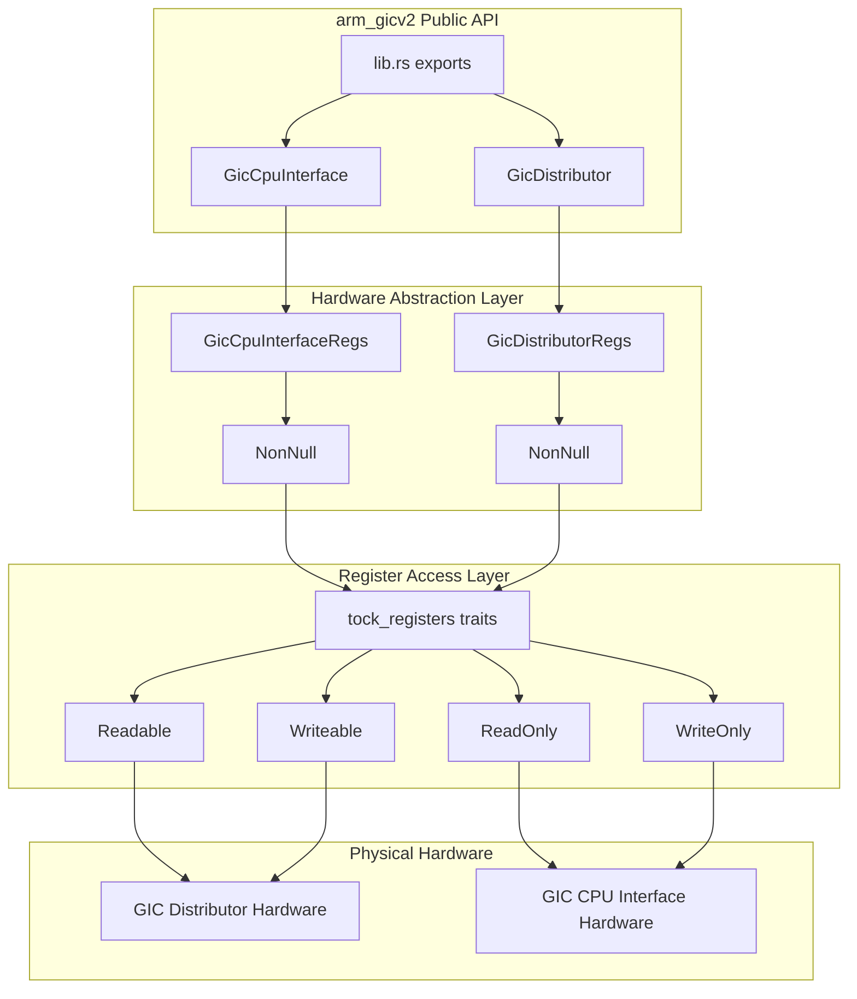

# Hardware Interface Implementation

> **Relevant source files**
> * [src/gic_v2.rs](https://github.com/arceos-org/arm_gicv2/blob/cf756f76/src/gic_v2.rs)
> * [src/lib.rs](https://github.com/arceos-org/arm_gicv2/blob/cf756f76/src/lib.rs)

This document provides an overview of the two primary hardware abstraction components in the arm_gicv2 crate: `GicDistributor` and `GicCpuInterface`. These components provide type-safe, register-level access to ARM Generic Interrupt Controller v2 hardware through memory-mapped register interfaces.

For detailed interrupt classification and routing mechanisms, see [Interrupt System Architecture](/arceos-org/arm_gicv2/2-interrupt-system-architecture). For implementation details of individual components, see [GIC Distributor](/arceos-org/arm_gicv2/3.1-gic-distributor) and [GIC CPU Interface](/arceos-org/arm_gicv2/3.2-gic-cpu-interface).

## Core Hardware Abstraction Components

The arm_gicv2 crate implements hardware abstraction through two main structures that directly correspond to the physical GICv2 hardware blocks:

|Component|Hardware Block|Primary Responsibility|
| --- | --- | --- |
|GicDistributor|GIC Distributor (GICD)|System-wide interrupt configuration and routing|
|GicCpuInterface|GIC CPU Interface (GICC)|Per-CPU interrupt handling and acknowledgment|

Both components are defined in [src/gic_v2.rs(L96 - L116)&emsp;](https://github.com/arceos-org/arm_gicv2/blob/cf756f76/src/gic_v2.rs#L96-L116) and exported through the public API in [src/lib.rs(L10)&emsp;](https://github.com/arceos-org/arm_gicv2/blob/cf756f76/src/lib.rs#L10-L10)

### GicDistributor Structure

The `GicDistributor` manages system-wide interrupt configuration and provides the programming interface for:

* Globally enabling interrupt forwarding
* Configuring interrupt trigger modes (edge/level)
* Setting interrupt target processors
* Managing interrupt priority and grouping
* Generating software interrupts (SGIs)

### GicCpuInterface Structure

The `GicCpuInterface` handles per-CPU interrupt processing and provides the programming interface for:

* Acknowledging pending interrupts
* Signaling interrupt completion
* Setting priority masks
* Managing preemption policies

Sources: [src/gic_v2.rs(L78 - L116)&emsp;](https://github.com/arceos-org/arm_gicv2/blob/cf756f76/src/gic_v2.rs#L78-L116) [src/lib.rs(L10)&emsp;](https://github.com/arceos-org/arm_gicv2/blob/cf756f76/src/lib.rs#L10-L10)

## Hardware Abstraction Architecture



Sources: [src/gic_v2.rs(L1 - L276)&emsp;](https://github.com/arceos-org/arm_gicv2/blob/cf756f76/src/gic_v2.rs#L1-L276) [src/lib.rs(L8 - L10)&emsp;](https://github.com/arceos-org/arm_gicv2/blob/cf756f76/src/lib.rs#L8-L10)

## Register Interface Design

```mermaid
flowchart TD
subgraph subGraph2["Memory Layout"]
    DistBase["base: NonNull"]
    CpuBase["base: NonNull"]
end
subgraph subGraph1["GicCpuInterfaceRegs Structure"]
    CCTLR["CTLR: ReadWrite"]
    CPMR["PMR: ReadWrite"]
    CBPR["BPR: ReadWrite"]
    CIAR["IAR: ReadOnly"]
    CEOIR["EOIR: WriteOnly"]
    CRPR["RPR: ReadOnly"]
    CHPPIR["HPPIR: ReadOnly"]
    CDIR["DIR: WriteOnly"]
end
subgraph subGraph0["GicDistributorRegs Structure"]
    DCTLR["CTLR: ReadWrite"]
    DTYPER["TYPER: ReadOnly"]
    DISENABLER["ISENABLER: [ReadWrite; 0x20]"]
    DICENABLER["ICENABLER: [ReadWrite; 0x20]"]
    DIPRIORITYR["IPRIORITYR: [ReadWrite; 0x100]"]
    DITARGETSR["ITARGETSR: [ReadWrite; 0x100]"]
    DICFGR["ICFGR: [ReadWrite; 0x40]"]
    DSGIR["SGIR: WriteOnly"]
end

CpuBase --> CCTLR
CpuBase --> CEOIR
CpuBase --> CIAR
CpuBase --> CPMR
DistBase --> DCTLR
DistBase --> DICFGR
DistBase --> DIPRIORITYR
DistBase --> DISENABLER
```



The register structures are defined using the `tock_registers::register_structs!` macro, which provides compile-time memory layout validation and type-safe register access patterns.

Sources: [src/gic_v2.rs(L12 - L76)&emsp;](https://github.com/arceos-org/arm_gicv2/blob/cf756f76/src/gic_v2.rs#L12-L76)

## Component Initialization and Lifecycle

Both hardware components follow a consistent initialization pattern:

|Phase|GicDistributor|GicCpuInterface|
| --- | --- | --- |
|Construction|new(base: *mut u8)|new(base: *mut u8)|
|Initialization|init()- Disables all interrupts, configures SPIs|init()- Enables interface, unmasks priorities|
|Runtime|Configuration and routing operations|Interrupt handling and acknowledgment|

The initialization sequence ensures that:

1. All interrupts are initially disabled
2. SPI interrupts are configured as edge-triggered by default
3. SPI targets are set to CPU 0 in multi-CPU systems
4. Hardware interfaces are enabled for operation

Sources: [src/gic_v2.rs(L124 - L131)&emsp;](https://github.com/arceos-org/arm_gicv2/blob/cf756f76/src/gic_v2.rs#L124-L131) [src/gic_v2.rs(L212 - L218)&emsp;](https://github.com/arceos-org/arm_gicv2/blob/cf756f76/src/gic_v2.rs#L212-L218) [src/gic_v2.rs(L180 - L209)&emsp;](https://github.com/arceos-org/arm_gicv2/blob/cf756f76/src/gic_v2.rs#L180-L209) [src/gic_v2.rs(L264 - L274)&emsp;](https://github.com/arceos-org/arm_gicv2/blob/cf756f76/src/gic_v2.rs#L264-L274)

## Thread Safety and Send/Sync Implementation

Both components implement `Send` and `Sync` traits through explicit `unsafe impl` blocks, enabling their use in multi-threaded environments:

```
unsafe impl Send for GicDistributor {}
unsafe impl Sync for GicDistributor {}
unsafe impl Send for GicCpuInterface {}
unsafe impl Sync for GicCpuInterface {}
```

This design acknowledges that while the underlying hardware registers require careful coordination, the abstraction layer itself can be safely shared across thread boundaries when properly synchronized at the application level.

Sources: [src/gic_v2.rs(L118 - L122)&emsp;](https://github.com/arceos-org/arm_gicv2/blob/cf756f76/src/gic_v2.rs#L118-L122)