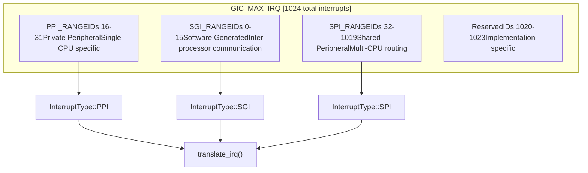
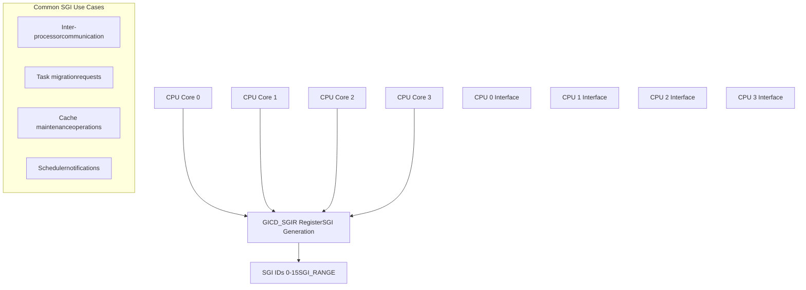
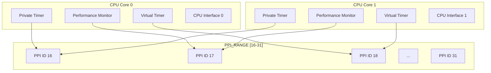
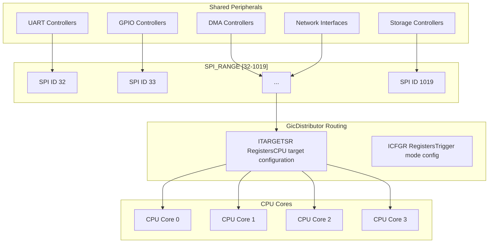
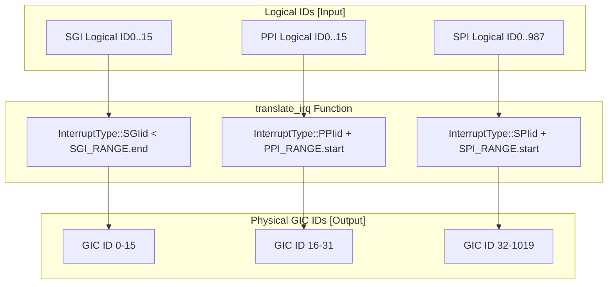

# Interrupt Types and Ranges

> **Relevant source files**
> * [src/lib.rs](https://github.com/arceos-org/arm_gicv2/blob/cf756f76/src/lib.rs)

This document details the three interrupt types supported by the ARM GICv2 controller and their corresponding interrupt ID ranges as implemented in the arm_gicv2 crate. It covers the classification system that divides the 1024-interrupt address space into Software-Generated Interrupts (SGI), Private Peripheral Interrupts (PPI), and Shared Peripheral Interrupts (SPI), along with the translation mechanisms between logical and physical interrupt identifiers.

For information about trigger modes and the `translate_irq` function implementation details, see [Trigger Modes and Translation](/arceos-org/arm_gicv2/2.2-trigger-modes-and-translation). For the hardware interface implementations that use these interrupt types, see [Hardware Interface Implementation](/arceos-org/arm_gicv2/3-hardware-interface-implementation).

## Interrupt Classification Overview

The ARM GICv2 specification defines a structured interrupt ID space of 1024 interrupts (0-1023) divided into three distinct types, each serving different purposes in the system architecture.

**GICv2 Interrupt ID Space Allocation**

Sources: [src/lib.rs(L12 - L30)&emsp;](https://github.com/arceos-org/arm_gicv2/blob/cf756f76/src/lib.rs#L12-L30)

## Software-Generated Interrupts (SGI)

Software-Generated Interrupts occupy interrupt IDs 0-15 and are primarily used for inter-processor communication in multi-core systems. These interrupts are triggered by software writing to the GIC Distributor's `GICD_SGIR` register.

|Property|Value|
| --- | --- |
|Range Constant|SGI_RANGE|
|ID Range|0-15 (16 interrupts)|
|Purpose|Inter-processor communication|
|Trigger Method|Software write to GICD_SGIR|
|Target|Specific CPU cores|

**SGI Characteristics and Usage**

Sources: [src/lib.rs(L12 - L16)&emsp;](https://github.com/arceos-org/arm_gicv2/blob/cf756f76/src/lib.rs#L12-L16)

## Private Peripheral Interrupts (PPI)

Private Peripheral Interrupts use interrupt IDs 16-31 and are generated by peripherals that are private to each individual processor core. Each CPU core has its own set of PPI interrupt sources.

|Property|Value|
| --- | --- |
|Range Constant|PPI_RANGE|
|ID Range|16-31 (16 interrupts)|
|Purpose|Private peripheral interrupts|
|Scope|Single CPU core|
|Examples|Private timers, PMU, virtual timer|

**PPI Architecture and Core Association**

Sources: [src/lib.rs(L18 - L21)&emsp;](https://github.com/arceos-org/arm_gicv2/blob/cf756f76/src/lib.rs#L18-L21)

## Shared Peripheral Interrupts (SPI)

Shared Peripheral Interrupts occupy the largest portion of the interrupt space, using IDs 32-1019. These interrupts can be routed to any CPU core and are typically generated by system-wide peripherals.

|Property|Value|
| --- | --- |
|Range Constant|SPI_RANGE|
|ID Range|32-1019 (988 interrupts)|
|Purpose|Shared peripheral interrupts|
|Routing|Configurable to any CPU core|
|Examples|UART, GPIO, DMA, network controllers|

**SPI Routing and Distribution**

Sources: [src/lib.rs(L23 - L27)&emsp;](https://github.com/arceos-org/arm_gicv2/blob/cf756f76/src/lib.rs#L23-L27)

## Interrupt ID Translation

The `translate_irq` function converts logical interrupt IDs (relative to each interrupt type) into physical GIC interrupt IDs (absolute addressing within the 1024-interrupt space).

**Translation Logic and Mapping**

### Translation Examples

|Input|Interrupt Type|Calculation|Output|
| --- | --- | --- | --- |
|id=5|InterruptType::SGI|id(direct mapping)|Some(5)|
|id=3|InterruptType::PPI|id + 16|Some(19)|
|id=10|InterruptType::SPI|id + 32|Some(42)|
|id=20|InterruptType::SGI|Invalid (≥16)|None|

### Range Validation

The translation function includes bounds checking to ensure logical IDs are valid for their respective interrupt types:

* **SGI**: Logical ID must be `< SGI_RANGE.end` (16)
* **PPI**: Logical ID must be `< PPI_RANGE.end - PPI_RANGE.start` (16)
* **SPI**: Logical ID must be `< SPI_RANGE.end - SPI_RANGE.start` (988)

Sources: [src/lib.rs(L65 - L90)&emsp;](https://github.com/arceos-org/arm_gicv2/blob/cf756f76/src/lib.rs#L65-L90)

## Implementation Constants

The interrupt ranges and limits are defined as compile-time constants in the crate's public API:

|Constant|Value|Purpose|
| --- | --- | --- |
|SGI_RANGE|0..16|Software-generated interrupt range|
|PPI_RANGE|16..32|Private peripheral interrupt range|
|SPI_RANGE|32..1020|Shared peripheral interrupt range|
|GIC_MAX_IRQ|1024|Maximum interrupt capacity|

These constants are used throughout the crate for bounds checking, validation, and hardware register configuration.

Sources: [src/lib.rs(L12 - L30)&emsp;](https://github.com/arceos-org/arm_gicv2/blob/cf756f76/src/lib.rs#L12-L30)