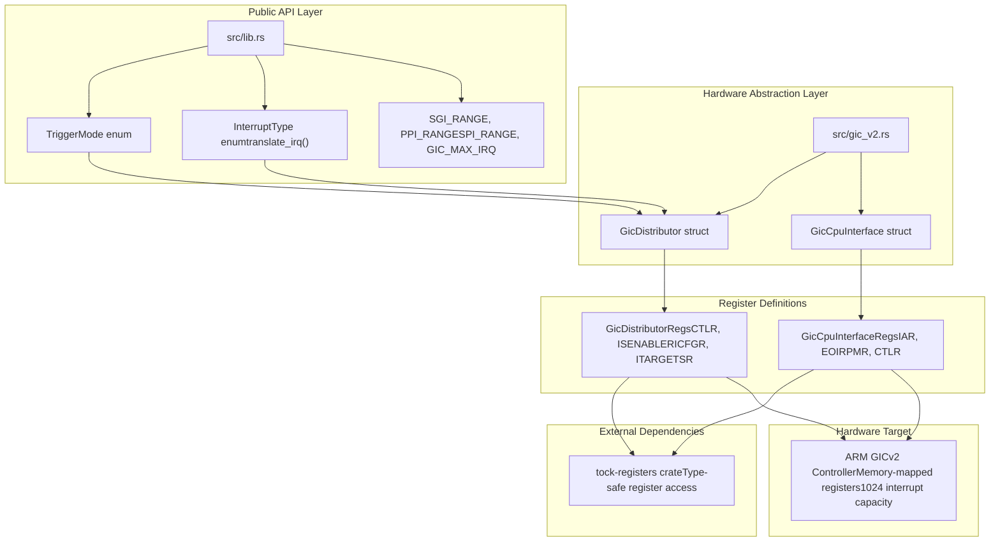
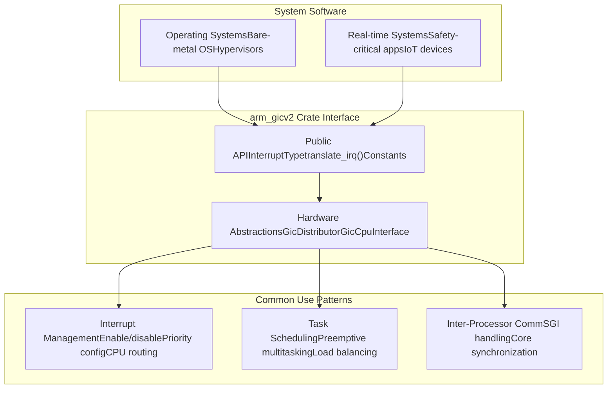

# Overview

> **Relevant source files**
> * [Cargo.toml](https://github.com/arceos-org/arm_gicv2/blob/cf756f76/Cargo.toml)
> * [README.md](https://github.com/arceos-org/arm_gicv2/blob/cf756f76/README.md)

This document provides an overview of the `arm_gicv2` crate, a hardware abstraction layer for the ARM Generic Interrupt Controller version 2 (GICv2). The crate provides type-safe register definitions and basic operations for managing interrupts on ARM-based systems.

For detailed information about interrupt classification and ranges, see [Interrupt System Architecture](/arceos-org/arm_gicv2/2-interrupt-system-architecture). For implementation details of the hardware interfaces, see [Hardware Interface Implementation](/arceos-org/arm_gicv2/3-hardware-interface-implementation). For development guidance and build system information, see [Development Guide](/arceos-org/arm_gicv2/4-development-guide).

## Purpose and Scope

The `arm_gicv2` crate serves as a low-level hardware abstraction layer for the ARM Generic Interrupt Controller version 2, enabling operating systems and embedded applications to manage interrupts in a type-safe manner. The crate provides register definitions, interrupt type classifications, and basic operations without imposing higher-level interrupt handling policies.

**Sources:** [Cargo.toml(L1 - L16)&emsp;](https://github.com/arceos-org/arm_gicv2/blob/cf756f76/Cargo.toml#L1-L16) [README.md(L1 - L10)&emsp;](https://github.com/arceos-org/arm_gicv2/blob/cf756f76/README.md#L1-L10)

## Target Platforms and Use Cases

The crate targets ARM systems that implement the GICv2 specification, specifically:

|Platform|Architecture|Use Cases|
| --- | --- | --- |
|ARMv7-A|Application Processors|Operating systems, hypervisors|
|ARMv7-R|Real-time Processors|Real-time systems, safety-critical applications|

The crate is designed for `no_std` environments and supports multiple target architectures including `aarch64-unknown-none-softfloat` and `riscv64gc-unknown-none-elf`, making it suitable for bare-metal operating system development and embedded applications.

**Sources:** [Cargo.toml(L11 - L12)&emsp;](https://github.com/arceos-org/arm_gicv2/blob/cf756f76/Cargo.toml#L11-L12)

## Core Architecture

The following diagram illustrates the main components of the `arm_gicv2` crate and their relationships to code entities:

**Sources:** [Cargo.toml(L14 - L15)&emsp;](https://github.com/arceos-org/arm_gicv2/blob/cf756f76/Cargo.toml#L14-L15) high-level architecture diagrams

## Key Features

The `arm_gicv2` crate provides the following core features:

### Interrupt Type System

* **SGI (Software Generated Interrupts)**: IDs 0-15 for inter-processor communication
* **PPI (Private Peripheral Interrupts)**: IDs 16-31 for CPU-specific peripherals
* **SPI (Shared Peripheral Interrupts)**: IDs 32-1019 for system-wide peripherals
* **ID Translation**: The `translate_irq()` function maps logical interrupt IDs to physical GIC interrupt IDs

### Hardware Interface Components

* **`GicDistributor`**: System-wide interrupt configuration, routing, and priority management
* **`GicCpuInterface`**: Per-CPU interrupt handling, acknowledgment, and completion signaling

### Type-Safe Register Access

The crate leverages the `tock-registers` dependency to provide compile-time safety for register operations, preventing common errors in low-level hardware programming.

**Sources:** [Cargo.toml(L6)&emsp;](https://github.com/arceos-org/arm_gicv2/blob/cf756f76/Cargo.toml#L6-L6) [Cargo.toml(L14 - L15)&emsp;](https://github.com/arceos-org/arm_gicv2/blob/cf756f76/Cargo.toml#L14-L15)

## Integration Context

The following diagram shows how the `arm_gicv2` crate integrates into larger system contexts:

The crate is designed to be a foundational component in system software stacks, providing the necessary abstractions for higher-level interrupt management policies while maintaining direct access to hardware capabilities when needed.

**Sources:** [Cargo.toml(L11 - L12)&emsp;](https://github.com/arceos-org/arm_gicv2/blob/cf756f76/Cargo.toml#L11-L12) [README.md(L7 - L9)&emsp;](https://github.com/arceos-org/arm_gicv2/blob/cf756f76/README.md#L7-L9)