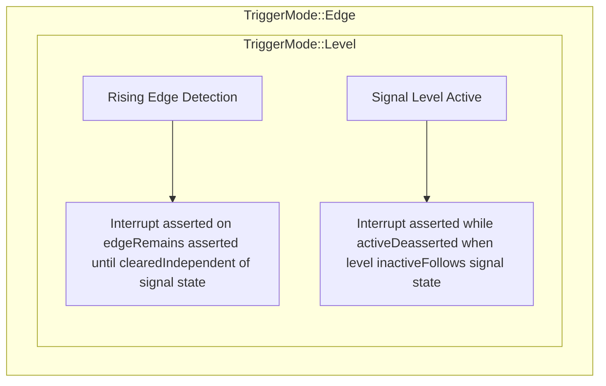
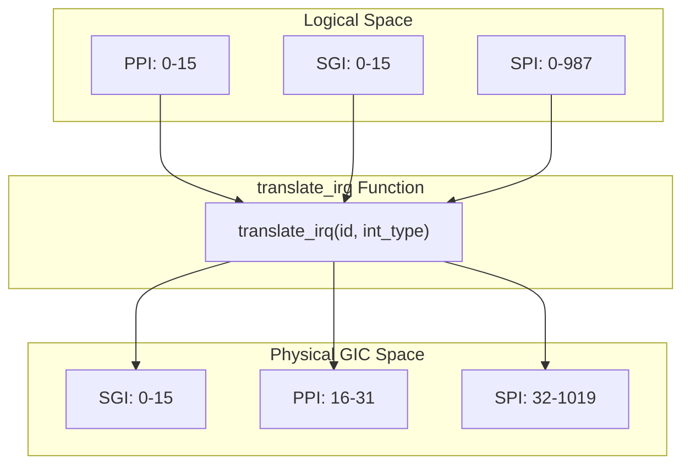
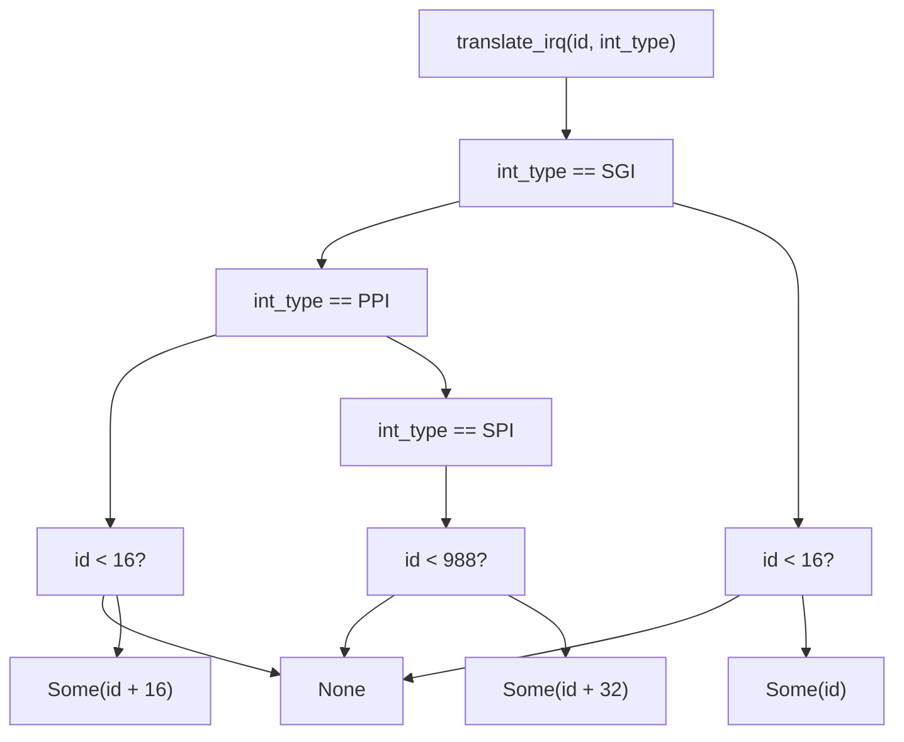

# Trigger Modes and Translation

> **Relevant source files**
> * [src/lib.rs](https://github.com/arceos-org/arm_gicv2/blob/cf756f76/src/lib.rs)

## Purpose and Scope

This document explains the interrupt trigger mode configuration and interrupt ID translation mechanisms provided by the ARM GICv2 crate. It covers how the `TriggerMode` enum defines edge and level triggering behavior, and how the `translate_irq` function maps logical interrupt IDs to physical GIC interrupt IDs across different interrupt types.

For information about interrupt types and their ranges, see [Interrupt Types and Ranges](/arceos-org/arm_gicv2/2.1-interrupt-types-and-ranges). For hardware implementation details, see [Hardware Interface Implementation](/arceos-org/arm_gicv2/3-hardware-interface-implementation).

## Trigger Modes

The GICv2 supports two fundamental interrupt trigger modes that determine how the interrupt controller responds to interrupt signals from peripheral devices.

### Edge vs Level Triggering

The `TriggerMode` enum defines two triggering behaviors:

|Mode|Value|Behavior|
| --- | --- | --- |
|Edge|0|Asserted on rising edge detection, remains asserted until cleared|
|Level|1|Asserted while signal level is active, deasserted when inactive|

**Edge-triggered interrupts** are suitable for event-based peripherals where the interrupt indicates that something has happened, such as a timer expiration or a button press. The interrupt remains active until software explicitly clears it.

**Level-sensitive interrupts** are appropriate for status-based peripherals where the interrupt indicates an ongoing condition, such as a UART receive buffer containing data or a device error state.

Sources: [src/lib.rs(L32 - L46)&emsp;](https://github.com/arceos-org/arm_gicv2/blob/cf756f76/src/lib.rs#L32-L46)

## Interrupt ID Translation

The `translate_irq` function provides a mapping layer between logical interrupt IDs and physical GIC interrupt IDs. This abstraction allows software to work with interrupt IDs relative to each interrupt type rather than absolute GIC interrupt IDs.

### Translation Mechanism

The translation function maps logical IDs to physical GIC interrupt IDs based on interrupt type:

|Interrupt Type|Logical ID Range|Physical ID Range|Translation Formula|
| --- | --- | --- | --- |
|SGI|0-15|0-15|physical_id = logical_id|
|PPI|0-15|16-31|physical_id = logical_id + 16|
|SPI|0-987|32-1019|physical_id = logical_id + 32|

### Implementation Logic

The `translate_irq` function implements the following logic for each interrupt type:

**SGI Translation**: SGI interrupts maintain a direct 1:1 mapping between logical and physical IDs since they occupy the lowest interrupt ID range (0-15).

**PPI Translation**: PPI interrupts add an offset of 16 to map logical IDs 0-15 to physical IDs 16-31. The function validates that the logical ID is within the valid PPI range.

**SPI Translation**: SPI interrupts add an offset of 32 to map logical IDs 0-987 to physical IDs 32-1019. The function ensures the logical ID fits within the available SPI range.

### Error Handling

The function returns `Option<usize>` to handle invalid interrupt IDs gracefully. It returns `None` when:

* SGI logical ID ≥ 16
* PPI logical ID ≥ 16
* SPI logical ID ≥ 988

This validation ensures that only valid interrupt IDs are translated, preventing out-of-bounds access to GIC registers.

Sources: [src/lib.rs(L65 - L90)&emsp;](https://github.com/arceos-org/arm_gicv2/blob/cf756f76/src/lib.rs#L65-L90) [src/lib.rs(L12 - L30)&emsp;](https://github.com/arceos-org/arm_gicv2/blob/cf756f76/src/lib.rs#L12-L30)