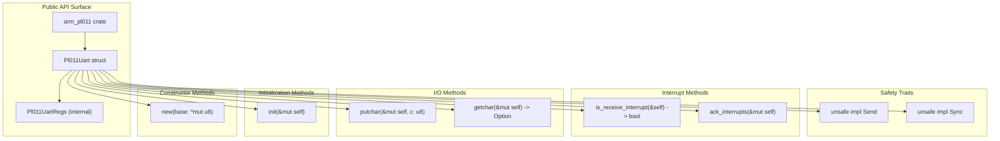
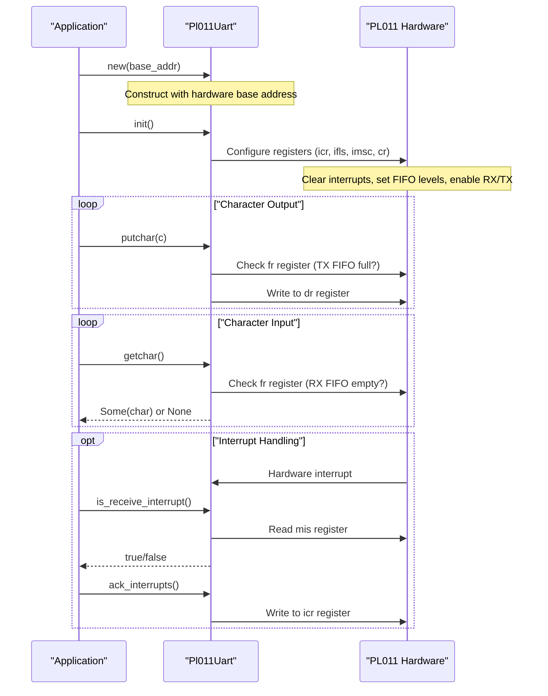
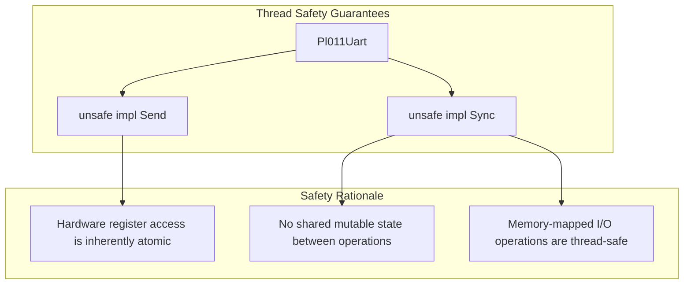

# API Reference

> **Relevant source files**
> * [src/lib.rs](https://github.com/arceos-org/arm_pl011/blob/a5a02f1f/src/lib.rs)
> * [src/pl011.rs](https://github.com/arceos-org/arm_pl011/blob/a5a02f1f/src/pl011.rs)

This document provides comprehensive API documentation for the `arm_pl011` crate, covering all public interfaces, method signatures, and usage patterns. The API is designed for direct hardware control of PL011 UART controllers in embedded systems and bare-metal environments.

For implementation details and internal architecture, see [Core Implementation](/arceos-org/arm_pl011/2-core-implementation). For hardware-specific register specifications, see [Hardware Reference](/arceos-org/arm_pl011/5-hardware-reference).

## API Overview

The `arm_pl011` crate exposes a minimal but complete interface centered around the `Pl011Uart` struct. The API follows a pattern of explicit initialization followed by character-level I/O operations with optional interrupt handling.

### Public Interface Structure



Sources: [src/lib.rs(L8)&emsp;](https://github.com/arceos-org/arm_pl011/blob/a5a02f1f/src/lib.rs#L8-L8) [src/pl011.rs(L34 - L103)&emsp;](https://github.com/arceos-org/arm_pl011/blob/a5a02f1f/src/pl011.rs#L34-L103)

### Method Call Flow



Sources: [src/pl011.rs(L51 - L103)&emsp;](https://github.com/arceos-org/arm_pl011/blob/a5a02f1f/src/pl011.rs#L51-L103)

## Core Types

### Pl011Uart

The main driver struct that provides safe access to PL011 UART hardware registers.

|Field|Type|Description|
| --- | --- | --- |
|base|NonNull<Pl011UartRegs>|Typed pointer to memory-mapped register base address|

**Safety Characteristics:**

* Implements `Send` and `Sync` for multi-threaded environments
* Uses `NonNull` for memory safety guarantees
* Requires `unsafe` implementations due to hardware register access

Sources: [src/pl011.rs(L42 - L47)&emsp;](https://github.com/arceos-org/arm_pl011/blob/a5a02f1f/src/pl011.rs#L42-L47)

### Pl011UartRegs

Internal register structure defining the memory layout of PL011 UART registers.

|Offset|Register|Type|Description|
| --- | --- | --- | --- |
|0x00|dr|ReadWrite<u32>|Data Register|
|0x18|fr|ReadOnly<u32>|Flag Register|
|0x30|cr|ReadWrite<u32>|Control Register|
|0x34|ifls|ReadWrite<u32>|Interrupt FIFO Level Select|
|0x38|imsc|ReadWrite<u32>|Interrupt Mask Set Clear|
|0x3c|ris|ReadOnly<u32>|Raw Interrupt Status|
|0x40|mis|ReadOnly<u32>|Masked Interrupt Status|
|0x44|icr|WriteOnly<u32>|Interrupt Clear|

Sources: [src/pl011.rs(L9 - L32)&emsp;](https://github.com/arceos-org/arm_pl011/blob/a5a02f1f/src/pl011.rs#L9-L32)

## Method Documentation

### Constructor Methods

#### new(base: *mut u8) -> Self

Creates a new `Pl011Uart` instance from a hardware base address.

**Parameters:**

* `base`: Raw pointer to the memory-mapped UART register base address

**Returns:**

* `Pl011Uart` instance ready for initialization

**Safety:**

* Marked as `const fn` for compile-time construction
* Uses `NonNull::new().unwrap()` - will panic if base address is null
* Caller must ensure base address points to valid PL011 hardware

**Example Usage:**

```javascript
// Base address for QEMU virt machine PL011
const UART_BASE: *mut u8 = 0x09000000 as *mut u8;
let mut uart = Pl011Uart::new(UART_BASE);
```

Sources: [src/pl011.rs(L50 - L55)&emsp;](https://github.com/arceos-org/arm_pl011/blob/a5a02f1f/src/pl011.rs#L50-L55)

### Initialization Methods

#### init(&mut self)

Initializes the PL011 UART with default configuration for basic operation.

**Configuration Applied:**

* Clears all pending interrupts (`icr = 0x7ff`)
* Sets FIFO trigger levels to 1/8 for both RX and TX (`ifls = 0`)
* Enables receive interrupts (`imsc = 1 << 4`)
* Enables UART, transmitter, and receiver (`cr = (1 << 0) | (1 << 8) | (1 << 9)`)

**Prerequisites:**

* Hardware clock and reset must be properly configured
* Base address must point to accessible PL011 registers

Sources: [src/pl011.rs(L61 - L76)&emsp;](https://github.com/arceos-org/arm_pl011/blob/a5a02f1f/src/pl011.rs#L61-L76)

### I/O Methods

#### putchar(&mut self, c: u8)

Transmits a single byte through the UART.

**Parameters:**

* `c`: Byte value to transmit

**Behavior:**

* Blocks until TX FIFO has space (polls `fr` register bit 5)
* Writes character to data register (`dr`)
* No return value - always succeeds once FIFO space available

**Register Operations:**

```
// Wait for TX FIFO not full
while self.regs().fr.get() & (1 << 5) != 0 {}
// Write character
self.regs().dr.set(c as u32);
```

Sources: [src/pl011.rs(L78 - L82)&emsp;](https://github.com/arceos-org/arm_pl011/blob/a5a02f1f/src/pl011.rs#L78-L82)

#### getchar(&mut self) -> Option<u8>

Attempts to read a single byte from the UART receive buffer.

**Returns:**

* `Some(byte)`: If data is available in RX FIFO
* `None`: If RX FIFO is empty

**Behavior:**

* Non-blocking operation
* Checks RX FIFO empty flag (`fr` register bit 4)
* Reads from data register (`dr`) if data available

**Register Operations:**

```
if self.regs().fr.get() & (1 << 4) == 0 {
    Some(self.regs().dr.get() as u8)
} else {
    None
}
```

Sources: [src/pl011.rs(L84 - L91)&emsp;](https://github.com/arceos-org/arm_pl011/blob/a5a02f1f/src/pl011.rs#L84-L91)

### Interrupt Methods

#### is_receive_interrupt(&self) -> bool

Checks if a receive interrupt is currently pending.

**Returns:**

* `true`: Receive interrupt is pending
* `false`: No receive interrupt pending

**Register Operations:**

* Reads masked interrupt status (`mis` register)
* Checks receive interrupt bit (bit 4)

Sources: [src/pl011.rs(L93 - L97)&emsp;](https://github.com/arceos-org/arm_pl011/blob/a5a02f1f/src/pl011.rs#L93-L97)

#### ack_interrupts(&mut self)

Clears all pending UART interrupts.

**Behavior:**

* Writes `0x7ff` to interrupt clear register (`icr`)
* Clears all interrupt types simultaneously
* Should be called from interrupt handler after processing

Sources: [src/pl011.rs(L99 - L102)&emsp;](https://github.com/arceos-org/arm_pl011/blob/a5a02f1f/src/pl011.rs#L99-L102)

## Thread Safety Implementation

The `Pl011Uart` struct implements both `Send` and `Sync` traits to enable safe usage across thread boundaries in multi-threaded embedded systems.



**Implementation Details:**

* `Send`: Safe to transfer ownership between threads
* `Sync`: Safe to share references between threads
* Hardware registers provide atomic access guarantees
* No internal synchronization primitives required

**Usage Considerations:**

* Multiple threads can safely call read-only methods (`is_receive_interrupt`)
* Mutable methods require external synchronization for concurrent access
* Interrupt handlers can safely access the same instance

Sources: [src/pl011.rs(L46 - L47)&emsp;](https://github.com/arceos-org/arm_pl011/blob/a5a02f1f/src/pl011.rs#L46-L47)