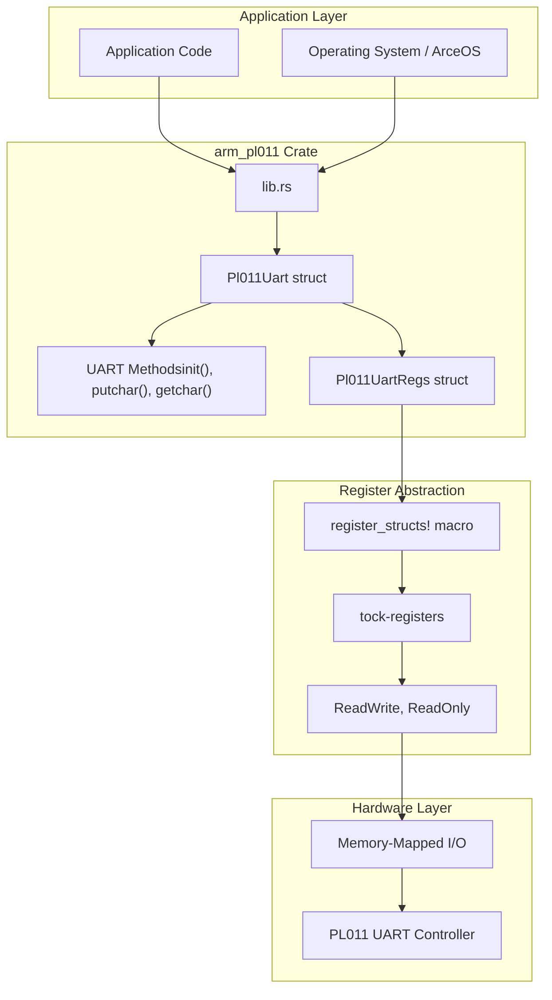
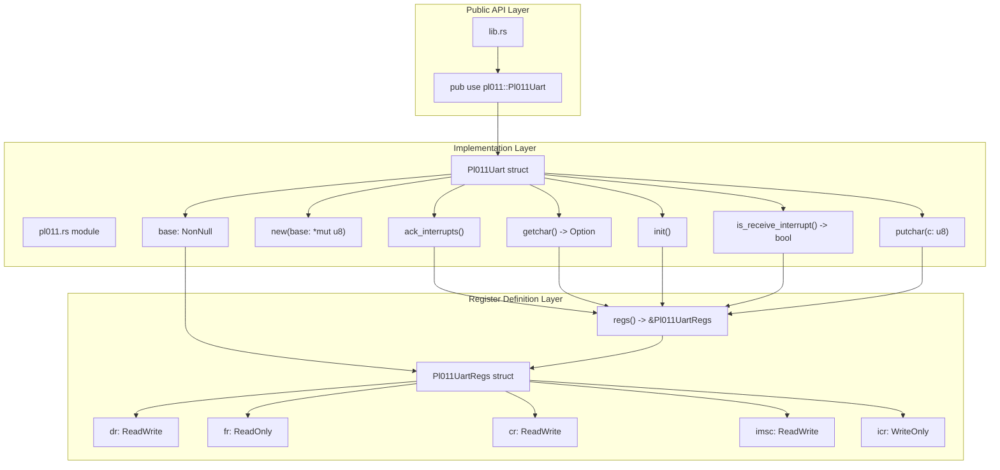
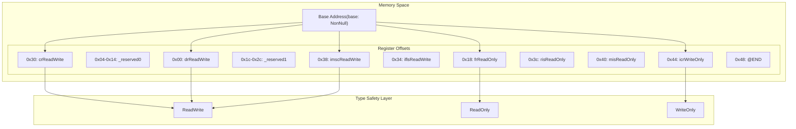
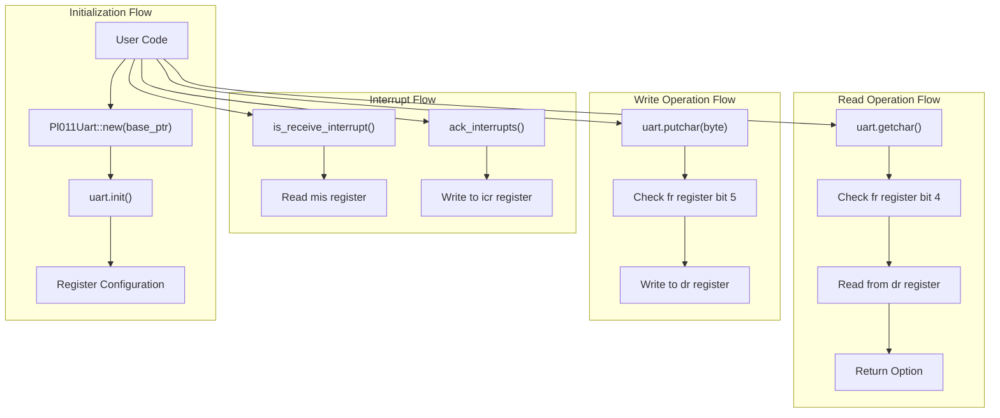

# Architecture

> **Relevant source files**
> * [Cargo.toml](https://github.com/arceos-org/arm_pl011/blob/a5a02f1f/Cargo.toml)
> * [src/lib.rs](https://github.com/arceos-org/arm_pl011/blob/a5a02f1f/src/lib.rs)
> * [src/pl011.rs](https://github.com/arceos-org/arm_pl011/blob/a5a02f1f/src/pl011.rs)

This page describes the architectural design of the `arm_pl011` crate, covering how it abstracts the PL011 UART hardware controller into a safe, type-checked Rust interface. The architecture demonstrates a layered approach that bridges low-level hardware registers to high-level embedded system interfaces.

For specific implementation details of UART operations, see [2.2](/arceos-org/arm_pl011/2.2-uart-operations). For hardware register specifications, see [5](/arceos-org/arm_pl011/5-hardware-reference).

## Architectural Overview

The `arm_pl011` crate implements a three-layer architecture that provides safe access to PL011 UART hardware through memory-mapped I/O registers.

### System Architecture

Sources: [src/lib.rs(L1 - L9)&emsp;](https://github.com/arceos-org/arm_pl011/blob/a5a02f1f/src/lib.rs#L1-L9) [src/pl011.rs(L9 - L32)&emsp;](https://github.com/arceos-org/arm_pl011/blob/a5a02f1f/src/pl011.rs#L9-L32) [src/pl011.rs(L42 - L44)&emsp;](https://github.com/arceos-org/arm_pl011/blob/a5a02f1f/src/pl011.rs#L42-L44) [Cargo.toml(L14 - L15)&emsp;](https://github.com/arceos-org/arm_pl011/blob/a5a02f1f/Cargo.toml#L14-L15)

## Core Components

The architecture centers around two primary structures that encapsulate hardware access and provide safe interfaces.

### Component Relationships

Sources: [src/lib.rs(L6 - L8)&emsp;](https://github.com/arceos-org/arm_pl011/blob/a5a02f1f/src/lib.rs#L6-L8) [src/pl011.rs(L42 - L44)&emsp;](https://github.com/arceos-org/arm_pl011/blob/a5a02f1f/src/pl011.rs#L42-L44) [src/pl011.rs(L49 - L103)&emsp;](https://github.com/arceos-org/arm_pl011/blob/a5a02f1f/src/pl011.rs#L49-L103) [src/pl011.rs(L9 - L32)&emsp;](https://github.com/arceos-org/arm_pl011/blob/a5a02f1f/src/pl011.rs#L9-L32)

## Register Abstraction Model

The crate uses the `tock-registers` library to provide type-safe, zero-cost abstractions over hardware registers. This approach ensures compile-time verification of register access patterns.

### Register Memory Layout

Sources: [src/pl011.rs(L9 - L32)&emsp;](https://github.com/arceos-org/arm_pl011/blob/a5a02f1f/src/pl011.rs#L9-L32) [src/pl011.rs(L51 - L54)&emsp;](https://github.com/arceos-org/arm_pl011/blob/a5a02f1f/src/pl011.rs#L51-L54) [src/pl011.rs(L57 - L59)&emsp;](https://github.com/arceos-org/arm_pl011/blob/a5a02f1f/src/pl011.rs#L57-L59)

## Memory Safety Architecture

The architecture implements several safety mechanisms to ensure correct hardware access in embedded environments.

|Safety Mechanism|Implementation|Purpose|
| --- | --- | --- |
|Type Safety|tock-registerstypes|Prevents invalid register access patterns|
|Pointer Safety|NonNull<Pl011UartRegs>|Guarantees non-null base address|
|Const Construction|const fn new()|Enables compile-time initialization|
|Thread Safety|Send + Synctraits|Allows multi-threaded access|
|Memory Layout|register_structs!macro|Enforces correct register offsets|

Sources: [src/pl011.rs(L46 - L47)&emsp;](https://github.com/arceos-org/arm_pl011/blob/a5a02f1f/src/pl011.rs#L46-L47) [src/pl011.rs(L51 - L55)&emsp;](https://github.com/arceos-org/arm_pl011/blob/a5a02f1f/src/pl011.rs#L51-L55) [src/pl011.rs(L9 - L32)&emsp;](https://github.com/arceos-org/arm_pl011/blob/a5a02f1f/src/pl011.rs#L9-L32)

### Data Flow Architecture

Sources: [src/pl011.rs(L64 - L76)&emsp;](https://github.com/arceos-org/arm_pl011/blob/a5a02f1f/src/pl011.rs#L64-L76) [src/pl011.rs(L79 - L82)&emsp;](https://github.com/arceos-org/arm_pl011/blob/a5a02f1f/src/pl011.rs#L79-L82) [src/pl011.rs(L85 - L91)&emsp;](https://github.com/arceos-org/arm_pl011/blob/a5a02f1f/src/pl011.rs#L85-L91) [src/pl011.rs(L94 - L102)&emsp;](https://github.com/arceos-org/arm_pl011/blob/a5a02f1f/src/pl011.rs#L94-L102)

## Integration Points

The architecture provides clean integration points for embedded systems and operating system kernels:

* **Const Construction**: The `new()` function is `const`, enabling static initialization in bootloaders and kernels
* **No-std Compatibility**: All code operates without standard library dependencies
* **Zero-cost Abstractions**: Register access compiles to direct memory operations
* **Multi-target Support**: Architecture works across x86, ARM64, and RISC-V platforms

The design allows the crate to function as a foundational component in embedded systems, providing reliable UART functionality while maintaining the performance characteristics required for system-level programming.

Sources: [src/lib.rs(L1 - L3)&emsp;](https://github.com/arceos-org/arm_pl011/blob/a5a02f1f/src/lib.rs#L1-L3) [src/pl011.rs(L51)&emsp;](https://github.com/arceos-org/arm_pl011/blob/a5a02f1f/src/pl011.rs#L51-L51) [Cargo.toml(L12 - L13)&emsp;](https://github.com/arceos-org/arm_pl011/blob/a5a02f1f/Cargo.toml#L12-L13)