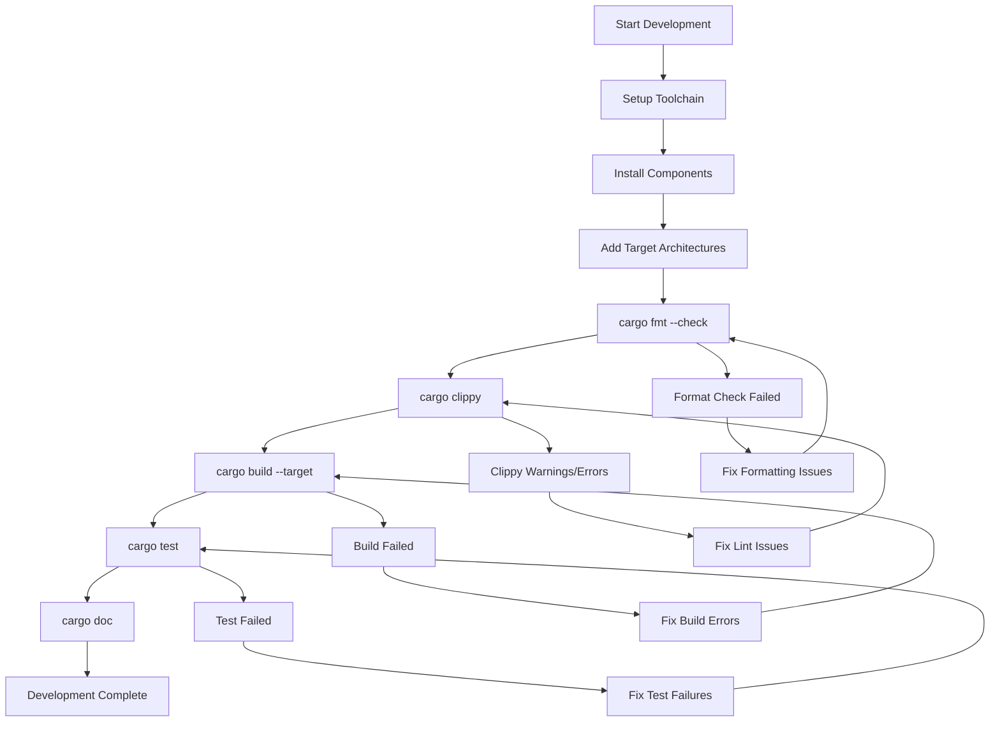
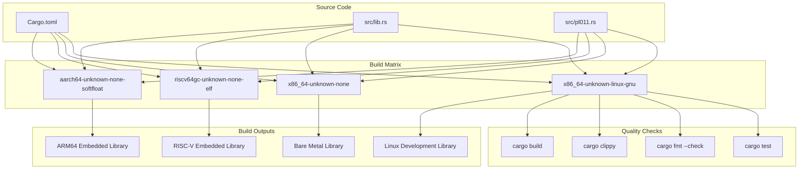
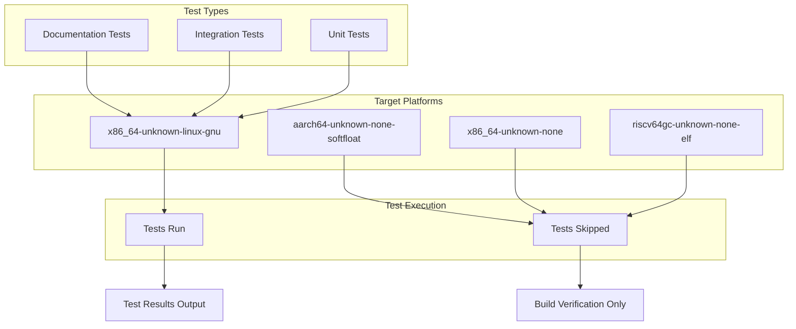
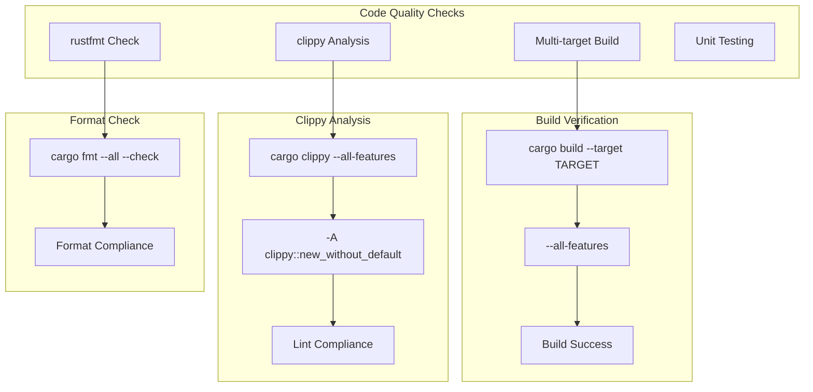
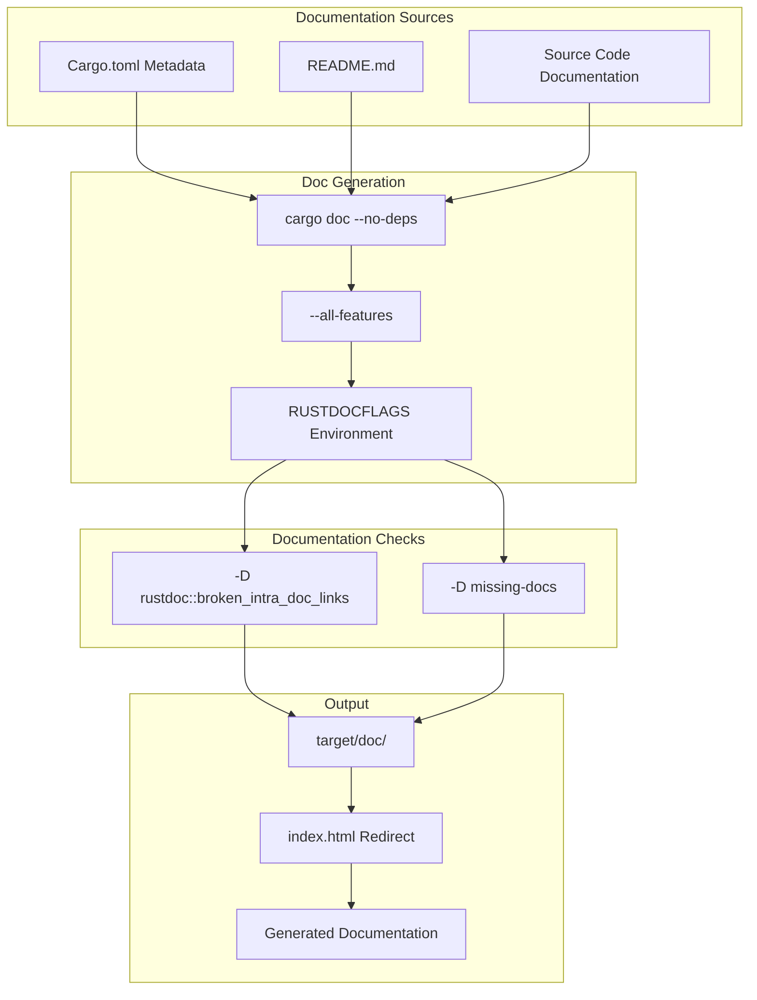

# Building and Testing

> **Relevant source files**
> * [.github/workflows/ci.yml](https://github.com/arceos-org/arm_pl011/blob/a5a02f1f/.github/workflows/ci.yml)
> * [Cargo.toml](https://github.com/arceos-org/arm_pl011/blob/a5a02f1f/Cargo.toml)

This document provides comprehensive instructions for building the `arm_pl011` crate locally, running tests, and working with the multi-target build matrix. It covers the development workflow from initial setup through quality assurance checks and documentation generation.

For information about the automated CI/CD pipeline and deployment processes, see [CI/CD Pipeline](/arceos-org/arm_pl011/4.2-cicd-pipeline).

## Prerequisites and Setup

The `arm_pl011` crate requires Rust nightly toolchain with specific components and target architectures. The crate uses `no_std` and requires unstable features for cross-platform embedded development.

### Required Toolchain Components

|Component|Purpose|
| --- | --- |
|rust-src|Source code for cross-compilation|
|clippy|Linting and code analysis|
|rustfmt|Code formatting|

### Supported Target Architectures

The crate supports multiple target architectures as defined in the CI configuration:

|Target|Use Case|
| --- | --- |
|x86_64-unknown-linux-gnu|Development and testing on Linux|
|x86_64-unknown-none|Bare metal x86_64 systems|
|riscv64gc-unknown-none-elf|RISC-V embedded systems|
|aarch64-unknown-none-softfloat|ARM64 embedded systems|

Sources: [.github/workflows/ci.yml(L12)&emsp;](https://github.com/arceos-org/arm_pl011/blob/a5a02f1f/.github/workflows/ci.yml#L12-L12) [.github/workflows/ci.yml(L18 - L19)&emsp;](https://github.com/arceos-org/arm_pl011/blob/a5a02f1f/.github/workflows/ci.yml#L18-L19)

## Local Build Workflow

### Development Build Process



Sources: [.github/workflows/ci.yml(L22 - L30)&emsp;](https://github.com/arceos-org/arm_pl011/blob/a5a02f1f/.github/workflows/ci.yml#L22-L30)

## Multi-Target Building

### Target Architecture Matrix

The crate implements a comprehensive multi-target build strategy to ensure compatibility across different embedded platforms:



### Building for Specific Targets

To build for a specific target architecture:

```markdown
# Build for Linux development
cargo build --target x86_64-unknown-linux-gnu --all-features

# Build for bare metal x86_64
cargo build --target x86_64-unknown-none --all-features

# Build for RISC-V embedded
cargo build --target riscv64gc-unknown-none-elf --all-features

# Build for ARM64 embedded
cargo build --target aarch64-unknown-none-softfloat --all-features
```

Sources: [.github/workflows/ci.yml(L27)&emsp;](https://github.com/arceos-org/arm_pl011/blob/a5a02f1f/.github/workflows/ci.yml#L27-L27) [Cargo.toml(L1 - L16)&emsp;](https://github.com/arceos-org/arm_pl011/blob/a5a02f1f/Cargo.toml#L1-L16)

## Testing Strategy

### Test Execution Matrix

Testing is platform-specific due to the embedded nature of the crate:



### Running Tests Locally

Unit tests are only executed on the `x86_64-unknown-linux-gnu` target due to the embedded nature of other targets:

```markdown
# Run unit tests with output
cargo test --target x86_64-unknown-linux-gnu -- --nocapture

# Run specific test
cargo test --target x86_64-unknown-linux-gnu test_name -- --nocapture

# Run tests with all features
cargo test --target x86_64-unknown-linux-gnu --all-features -- --nocapture
```

Sources: [.github/workflows/ci.yml(L28 - L30)&emsp;](https://github.com/arceos-org/arm_pl011/blob/a5a02f1f/.github/workflows/ci.yml#L28-L30)

## Code Quality Assurance

### Quality Check Pipeline

The development workflow includes mandatory quality checks that mirror the CI pipeline:



### Local Quality Checks

Run the same quality checks locally as the CI pipeline:

```markdown
# Format check
cargo fmt --all -- --check

# Clippy with target-specific analysis
cargo clippy --target x86_64-unknown-linux-gnu --all-features -- -A clippy::new_without_default
cargo clippy --target aarch64-unknown-none-softfloat --all-features -- -A clippy::new_without_default

# Build all targets
cargo build --target x86_64-unknown-linux-gnu --all-features
cargo build --target x86_64-unknown-none --all-features
cargo build --target riscv64gc-unknown-none-elf --all-features
cargo build --target aarch64-unknown-none-softfloat --all-features
```

Sources: [.github/workflows/ci.yml(L22 - L27)&emsp;](https://github.com/arceos-org/arm_pl011/blob/a5a02f1f/.github/workflows/ci.yml#L22-L27)

## Documentation Building

### Documentation Generation Process



### Building Documentation Locally

Generate documentation with the same strict requirements as CI:

```sql
# Set documentation flags for strict checking
export RUSTDOCFLAGS="-D rustdoc::broken_intra_doc_links -D missing-docs"

# Generate documentation
cargo doc --no-deps --all-features

# Create index redirect (mimics CI behavior)
printf '<meta http-equiv="refresh" content="0;url=%s/index.html">' \
  $(cargo tree | head -1 | cut -d' ' -f1) > target/doc/index.html

# Open documentation in browser
open target/doc/index.html  # macOS
xdg-open target/doc/index.html  # Linux
```

Sources: [.github/workflows/ci.yml(L40)&emsp;](https://github.com/arceos-org/arm_pl011/blob/a5a02f1f/.github/workflows/ci.yml#L40-L40) [.github/workflows/ci.yml(L44 - L48)&emsp;](https://github.com/arceos-org/arm_pl011/blob/a5a02f1f/.github/workflows/ci.yml#L44-L48) [Cargo.toml(L10)&emsp;](https://github.com/arceos-org/arm_pl011/blob/a5a02f1f/Cargo.toml#L10-L10)

## Development Environment Setup

### Complete Setup Commands

```markdown
# Install nightly toolchain
rustup toolchain install nightly

# Add required components
rustup component add rust-src clippy rustfmt

# Add target architectures
rustup target add x86_64-unknown-linux-gnu
rustup target add x86_64-unknown-none
rustup target add riscv64gc-unknown-none-elf
rustup target add aarch64-unknown-none-softfloat

# Set nightly as default for this project
rustup override set nightly

# Verify setup
rustc --version --verbose
cargo --version
```

Sources: [.github/workflows/ci.yml(L15 - L21)&emsp;](https://github.com/arceos-org/arm_pl011/blob/a5a02f1f/.github/workflows/ci.yml#L15-L21)