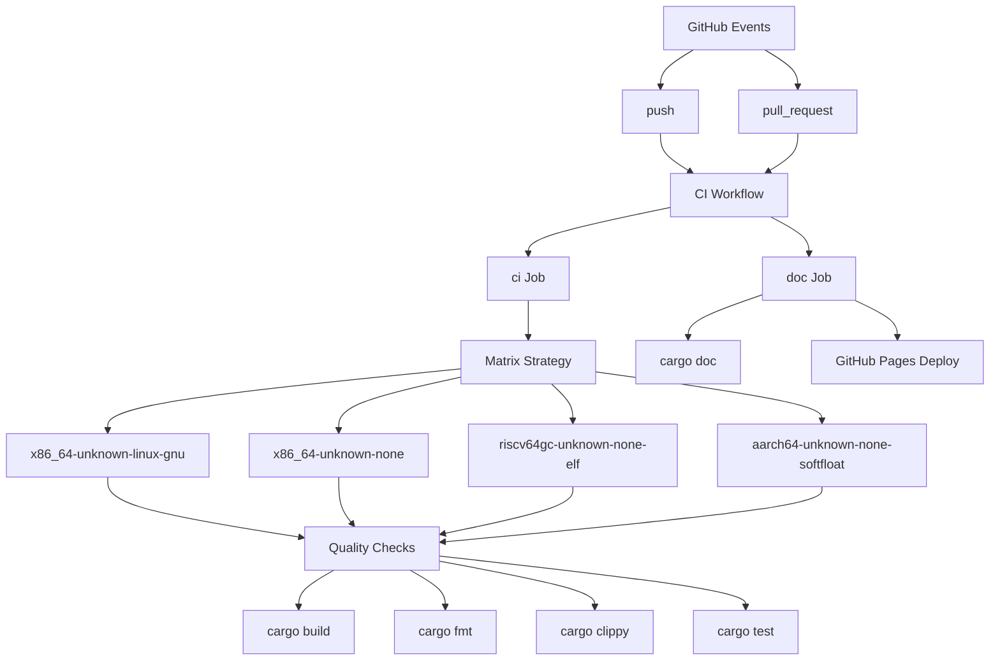
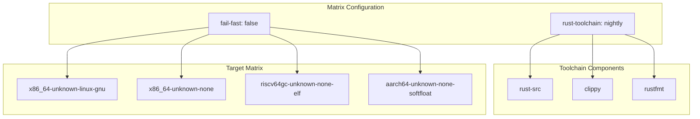
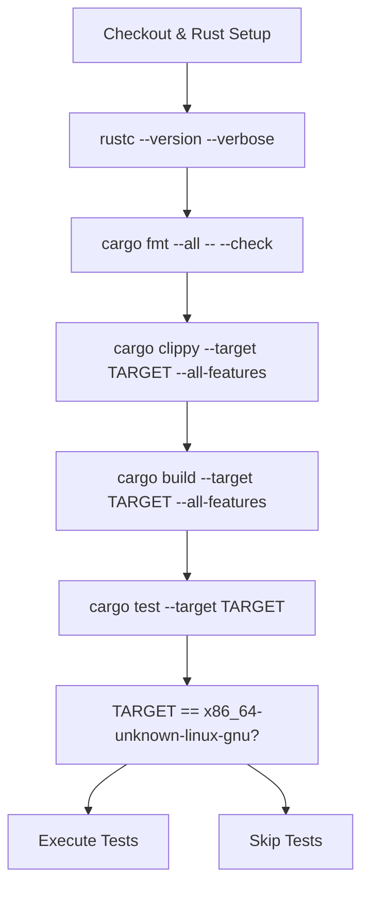
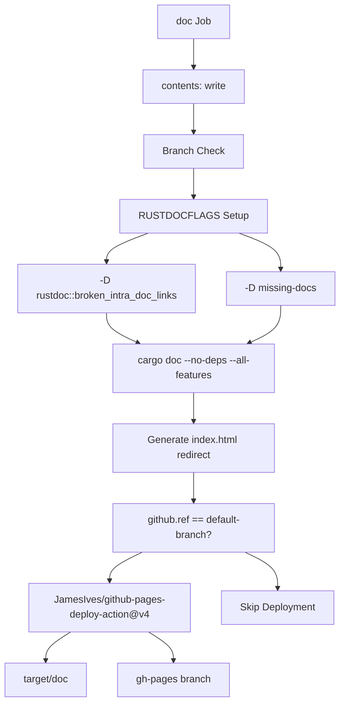
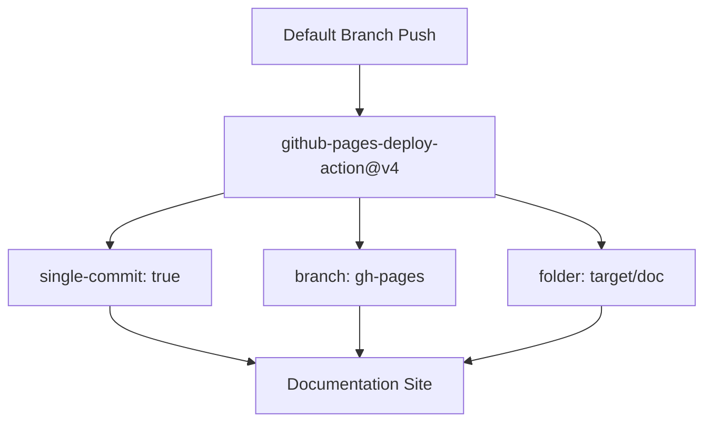
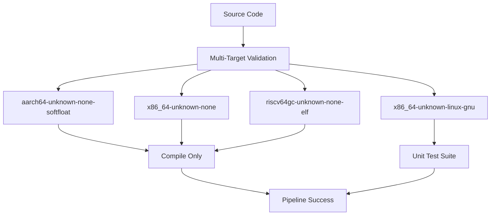

# CI/CD Pipeline

> **Relevant source files**
> * [.github/workflows/ci.yml](https://github.com/arceos-org/arm_pl011/blob/a5a02f1f/.github/workflows/ci.yml)

This document describes the automated continuous integration and deployment pipeline for the arm_pl011 crate. The pipeline handles code quality checks, multi-target compilation, testing, documentation generation, and automated deployment to GitHub Pages.

For information about local development and testing procedures, see [Building and Testing](/arceos-org/arm_pl011/4.1-building-and-testing). For API documentation specifics, see [API Reference](/arceos-org/arm_pl011/3-api-reference).

## Pipeline Overview

The CI/CD pipeline is implemented using GitHub Actions and consists of two primary workflows that execute on every push and pull request to ensure code quality and maintain up-to-date documentation.

### Workflow Architecture



Sources: [.github/workflows/ci.yml(L1 - L56)&emsp;](https://github.com/arceos-org/arm_pl011/blob/a5a02f1f/.github/workflows/ci.yml#L1-L56)

## CI Job Implementation

The `ci` job implements comprehensive quality assurance through a matrix build strategy that validates the crate across multiple target architectures.

### Matrix Configuration

|Component|Value|
| --- | --- |
|Runner|ubuntu-latest|
|Rust Toolchain|nightly|
|Fail Fast|false|
|Target Count|4 architectures|

The matrix strategy ensures the crate builds correctly across all supported embedded platforms:



Sources: [.github/workflows/ci.yml(L8 - L19)&emsp;](https://github.com/arceos-org/arm_pl011/blob/a5a02f1f/.github/workflows/ci.yml#L8-L19)

### Quality Check Steps

The pipeline implements a four-stage quality verification process:



#### Code Formatting

The `cargo fmt --all -- --check` command validates that all code adheres to standard Rust formatting conventions without making modifications.

#### Linting Analysis

Clippy performs static analysis with the configuration `cargo clippy --target ${{ matrix.targets }} --all-features -- -A clippy::new_without_default`, specifically allowing the `new_without_default` lint for the crate's design patterns.

#### Multi-Target Compilation

Each target architecture undergoes full compilation with `cargo build --target ${{ matrix.targets }} --all-features` to ensure cross-platform compatibility.

#### Unit Testing

Unit tests execute only on the `x86_64-unknown-linux-gnu` target using `cargo test --target ${{ matrix.targets }} -- --nocapture` for comprehensive output visibility.

Sources: [.github/workflows/ci.yml(L20 - L30)&emsp;](https://github.com/arceos-org/arm_pl011/blob/a5a02f1f/.github/workflows/ci.yml#L20-L30)

## Documentation Job

The `doc` job generates and deploys API documentation with strict quality enforcement.

### Documentation Build Process



### Documentation Configuration

The documentation build enforces strict quality standards through `RUSTDOCFLAGS`:

|Flag|Purpose|
| --- | --- |
|-D rustdoc::broken_intra_doc_links|Fail on broken internal documentation links|
|-D missing-docs|Require documentation for all public items|

The build process includes automatic index generation:

```
printf '<meta http-equiv="refresh" content="0;url=%s/index.html">' $(cargo tree | head -1 | cut -d' ' -f1) > target/doc/index.html
```

Sources: [.github/workflows/ci.yml(L32 - L48)&emsp;](https://github.com/arceos-org/arm_pl011/blob/a5a02f1f/.github/workflows/ci.yml#L32-L48)

## Deployment Strategy

### GitHub Pages Integration

The deployment uses the `JamesIves/github-pages-deploy-action@v4` action with specific configuration:



### Conditional Deployment Logic

Documentation deployment occurs only when:

1. The push targets the repository's default branch (`github.ref == env.default-branch`)
2. The documentation build succeeds without errors

For non-default branches and pull requests, the documentation build continues with `continue-on-error: true` to provide feedback without blocking the pipeline.

Sources: [.github/workflows/ci.yml(L38 - L55)&emsp;](https://github.com/arceos-org/arm_pl011/blob/a5a02f1f/.github/workflows/ci.yml#L38-L55)

## Target Architecture Matrix

The pipeline validates compilation across four distinct target architectures, ensuring broad embedded systems compatibility:

### Architecture Support Matrix

|Target|Environment|Use Case|
| --- | --- | --- |
|x86_64-unknown-linux-gnu|Linux userspace|Development and testing|
|x86_64-unknown-none|Bare metal x86|OS kernels and bootloaders|
|riscv64gc-unknown-none-elf|RISC-V embedded|RISC-V based systems|
|aarch64-unknown-none-softfloat|ARM64 embedded|ARM-based embedded systems|

### Build Validation Flow



Sources: [.github/workflows/ci.yml(L12 - L30)&emsp;](https://github.com/arceos-org/arm_pl011/blob/a5a02f1f/.github/workflows/ci.yml#L12-L30)