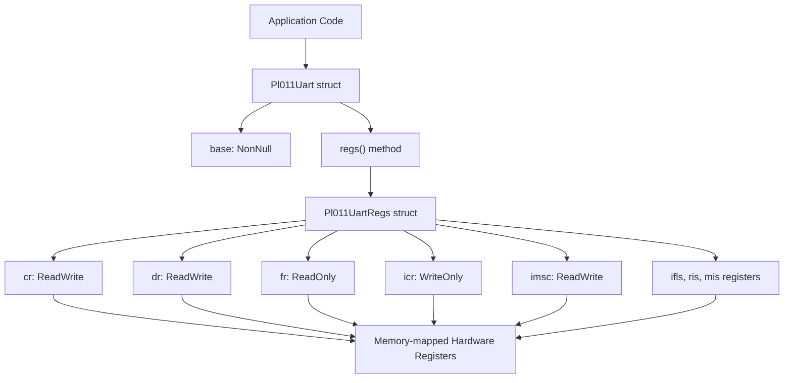
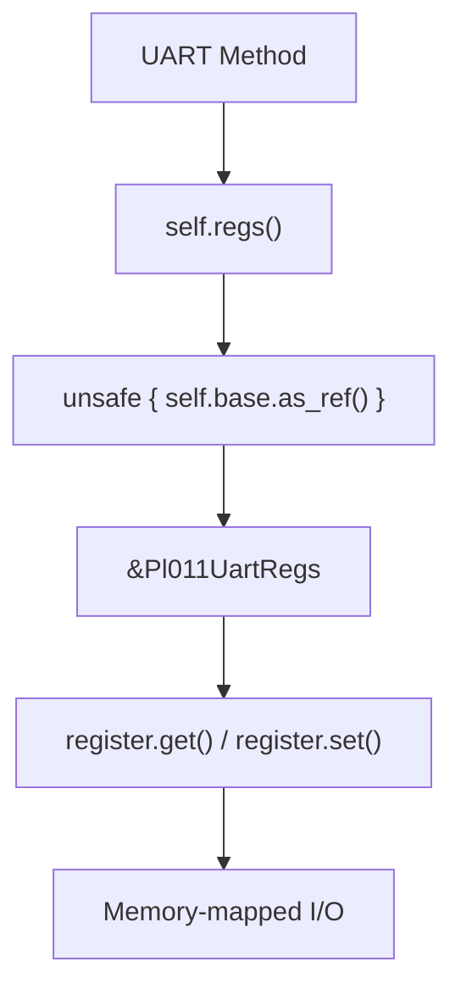
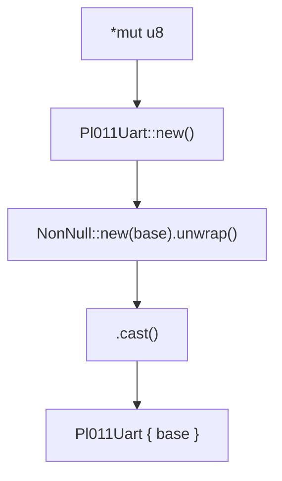
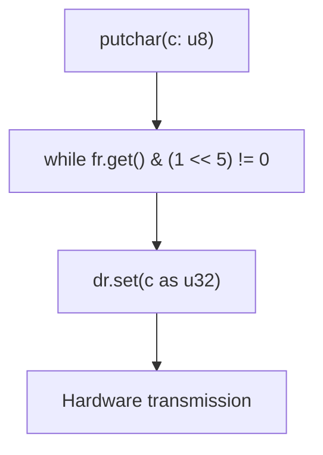
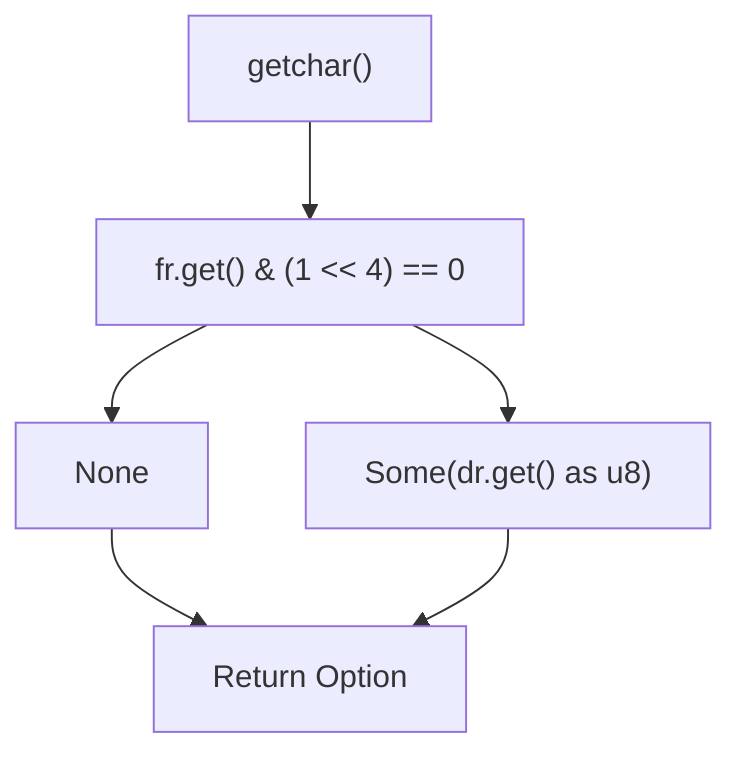
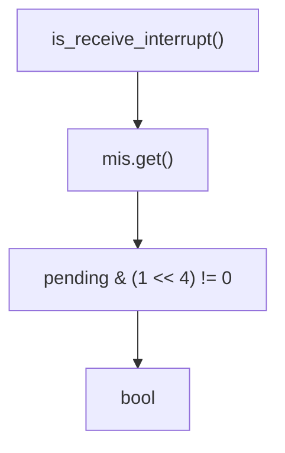

# Core Implementation

> **Relevant source files**
> * [src/pl011.rs](https://github.com/arceos-org/arm_pl011/blob/a5a02f1f/src/pl011.rs)

This document covers the core implementation details of the `Pl011Uart` driver, including the main driver struct, register abstraction layer, memory safety mechanisms, and fundamental design patterns. This page focuses on the internal architecture and implementation strategies rather than usage examples.

For detailed register specifications and hardware mappings, see [Register Definitions](/arceos-org/arm_pl011/2.1-register-definitions). For comprehensive method documentation and API usage, see [API Reference](/arceos-org/arm_pl011/3-api-reference).

## Pl011Uart Structure and Architecture

The core driver implementation centers around the `Pl011Uart` struct, which serves as the primary interface for all UART operations. The driver follows a layered architecture that separates hardware register access from high-level UART functionality.

### Core Driver Architecture

Sources: [src/pl011.rs(L34 - L44)&emsp;](https://github.com/arceos-org/arm_pl011/blob/a5a02f1f/src/pl011.rs#L34-L44) [src/pl011.rs(L9 - L32)&emsp;](https://github.com/arceos-org/arm_pl011/blob/a5a02f1f/src/pl011.rs#L9-L32)

The `Pl011Uart` struct maintains a single field `base` of type `NonNull<Pl011UartRegs>` that points to the memory-mapped register structure. This design provides type-safe access to hardware registers while maintaining zero-cost abstractions.

### Register Access Pattern

Sources: [src/pl011.rs(L57 - L59)&emsp;](https://github.com/arceos-org/arm_pl011/blob/a5a02f1f/src/pl011.rs#L57-L59)

The `regs()` method provides controlled access to the register structure through a const function that dereferences the `NonNull` pointer. This pattern encapsulates the unsafe memory access within a single, well-defined boundary.

## Memory Safety and Thread Safety

The driver implements explicit safety markers to enable usage in multi-threaded embedded environments while maintaining Rust's safety guarantees.

|Safety Trait|Implementation|Purpose|
| --- | --- | --- |
|Send|unsafe impl Send for Pl011Uart {}|Allows transfer between threads|
|Sync|unsafe impl Sync for Pl011Uart {}|Allows shared references across threads|

Sources: [src/pl011.rs(L46 - L47)&emsp;](https://github.com/arceos-org/arm_pl011/blob/a5a02f1f/src/pl011.rs#L46-L47)

These unsafe implementations are justified because:

* The PL011 UART controller is designed for single-threaded access per instance
* Memory-mapped I/O operations are atomic at the hardware level
* The `NonNull` pointer provides guaranteed non-null access
* Register operations through `tock_registers` are inherently safe

## Constructor and Initialization Pattern

The driver follows a two-phase initialization pattern that separates object construction from hardware configuration.

### Construction Phase

Sources: [src/pl011.rs(L51 - L55)&emsp;](https://github.com/arceos-org/arm_pl011/blob/a5a02f1f/src/pl011.rs#L51-L55)

The `new()` constructor is marked as `const fn`, enabling compile-time initialization in embedded contexts. The constructor performs type casting from a raw byte pointer to the structured register layout.

### Hardware Initialization Sequence

The `init()` method configures the hardware through a specific sequence of register operations:

|Step|Register|Operation|Purpose|
| --- | --- | --- | --- |
|1|icr|set(0x7ff)|Clear all pending interrupts|
|2|ifls|set(0)|Set FIFO trigger levels (1/8 depth)|
|3|imsc|set(1 << 4)|Enable receive interrupts|
|4|cr|set((1 << 0) \| (1 << 8) \| (1 << 9))|Enable TX, RX, and UART|

Sources: [src/pl011.rs(L64 - L76)&emsp;](https://github.com/arceos-org/arm_pl011/blob/a5a02f1f/src/pl011.rs#L64-L76)

## Data Flow and Operation Methods

The driver implements fundamental UART operations through direct register manipulation with appropriate status checking.

### Character Transmission Flow

Sources: [src/pl011.rs(L79 - L82)&emsp;](https://github.com/arceos-org/arm_pl011/blob/a5a02f1f/src/pl011.rs#L79-L82)

The transmission method implements busy-waiting on the Transmit FIFO Full flag (bit 5) in the Flag Register before writing data.

### Character Reception Flow

Sources: [src/pl011.rs(L85 - L91)&emsp;](https://github.com/arceos-org/arm_pl011/blob/a5a02f1f/src/pl011.rs#L85-L91)

The reception method checks the Receive FIFO Empty flag (bit 4) and returns `Option<u8>` to handle the absence of available data without blocking.

## Interrupt Handling Architecture

The driver provides interrupt status checking and acknowledgment methods that integrate with higher-level interrupt management systems.

### Interrupt Status Detection

Sources: [src/pl011.rs(L94 - L97)&emsp;](https://github.com/arceos-org/arm_pl011/blob/a5a02f1f/src/pl011.rs#L94-L97)

The interrupt detection reads the Masked Interrupt Status register and specifically checks for receive interrupts (bit 4).

### Interrupt Acknowledgment

The `ack_interrupts()` method clears all interrupt conditions by writing to the Interrupt Clear Register with a comprehensive mask value `0x7ff`, ensuring no stale interrupt states remain.

Sources: [src/pl011.rs(L100 - L102)&emsp;](https://github.com/arceos-org/arm_pl011/blob/a5a02f1f/src/pl011.rs#L100-L102)

This implementation pattern provides a clean separation between interrupt detection, handling, and acknowledgment, enabling integration with various interrupt management strategies in embedded operating systems.