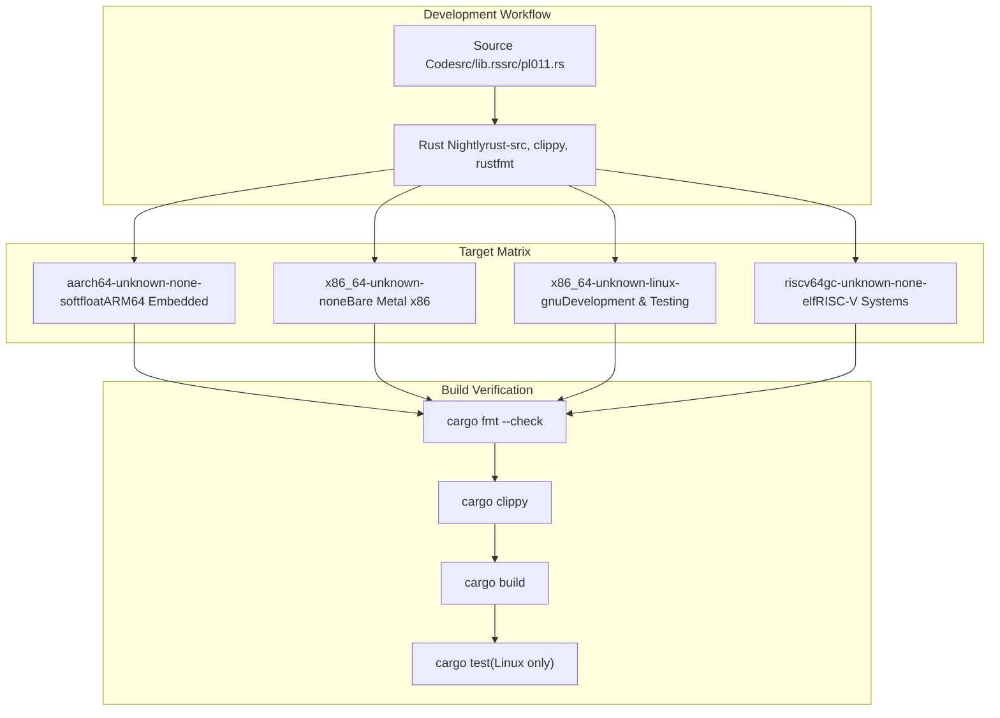
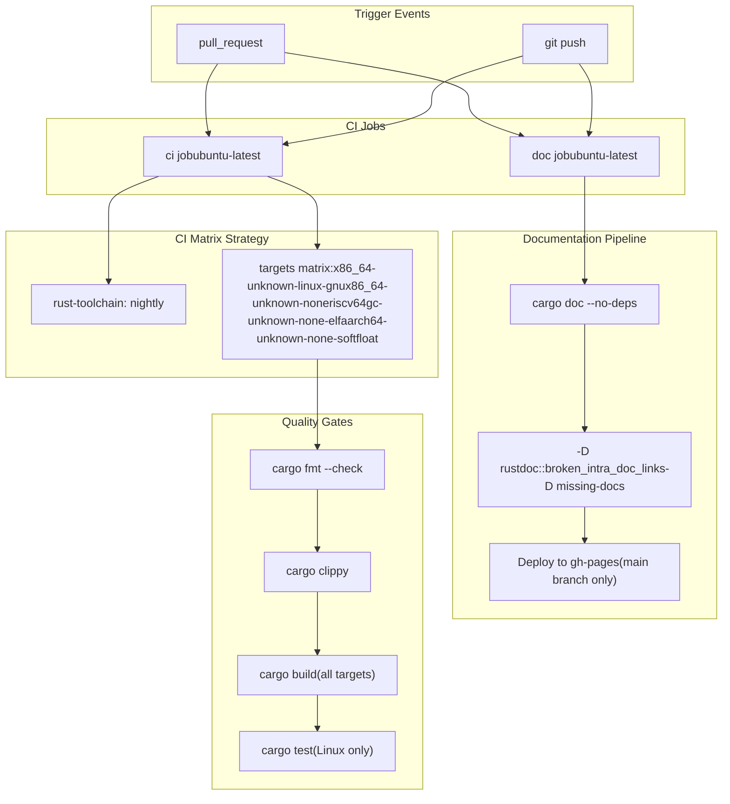

# Development

> **Relevant source files**
> * [.github/workflows/ci.yml](https://github.com/arceos-org/arm_pl011/blob/a5a02f1f/.github/workflows/ci.yml)
> * [.gitignore](https://github.com/arceos-org/arm_pl011/blob/a5a02f1f/.gitignore)
> * [Cargo.toml](https://github.com/arceos-org/arm_pl011/blob/a5a02f1f/Cargo.toml)

This section provides a comprehensive guide for contributors to the `arm_pl011` crate, covering the development workflow, multi-target building, code quality standards, and continuous integration processes. The material focuses on the practical aspects of contributing to this embedded systems driver library.

For detailed API documentation and usage patterns, see [API Reference](/arceos-org/arm_pl011/3-api-reference). For hardware-specific implementation details, see [Core Implementation](/arceos-org/arm_pl011/2-core-implementation).

## Development Environment Setup

The `arm_pl011` crate is designed as a `no_std` embedded library that supports multiple target architectures. Development requires the Rust nightly toolchain with specific components and target platforms.

### Required Toolchain Components

The project uses Rust nightly with the following components as defined in the CI configuration:

|Component|Purpose|
| --- | --- |
|rust-src|Source code for cross-compilation|
|clippy|Linting and code quality checks|
|rustfmt|Code formatting enforcement|

### Supported Target Platforms

The crate maintains compatibility across four distinct target architectures:

|Target|Use Case|
| --- | --- |
|x86_64-unknown-linux-gnu|Development and testing on Linux|
|x86_64-unknown-none|Bare metal x86_64 systems|
|riscv64gc-unknown-none-elf|RISC-V embedded systems|
|aarch64-unknown-none-softfloat|ARM64 embedded systems without FPU|

Sources: [.github/workflows/ci.yml(L11 - L12)&emsp;](https://github.com/arceos-org/arm_pl011/blob/a5a02f1f/.github/workflows/ci.yml#L11-L12) [.github/workflows/ci.yml(L19)&emsp;](https://github.com/arceos-org/arm_pl011/blob/a5a02f1f/.github/workflows/ci.yml#L19-L19)

## Multi-Target Development Workflow

The development process accommodates the diverse embedded systems ecosystem by supporting multiple target architectures through a unified workflow.

### Target Architecture Matrix



Sources: [.github/workflows/ci.yml(L11 - L12)&emsp;](https://github.com/arceos-org/arm_pl011/blob/a5a02f1f/.github/workflows/ci.yml#L11-L12) [.github/workflows/ci.yml(L23 - L30)&emsp;](https://github.com/arceos-org/arm_pl011/blob/a5a02f1f/.github/workflows/ci.yml#L23-L30)

### Local Development Commands

For local development, contributors should verify their changes against all supported targets:

```markdown
# Format check
cargo fmt --all -- --check

# Linting for each target
cargo clippy --target <TARGET> --all-features

# Build verification
cargo build --target <TARGET> --all-features

# Unit tests (Linux only)
cargo test --target x86_64-unknown-linux-gnu -- --nocapture
```

The `--all-features` flag ensures compatibility with the complete feature set defined in [`Cargo.toml(L15)&emsp;](https://github.com/arceos-org/arm_pl011/blob/a5a02f1f/`Cargo.toml#L15-L15)

Sources: [.github/workflows/ci.yml(L23 - L30)&emsp;](https://github.com/arceos-org/arm_pl011/blob/a5a02f1f/.github/workflows/ci.yml#L23-L30)

## Continuous Integration Pipeline

The project maintains code quality through an automated CI/CD pipeline that validates all changes across the supported target matrix.

### CI/CD Architecture



Sources: [.github/workflows/ci.yml(L1 - L56)&emsp;](https://github.com/arceos-org/arm_pl011/blob/a5a02f1f/.github/workflows/ci.yml#L1-L56)

### Quality Enforcement Standards

The CI pipeline enforces strict quality standards through multiple validation stages:

#### Code Formatting

All code must pass `rustfmt` validation with the project's formatting rules. The CI fails if formatting inconsistencies are detected.

#### Linting Rules

The project uses `clippy` with custom configuration that allows the `clippy::new_without_default` warning while maintaining strict standards for other potential issues.

#### Documentation Requirements

Documentation builds enforce strict standards through `RUSTDOCFLAGS`:

* `-D rustdoc::broken_intra_doc_links`: Fails on broken documentation links
* `-D missing-docs`: Requires documentation for all public interfaces

Sources: [.github/workflows/ci.yml(L23 - L25)&emsp;](https://github.com/arceos-org/arm_pl011/blob/a5a02f1f/.github/workflows/ci.yml#L23-L25) [.github/workflows/ci.yml(L40)&emsp;](https://github.com/arceos-org/arm_pl011/blob/a5a02f1f/.github/workflows/ci.yml#L40-L40)

### Testing Strategy

The project implements a targeted testing approach:

* **Unit Tests**: Execute only on `x86_64-unknown-linux-gnu` for practical development iteration
* **Build Verification**: All targets must compile successfully to ensure cross-platform compatibility
* **Documentation Tests**: Included in the documentation build process

This strategy balances comprehensive validation with CI resource efficiency, since the core functionality is hardware-agnostic while the compilation targets verify platform compatibility.

Sources: [.github/workflows/ci.yml(L28 - L30)&emsp;](https://github.com/arceos-org/arm_pl011/blob/a5a02f1f/.github/workflows/ci.yml#L28-L30)

### Documentation Deployment

The documentation pipeline automatically generates and deploys API documentation to GitHub Pages for the main branch. The process includes:

1. Building documentation with `cargo doc --no-deps --all-features`
2. Generating an index redirect page based on the crate name from `cargo tree`
3. Deploying to the `gh-pages` branch using single-commit strategy

This ensures that the latest documentation is always available at the project's GitHub Pages URL as specified in [`Cargo.toml(L10)&emsp;](https://github.com/arceos-org/arm_pl011/blob/a5a02f1f/`Cargo.toml#L10-L10)

Sources: [.github/workflows/ci.yml(L44 - L55)&emsp;](https://github.com/arceos-org/arm_pl011/blob/a5a02f1f/.github/workflows/ci.yml#L44-L55)