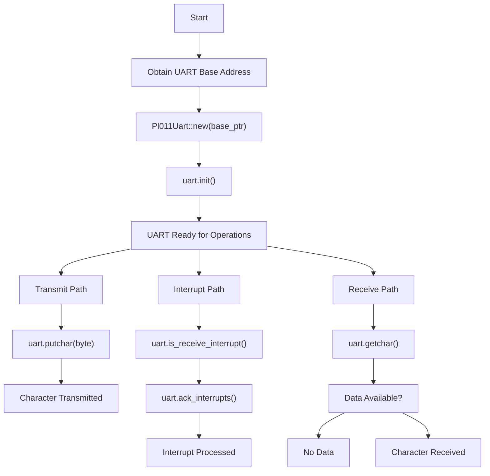
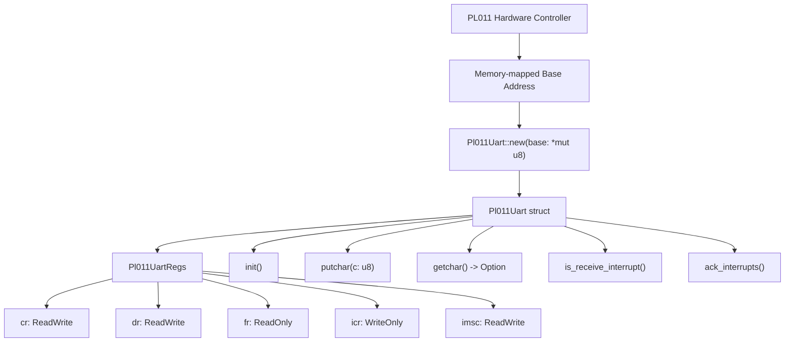

# Getting Started

> **Relevant source files**
> * [Cargo.toml](https://github.com/arceos-org/arm_pl011/blob/a5a02f1f/Cargo.toml)
> * [README.md](https://github.com/arceos-org/arm_pl011/blob/a5a02f1f/README.md)
> * [src/pl011.rs](https://github.com/arceos-org/arm_pl011/blob/a5a02f1f/src/pl011.rs)

This page provides a practical guide for integrating and using the `arm_pl011` crate in your embedded systems project. It covers adding the crate as a dependency, basic initialization, and fundamental UART operations.

For detailed hardware register specifications, see [Hardware Reference](/arceos-org/arm_pl011/5-hardware-reference). For comprehensive API documentation, see [API Reference](/arceos-org/arm_pl011/3-api-reference).

## Prerequisites

The `arm_pl011` crate is designed for embedded systems development with the following requirements:

|Requirement|Details|
| --- | --- |
|Rust Edition|2021 or later|
|Target Environment|no_stdcompatible|
|Hardware|ARM-based system with PL011 UART controller|
|Memory Management|Access to memory-mapped I/O addresses|
|Dependencies|tock-registersfor type-safe register access|

**Target Architecture Support:**

* `aarch64-unknown-none-softfloat` (primary target)
* `x86_64-unknown-linux-gnu` (development/testing)
* `riscv64gc-unknown-none-elf` (cross-platform compatibility)

Sources: [Cargo.toml(L1 - L16)&emsp;](https://github.com/arceos-org/arm_pl011/blob/a5a02f1f/Cargo.toml#L1-L16)

## Adding the Crate to Your Project

Add `arm_pl011` to your `Cargo.toml` dependencies:

```
[dependencies]
arm_pl011 = "0.1.0"
```

The crate automatically includes the `tock-registers` dependency for register manipulation safety.

Sources: [Cargo.toml(L14 - L15)&emsp;](https://github.com/arceos-org/arm_pl011/blob/a5a02f1f/Cargo.toml#L14-L15)

## Basic Usage Flow

### Initialization and Operation Sequence



Sources: [src/pl011.rs(L51 - L103)&emsp;](https://github.com/arceos-org/arm_pl011/blob/a5a02f1f/src/pl011.rs#L51-L103)

### Code Entity Mapping



Sources: [src/pl011.rs(L42 - L44)&emsp;](https://github.com/arceos-org/arm_pl011/blob/a5a02f1f/src/pl011.rs#L42-L44) [src/pl011.rs(L11 - L32)&emsp;](https://github.com/arceos-org/arm_pl011/blob/a5a02f1f/src/pl011.rs#L11-L32) [src/pl011.rs(L49 - L103)&emsp;](https://github.com/arceos-org/arm_pl011/blob/a5a02f1f/src/pl011.rs#L49-L103)

## Simple Usage Examples

### Basic UART Setup

```javascript
use arm_pl011::Pl011Uart;

// Obtain the base address for your PL011 UART
// This is platform-specific and typically provided by your BSP
let uart_base = 0x0900_0000 as *mut u8;

// Create UART instance
let mut uart = Pl011Uart::new(uart_base);

// Initialize the UART with default settings
uart.init();
```

### Character Transmission

The `putchar` method blocks until the transmit FIFO has space:

```
// Send a single character
uart.putchar(b'H');

// Send a string
for byte in b"Hello, World!\n" {
    uart.putchar(*byte);
}
```

### Character Reception

The `getchar` method returns immediately with an `Option`:

```
// Check for received data
match uart.getchar() {
    Some(byte) => {
        // Process received byte
        uart.putchar(byte); // Echo back
    }
    None => {
        // No data available
    }
}
```

### Interrupt Handling

```javascript
// Check if receive interrupt occurred
if uart.is_receive_interrupt() {
    // Handle the interrupt
    if let Some(byte) = uart.getchar() {
        // Process received data
    }
    
    // Clear interrupts
    uart.ack_interrupts();
}
```

Sources: [src/pl011.rs(L51 - L55)&emsp;](https://github.com/arceos-org/arm_pl011/blob/a5a02f1f/src/pl011.rs#L51-L55) [src/pl011.rs(L64 - L76)&emsp;](https://github.com/arceos-org/arm_pl011/blob/a5a02f1f/src/pl011.rs#L64-L76) [src/pl011.rs(L79 - L82)&emsp;](https://github.com/arceos-org/arm_pl011/blob/a5a02f1f/src/pl011.rs#L79-L82) [src/pl011.rs(L85 - L91)&emsp;](https://github.com/arceos-org/arm_pl011/blob/a5a02f1f/src/pl011.rs#L85-L91) [src/pl011.rs(L94 - L102)&emsp;](https://github.com/arceos-org/arm_pl011/blob/a5a02f1f/src/pl011.rs#L94-L102)

## Memory Safety Considerations

The `Pl011Uart` struct implements `Send` and `Sync` traits, enabling safe usage across thread boundaries:

|Safety Feature|Implementation|
| --- | --- |
|Memory Safety|UsesNonNull<Pl011UartRegs>for guaranteed non-null pointers|
|Thread Safety|ManualSend + Syncimplementation for multi-threaded environments|
|Register Safety|tock-registersprovides compile-time type safety for register access|

Sources: [src/pl011.rs(L46 - L47)&emsp;](https://github.com/arceos-org/arm_pl011/blob/a5a02f1f/src/pl011.rs#L46-L47) [src/pl011.rs(L43)&emsp;](https://github.com/arceos-org/arm_pl011/blob/a5a02f1f/src/pl011.rs#L43-L43)

## Configuration Details

The `init()` method configures the UART with these default settings:

|Setting|Value|Register|Purpose|
| --- | --- | --- | --- |
|FIFO Trigger|1/8 level|ifls|Interrupt timing|
|RX Interrupt|Enabled|imsc|Receive notifications|
|UART Enable|Yes|cr|Overall operation|
|TX Enable|Yes|cr|Transmission capability|
|RX Enable|Yes|cr|Reception capability|

Sources: [src/pl011.rs(L64 - L76)&emsp;](https://github.com/arceos-org/arm_pl011/blob/a5a02f1f/src/pl011.rs#L64-L76)

## Next Steps

After completing basic setup:

1. **Advanced Configuration**: See [UART Operations](/arceos-org/arm_pl011/2.2-uart-operations) for FIFO management and custom interrupt handling
2. **Register Details**: See [Register Definitions](/arceos-org/arm_pl011/2.1-register-definitions) for low-level register manipulation
3. **Thread Safety**: See [Thread Safety and Memory Safety](/arceos-org/arm_pl011/3.2-thread-safety-and-memory-safety) for multi-threaded usage patterns
4. **Hardware Integration**: See [Hardware Reference](/arceos-org/arm_pl011/5-hardware-reference) for platform-specific considerations

For comprehensive method documentation, proceed to [Pl011Uart Methods](/arceos-org/arm_pl011/3.1-pl011uart-methods).

Sources: [src/pl011.rs(L1 - L104)&emsp;](https://github.com/arceos-org/arm_pl011/blob/a5a02f1f/src/pl011.rs#L1-L104) [Cargo.toml(L1 - L16)&emsp;](https://github.com/arceos-org/arm_pl011/blob/a5a02f1f/Cargo.toml#L1-L16)