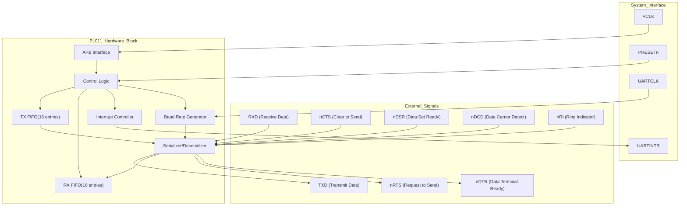
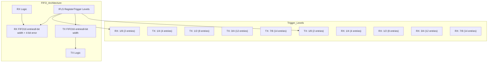
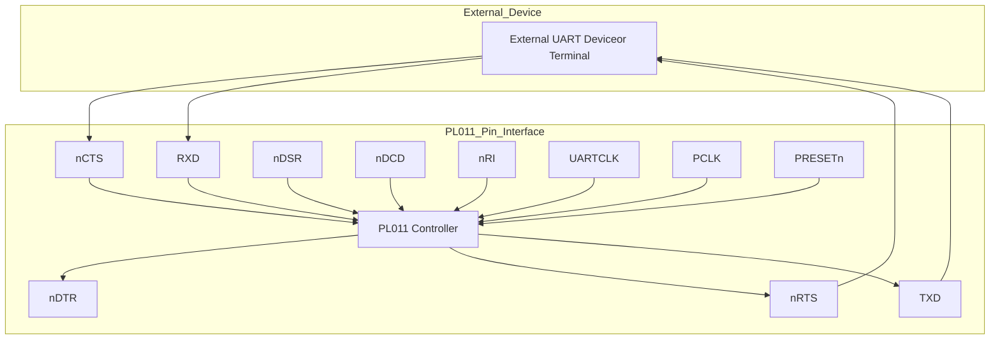
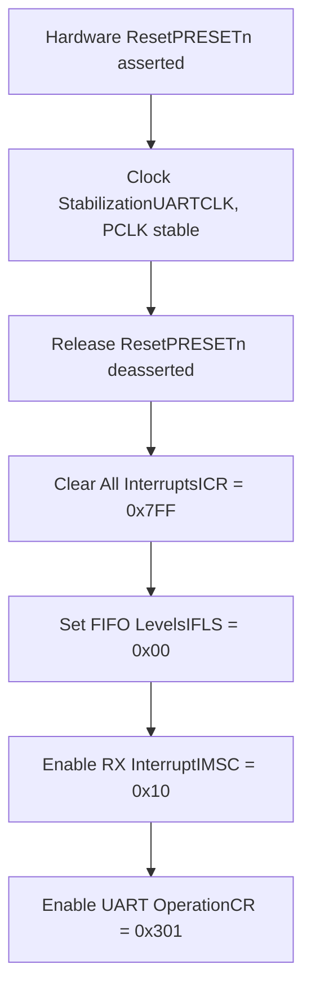

# Hardware Reference

> **Relevant source files**
> * [README.md](https://github.com/arceos-org/arm_pl011/blob/a5a02f1f/README.md)
> * [src/pl011.rs](https://github.com/arceos-org/arm_pl011/blob/a5a02f1f/src/pl011.rs)

This document provides technical specifications and hardware details for the ARM PL011 UART controller. It covers register definitions, memory mapping, signal interfaces, and hardware configuration requirements necessary for embedded systems development with the PL011.

For software implementation details and API usage, see [Core Implementation](/arceos-org/arm_pl011/2-core-implementation). For register abstraction and driver implementation, see [Register Definitions](/arceos-org/arm_pl011/2.1-register-definitions).

## PL011 UART Controller Overview

The ARM PL011 is a programmable serial interface controller that implements the Universal Asynchronous Receiver/Transmitter (UART) functionality. It provides full-duplex serial communication with configurable baud rates, data formats, and hardware flow control capabilities.

### Hardware Block Architecture



Sources: [src/pl011.rs(L9 - L32)&emsp;](https://github.com/arceos-org/arm_pl011/blob/a5a02f1f/src/pl011.rs#L9-L32)

## Register Map and Memory Layout

The PL011 uses a memory-mapped register interface accessed through the APB bus. The register map spans 72 bytes (0x48) with specific registers at defined offsets.

### Complete Register Map

|Offset|Register|Access|Description|
| --- | --- | --- | --- |
|0x00|DR|R/W|Data Register|
|0x04-0x14|Reserved|-|Reserved space|
|0x18|FR|RO|Flag Register|
|0x1C-0x2C|Reserved|-|Reserved space|
|0x30|CR|R/W|Control Register|
|0x34|IFLS|R/W|Interrupt FIFO Level Select|
|0x38|IMSC|R/W|Interrupt Mask Set/Clear|
|0x3C|RIS|RO|Raw Interrupt Status|
|0x40|MIS|RO|Masked Interrupt Status|
|0x44|ICR|WO|Interrupt Clear|
|0x48|END|-|End of register space|


Sources: [src/pl011.rs(L9 - L32)&emsp;](https://github.com/arceos-org/arm_pl011/blob/a5a02f1f/src/pl011.rs#L9-L32)

## Register Specifications

### Data Register (DR) - Offset 0x00

The Data Register provides the interface for transmitting and receiving data. It handles both read and write operations with automatic FIFO management.

|Bits|Field|Access|Description|
| --- | --- | --- | --- |
|31:12|Reserved|-|Reserved, reads as zero|
|11|OE|RO|Overrun Error|
|10|BE|RO|Break Error|
|9|PE|RO|Parity Error|
|8|FE|RO|Framing Error|
|7:0|DATA|R/W|Transmit/Receive Data|

### Flag Register (FR) - Offset 0x18

The Flag Register provides status information about the UART's operational state and FIFO conditions.

|Bits|Field|Access|Description|
| --- | --- | --- | --- |
|31:8|Reserved|-|Reserved|
|7|TXFE|RO|Transmit FIFO Empty|
|6|RXFF|RO|Receive FIFO Full|
|5|TXFF|RO|Transmit FIFO Full|
|4|RXFE|RO|Receive FIFO Empty|
|3|BUSY|RO|UART Busy|
|2|DCD|RO|Data Carrier Detect|
|1|DSR|RO|Data Set Ready|
|0|CTS|RO|Clear to Send|

### Control Register (CR) - Offset 0x30

The Control Register configures the operational parameters of the UART including enables, loopback, and flow control.

|Bits|Field|Access|Description|
| --- | --- | --- | --- |
|31:16|Reserved|-|Reserved|
|15|CTSEN|R/W|CTS Hardware Flow Control Enable|
|14|RTSEN|R/W|RTS Hardware Flow Control Enable|
|13:12|Reserved|-|Reserved|
|11|RTS|R/W|Request to Send|
|10|DTR|R/W|Data Terminal Ready|
|9|RXE|R/W|Receive Enable|
|8|TXE|R/W|Transmit Enable|
|7|LBE|R/W|Loopback Enable|
|6:3|Reserved|-|Reserved|
|2:1|SIRLP|R/W|SIR Low Power Mode|
|0|UARTEN|R/W|UART Enable|

Sources: [src/pl011.rs(L12 - L31)&emsp;](https://github.com/arceos-org/arm_pl011/blob/a5a02f1f/src/pl011.rs#L12-L31)

## Hardware Features

### FIFO Configuration

The PL011 contains separate 16-entry FIFOs for transmit and receive operations, providing buffering to reduce interrupt overhead and improve system performance.



Sources: [src/pl011.rs(L68 - L69)&emsp;](https://github.com/arceos-org/arm_pl011/blob/a5a02f1f/src/pl011.rs#L68-L69)

### Interrupt System

The PL011 provides comprehensive interrupt support with multiple interrupt sources and configurable masking.

|Interrupt|Bit|Description|
| --- | --- | --- |
|OEIM|10|Overrun Error Interrupt|
|BEIM|9|Break Error Interrupt|
|PEIM|8|Parity Error Interrupt|
|FEIM|7|Framing Error Interrupt|
|RTIM|6|Receive Timeout Interrupt|
|TXIM|5|Transmit Interrupt|
|RXIM|4|Receive Interrupt|
|DSRMIM|3|nUARTDSR Modem Interrupt|
|DCDMIM|2|nUARTDCD Modem Interrupt|
|CTSMIM|1|nUARTCTS Modem Interrupt|
|RIMIM|0|nUARTRI Modem Interrupt|

Sources: [src/pl011.rs(L71 - L72)&emsp;](https://github.com/arceos-org/arm_pl011/blob/a5a02f1f/src/pl011.rs#L71-L72) [src/pl011.rs(L94 - L96)&emsp;](https://github.com/arceos-org/arm_pl011/blob/a5a02f1f/src/pl011.rs#L94-L96) [src/pl011.rs(L100 - L101)&emsp;](https://github.com/arceos-org/arm_pl011/blob/a5a02f1f/src/pl011.rs#L100-L101)

## Signal Interface and Pin Configuration

### Primary UART Signals

The PL011 requires the following primary signals for basic UART operation:

|Signal|Direction|Description|
| --- | --- | --- |
|TXD|Output|Transmit Data|
|RXD|Input|Receive Data|
|UARTCLK|Input|UART Reference Clock|
|PCLK|Input|APB Bus Clock|
|PRESETn|Input|APB Reset (active low)|

### Modem Control Signals (Optional)

For full modem control functionality, additional signals are available:

|Signal|Direction|Description|
| --- | --- | --- |
|nRTS|Output|Request to Send (active low)|
|nCTS|Input|Clear to Send (active low)|
|nDTR|Output|Data Terminal Ready (active low)|
|nDSR|Input|Data Set Ready (active low)|
|nDCD|Input|Data Carrier Detect (active low)|
|nRI|Input|Ring Indicator (active low)|



Sources: README.md references ARM documentation

## Hardware Initialization Requirements

### Power-On Reset Sequence

The PL011 requires a specific initialization sequence to ensure proper operation:

1. **Assert PRESETn**: Hold the reset signal low during power-up
2. **Clock Stabilization**: Ensure UARTCLK and PCLK are stable
3. **Release Reset**: Deassert PRESETn to begin initialization
4. **Register Configuration**: Configure control and interrupt registers

### Essential Configuration Steps

Based on the driver implementation, the hardware requires this initialization sequence:



The specific register values used in initialization:

* **ICR**: `0x7FF` - Clears all interrupt sources
* **IFLS**: `0x00` - Sets 1/8 trigger level for both TX and RX FIFOs
* **IMSC**: `0x10` - Enables receive interrupt (RXIM bit)
* **CR**: `0x301` - Enables UART, transmit, and receive (`UARTEN | TXE | RXE`)

Sources: [src/pl011.rs(L64 - L76)&emsp;](https://github.com/arceos-org/arm_pl011/blob/a5a02f1f/src/pl011.rs#L64-L76)

## Performance and Timing Considerations

### Clock Requirements

The PL011 operates with two clock domains:

* **PCLK**: APB bus clock for register access (typically system clock frequency)
* **UARTCLK**: Reference clock for baud rate generation (can be independent)

### Baud Rate Generation

The internal baud rate generator uses UARTCLK to create the desired communication speed. The relationship is:

```
Baud Rate = UARTCLK / (16 × (IBRD + FBRD/64))
```

Where IBRD and FBRD are integer and fractional baud rate divisors configured through additional registers not exposed in this implementation.

### FIFO Timing Characteristics

* **FIFO Depth**: 16 entries for both TX and RX
* **Access Time**: Single PCLK cycle for register access
* **Interrupt Latency**: Configurable based on FIFO trigger levels
* **Overrun Protection**: Hardware prevents data loss when FIFOs are properly managed

Sources: [src/pl011.rs(L68 - L69)&emsp;](https://github.com/arceos-org/arm_pl011/blob/a5a02f1f/src/pl011.rs#L68-L69) for FIFO configuration, ARM PL011 Technical Reference Manual for timing specifications