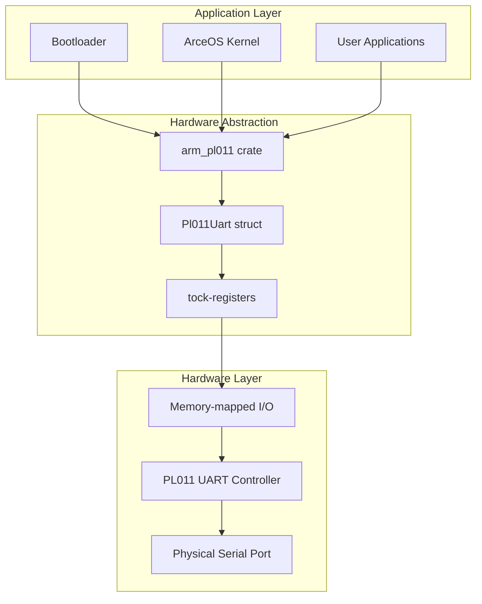
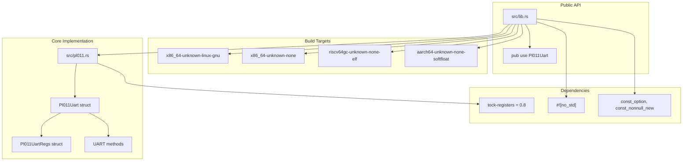

# Overview

> **Relevant source files**
> * [Cargo.toml](https://github.com/arceos-org/arm_pl011/blob/a5a02f1f/Cargo.toml)
> * [README.md](https://github.com/arceos-org/arm_pl011/blob/a5a02f1f/README.md)
> * [src/lib.rs](https://github.com/arceos-org/arm_pl011/blob/a5a02f1f/src/lib.rs)

The `arm_pl011` crate provides type-safe register definitions and basic operations for the ARM PL011 UART controller. This library serves as a hardware abstraction layer for embedded systems and operating system kernels that need to interface with PL011 UART hardware found in ARM-based systems.

The crate is designed for `no_std` environments and integrates with the ArceOS operating system ecosystem, though it can be used independently in any Rust embedded project requiring PL011 UART support. For detailed hardware specifications and register layouts, see [Hardware Reference](/arceos-org/arm_pl011/5-hardware-reference). For specific implementation details, see [Core Implementation](/arceos-org/arm_pl011/2-core-implementation).

## System Context

The following diagram illustrates how `arm_pl011` fits within the broader embedded systems software stack:

**System Integration Context**

Sources: [Cargo.toml(L8 - L12)&emsp;](https://github.com/arceos-org/arm_pl011/blob/a5a02f1f/Cargo.toml#L8-L12) [README.md(L7 - L9)&emsp;](https://github.com/arceos-org/arm_pl011/blob/a5a02f1f/README.md#L7-L9)

## Crate Structure and Code Entities

The crate follows a minimal, focused design with clear separation between public API and internal implementation:

**Code Organization and Key Entities**

Sources: [src/lib.rs(L1 - L8)&emsp;](https://github.com/arceos-org/arm_pl011/blob/a5a02f1f/src/lib.rs#L1-L8) [Cargo.toml(L14 - L15)&emsp;](https://github.com/arceos-org/arm_pl011/blob/a5a02f1f/Cargo.toml#L14-L15)

## Key Features

The `arm_pl011` crate provides the following core capabilities:

|Feature|Description|Code Entity|
| --- | --- | --- |
|Type-safe register access|Memory-mapped register operations with compile-time safety|tock-registersintegration|
|UART initialization|Hardware setup and configuration|Pl011Uart::init()|
|Character I/O|Blocking send/receive operations|putchar(),getchar()|
|Interrupt management|Interrupt status checking and acknowledgment|is_receive_interrupt(),ack_interrupts()|
|Multi-target support|Cross-compilation for embedded and hosted environments|no_stdcompatibility|
|Const operations|Compile-time initialization support|const_option,const_nonnull_new|

Sources: [Cargo.toml(L1 - L12)&emsp;](https://github.com/arceos-org/arm_pl011/blob/a5a02f1f/Cargo.toml#L1-L12) [src/lib.rs(L2 - L3)&emsp;](https://github.com/arceos-org/arm_pl011/blob/a5a02f1f/src/lib.rs#L2-L3)

## Target Use Cases

The crate is designed for several specific embedded development scenarios:

* **Operating System Kernels**: Provides console and debug output for kernel development, particularly within the ArceOS ecosystem
* **Bootloaders**: Early-stage system initialization requiring minimal dependencies and `no_std` compatibility
* **Embedded Applications**: Direct hardware control in bare-metal ARM systems with PL011 UART controllers
* **Cross-platform Development**: Testing and development on hosted systems before deployment to embedded targets

The multi-target build support enables development workflows that span from Linux-based development environments to bare-metal embedded deployment, making it suitable for both prototyping and production use.

Sources: [Cargo.toml(L8 - L12)&emsp;](https://github.com/arceos-org/arm_pl011/blob/a5a02f1f/Cargo.toml#L8-L12) [README.md(L1 - L9)&emsp;](https://github.com/arceos-org/arm_pl011/blob/a5a02f1f/README.md#L1-L9)