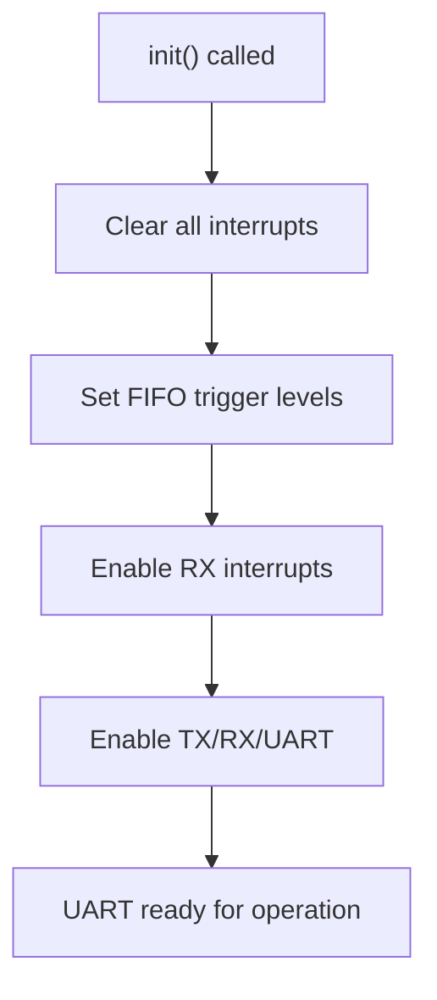
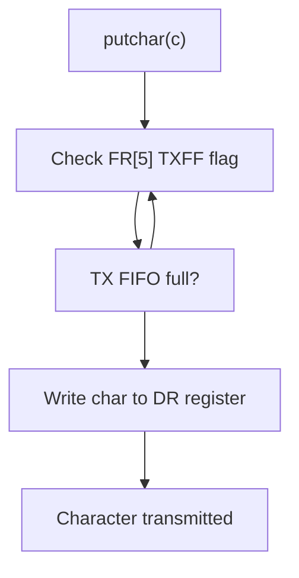
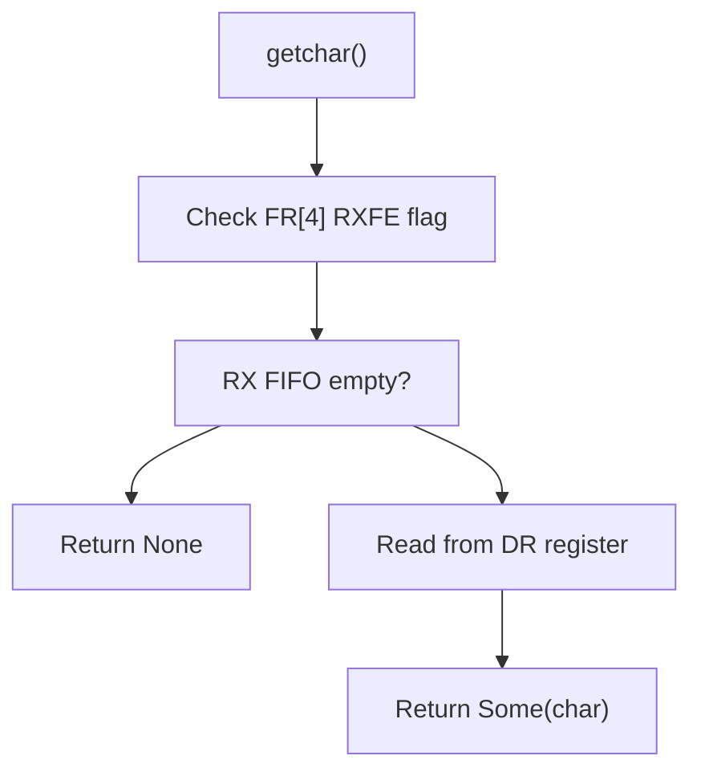
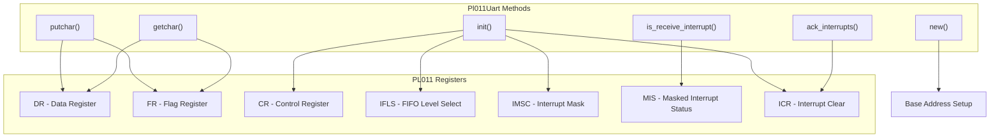
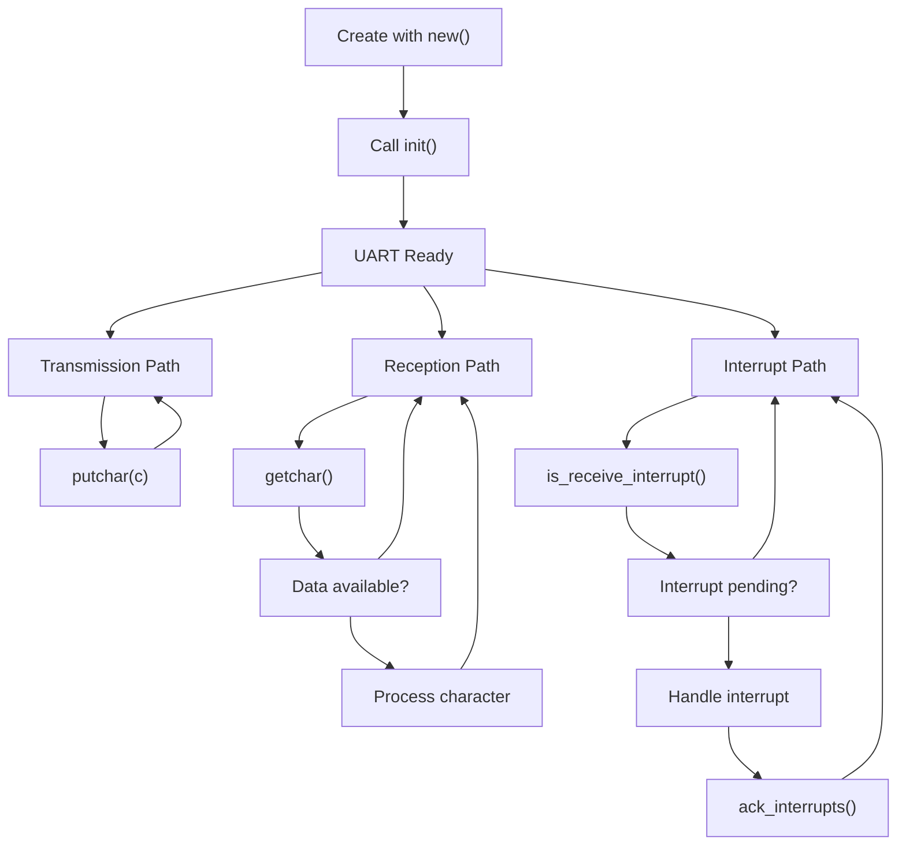

# Pl011Uart Methods

> **Relevant source files**
> * [src/pl011.rs](https://github.com/arceos-org/arm_pl011/blob/a5a02f1f/src/pl011.rs)

This page provides detailed documentation for all public methods of the `Pl011Uart` struct, which implements the primary interface for controlling PL011 UART hardware. These methods handle UART initialization, character transmission and reception, and interrupt management.

For information about the underlying register definitions and hardware abstraction, see [Register Definitions](/arceos-org/arm_pl011/2.1-register-definitions). For thread safety and memory safety considerations when using these methods, see [Thread Safety and Memory Safety](/arceos-org/arm_pl011/3.2-thread-safety-and-memory-safety).

## Constructor Methods

### new()

The `new()` method constructs a new `Pl011Uart` instance from a hardware base address.

|Method|Signature|Purpose|
| --- | --- | --- |
|new|pub const fn new(base: *mut u8) -> Self|Create UART instance from base address|

```javascript
// Usage example - base address typically from device tree or platform code
let uart = Pl011Uart::new(0x0900_0000 as *mut u8);
```

This constructor uses `const fn` to enable compile-time initialization and leverages `NonNull::new().unwrap().cast()` to safely convert the raw pointer to a typed register pointer. The method is marked as `const` to support static initialization patterns common in embedded systems.

**Sources:** [src/pl011.rs(L50 - L55)&emsp;](https://github.com/arceos-org/arm_pl011/blob/a5a02f1f/src/pl011.rs#L50-L55)

## Initialization Methods

### init()

The `init()` method performs complete UART hardware initialization, configuring interrupts, FIFO levels, and enabling transmission/reception.

|Method|Signature|Purpose|
| --- | --- | --- |
|init|pub fn init(&mut self)|Initialize UART hardware for operation|

**Initialization Sequence:**



The initialization process involves:

1. **Interrupt Clearing**: Sets ICR register to `0x7ff` to clear all pending interrupts
2. **FIFO Configuration**: Sets IFLS register to `0` for 1/8 RX and TX FIFO trigger levels
3. **Interrupt Enablement**: Sets IMSC register bit 4 to enable RX interrupts
4. **UART Enablement**: Sets CR register bits 0, 8, and 9 to enable TX, RX, and overall UART operation

**Sources:** [src/pl011.rs(L61 - L76)&emsp;](https://github.com/arceos-org/arm_pl011/blob/a5a02f1f/src/pl011.rs#L61-L76)

## Character I/O Methods

### putchar()

The `putchar()` method transmits a single character through the UART, implementing blocking transmission with FIFO status checking.

|Method|Signature|Purpose|
| --- | --- | --- |
|putchar|pub fn putchar(&mut self, c: u8)|Transmit single character (blocking)|

**Transmission Process:**



The method blocks until the transmit FIFO has space (FR register bit 5 clear), then writes the character to the data register for transmission.

**Sources:** [src/pl011.rs(L78 - L82)&emsp;](https://github.com/arceos-org/arm_pl011/blob/a5a02f1f/src/pl011.rs#L78-L82)

### getchar()

The `getchar()` method attempts to receive a character from the UART, returning `Some(u8)` if data is available or `None` if the receive FIFO is empty.

|Method|Signature|Purpose|
| --- | --- | --- |
|getchar|pub fn getchar(&mut self) -> Option<u8>|Receive single character (non-blocking)|

**Reception Logic:**



The method checks the FR register bit 4 (RXFE - receive FIFO empty). If clear, data is available and the method reads from the data register; otherwise it returns `None`.

**Sources:** [src/pl011.rs(L84 - L91)&emsp;](https://github.com/arceos-org/arm_pl011/blob/a5a02f1f/src/pl011.rs#L84-L91)

## Interrupt Handling Methods

### is_receive_interrupt()

The `is_receive_interrupt()` method checks if a receive interrupt is currently pending, enabling interrupt-driven I/O patterns.

|Method|Signature|Purpose|
| --- | --- | --- |
|is_receive_interrupt|pub fn is_receive_interrupt(&self) -> bool|Check for pending RX interrupt|

This method reads the MIS (Masked Interrupt Status) register and tests bit 4 to determine if a receive interrupt is active. It only detects interrupts that are both asserted and enabled through the interrupt mask.

**Sources:** [src/pl011.rs(L93 - L97)&emsp;](https://github.com/arceos-org/arm_pl011/blob/a5a02f1f/src/pl011.rs#L93-L97)

### ack_interrupts()

The `ack_interrupts()` method clears all pending UART interrupts by writing to the interrupt clear register.

|Method|Signature|Purpose|
| --- | --- | --- |
|ack_interrupts|pub fn ack_interrupts(&mut self)|Clear all pending interrupts|

This method writes `0x7ff` to the ICR register, clearing all possible interrupt conditions. This is typically called in interrupt service routines to acknowledge interrupt processing.

**Sources:** [src/pl011.rs(L99 - L102)&emsp;](https://github.com/arceos-org/arm_pl011/blob/a5a02f1f/src/pl011.rs#L99-L102)

## Method Access Patterns

The following diagram shows how each method interacts with the PL011 hardware registers:



## Typical Usage Flow

Most applications follow this pattern when using `Pl011Uart` methods:



## Private Helper Methods

### regs()

The `regs()` method provides internal access to the register structure, converting the base pointer to a register reference.

|Method|Signature|Purpose|
| --- | --- | --- |
|regs|const fn regs(&self) -> &Pl011UartRegs|Internal register access|

This private method uses `unsafe` code to dereference the base pointer and return a reference to the register structure. All public methods use this helper to access hardware registers safely.

**Sources:** [src/pl011.rs(L57 - L59)&emsp;](https://github.com/arceos-org/arm_pl011/blob/a5a02f1f/src/pl011.rs#L57-L59)