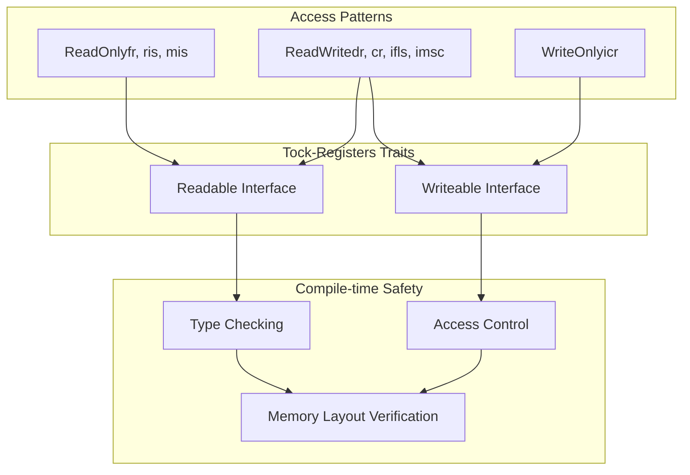
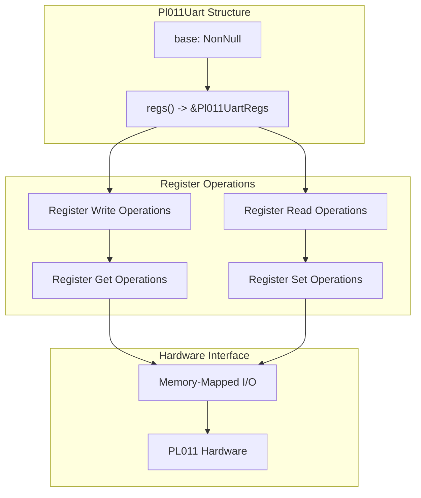

# Register Definitions

> **Relevant source files**
> * [src/pl011.rs](https://github.com/arceos-org/arm_pl011/blob/a5a02f1f/src/pl011.rs)

This document details the PL011 UART register definitions implemented in the `arm_pl011` crate, including the memory-mapped register structure, individual register specifications, and the type-safe abstractions provided by the `tock-registers` library. This covers the hardware abstraction layer that maps PL011 UART controller registers to Rust data structures.

For information about how these registers are used in UART operations, see [UART Operations](/arceos-org/arm_pl011/2.2-uart-operations). For the complete API methods that interact with these registers, see [Pl011Uart Methods](/arceos-org/arm_pl011/3.1-pl011uart-methods).

## Register Structure Overview

The PL011 UART registers are defined using the `register_structs!` macro from the `tock-registers` crate, which provides compile-time memory layout verification and type-safe register access. The `Pl011UartRegs` structure maps the complete PL011 register set to their hardware-defined memory offsets.

**Register Memory Layout**

```mermaid
flowchart TD
subgraph subGraph0["Pl011UartRegs Structure"]
    DR["dr: ReadWrite0x00 - Data Register"]
    RES0["_reserved00x04-0x17"]
    FR["fr: ReadOnly0x18 - Flag Register"]
    RES1["_reserved10x1C-0x2F"]
    CR["cr: ReadWrite0x30 - Control Register"]
    IFLS["ifls: ReadWrite0x34 - Interrupt FIFO Level"]
    IMSC["imsc: ReadWrite0x38 - Interrupt Mask Set Clear"]
    RIS["ris: ReadOnly0x3C - Raw Interrupt Status"]
    MIS["mis: ReadOnly0x40 - Masked Interrupt Status"]
    ICR["icr: WriteOnly0x44 - Interrupt Clear"]
    END["@END0x48"]
end

CR --> IFLS
DR --> RES0
FR --> RES1
ICR --> END
IFLS --> IMSC
IMSC --> RIS
MIS --> ICR
RES0 --> FR
RES1 --> CR
RIS --> MIS
```

Sources: [src/pl011.rs(L9 - L32)&emsp;](https://github.com/arceos-org/arm_pl011/blob/a5a02f1f/src/pl011.rs#L9-L32)

## Individual Register Definitions

The register structure defines eight functional registers with specific access patterns and purposes:

|Register|Offset|Type|Description|
| --- | --- | --- | --- |
|dr|0x00|ReadWrite<u32>|Data Register - transmit/receive data|
|fr|0x18|ReadOnly<u32>|Flag Register - UART status flags|
|cr|0x30|ReadWrite<u32>|Control Register - UART configuration|
|ifls|0x34|ReadWrite<u32>|Interrupt FIFO Level Select Register|
|imsc|0x38|ReadWrite<u32>|Interrupt Mask Set Clear Register|
|ris|0x3C|ReadOnly<u32>|Raw Interrupt Status Register|
|mis|0x40|ReadOnly<u32>|Masked Interrupt Status Register|
|icr|0x44|WriteOnly<u32>|Interrupt Clear Register|

### Data Register (dr)

The Data Register at offset `0x00` provides bidirectional data access for character transmission and reception. It supports both read and write operations for handling UART data flow.

### Flag Register (fr)

The Flag Register at offset `0x18` provides read-only status information about the UART state, including transmit/receive FIFO status and busy indicators.

### Control Register (cr)

The Control Register at offset `0x30` configures UART operational parameters including enable/disable states for transmission, reception, and the overall UART controller.

Sources: [src/pl011.rs(L9 - L32)&emsp;](https://github.com/arceos-org/arm_pl011/blob/a5a02f1f/src/pl011.rs#L9-L32)

## Type Safety and Memory Mapping

The register definitions leverage the `tock-registers` library to provide compile-time guarantees about register access patterns and memory safety:

**Register Access Type Safety**

The `register_structs!` macro ensures that:

* Register offsets match PL011 hardware specifications
* Reserved memory regions are properly handled
* Access patterns prevent invalid operations (e.g., reading write-only registers)
* Memory layout is validated at compile time

Sources: [src/pl011.rs(L3 - L7)&emsp;](https://github.com/arceos-org/arm_pl011/blob/a5a02f1f/src/pl011.rs#L3-L7) [src/pl011.rs(L9 - L32)&emsp;](https://github.com/arceos-org/arm_pl011/blob/a5a02f1f/src/pl011.rs#L9-L32)

## Register Access Implementation

The `Pl011Uart` structure contains a `NonNull<Pl011UartRegs>` pointer that provides safe access to the memory-mapped registers. The `regs()` method returns a reference to the register structure for performing hardware operations.

**Register Access Flow**

The implementation ensures memory safety through:

* Const construction via `NonNull::new().unwrap().cast()`
* Unsafe register access contained within safe method boundaries
* Type-safe register operations through tock-registers interfaces

Sources: [src/pl011.rs(L42 - L59)&emsp;](https://github.com/arceos-org/arm_pl011/blob/a5a02f1f/src/pl011.rs#L42-L59)