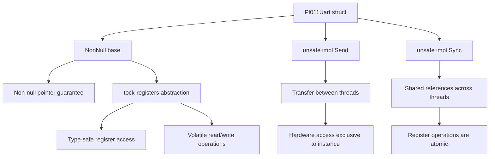
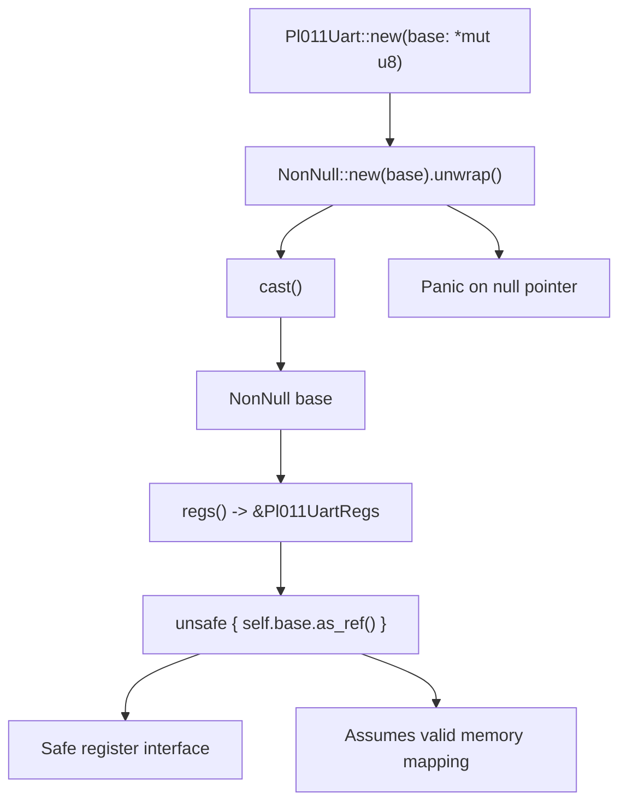
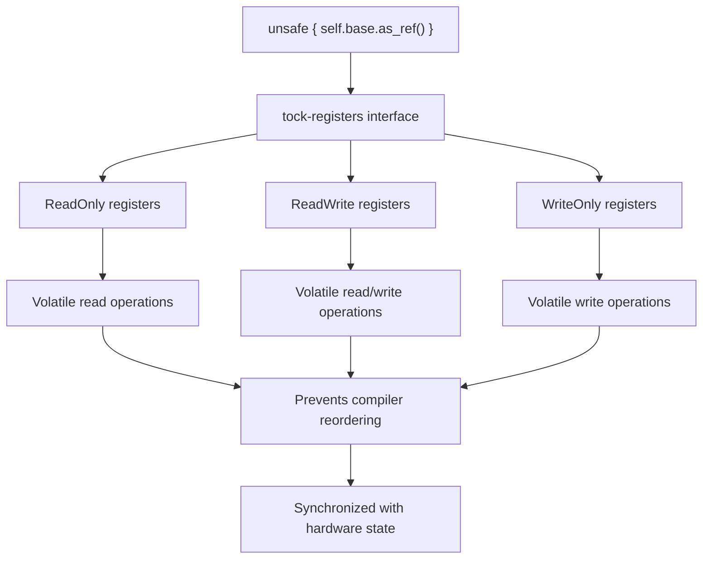
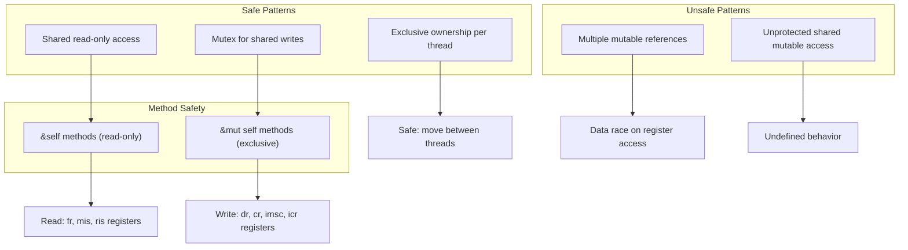
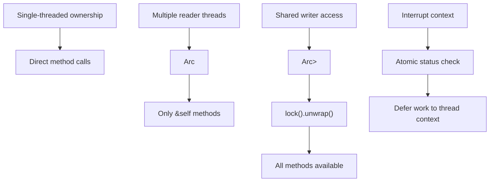

# Thread Safety and Memory Safety

> **Relevant source files**
> * [src/pl011.rs](https://github.com/arceos-org/arm_pl011/blob/a5a02f1f/src/pl011.rs)

This document covers the thread safety and memory safety guarantees provided by the `arm_pl011` crate, focusing on the `Pl011Uart` implementation and its safe abstractions over hardware register access. For general API usage patterns, see [3.1](/arceos-org/arm_pl011/3.1-pl011uart-methods). For hardware register specifications, see [5](/arceos-org/arm_pl011/5-hardware-reference).

## Purpose and Scope

The `arm_pl011` crate provides memory-safe and thread-safe abstractions for PL011 UART hardware access in `no_std` embedded environments. This page examines the explicit `Send` and `Sync` implementations, memory safety guarantees through `NonNull` and `tock-registers`, and safe usage patterns for concurrent access scenarios.

## Send and Sync Implementations

The `Pl011Uart` struct explicitly implements both `Send` and `Sync` traits through unsafe implementations, enabling safe transfer and sharing between threads.

### Safety Guarantees



**Send Safety Justification**: Each `Pl011Uart` instance exclusively owns access to its memory-mapped register region. The hardware controller exists at a unique physical address, making transfer between threads safe as long as no aliasing occurs.

**Sync Safety Justification**: PL011 register operations are atomic at the hardware level. The `tock-registers` abstraction ensures volatile access patterns that are safe for concurrent readers.

Sources: [src/pl011.rs(L46 - L47)&emsp;](https://github.com/arceos-org/arm_pl011/blob/a5a02f1f/src/pl011.rs#L46-L47)

### Implementation Details

|Trait|Safety Requirement|Implementation Rationale|
| --- | --- | --- |
|Send|Safe to transfer ownership between threads|Hardware register access is location-bound, not thread-bound|
|Sync|Safe to share references across threads|Register operations are atomic; concurrent reads are safe|

The implementations rely on hardware-level atomicity guarantees and the absence of internal mutability that could cause data races.

Sources: [src/pl011.rs(L42 - L47)&emsp;](https://github.com/arceos-org/arm_pl011/blob/a5a02f1f/src/pl011.rs#L42-L47)

## Memory Safety Guarantees

### NonNull Pointer Management



The `Pl011Uart` constructor uses `NonNull::new().unwrap()` to ensure non-null pointer storage, panicking immediately on null input rather than deferring undefined behavior.

**Memory Safety Properties**:

* **Non-null guarantee**: `NonNull<T>` type prevents null pointer dereference
* **Const construction**: Construction in const context validates pointer at compile time when possible
* **Type safety**: Cast to `Pl011UartRegs` provides typed access to register layout

Sources: [src/pl011.rs(L51 - L54)&emsp;](https://github.com/arceos-org/arm_pl011/blob/a5a02f1f/src/pl011.rs#L51-L54) [src/pl011.rs(L57 - L59)&emsp;](https://github.com/arceos-org/arm_pl011/blob/a5a02f1f/src/pl011.rs#L57-L59)

### Register Access Safety

The crate uses `tock-registers` to provide memory-safe register access patterns:



**Safety Mechanisms**:

* **Volatile access**: All register operations use volatile semantics to prevent compiler optimizations
* **Type safety**: Register types prevent incorrect access patterns (e.g., writing to read-only registers)
* **Memory barriers**: Volatile operations provide necessary compiler barriers for hardware synchronization

Sources: [src/pl011.rs(L9 - L32)&emsp;](https://github.com/arceos-org/arm_pl011/blob/a5a02f1f/src/pl011.rs#L9-L32) [src/pl011.rs(L57 - L59)&emsp;](https://github.com/arceos-org/arm_pl011/blob/a5a02f1f/src/pl011.rs#L57-L59)

## Thread Safety Considerations

### Concurrent Access Patterns



**Thread Safety Model**:

* **Shared immutable access**: Multiple threads can safely call `&self` methods for reading status
* **Exclusive mutable access**: Only one thread should have `&mut` access for configuration and I/O operations
* **Hardware atomicity**: Individual register operations are atomic at the hardware level

Sources: [src/pl011.rs(L78 - L103)&emsp;](https://github.com/arceos-org/arm_pl011/blob/a5a02f1f/src/pl011.rs#L78-L103)

### Method Safety Classification

|Method|Signature|Thread Safety|Hardware Impact|
| --- | --- | --- | --- |
|is_receive_interrupt()|&self|Safe for concurrent access|Read-only status check|
|putchar()|&mut self|Requires exclusive access|Modifies transmit state|
|getchar()|&mut self|Requires exclusive access|Modifies receive state|
|init()|&mut self|Requires exclusive access|Modifies controller configuration|
|ack_interrupts()|&mut self|Requires exclusive access|Clears interrupt state|

The distinction between `&self` and `&mut self` methods reflects the underlying hardware behavior and safety requirements.

Sources: [src/pl011.rs(L64 - L103)&emsp;](https://github.com/arceos-org/arm_pl011/blob/a5a02f1f/src/pl011.rs#L64-L103)

## Safe Usage Patterns

### Recommended Concurrent Access



**Best Practices**:

1. **Single ownership**: Preferred pattern for most embedded applications
2. **Arc sharing**: Use for status monitoring across multiple threads
3. **Mutex protection**: Required for shared mutable access
4. **Interrupt safety**: Minimize work in interrupt context, use atomic operations only

Sources: [src/pl011.rs(L94 - L96)&emsp;](https://github.com/arceos-org/arm_pl011/blob/a5a02f1f/src/pl011.rs#L94-L96)

### Initialization Safety

The `const fn new()` constructor enables compile-time safety verification when used with known memory addresses:

```javascript
// Safe: Address known at compile time
const UART0: Pl011Uart = Pl011Uart::new(0x9000_0000 as *mut u8);

// Runtime construction - requires valid address
let uart = Pl011Uart::new(base_addr);
```

**Safety Requirements**:

* Base address must point to valid PL011 hardware registers
* Memory region must remain mapped for lifetime of `Pl011Uart` instance
* No other code should directly access the same register region

Sources: [src/pl011.rs(L50 - L55)&emsp;](https://github.com/arceos-org/arm_pl011/blob/a5a02f1f/src/pl011.rs#L50-L55)