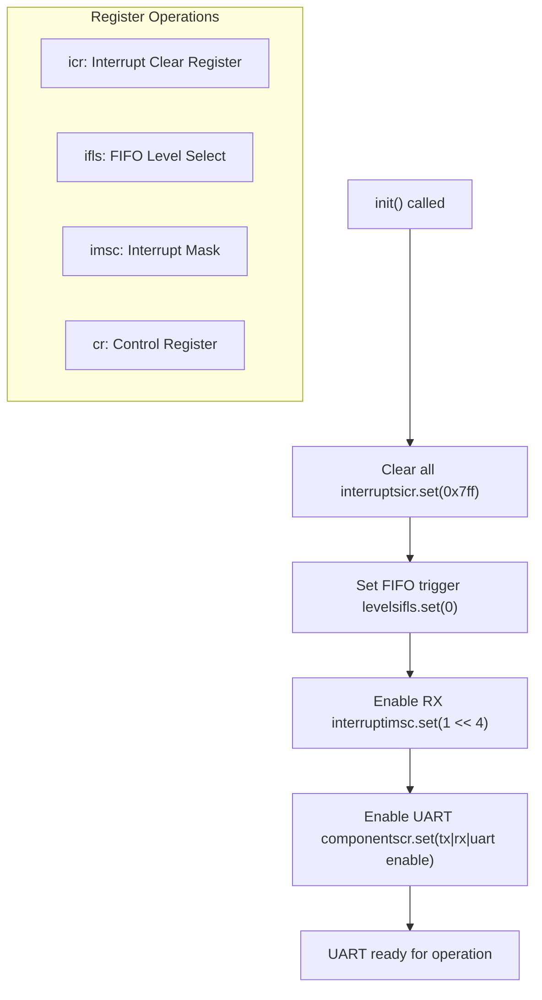
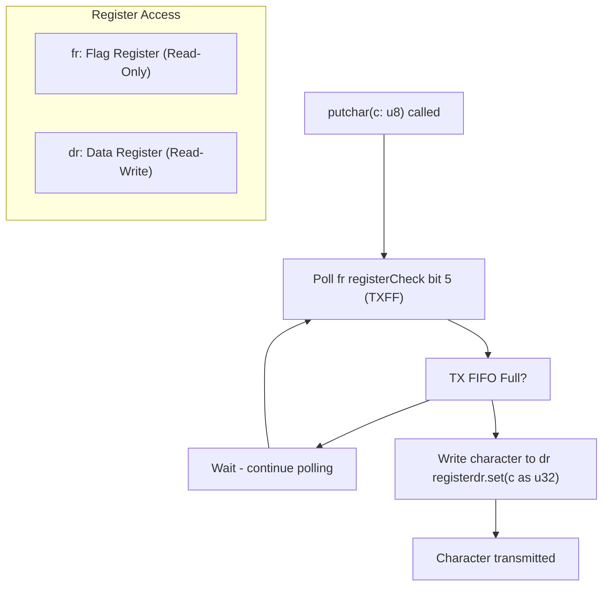
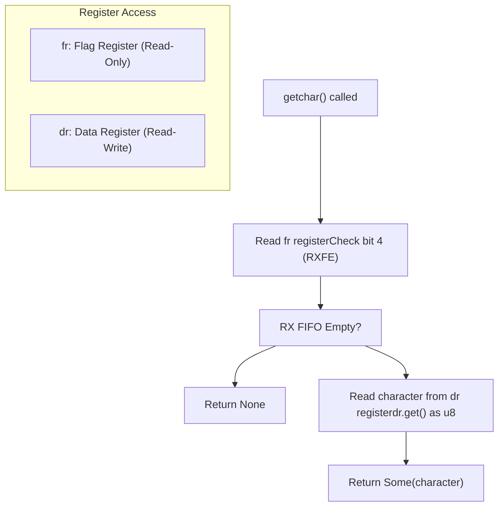
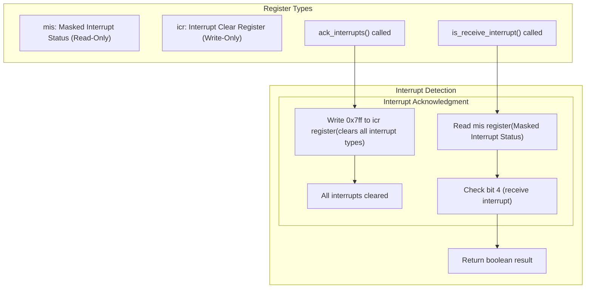
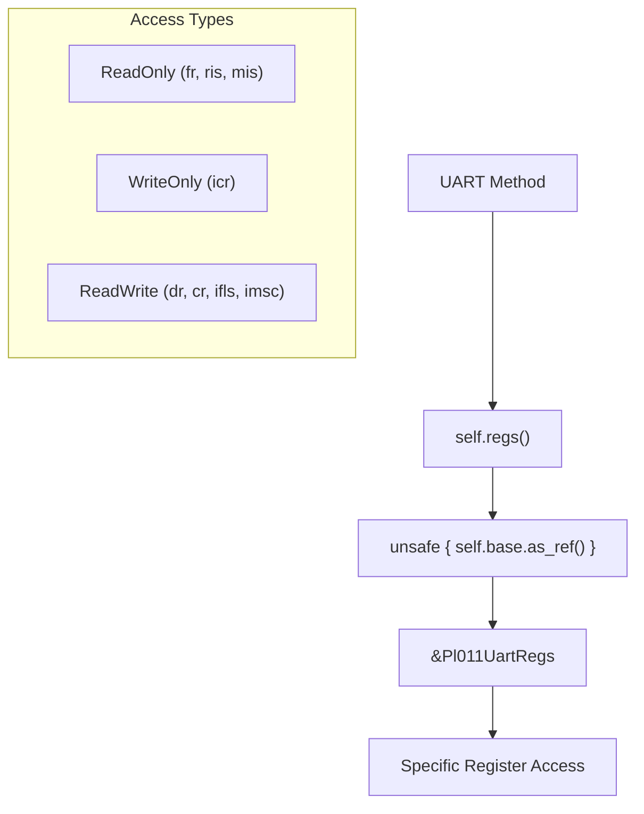

# UART Operations

> **Relevant source files**
> * [src/pl011.rs](https://github.com/arceos-org/arm_pl011/blob/a5a02f1f/src/pl011.rs)

This document covers the core UART operations provided by the `Pl011Uart` implementation, including initialization, character transmission and reception, status monitoring, and interrupt handling. These operations form the fundamental interface for communicating with PL011 UART hardware controllers.

For details about the underlying register structure and memory layout, see [Register Definitions](/arceos-org/arm_pl011/2.1-register-definitions). For complete API documentation and method signatures, see [Pl011Uart Methods](/arceos-org/arm_pl011/3.1-pl011uart-methods).

## Operation Categories

The `Pl011Uart` struct provides five main categories of operations implemented through distinct methods that directly manipulate hardware registers:

|Operation Category|Methods|Purpose|
| --- | --- | --- |
|Initialization|init()|Configure UART for operation|
|Character Output|putchar()|Transmit single characters|
|Character Input|getchar()|Receive single characters|
|Interrupt Detection|is_receive_interrupt()|Check for receive interrupts|
|Interrupt Handling|ack_interrupts()|Clear pending interrupts|

## Initialization Process

### init() Method Operation Flow

The `init()` method [src/pl011.rs(L64 - L76)&emsp;](https://github.com/arceos-org/arm_pl011/blob/a5a02f1f/src/pl011.rs#L64-L76) performs a four-step hardware configuration sequence:

1. **Interrupt Clearing**: Sets `icr` register to `0x7ff` to clear all pending interrupts
2. **FIFO Configuration**: Sets `ifls` register to `0` for 1/8 RX FIFO and 1/8 TX FIFO trigger levels
3. **Interrupt Enabling**: Sets `imsc` register bit 4 to enable receive interrupts (`rxim`)
4. **UART Activation**: Sets `cr` register bits 0, 8, and 9 to enable transmission, reception, and overall UART operation

Sources: [src/pl011.rs(L61 - L76)&emsp;](https://github.com/arceos-org/arm_pl011/blob/a5a02f1f/src/pl011.rs#L61-L76)

## Character Transmission

### putchar() Operation Flow

The `putchar()` method [src/pl011.rs(L79 - L82)&emsp;](https://github.com/arceos-org/arm_pl011/blob/a5a02f1f/src/pl011.rs#L79-L82) implements blocking character transmission:

1. **Status Polling**: Continuously reads the `fr` (Flag Register) and checks bit 5 (`TXFF` - Transmit FIFO Full)
2. **Busy Waiting**: If bit 5 is set, the transmit FIFO is full and the method continues polling
3. **Character Writing**: When bit 5 is clear, writes the character to the `dr` (Data Register) as a 32-bit value

Sources: [src/pl011.rs(L78 - L82)&emsp;](https://github.com/arceos-org/arm_pl011/blob/a5a02f1f/src/pl011.rs#L78-L82)

## Character Reception

### getchar() Operation Flow

The `getchar()` method [src/pl011.rs(L85 - L91)&emsp;](https://github.com/arceos-org/arm_pl011/blob/a5a02f1f/src/pl011.rs#L85-L91) provides non-blocking character reception:

1. **Status Check**: Reads the `fr` (Flag Register) and examines bit 4 (`RXFE` - Receive FIFO Empty)
2. **Conditional Read**: If bit 4 is clear (FIFO not empty), reads from the `dr` (Data Register)
3. **Return Logic**: Returns `Some(u8)` if data is available, `None` if FIFO is empty

Sources: [src/pl011.rs(L84 - L91)&emsp;](https://github.com/arceos-org/arm_pl011/blob/a5a02f1f/src/pl011.rs#L84-L91)

## Interrupt Handling

### Interrupt Detection and Acknowledgment

The interrupt handling operations [src/pl011.rs(L94 - L102)&emsp;](https://github.com/arceos-org/arm_pl011/blob/a5a02f1f/src/pl011.rs#L94-L102) provide status checking and clearing functionality:

**Interrupt Detection** (`is_receive_interrupt()`):

* Reads the `mis` (Masked Interrupt Status) register
* Checks bit 4 to determine if a receive interrupt is pending
* Returns boolean indicating interrupt status

**Interrupt Acknowledgment** (`ack_interrupts()`):

* Writes `0x7ff` to the `icr` (Interrupt Clear Register)
* Clears all interrupt types simultaneously
* Used after handling interrupts to reset hardware state

Sources: [src/pl011.rs(L93 - L102)&emsp;](https://github.com/arceos-org/arm_pl011/blob/a5a02f1f/src/pl011.rs#L93-L102)

## FIFO Management

The PL011 UART controller includes internal FIFOs for both transmission and reception. The implementation configures and interacts with these FIFOs through specific register operations:

|FIFO Aspect|Register|Configuration|Purpose|
| --- | --- | --- | --- |
|Trigger Levels|ifls|Set to0|1/8 depth triggers for both TX/RX|
|TX Status|frbit 5|Read-only|Indicates TX FIFO full condition|
|RX Status|frbit 4|Read-only|Indicates RX FIFO empty condition|
|Data Transfer|dr|Read/Write|Single entry point for FIFO access|

The FIFO configuration ensures efficient interrupt-driven operation while preventing data loss during high-throughput scenarios.

Sources: [src/pl011.rs(L68 - L69)&emsp;](https://github.com/arceos-org/arm_pl011/blob/a5a02f1f/src/pl011.rs#L68-L69) [src/pl011.rs(L80)&emsp;](https://github.com/arceos-org/arm_pl011/blob/a5a02f1f/src/pl011.rs#L80-L80) [src/pl011.rs(L86)&emsp;](https://github.com/arceos-org/arm_pl011/blob/a5a02f1f/src/pl011.rs#L86-L86)

## Register Access Patterns

All UART operations follow consistent patterns for hardware register access through the `regs()` method [src/pl011.rs(L57 - L59)&emsp;](https://github.com/arceos-org/arm_pl011/blob/a5a02f1f/src/pl011.rs#L57-L59):

The `regs()` method provides type-safe access to memory-mapped registers through the `tock-registers` crate, ensuring that register access constraints are enforced at compile time.

Sources: [src/pl011.rs(L57 - L59)&emsp;](https://github.com/arceos-org/arm_pl011/blob/a5a02f1f/src/pl011.rs#L57-L59) [src/pl011.rs(L9 - L32)&emsp;](https://github.com/arceos-org/arm_pl011/blob/a5a02f1f/src/pl011.rs#L9-L32)