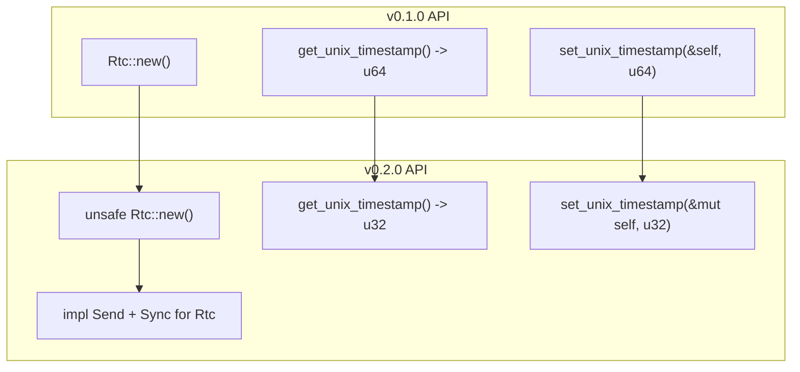
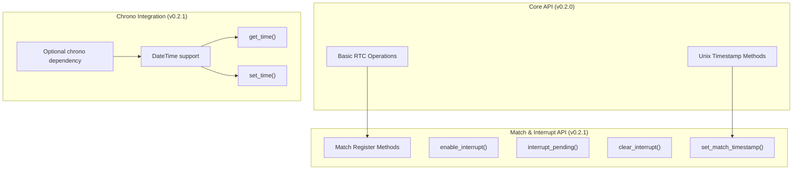
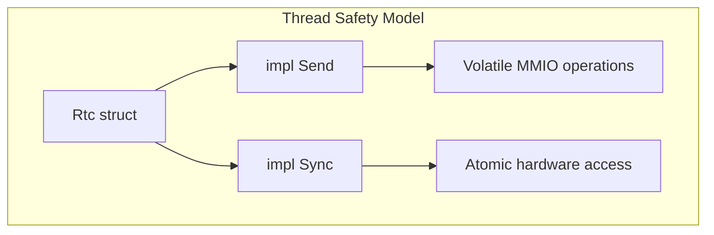

# API Evolution and Changelog

> **Relevant source files**
> * [CHANGELOG.md](https://github.com/arceos-org/arm_pl031/blob/8cc6761d/CHANGELOG.md)

This document tracks the evolution of the `arm_pl031` crate's public API across versions, documenting breaking changes, feature additions, and migration guidance. It serves as a reference for understanding how the crate has evolved and helps developers plan upgrades and maintain backward compatibility.

For information about building and testing the current version, see [Building and Testing](/arceos-org/arm_pl031/5.1-building-and-testing). For development environment setup, see [Development Environment](/arceos-org/arm_pl031/5.3-development-environment).

## Version History Overview

The `arm_pl031` crate has evolved through three major releases, each introducing significant improvements to the API design and functionality. The evolution demonstrates a progression from a basic RTC interface to a more robust, safe, and feature-rich driver.

### API Evolution Timeline

```

```

Sources: [CHANGELOG.md(L1 - L26)&emsp;](https://github.com/arceos-org/arm_pl031/blob/8cc6761d/CHANGELOG.md#L1-L26)

## Breaking Changes Analysis

### Version 0.2.0 Breaking Changes

Version 0.2.0 introduced several breaking changes that improved the API's safety and correctness:



Sources: [CHANGELOG.md(L10 - L22)&emsp;](https://github.com/arceos-org/arm_pl031/blob/8cc6761d/CHANGELOG.md#L10-L22)

#### Timestamp Type Change (u64 → u32)

The most significant breaking change was the modification of timestamp handling functions:

|Function|v0.1.0 Signature|v0.2.0 Signature|Rationale|
| --- | --- | --- | --- |
|get_unix_timestamp|fn() -> u64|fn() -> u32|Match PL031 register width|
|set_unix_timestamp|fn(&self, u64)|fn(&mut self, u32)|Type consistency + mutability|

This change aligned the API with the underlying hardware's 32-bit registers, preventing potential data truncation issues and improving type safety.

#### Safety Boundary Introduction

The `Rtc::new()` constructor was marked as `unsafe` to properly reflect that it requires a valid memory-mapped I/O pointer:

```rust
// v0.1.0
impl Rtc {
    pub fn new(base: *mut u8) -> Self

// v0.2.0  
impl Rtc {
    pub unsafe fn new(base: *mut u8) -> Self
```

#### Mutability Requirements

The `set_unix_timestamp` function was changed to require a mutable reference, correctly reflecting that it modifies device state:

```rust
// v0.1.0
fn set_unix_timestamp(&self, timestamp: u64)

// v0.2.0
fn set_unix_timestamp(&mut self, timestamp: u32)
```

Sources: [CHANGELOG.md(L14 - L17)&emsp;](https://github.com/arceos-org/arm_pl031/blob/8cc6761d/CHANGELOG.md#L14-L17)

## Feature Evolution

### Version 0.2.1 Feature Additions

Version 0.2.1 introduced new capabilities without breaking existing APIs:



Sources: [CHANGELOG.md(L3 - L9)&emsp;](https://github.com/arceos-org/arm_pl031/blob/8cc6761d/CHANGELOG.md#L3-L9)

#### Interrupt Management

The addition of interrupt-related methods provided comprehensive control over PL031 interrupt functionality:

* `enable_interrupt()` - Enable/disable alarm interrupts
* `interrupt_pending()` - Check interrupt status
* `clear_interrupt()` - Clear pending interrupts
* `set_match_timestamp()` - Configure alarm time

#### Chrono Integration

The optional `chrono` feature added high-level time handling:

* Conversion between Unix timestamps and `DateTime<Utc>`
* Timezone-aware time operations
* Integration with the broader Rust ecosystem

## Migration Guidance

### Migrating from v0.1.0 to v0.2.0

#### Type Changes

```javascript
// v0.1.0 code
let timestamp: u64 = rtc.get_unix_timestamp();
rtc.set_unix_timestamp(timestamp);

// v0.2.0 migration
let timestamp: u32 = rtc.get_unix_timestamp();
rtc.set_unix_timestamp(timestamp);  // Also requires &mut rtc
```

#### Safety Annotations

```javascript
// v0.1.0 code
let rtc = Rtc::new(base_addr);

// v0.2.0 migration
let rtc = unsafe { Rtc::new(base_addr) };
```

#### Mutability Requirements

```rust
// v0.1.0 code
fn update_time(rtc: &Rtc, new_time: u64) {
    rtc.set_unix_timestamp(new_time);
}

// v0.2.0 migration  
fn update_time(rtc: &mut Rtc, new_time: u32) {
    rtc.set_unix_timestamp(new_time);
}
```

### Migrating from v0.2.0 to v0.2.1

Version 0.2.1 is fully backward compatible. New features can be adopted incrementally:

```javascript
// Existing v0.2.0 code continues to work
let timestamp = rtc.get_unix_timestamp();

// New v0.2.1 features (optional)
rtc.set_match_timestamp(timestamp + 3600);  // Alarm in 1 hour
rtc.enable_interrupt(true);

// With chrono feature enabled
#[cfg(feature = "chrono")]
{
    let datetime = rtc.get_time().unwrap();
    println!("Current time: {}", datetime);
}
```

Sources: [CHANGELOG.md(L7 - L8)&emsp;](https://github.com/arceos-org/arm_pl031/blob/8cc6761d/CHANGELOG.md#L7-L8)

## Thread Safety Evolution

### Send + Sync Implementation

Version 0.2.0 introduced thread safety guarantees:



The `Send` and `Sync` implementations enable safe use in multi-threaded environments, with the underlying volatile memory operations providing the necessary synchronization primitives.

Sources: [CHANGELOG.md(L21)&emsp;](https://github.com/arceos-org/arm_pl031/blob/8cc6761d/CHANGELOG.md#L21-L21)

## Compatibility Matrix

|Version|Breaking Changes|New Features|Rust Edition|no_std Support|
| --- | --- | --- | --- | --- |
|0.1.0|N/A|Basic RTC operations|2021|Yes|
|0.2.0|Timestamp types, Safety|Send/Sync traits|2021|Yes|
|0.2.1|None|Interrupts, chrono|2021|Yes|

## Future Compatibility Considerations

The API design demonstrates several patterns that suggest future stability:

1. **Hardware Alignment**: The v0.2.0 type changes align with hardware constraints, reducing likelihood of future type changes
2. **Safety First**: The unsafe boundary is clearly defined and unlikely to change
3. **Feature Flags**: Optional features like `chrono` allow expansion without breaking core functionality
4. **Thread Safety**: The Send/Sync implementation provides a stable foundation for concurrent use

The crate follows semantic versioning, ensuring that future minor versions (0.2.x) will maintain backward compatibility while major versions (0.x.0) may introduce breaking changes.

Sources: [CHANGELOG.md(L1 - L26)&emsp;](https://github.com/arceos-org/arm_pl031/blob/8cc6761d/CHANGELOG.md#L1-L26)