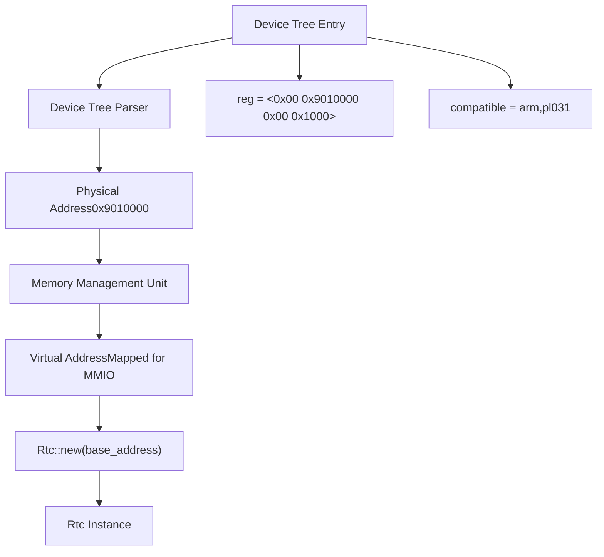
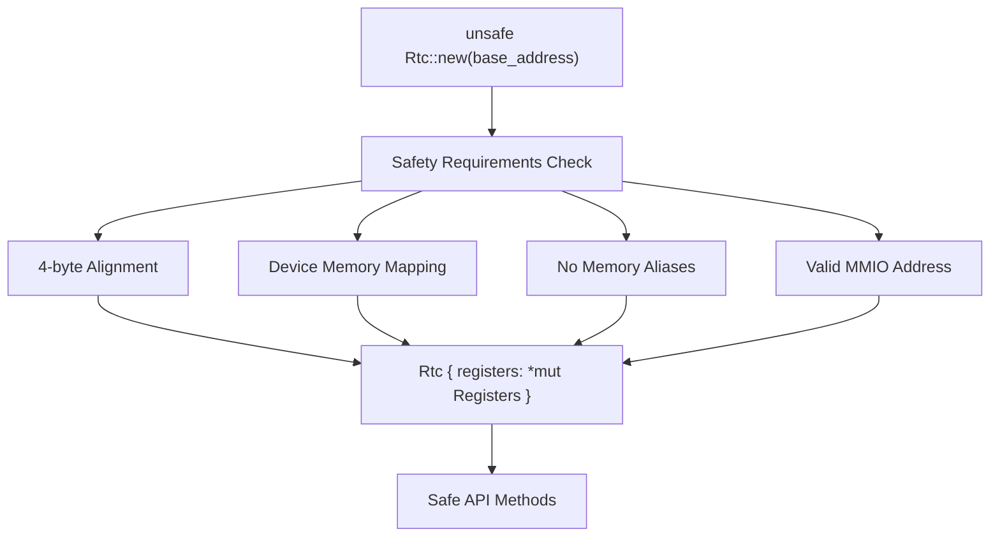
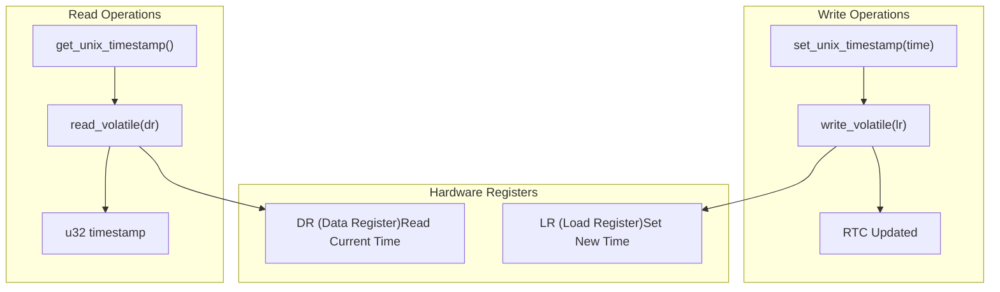
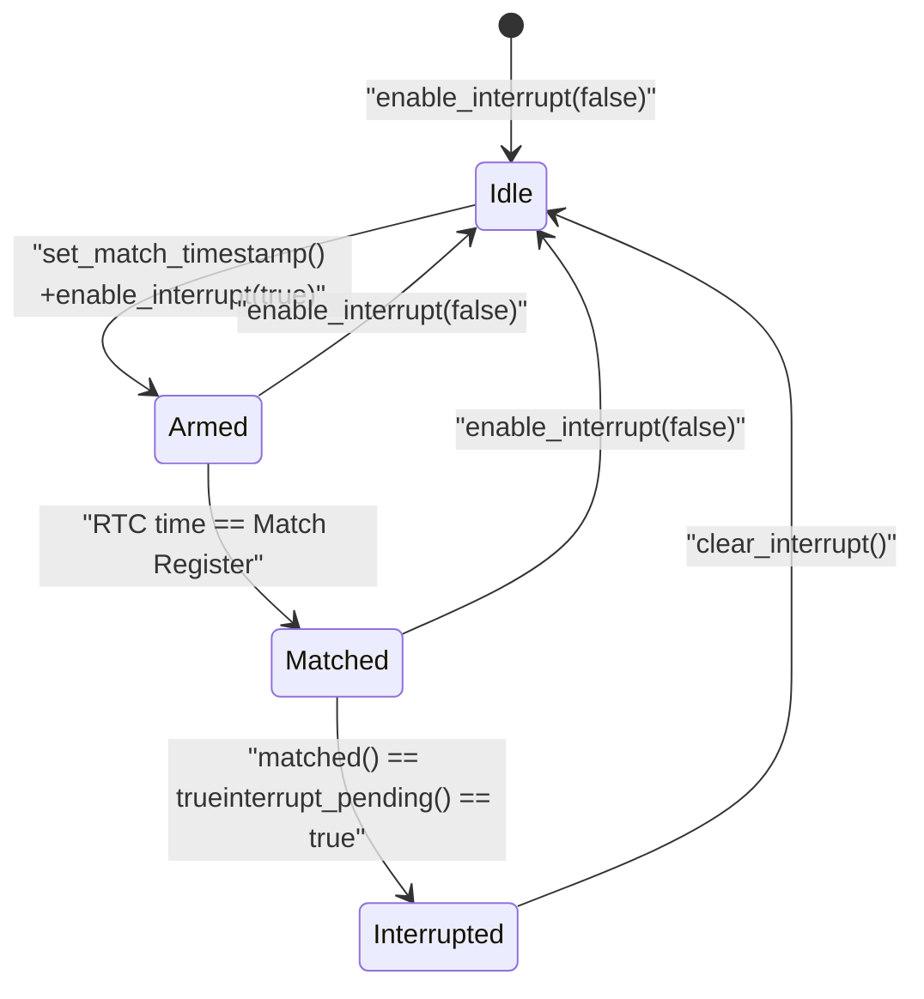
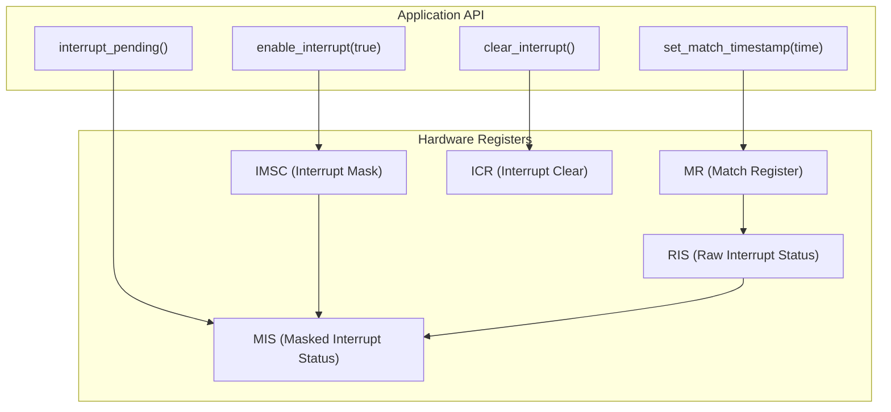

# Basic Usage and Examples

> **Relevant source files**
> * [README.md](https://github.com/arceos-org/arm_pl031/blob/8cc6761d/README.md)
> * [src/lib.rs](https://github.com/arceos-org/arm_pl031/blob/8cc6761d/src/lib.rs)

This page provides practical examples for integrating and using the arm_pl031 RTC driver in your projects. It covers device initialization, basic time operations, and simple interrupt handling. For detailed information about optional features like chrono integration, see [Chrono Integration](/arceos-org/arm_pl031/4.1-chrono-integration). For comprehensive driver internals and advanced usage, see [Core Driver Implementation](/arceos-org/arm_pl031/3-core-driver-implementation).

## Device Tree Configuration and Address Discovery

The ARM PL031 RTC driver requires a memory-mapped I/O (MMIO) base address to access the hardware registers. This address is typically obtained from the device tree configuration in your system.

### Device Tree Example

The device tree entry for a PL031 RTC device follows this structure:

```
pl031@9010000 {
    clock-names = "apb_pclk";
    clocks = <0x8000>;
    interrupts = <0x00 0x02 0x04>;
    reg = <0x00 0x9010000 0x00 0x1000>;
    compatible = "arm,pl031", "arm,primecell";
};
```

The `reg` property specifies the base address (`0x9010000`) and size (`0x1000`) of the MMIO region. Your system's device tree parser should map this physical address to a virtual address accessible to your driver.

### Address Discovery Flow



Sources: [README.md(L19 - L37)&emsp;](https://github.com/arceos-org/arm_pl031/blob/8cc6761d/README.md#L19-L37) [src/lib.rs(L47 - L60)&emsp;](https://github.com/arceos-org/arm_pl031/blob/8cc6761d/src/lib.rs#L47-L60)

## Basic Initialization

The `Rtc` struct provides the primary interface to the PL031 hardware. Initialization requires an unsafe constructor call since it involves raw memory access.

### Creating an RTC Instance

```javascript
use arm_pl031::Rtc;

// Obtain base_address from device tree mapping
let base_address = 0x901_0000 as *mut u32;

// SAFETY: base_address must point to valid PL031 MMIO registers
let rtc = unsafe { Rtc::new(base_address) };
```

### Safety Requirements

The `new` constructor is marked unsafe because it requires several guarantees from the caller:

* The base address must point to valid PL031 MMIO control registers
* The memory region must be mapped as device memory (not cached)
* The address must be aligned to a 4-byte boundary
* No other aliases to this memory region should exist



Sources: [src/lib.rs(L47 - L60)&emsp;](https://github.com/arceos-org/arm_pl031/blob/8cc6761d/src/lib.rs#L47-L60) [README.md(L9 - L14)&emsp;](https://github.com/arceos-org/arm_pl031/blob/8cc6761d/README.md#L9-L14)

## Reading and Setting Time

The driver provides straightforward methods for time operations using Unix timestamps (seconds since epoch).

### Reading Current Time

The `get_unix_timestamp` method reads the current time from the Data Register (`dr`):

```javascript
let current_time = rtc.get_unix_timestamp();
println!("Current Unix timestamp: {}", current_time);
```

### Setting Current Time

The `set_unix_timestamp` method writes to the Load Register (`lr`) to update the RTC:

```javascript
let new_time = 1609459200; // January 1, 2021 00:00:00 UTC
rtc.set_unix_timestamp(new_time);
```

### Time Operations Flow



Sources: [src/lib.rs(L63 - L74)&emsp;](https://github.com/arceos-org/arm_pl031/blob/8cc6761d/src/lib.rs#L63-L74) [src/lib.rs(L135 - L157)&emsp;](https://github.com/arceos-org/arm_pl031/blob/8cc6761d/src/lib.rs#L135-L157)

## Basic Interrupt Operations

The PL031 supports interrupt generation when the current time matches a preset value. This enables alarm functionality and periodic notifications.

### Setting Up Interrupts

```javascript
// Set a match timestamp (e.g., 1 hour from now)
let alarm_time = rtc.get_unix_timestamp() + 3600;
rtc.set_match_timestamp(alarm_time);

// Enable the interrupt
rtc.enable_interrupt(true);
```

### Checking Interrupt Status

```
// Check if the match condition occurred
if rtc.matched() {
    println!("Time match occurred");
}

// Check if an interrupt is pending (matched + enabled)
if rtc.interrupt_pending() {
    println!("Interrupt is pending");
    
    // Clear the interrupt
    rtc.clear_interrupt();
}
```

### Interrupt State Machine



### Register-Level Interrupt Flow



Sources: [src/lib.rs(L76 - L120)&emsp;](https://github.com/arceos-org/arm_pl031/blob/8cc6761d/src/lib.rs#L76-L120) [src/lib.rs(L17 - L39)&emsp;](https://github.com/arceos-org/arm_pl031/blob/8cc6761d/src/lib.rs#L17-L39)

## Error Handling and Best Practices

### Memory Safety

The driver maintains memory safety through careful use of volatile operations and proper Send/Sync implementations:

```javascript
// The driver is Send + Sync safe
fn use_rtc_across_threads(rtc: Rtc) {
    std::thread::spawn(move || {
        let time = rtc.get_unix_timestamp(); // Safe from any thread
    });
}
```

### Typical Usage Pattern

```javascript
// 1. Initialize from device tree
let base_addr = get_pl031_base_from_device_tree();
let mut rtc = unsafe { Rtc::new(base_addr) };

// 2. Read current time
let current_time = rtc.get_unix_timestamp();

// 3. Set up periodic alarm (optional)
rtc.set_match_timestamp(current_time + 60); // 1 minute alarm
rtc.enable_interrupt(true);

// 4. In interrupt handler or polling loop
if rtc.interrupt_pending() {
    handle_rtc_alarm();
    rtc.clear_interrupt();
}
```

Sources: [src/lib.rs(L123 - L128)&emsp;](https://github.com/arceos-org/arm_pl031/blob/8cc6761d/src/lib.rs#L123-L128) [README.md(L9 - L14)&emsp;](https://github.com/arceos-org/arm_pl031/blob/8cc6761d/README.md#L9-L14)