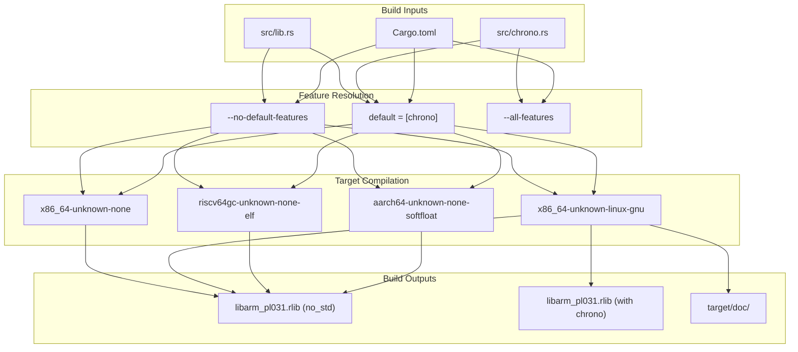
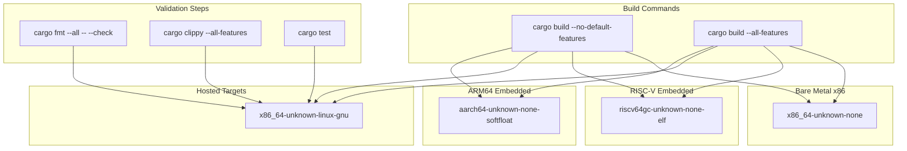
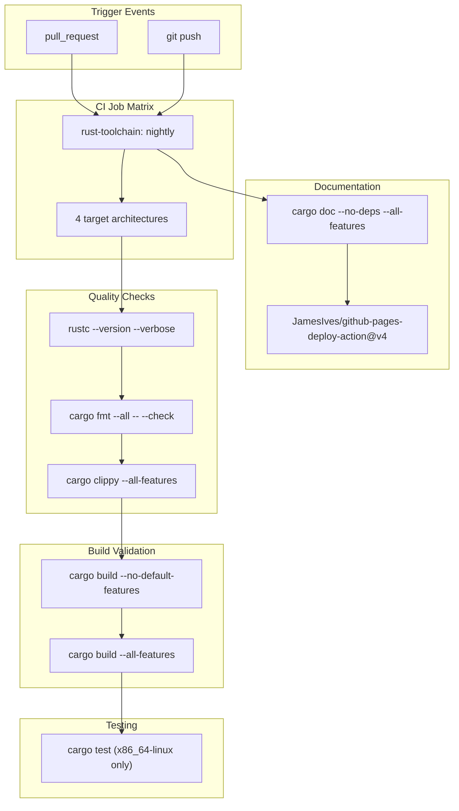
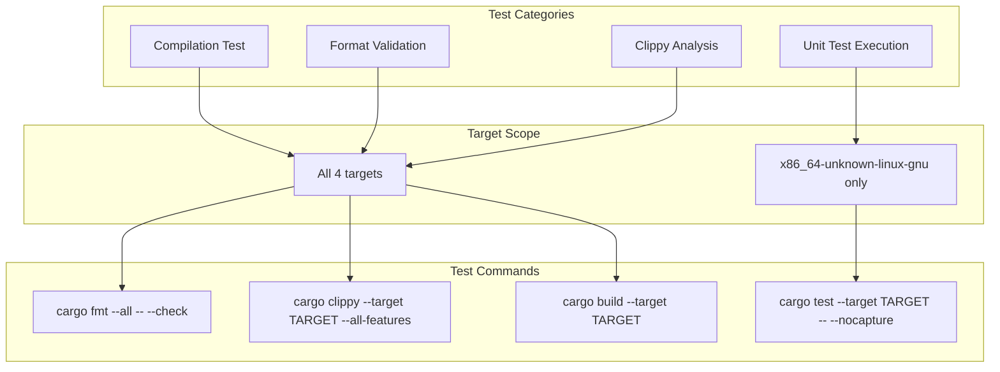
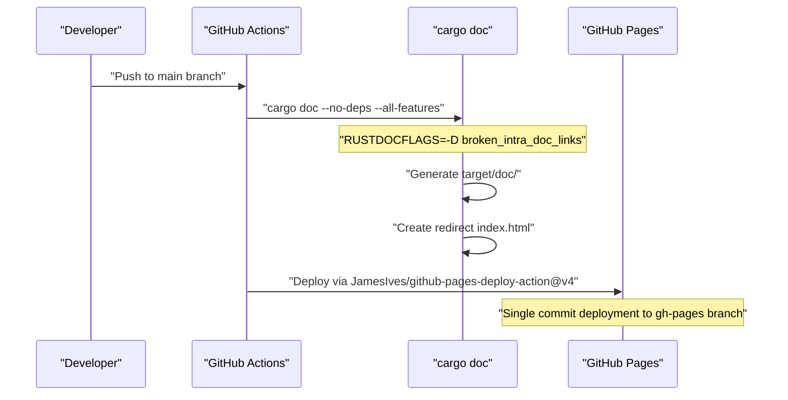

# Building and Testing

> **Relevant source files**
> * [.github/workflows/ci.yml](https://github.com/arceos-org/arm_pl031/blob/8cc6761d/.github/workflows/ci.yml)
> * [Cargo.toml](https://github.com/arceos-org/arm_pl031/blob/8cc6761d/Cargo.toml)

This section covers the build process, multi-target support, continuous integration pipeline, and testing procedures for the `arm_pl031` crate. It provides developers with comprehensive information about how to build the crate for different target architectures, understand the automated testing infrastructure, and contribute to the project with confidence.

For information about setting up the development environment and contribution guidelines, see [Development Environment](/arceos-org/arm_pl031/5.3-development-environment). For details about the crate's API evolution and versioning, see [API Evolution and Changelog](/arceos-org/arm_pl031/5.2-api-evolution-and-changelog).

## Build System Overview

The `arm_pl031` crate uses Cargo as its primary build system and is configured for cross-platform compilation with `no_std` compatibility. The crate supports both embedded and hosted environments through careful dependency management and feature flags.

### Build Configuration

The build configuration is defined in [`Cargo.toml(L1 - L20)&emsp;](https://github.com/arceos-org/arm_pl031/blob/8cc6761d/`Cargo.toml#L1-L20) and emphasizes embedded-first design:

|Configuration|Value|Purpose|
| --- | --- | --- |
|Edition|2021|Modern Rust features and patterns|
|Categories|os,hardware-support,no-std|Embedded systems focus|
|Default Features|chrono|DateTime support enabled by default|
|Optional Dependencies|chrono = "0.4.38"|DateTime integration without std|



**Build System Architecture**

Sources: [`Cargo.toml(L1 - L20)&emsp;](https://github.com/arceos-org/arm_pl031/blob/8cc6761d/`Cargo.toml#L1-L20)

## Multi-Target Support

The crate is designed to work across multiple target architectures, with particular emphasis on embedded `no_std` environments. The CI system validates compatibility across four primary target configurations.

### Supported Target Architectures



**Multi-Target Build Matrix**

|Target|Purpose|Features Tested|Test Execution|
| --- | --- | --- | --- |
|x86_64-unknown-linux-gnu|Hosted development|All features, unit tests|Full test suite|
|x86_64-unknown-none|Bare metal x86|Core functionality|Build verification|
|riscv64gc-unknown-none-elf|RISC-V embedded|Core functionality|Build verification|
|aarch64-unknown-none-softfloat|ARM64 embedded|Core functionality|Build verification|

Sources: [`.github/workflows/ci.yml(L12)&emsp;](https://github.com/arceos-org/arm_pl031/blob/8cc6761d/`.github/workflows/ci.yml#L12-L12) [`.github/workflows/ci.yml(L25 - L29)&emsp;](https://github.com/arceos-org/arm_pl031/blob/8cc6761d/`.github/workflows/ci.yml#L25-L29)

## Continuous Integration Pipeline

The CI pipeline is implemented using GitHub Actions and provides comprehensive validation across multiple dimensions: code quality, build compatibility, and documentation generation.

### CI Workflow Structure



**GitHub Actions CI Pipeline**

### Toolchain and Components

The CI system uses Rust nightly toolchain with specific components required for comprehensive validation:

|Component|Purpose|Usage|
| --- | --- | --- |
|rust-src|Source code for cross-compilation|Required forno_stdtargets|
|clippy|Lint analysis|Code quality enforcement|
|rustfmt|Code formatting|Style consistency|
|nightlytoolchain|Latest Rust features|Embedded development support|

Sources: [`.github/workflows/ci.yml(L17 - L19)&emsp;](https://github.com/arceos-org/arm_pl031/blob/8cc6761d/`.github/workflows/ci.yml#L17-L19)

## Testing Strategy

The testing approach balances comprehensive validation with practical constraints of embedded development, where some targets cannot execute tests directly.

### Test Execution Matrix



**Testing Architecture by Target**

### Quality Assurance Steps

The CI pipeline enforces multiple quality gates to ensure code reliability and maintainability:

1. **Code Formatting**: Enforced via [`cargo fmt --all -- --check`](https://github.com/arceos-org/arm_pl031/blob/8cc6761d/`cargo fmt --all -- --check`)
2. **Lint Analysis**: Comprehensive clippy checks with [`-A clippy](https://github.com/arceos-org/arm_pl031/blob/8cc6761d/`-A clippy#LNaN-LNaN) exception
3. **Build Verification**: Both minimal and full feature builds for each target
4. **Unit Testing**: Executed only on `x86_64-unknown-linux-gnu` with [`--nocapture`](https://github.com/arceos-org/arm_pl031/blob/8cc6761d/`--nocapture`) for detailed output

Sources: [`.github/workflows/ci.yml(L22 - L32)&emsp;](https://github.com/arceos-org/arm_pl031/blob/8cc6761d/`.github/workflows/ci.yml#L22-L32)

## Documentation Building and Deployment

The documentation system automatically generates and deploys API documentation to GitHub Pages, ensuring developers always have access to current documentation.

### Documentation Pipeline



**Documentation Deployment Workflow**

### Documentation Configuration

The documentation build process includes several quality controls:

|Setting|Value|Purpose|
| --- | --- | --- |
|RUSTDOCFLAGS|-D rustdoc::broken_intra_doc_links -D missing-docs|Enforce documentation completeness|
|--no-deps|Skip dependency docs|Focus on crate-specific documentation|
|--all-features|Include all features|Document complete API surface|
|single-commit|True|Clean deployment history|

The system automatically generates a redirect index page using the crate name extracted from [`cargo tree`](https://github.com/arceos-org/arm_pl031/blob/8cc6761d/`cargo tree`) ensuring seamless navigation to the main documentation.

Sources: [`.github/workflows/ci.yml(L34 - L58)&emsp;](https://github.com/arceos-org/arm_pl031/blob/8cc6761d/`.github/workflows/ci.yml#L34-L58) [`.github/workflows/ci.yml(L42)&emsp;](https://github.com/arceos-org/arm_pl031/blob/8cc6761d/`.github/workflows/ci.yml#L42-L42) [`.github/workflows/ci.yml(L48 - L50)&emsp;](https://github.com/arceos-org/arm_pl031/blob/8cc6761d/`.github/workflows/ci.yml#L48-L50)

## Build Commands Reference

For local development and testing, the following commands replicate the CI environment:

### Basic Build Commands

```markdown
# Minimal build (no chrono feature)
cargo build --no-default-features

# Full build (all features)
cargo build --all-features

# Target-specific build
cargo build --target aarch64-unknown-none-softfloat
```

### Quality Assurance Commands

```markdown
# Format check
cargo fmt --all -- --check

# Lint analysis
cargo clippy --all-features -- -A clippy::new_without_default

# Unit tests
cargo test -- --nocapture
```

### Documentation Commands

```markdown
# Generate documentation
cargo doc --no-deps --all-features

# Open documentation locally
cargo doc --no-deps --all-features --open
```

Sources: [`.github/workflows/ci.yml(L23 - L32)&emsp;](https://github.com/arceos-org/arm_pl031/blob/8cc6761d/`.github/workflows/ci.yml#L23-L32) [`.github/workflows/ci.yml(L49)&emsp;](https://github.com/arceos-org/arm_pl031/blob/8cc6761d/`.github/workflows/ci.yml#L49-L49)