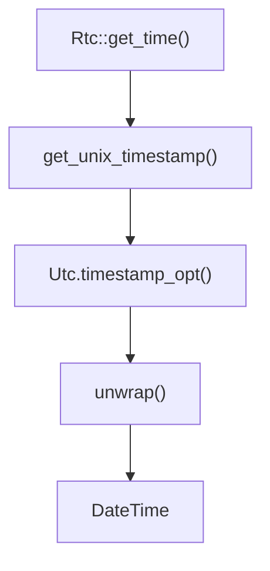
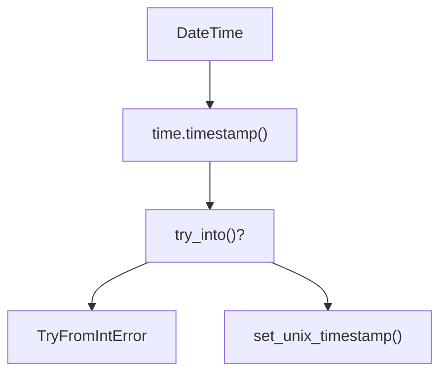
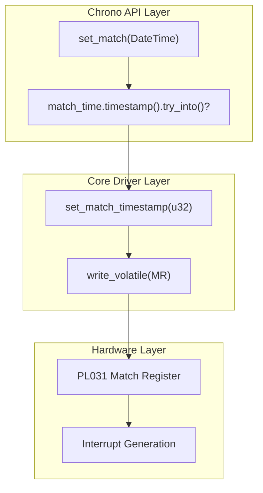
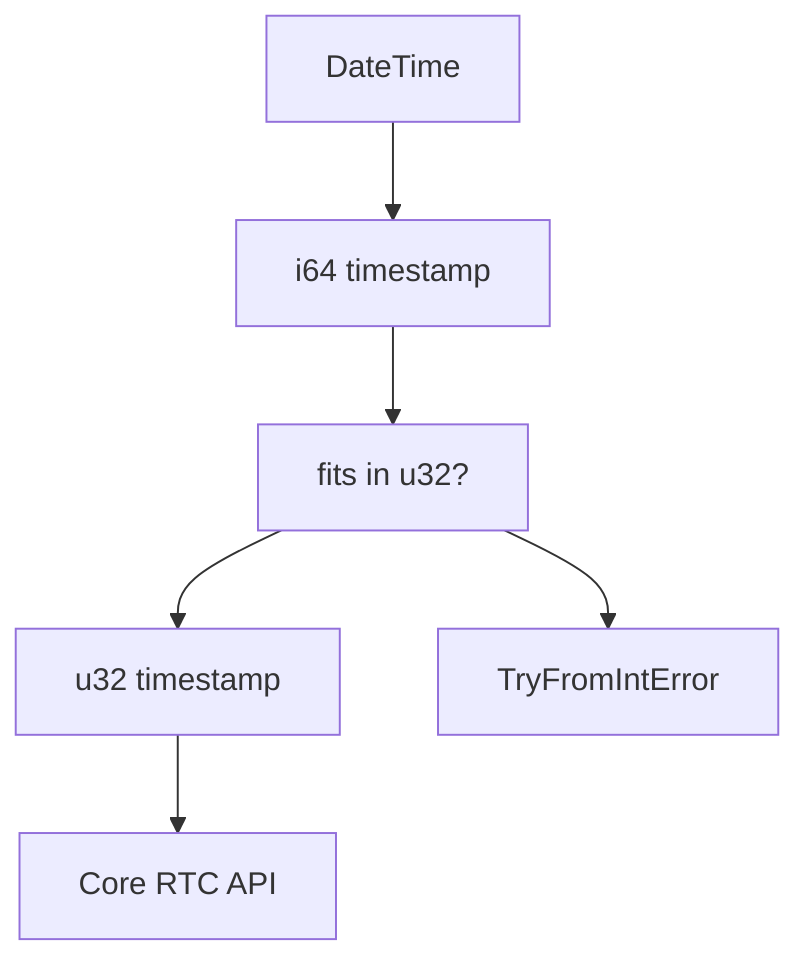
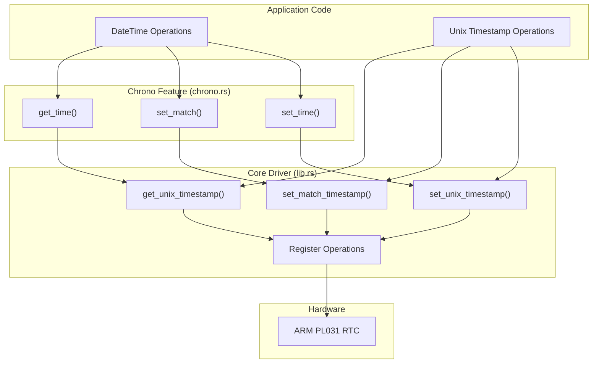

# Chrono Integration

> **Relevant source files**
> * [src/chrono.rs](https://github.com/arceos-org/arm_pl031/blob/8cc6761d/src/chrono.rs)

This document covers the optional `chrono` feature integration that provides high-level DateTime operations for the ARM PL031 RTC driver. This feature extends the core Unix timestamp API with convenient date and time handling using the `chrono` crate.

For information about the core driver functionality and Unix timestamp operations, see [Core Driver Implementation](/arceos-org/arm_pl031/3-core-driver-implementation). For details about enabling and configuring the chrono feature, see [Feature Configuration](/arceos-org/arm_pl031/4.2-feature-configuration).

## Purpose and Scope

The chrono integration provides a type-safe, ergonomic API layer over the core RTC driver by converting between Unix timestamps and `DateTime<Utc>` objects. This feature is enabled by default but can be disabled for minimal deployments that only need raw timestamp operations.

The integration handles timezone considerations by standardizing on UTC, performs bounds checking for timestamp conversions, and maintains the same interrupt and match functionality as the core API while operating on DateTime objects.

## API Overview

The chrono integration extends the `Rtc` struct with three additional methods that mirror the core timestamp operations but operate on `DateTime<Utc>` types.

### DateTime Operations

|Method|Core Equivalent|Purpose|
| --- | --- | --- |
|get_time()|get_unix_timestamp()|Read current time as DateTime|
|set_time()|set_unix_timestamp()|Set current time from DateTime|
|set_match()|set_match_timestamp()|Set match time for interrupts|

## Method Implementation Details

### Time Reading

The `get_time()` method provides a safe conversion from the hardware's 32-bit Unix timestamp to a proper DateTime object:

**Chrono DateTime Conversion Flow**

The conversion uses `chrono::Utc::timestamp_opt()` with nanoseconds set to 0, since the PL031 hardware only provides second-level precision. The `unwrap()` is safe because valid PL031 timestamps always fall within chrono's supported range.

Sources: [src/chrono.rs(L6 - L10)&emsp;](https://github.com/arceos-org/arm_pl031/blob/8cc6761d/src/chrono.rs#L6-L10)

### Time Setting

The `set_time()` method handles the reverse conversion with proper error handling for out-of-bounds timestamps:

**DateTime to Timestamp Conversion with Error Handling**

The method returns `Result<(), TryFromIntError>` to handle cases where the DateTime represents a time outside the PL031's supported range (Unix timestamps that don't fit in 32 bits).

Sources: [src/chrono.rs(L12 - L18)&emsp;](https://github.com/arceos-org/arm_pl031/blob/8cc6761d/src/chrono.rs#L12-L18)

### Match Register Integration

The `set_match()` method extends the interrupt functionality to work with DateTime objects:

**Match Register DateTime Integration**

This allows applications to schedule interrupts using natural DateTime objects rather than calculating Unix timestamps manually.

Sources: [src/chrono.rs(L20 - L26)&emsp;](https://github.com/arceos-org/arm_pl031/blob/8cc6761d/src/chrono.rs#L20-L26)

## Error Handling and Type Safety

### Conversion Error Types

The chrono integration uses `TryFromIntError` to handle timestamp conversion failures. This occurs when attempting to convert a `DateTime` that represents a time outside the range of a 32-bit Unix timestamp (before 1970 or after 2106).

**Timestamp Range Validation**

Applications should handle these errors appropriately, either by validating DateTime inputs or providing fallback behavior for out-of-range times.

### UTC Timezone Handling

The integration standardizes on UTC timezone to avoid complex timezone conversion logic in embedded systems. This ensures consistent behavior across different deployment environments and simplifies the API surface.

Sources: [src/chrono.rs(L1 - L3)&emsp;](https://github.com/arceos-org/arm_pl031/blob/8cc6761d/src/chrono.rs#L1-L3)

## Integration with Core Functionality

The chrono methods are thin wrappers around the core driver functionality, maintaining the same safety properties and hardware access patterns while providing a more convenient interface.

**Chrono Integration Architecture**

This design allows applications to choose the appropriate abstraction level: high-level DateTime operations for convenience, or low-level timestamp operations for performance-critical code.

Sources: [src/chrono.rs(L1 - L27)&emsp;](https://github.com/arceos-org/arm_pl031/blob/8cc6761d/src/chrono.rs#L1-L27)