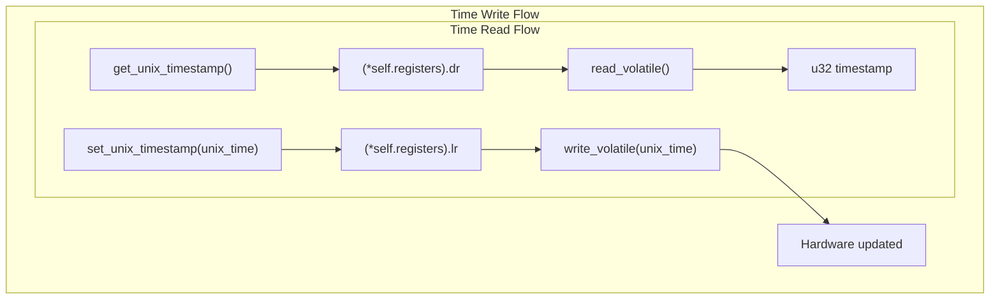

# Core Driver Implementation

> **Relevant source files**
> * [CHANGELOG.md](https://github.com/arceos-org/arm_pl031/blob/8cc6761d/CHANGELOG.md)
> * [src/lib.rs](https://github.com/arceos-org/arm_pl031/blob/8cc6761d/src/lib.rs)

This document provides a detailed technical analysis of the core ARM PL031 RTC driver implementation. It covers the internal structure of the `Rtc` driver, register layout, hardware interface patterns, and safety mechanisms. This focuses specifically on the implementation details found in the main driver code.

For basic usage examples and integration guidance, see [Basic Usage and Examples](/arceos-org/arm_pl031/2.2-basic-usage-and-examples). For information about optional features like chrono integration, see [Chrono Integration](/arceos-org/arm_pl031/4.1-chrono-integration).

## Driver Structure and Core Components

The core driver implementation centers around two primary structures that provide the foundation for all RTC operations.

### Core Driver Architecture

```

```

The `Rtc` struct [src/lib.rs(L42 - L44)&emsp;](https://github.com/arceos-org/arm_pl031/blob/8cc6761d/src/lib.rs#L42-L44) serves as the primary driver interface, containing a single field that points to the memory-mapped register layout. The `Registers` struct [src/lib.rs(L15 - L39)&emsp;](https://github.com/arceos-org/arm_pl031/blob/8cc6761d/src/lib.rs#L15-L39) defines the exact memory layout of the PL031 hardware registers with proper alignment and padding.

**Sources:** [src/lib.rs(L15 - L44)&emsp;](https://github.com/arceos-org/arm_pl031/blob/8cc6761d/src/lib.rs#L15-L44)

## Register Layout and Hardware Interface

The driver implements a direct mapping to the ARM PL031 hardware registers through a carefully structured memory layout.

### PL031 Register Mapping

|Register|Type|Offset|Purpose|
| --- | --- | --- | --- |
|dr|u32|0x00|Data Register - current RTC value|
|mr|u32|0x04|Match Register - alarm comparison value|
|lr|u32|0x08|Load Register - sets RTC value|
|cr|u8|0x0C|Control Register - enables RTC|
|imsc|u8|0x10|Interrupt Mask Set/Clear|
|ris|u8|0x14|Raw Interrupt Status|
|mis|u8|0x18|Masked Interrupt Status|
|icr|u8|0x1C|Interrupt Clear Register|

The `Registers` struct uses `#[repr(C, align(4))]` [src/lib.rs(L16)&emsp;](https://github.com/arceos-org/arm_pl031/blob/8cc6761d/src/lib.rs#L16-L16) to ensure proper memory alignment and layout compatibility with the hardware. Reserved padding fields like `_reserved0: [u8; 3]` [src/lib.rs(L26)&emsp;](https://github.com/arceos-org/arm_pl031/blob/8cc6761d/src/lib.rs#L26-L26) maintain correct register spacing.

### MMIO Access Patterns

All hardware access follows a consistent volatile read/write pattern:

```

```

The driver uses `addr_of!` and `addr_of_mut!` macros [src/lib.rs(L66)&emsp;](https://github.com/arceos-org/arm_pl031/blob/8cc6761d/src/lib.rs#L66-L66) [src/lib.rs(L73)&emsp;](https://github.com/arceos-org/arm_pl031/blob/8cc6761d/src/lib.rs#L73-L73) to create pointers to specific register fields, followed by volatile operations to ensure proper hardware communication without compiler optimizations.

**Sources:** [src/lib.rs(L15 - L39)&emsp;](https://github.com/arceos-org/arm_pl031/blob/8cc6761d/src/lib.rs#L15-L39) [src/lib.rs(L63 - L74)&emsp;](https://github.com/arceos-org/arm_pl031/blob/8cc6761d/src/lib.rs#L63-L74)

## Core Time Operations

The driver provides fundamental time management through Unix timestamp operations, implementing both read and write access to the RTC hardware.

### Time Reading and Writing

The `get_unix_timestamp()` method [src/lib.rs(L63 - L67)&emsp;](https://github.com/arceos-org/arm_pl031/blob/8cc6761d/src/lib.rs#L63-L67) reads the current RTC value from the Data Register (`dr`), while `set_unix_timestamp()` [src/lib.rs(L70 - L74)&emsp;](https://github.com/arceos-org/arm_pl031/blob/8cc6761d/src/lib.rs#L70-L74) writes to the Load Register (`lr`) to update the RTC time.



Both operations use 32-bit unsigned integers, matching the hardware register width. The choice of `u32` over `u64` was made in version 0.2.0 [CHANGELOG.md(L14 - L15)&emsp;](https://github.com/arceos-org/arm_pl031/blob/8cc6761d/CHANGELOG.md#L14-L15) to align with the actual hardware capabilities.

**Sources:** [src/lib.rs(L63 - L74)&emsp;](https://github.com/arceos-org/arm_pl031/blob/8cc6761d/src/lib.rs#L63-L74) [CHANGELOG.md(L14 - L15)&emsp;](https://github.com/arceos-org/arm_pl031/blob/8cc6761d/CHANGELOG.md#L14-L15)

## Interrupt Management System

The driver implements a comprehensive interrupt management system using the PL031's match register functionality and interrupt control registers.

### Interrupt Control Flow

```

```

### Interrupt Methods

|Method|Register|Purpose|
| --- | --- | --- |
|set_match_timestamp()src/lib.rs78-82|mr|Configure alarm time|
|enable_interrupt()src/lib.rs108-113|imsc|Enable/disable interrupts|
|matched()src/lib.rs86-91|ris|Check if match occurred|
|interrupt_pending()src/lib.rs97-102|mis|Check if interrupt is pending|
|clear_interrupt()src/lib.rs116-120|icr|Clear pending interrupt|

The interrupt system operates by comparing the RTC value against the match register. When they match, the Raw Interrupt Status (`ris`) bit is set [src/lib.rs(L89 - L90)&emsp;](https://github.com/arceos-org/arm_pl031/blob/8cc6761d/src/lib.rs#L89-L90) If interrupts are enabled via the Interrupt Mask (`imsc`), the Masked Interrupt Status (`mis`) will also be set [src/lib.rs(L100 - L101)&emsp;](https://github.com/arceos-org/arm_pl031/blob/8cc6761d/src/lib.rs#L100-L101)

**Sources:** [src/lib.rs(L78 - L120)&emsp;](https://github.com/arceos-org/arm_pl031/blob/8cc6761d/src/lib.rs#L78-L120)

## Memory Safety and Concurrency Model

The driver implements a carefully designed safety model that provides safe abstractions over unsafe hardware operations while supporting concurrent access.

### Safety Boundaries

```

```

### Constructor Safety Requirements

The `new()` constructor [src/lib.rs(L56 - L60)&emsp;](https://github.com/arceos-org/arm_pl031/blob/8cc6761d/src/lib.rs#L56-L60) is marked `unsafe` and requires several safety guarantees:

* Base address must point to valid PL031 MMIO registers
* Memory must be mapped as device memory without aliases
* Address must be aligned to 4-byte boundary
* Caller must ensure exclusive access during construction

### Thread Safety Implementation

The driver implements `Send` [src/lib.rs(L124)&emsp;](https://github.com/arceos-org/arm_pl031/blob/8cc6761d/src/lib.rs#L124-L124) and `Sync` [src/lib.rs(L128)&emsp;](https://github.com/arceos-org/arm_pl031/blob/8cc6761d/src/lib.rs#L128-L128) traits with careful safety reasoning:

* **Send**: The `Rtc` struct contains only a pointer to device memory, which can be safely transferred between threads
* **Sync**: Shared references (`&Rtc`) only allow reading device registers, which is safe for concurrent access

The `set_unix_timestamp()` method requires `&mut self` [src/lib.rs(L70)&emsp;](https://github.com/arceos-org/arm_pl031/blob/8cc6761d/src/lib.rs#L70-L70) because it performs write operations, ensuring exclusive access for modifications while allowing concurrent reads.

**Sources:** [src/lib.rs(L47 - L60)&emsp;](https://github.com/arceos-org/arm_pl031/blob/8cc6761d/src/lib.rs#L47-L60) [src/lib.rs(L124 - L128)&emsp;](https://github.com/arceos-org/arm_pl031/blob/8cc6761d/src/lib.rs#L124-L128) [CHANGELOG.md(L16 - L17)&emsp;](https://github.com/arceos-org/arm_pl031/blob/8cc6761d/CHANGELOG.md#L16-L17) [CHANGELOG.md(L21)&emsp;](https://github.com/arceos-org/arm_pl031/blob/8cc6761d/CHANGELOG.md#L21-L21)