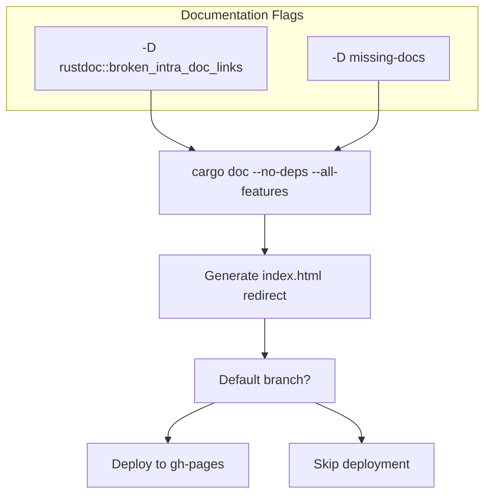

# Development Environment

> **Relevant source files**
> * [.github/workflows/ci.yml](https://github.com/arceos-org/arm_pl031/blob/8cc6761d/.github/workflows/ci.yml)
> * [.gitignore](https://github.com/arceos-org/arm_pl031/blob/8cc6761d/.gitignore)

This page provides comprehensive setup instructions for developing and contributing to the `arm_pl031` crate. It covers toolchain requirements, development tools configuration, build procedures, and the continuous integration pipeline that ensures code quality across multiple target architectures.

For information about the project's build system and testing procedures in production, see [Building and Testing](/arceos-org/arm_pl031/5.1-building-and-testing). For details about project structure and API design, see [Core Driver Implementation](/arceos-org/arm_pl031/3-core-driver-implementation).

## Prerequisites and Toolchain

The `arm_pl031` crate requires specific Rust toolchain configurations to support its embedded and cross-platform nature. The project is built exclusively with Rust nightly to access unstable features required for embedded development.

### Required Rust Toolchain

The development environment requires Rust nightly with specific components:

|Component|Purpose|
| --- | --- |
|rust-src|Required for building core library and no_std targets|
|clippy|Linting and code analysis|
|rustfmt|Code formatting enforcement|

### Supported Target Architectures

The crate supports multiple target architectures for cross-compilation:

|Target|Architecture|Environment|
| --- | --- | --- |
|x86_64-unknown-linux-gnu|x86_64|Hosted Linux environment|
|x86_64-unknown-none|x86_64|Bare metal no_std|
|riscv64gc-unknown-none-elf|RISC-V 64-bit|Embedded no_std|
|aarch64-unknown-none-softfloat|ARM64|Embedded no_std with soft float|

**Development Environment Setup**


Sources: [.github/workflows/ci.yml(L11 - L19)&emsp;](https://github.com/arceos-org/arm_pl031/blob/8cc6761d/.github/workflows/ci.yml#L11-L19)

## Development Tooling and Code Quality

The project enforces strict code quality standards through automated tooling integrated into the development workflow.

### Code Formatting

Code formatting is enforced using `rustfmt` with project-specific configuration. All code must pass formatting checks before merge.

**Formatting Workflow:**

* Local development: `cargo fmt --all`
* CI enforcement: `cargo fmt --all -- --check`

### Linting and Static Analysis

The project uses `clippy` for comprehensive linting with custom rule configuration:

**Clippy Configuration:**

* Runs on all target architectures
* Uses `--all-features` flag for complete analysis
* Suppresses `clippy::new_without_default` warnings
* Command: `cargo clippy --target <target> --all-features -- -A clippy::new_without_default`

**CI Quality Gates**


Sources: [.github/workflows/ci.yml(L22 - L32)&emsp;](https://github.com/arceos-org/arm_pl031/blob/8cc6761d/.github/workflows/ci.yml#L22-L32)

## Build System and Testing

The build system supports multiple feature configurations and target architectures with comprehensive testing on hosted platforms.

### Build Configurations

The project supports two primary build configurations:

|Configuration|Command|Purpose|
| --- | --- | --- |
|Minimal|cargo build --no-default-features|Core functionality only|
|Full|cargo build --all-features|All features including chrono integration|

### Testing Framework

Unit tests run exclusively on the `x86_64-unknown-linux-gnu` target due to hosted environment requirements:

**Test Execution:**

* Target: `x86_64-unknown-linux-gnu` only
* Command: `cargo test --target x86_64-unknown-linux-gnu -- --nocapture`
* Output: Verbose test output with `--nocapture` flag

**Cross-Compilation Verification**


Sources: [.github/workflows/ci.yml(L8 - L12)&emsp;](https://github.com/arceos-org/arm_pl031/blob/8cc6761d/.github/workflows/ci.yml#L8-L12) [.github/workflows/ci.yml(L26 - L32)&emsp;](https://github.com/arceos-org/arm_pl031/blob/8cc6761d/.github/workflows/ci.yml#L26-L32)

## Documentation Generation

The project maintains comprehensive documentation with automated generation and deployment to GitHub Pages.

### Documentation Build Process

Documentation generation includes:

* API documentation: `cargo doc --no-deps --all-features`
* Intra-doc link validation: `-D rustdoc::broken_intra_doc_links`
* Missing documentation detection: `-D missing-docs`
* Automatic index page generation for navigation

### Documentation Deployment

**GitHub Pages Integration:**

* Automatic deployment from default branch
* Single-commit deployment strategy
* Target branch: `gh-pages`
* Deploy action: `JamesIves/github-pages-deploy-action@v4`

**Documentation Pipeline**



Sources: [.github/workflows/ci.yml(L34 - L57)&emsp;](https://github.com/arceos-org/arm_pl031/blob/8cc6761d/.github/workflows/ci.yml#L34-L57) [.github/workflows/ci.yml(L42)&emsp;](https://github.com/arceos-org/arm_pl031/blob/8cc6761d/.github/workflows/ci.yml#L42-L42)

## Continuous Integration Pipeline

The CI system ensures code quality and compatibility across all supported platforms through comprehensive automated testing.

### Pipeline Architecture

The CI pipeline consists of two primary jobs:

|Job|Purpose|Trigger|
| --- | --- | --- |
|ci|Code quality, building, testing|Push, Pull Request|
|doc|Documentation generation and deployment|Push, Pull Request|

### Matrix Strategy

The CI uses a matrix build strategy for comprehensive testing:

**Matrix Configuration:**

* Rust toolchain: `nightly` (only)
* Fail-fast: `false` (continue testing other targets on failure)
* Parallel execution across all target architectures

**CI Architecture Flow**


Sources: [.github/workflows/ci.yml(L1 - L33)&emsp;](https://github.com/arceos-org/arm_pl031/blob/8cc6761d/.github/workflows/ci.yml#L1-L33) [.github/workflows/ci.yml(L34 - L57)&emsp;](https://github.com/arceos-org/arm_pl031/blob/8cc6761d/.github/workflows/ci.yml#L34-L57)

## Contribution Workflow

### Local Development Setup

1. **Install Rust Nightly:**

```
rustup toolchain install nightly
rustup default nightly
```
2. **Add Required Components:**

```
rustup component add rust-src clippy rustfmt
```
3. **Install Target Architectures:**

```
rustup target add x86_64-unknown-linux-gnu
rustup target add x86_64-unknown-none
rustup target add riscv64gc-unknown-none-elf
rustup target add aarch64-unknown-none-softfloat
```

### Pre-commit Checklist

Before submitting contributions, ensure all quality gates pass:

|Check|Command|Requirement|
| --- | --- | --- |
|Format|cargo fmt --all -- --check|Must pass|
|Lint|cargo clippy --all-features|Must pass|
|Build (minimal)|cargo build --no-default-features|All targets|
|Build (full)|cargo build --all-features|All targets|
|Test|cargo test|Must pass on linux-gnu|

### Git Configuration

The project excludes standard development artifacts:

**Ignored Files:**

* `/target` - Rust build artifacts
* `/.vscode` - VS Code configuration
* `.DS_Store` - macOS system files
* `Cargo.lock` - Dependency lock file (excluded for libraries)

Sources: [.gitignore(L1 - L4)&emsp;](https://github.com/arceos-org/arm_pl031/blob/8cc6761d/.gitignore#L1-L4)