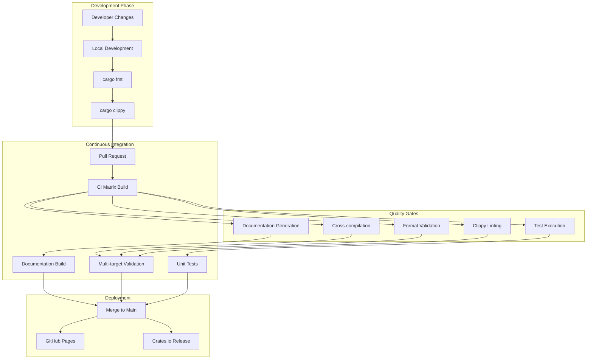
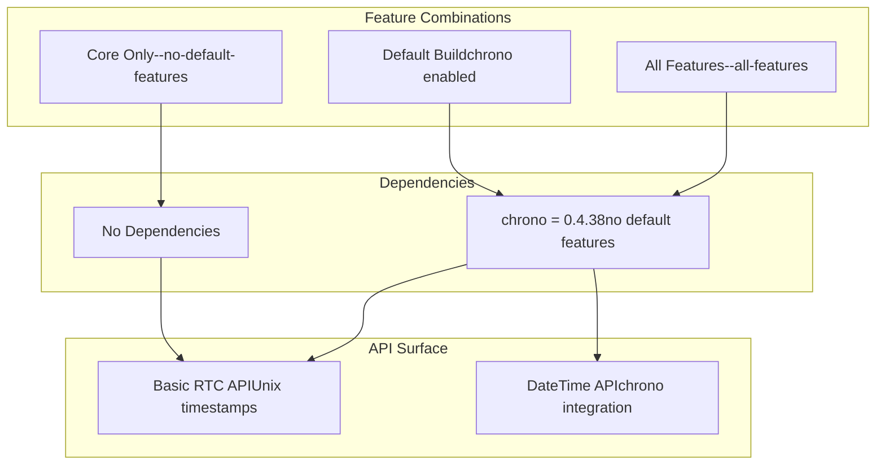
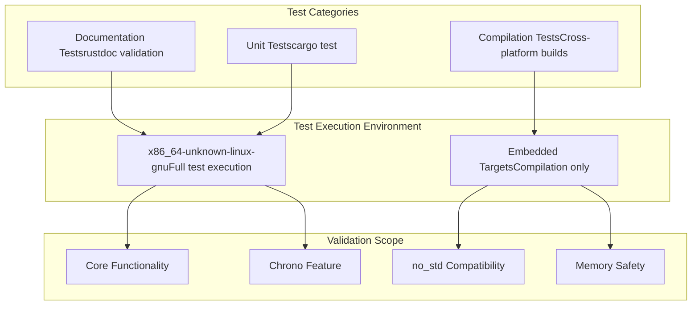
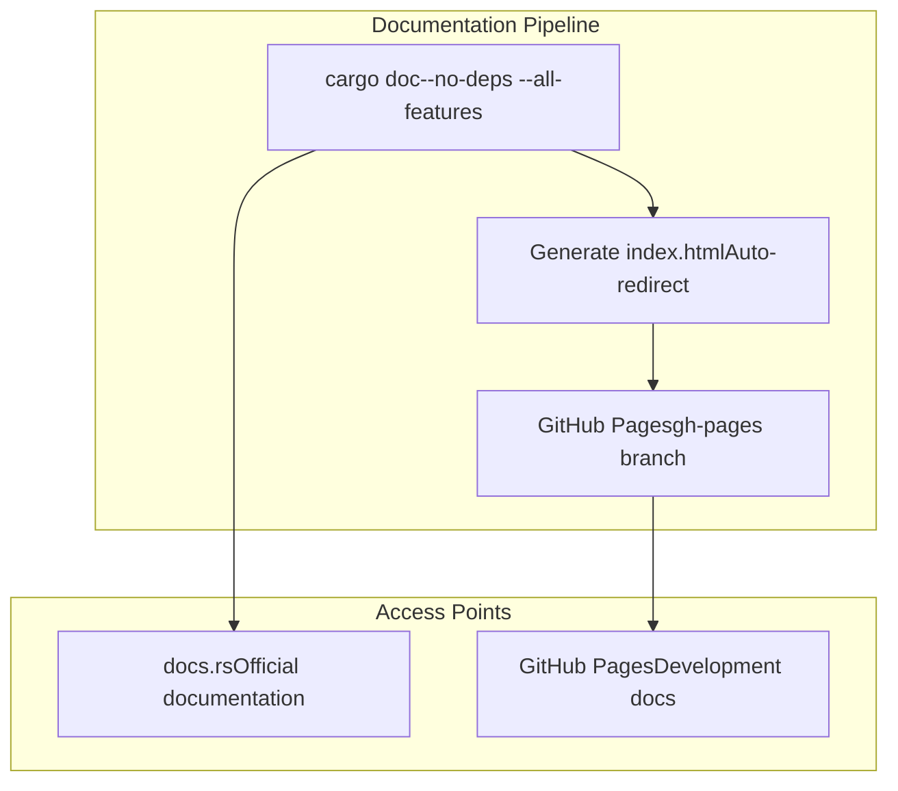
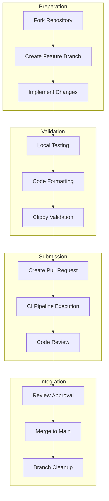

# Development and Contributing

> **Relevant source files**
> * [.github/workflows/ci.yml](https://github.com/arceos-org/arm_pl031/blob/8cc6761d/.github/workflows/ci.yml)
> * [CHANGELOG.md](https://github.com/arceos-org/arm_pl031/blob/8cc6761d/CHANGELOG.md)
> * [Cargo.toml](https://github.com/arceos-org/arm_pl031/blob/8cc6761d/Cargo.toml)

This page provides comprehensive information for developers who want to build, test, modify, or contribute to the arm_pl031 crate. It covers the development workflow, build system, testing procedures, and contribution guidelines.

For information about using the driver in your applications, see [Getting Started](/arceos-org/arm_pl031/2-getting-started). For details about the crate's API and functionality, see [Core Driver Implementation](/arceos-org/arm_pl031/3-core-driver-implementation) and [Features and Extensions](/arceos-org/arm_pl031/4-features-and-extensions).

## Development Workflow Overview

The arm_pl031 project follows a standard Rust development workflow with automated quality assurance through GitHub Actions. The development process emphasizes cross-platform compatibility, code quality, and comprehensive testing.

### Development Pipeline Architecture



Sources: [.github/workflows/ci.yml(L1 - L58)&emsp;](https://github.com/arceos-org/arm_pl031/blob/8cc6761d/.github/workflows/ci.yml#L1-L58)

## Build System and Target Support

The project supports multiple architectures and build configurations to ensure compatibility across different embedded and hosted environments.

### Supported Build Targets

|Target|Architecture|Environment|Primary Use Case|
| --- | --- | --- | --- |
|x86_64-unknown-linux-gnu|x86_64|Linux hosted|Development, testing|
|x86_64-unknown-none|x86_64|Bare metal|Testing no_std compatibility|
|riscv64gc-unknown-none-elf|RISC-V 64-bit|Bare metal|RISC-V embedded systems|
|aarch64-unknown-none-softfloat|ARM64|Bare metal|ARM64 embedded systems|

The build matrix validates all targets with both minimal and full feature sets:

```markdown
# Build with no features (core functionality only)
cargo build --target <target> --no-default-features

# Build with all features (including chrono integration)
cargo build --target <target> --all-features
```

### Feature Configuration Matrix



Sources: [Cargo.toml(L14 - L19)&emsp;](https://github.com/arceos-org/arm_pl031/blob/8cc6761d/Cargo.toml#L14-L19) [.github/workflows/ci.yml(L26 - L29)&emsp;](https://github.com/arceos-org/arm_pl031/blob/8cc6761d/.github/workflows/ci.yml#L26-L29)

## Code Quality and Validation

### Automated Quality Checks

The CI pipeline enforces several quality standards that must pass before code can be merged:

1. **Code Formatting**: All code must be formatted with `rustfmt` using default settings

```
cargo fmt --all -- --check
```
2. **Linting**: Code must pass `clippy` analysis with minimal warnings

```
cargo clippy --target <target> --all-features -- -A clippy::new_without_default
```
3. **Cross-compilation**: Code must compile successfully on all supported targets
4. **Unit Testing**: Tests must pass on the primary development target (`x86_64-unknown-linux-gnu`)

### Testing Strategy



Sources: [.github/workflows/ci.yml(L30 - L32)&emsp;](https://github.com/arceos-org/arm_pl031/blob/8cc6761d/.github/workflows/ci.yml#L30-L32) [.github/workflows/ci.yml(L26 - L29)&emsp;](https://github.com/arceos-org/arm_pl031/blob/8cc6761d/.github/workflows/ci.yml#L26-L29)

## Documentation and API Standards

### Documentation Requirements

The project maintains strict documentation standards enforced through the CI pipeline:

* **Missing Documentation**: All public APIs must be documented (`-D missing-docs`)
* **Broken Links**: Intra-doc links must be valid (`-D rustdoc::broken_intra_doc_links`)
* **API Examples**: Public functions should include usage examples
* **Safety Documentation**: All `unsafe` functions must document their safety requirements

### Documentation Deployment

Documentation is automatically built and deployed to GitHub Pages on every push to the main branch:



Sources: [.github/workflows/ci.yml(L34 - L57)&emsp;](https://github.com/arceos-org/arm_pl031/blob/8cc6761d/.github/workflows/ci.yml#L34-L57) [.github/workflows/ci.yml(L42)&emsp;](https://github.com/arceos-org/arm_pl031/blob/8cc6761d/.github/workflows/ci.yml#L42-L42)

## Version Management and API Evolution

### Semantic Versioning Policy

The project follows semantic versioning with careful attention to API stability:

* **Patch versions** (0.2.0 → 0.2.1): Bug fixes, new features that don't break existing APIs
* **Minor versions** (0.1.x → 0.2.0): New features, may include breaking changes in pre-1.0 releases
* **Major versions** (future 1.x → 2.x): Significant breaking changes

### API Evolution History

```

```

### Breaking Changes Documentation

Major API changes are carefully documented in the changelog with migration guidance:

|Version|Breaking Change|Rationale|Migration Path|
| --- | --- | --- | --- |
|v0.2.0|get_unix_timestamp()returnsu32|Match hardware register size|Castu64tou32if needed|
|v0.2.0|Rtc::new()isunsafe|Requires valid MMIO pointer|Addunsafeblock with safety comment|
|v0.2.0|set_unix_timestamp()takes&mut self|Reflects write operation semantics|Use mutable reference|

Sources: [CHANGELOG.md(L1 - L26)&emsp;](https://github.com/arceos-org/arm_pl031/blob/8cc6761d/CHANGELOG.md#L1-L26)

## Contributing Guidelines

### Development Environment Setup

1. **Rust Toolchain**: Install nightly Rust with required components

```
rustup toolchain install nightly
rustup component add rust-src clippy rustfmt
```
2. **Target Support**: Add required compilation targets

```
rustup target add x86_64-unknown-none
rustup target add riscv64gc-unknown-none-elf
rustup target add aarch64-unknown-none-softfloat
```
3. **Development Workflow**: Follow the standard validation steps

```markdown
cargo fmt --all                    # Format code
cargo clippy --all-features        # Lint code
cargo test                         # Run tests
cargo build --no-default-features  # Test minimal build
```

### Pull Request Process



### Code Standards

* **Safety**: All `unsafe` code must be justified and documented
* **Documentation**: Public APIs require comprehensive documentation
* **Testing**: New functionality should include appropriate tests
* **Compatibility**: Changes must not break existing supported targets
* **Feature Flags**: Optional functionality should be feature-gated appropriately

Sources: [.github/workflows/ci.yml(L1 - L58)&emsp;](https://github.com/arceos-org/arm_pl031/blob/8cc6761d/.github/workflows/ci.yml#L1-L58) [Cargo.toml(L1 - L20)&emsp;](https://github.com/arceos-org/arm_pl031/blob/8cc6761d/Cargo.toml#L1-L20)