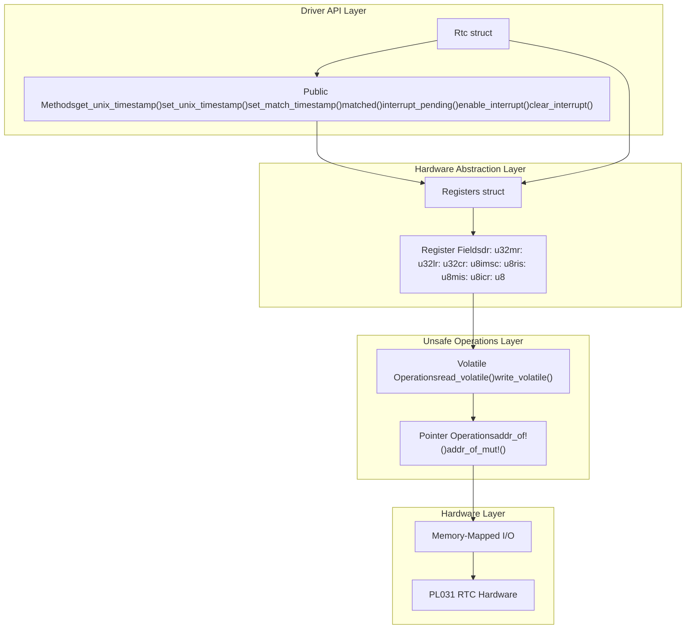
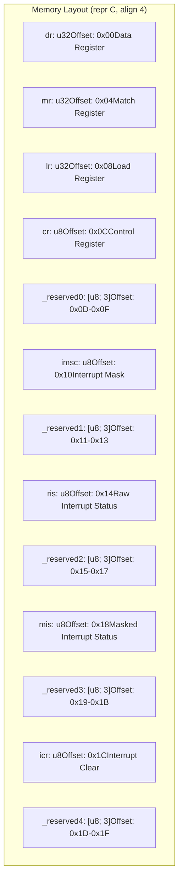
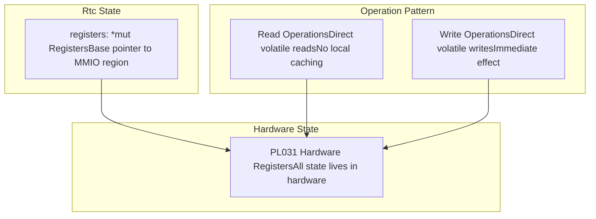
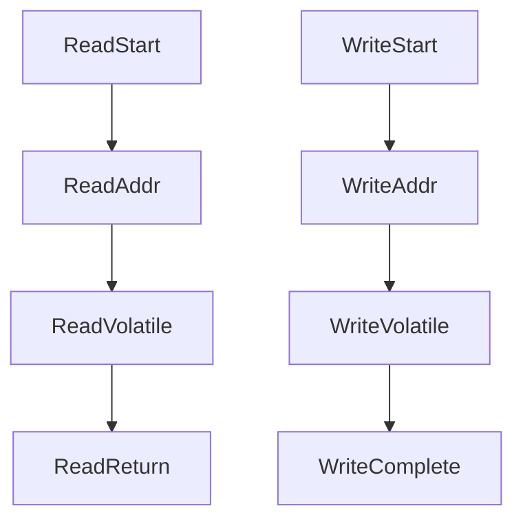
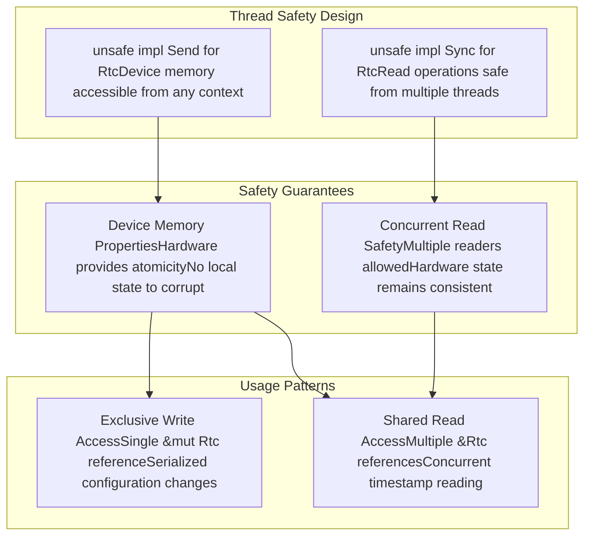

# Driver Architecture and Design

> **Relevant source files**
> * [src/lib.rs](https://github.com/arceos-org/arm_pl031/blob/8cc6761d/src/lib.rs)

This page documents the internal architecture and design principles of the `arm_pl031` RTC driver, focusing on the core `Rtc` struct, register layout, and hardware abstraction patterns. The material covers how the driver translates hardware register operations into safe Rust APIs while maintaining minimal overhead.

For hardware interface details and MMIO operations, see [Hardware Interface and MMIO](/arceos-org/arm_pl031/3.2-hardware-interface-and-mmio). For register-specific operations and meanings, see [Register Operations](/arceos-org/arm_pl031/3.3-register-operations).

## Core Driver Structure

The driver architecture centers around two primary components: the `Registers` struct that defines the hardware memory layout, and the `Rtc` struct that provides the safe API interface.

### Driver Components and Relationships

**Sources:** [src/lib.rs(L42 - L44)&emsp;](https://github.com/arceos-org/arm_pl031/blob/8cc6761d/src/lib.rs#L42-L44) [src/lib.rs(L15 - L39)&emsp;](https://github.com/arceos-org/arm_pl031/blob/8cc6761d/src/lib.rs#L15-L39) [src/lib.rs(L46 - L121)&emsp;](https://github.com/arceos-org/arm_pl031/blob/8cc6761d/src/lib.rs#L46-L121)

### Register Memory Layout

The `Registers` struct provides a direct mapping to the PL031 hardware register layout, ensuring proper alignment and padding for hardware compatibility.

**Sources:** [src/lib.rs(L15 - L39)&emsp;](https://github.com/arceos-org/arm_pl031/blob/8cc6761d/src/lib.rs#L15-L39)

## Driver Design Principles

### Safety Boundary Architecture

The driver implements a clear safety boundary where all unsafe operations are contained within method implementations, exposing only safe APIs to users.

|Component|Safety Level|Responsibility|
| --- | --- | --- |
|Rtc::new()|Unsafe|Initial pointer validation and construction|
|Public methods|Safe|High-level operations with safety guarantees|
|Volatile operations|Unsafe (internal)|Direct hardware register access|
|Pointer arithmetic|Unsafe (internal)|Register address calculation|

### State Management Design

The `Rtc` struct follows a stateless design pattern, storing only the base pointer to hardware registers without caching any hardware state.

**Sources:** [src/lib.rs(L42 - L44)&emsp;](https://github.com/arceos-org/arm_pl031/blob/8cc6761d/src/lib.rs#L42-L44) [src/lib.rs(L63 - L66)&emsp;](https://github.com/arceos-org/arm_pl031/blob/8cc6761d/src/lib.rs#L63-L66) [src/lib.rs(L70 - L73)&emsp;](https://github.com/arceos-org/arm_pl031/blob/8cc6761d/src/lib.rs#L70-L73)

## Method Organization and Patterns

### Functional Categories

The driver methods are organized into distinct functional categories, each following consistent patterns for hardware interaction.

|Category|Methods|Pattern|Register Access|
| --- | --- | --- | --- |
|Time Management|get_unix_timestamp(),set_unix_timestamp()|Read/Write DR/LR|Direct timestamp operations|
|Alarm Management|set_match_timestamp(),matched()|Write MR, Read RIS|Match register operations|
|Interrupt Management|enable_interrupt(),interrupt_pending(),clear_interrupt()|Read/Write IMSC/MIS/ICR|Interrupt control flow|

### Memory Access Pattern

All hardware access follows a consistent volatile operation pattern using `addr_of!` and `addr_of_mut!` macros for safe pointer arithmetic.

**Sources:** [src/lib.rs(L63 - L66)&emsp;](https://github.com/arceos-org/arm_pl031/blob/8cc6761d/src/lib.rs#L63-L66) [src/lib.rs(L70 - L73)&emsp;](https://github.com/arceos-org/arm_pl031/blob/8cc6761d/src/lib.rs#L70-L73) [src/lib.rs(L108 - L112)&emsp;](https://github.com/arceos-org/arm_pl031/blob/8cc6761d/src/lib.rs#L108-L112)

## Concurrency and Thread Safety

### Send and Sync Implementation

The driver implements `Send` and `Sync` traits with explicit safety documentation, enabling safe usage across thread boundaries.

**Sources:** [src/lib.rs(L123 - L128)&emsp;](https://github.com/arceos-org/arm_pl031/blob/8cc6761d/src/lib.rs#L123-L128)

## Construction and Initialization

The driver construction follows an unsafe initialization pattern that requires explicit safety contracts from the caller.

### Initialization Requirements

The `new()` method establishes the safety contract for proper driver operation:

* Base address must point to valid PL031 MMIO registers
* Memory must be mapped as device memory
* No other aliases to the memory region
* 4-byte alignment requirement

**Sources:** [src/lib.rs(L46 - L60)&emsp;](https://github.com/arceos-org/arm_pl031/blob/8cc6761d/src/lib.rs#L46-L60)