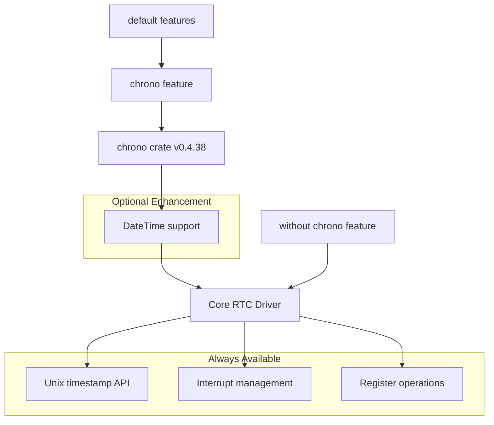
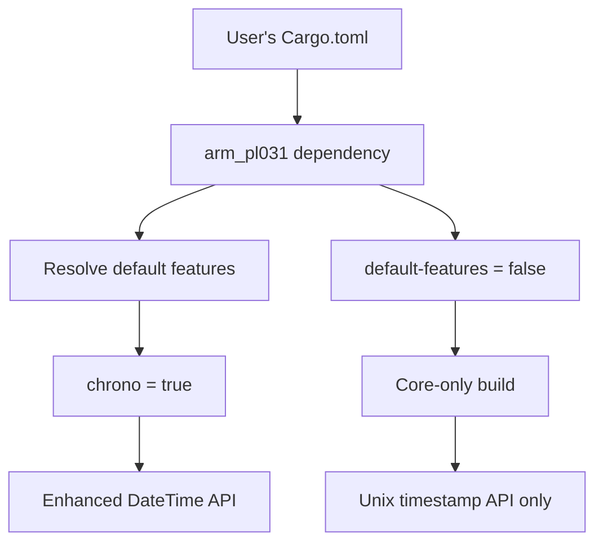
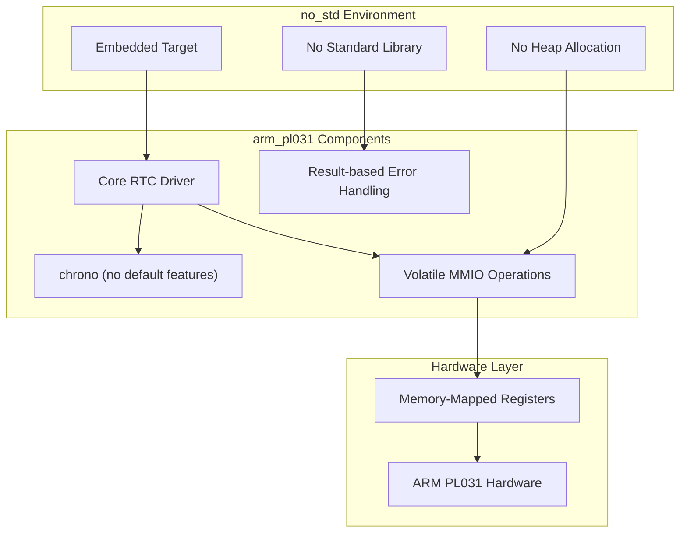
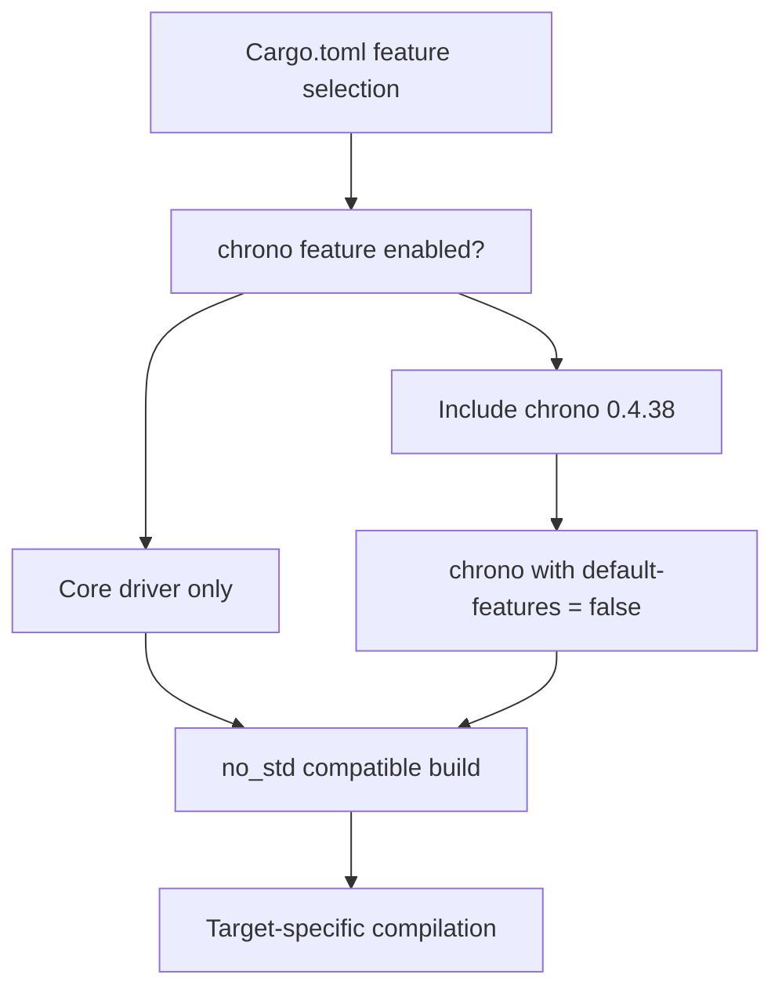

# Feature Configuration

> **Relevant source files**
> * [Cargo.toml](https://github.com/arceos-org/arm_pl031/blob/8cc6761d/Cargo.toml)

This document covers the available feature flags, `no_std` compatibility settings, and build configuration options for the `arm_pl031` crate. It explains how to customize the driver's functionality through feature selection and target-specific compilation settings.

For information about the chrono-specific functionality enabled by features, see [Chrono Integration](/arceos-org/arm_pl031/4.1-chrono-integration). For build and testing procedures across different targets, see [Building and Testing](/arceos-org/arm_pl031/5.1-building-and-testing).

## Feature Flags Overview

The `arm_pl031` crate provides a minimal set of feature flags to control optional functionality while maintaining a lightweight core driver suitable for embedded environments.

### Available Features

|Feature|Description|Default|Dependencies|
| --- | --- | --- | --- |
|chrono|Enables DateTime integration with the chrono crate|✓ Enabled|chrono = "0.4.38"|

**Feature Dependencies Diagram**



Sources: [Cargo.toml(L17 - L19)&emsp;](https://github.com/arceos-org/arm_pl031/blob/8cc6761d/Cargo.toml#L17-L19)

### Core Driver (Always Available)

The core functionality remains available regardless of feature selection:

* Unix timestamp operations via `get_unix_timestamp()` and `set_unix_timestamp()`
* Interrupt management through match registers
* Direct register access for all PL031 hardware features
* Memory-mapped I/O operations

### Chrono Feature

When the `chrono` feature is enabled (default), the driver provides additional convenience methods:

* `get_time()` returns `Result<DateTime<Utc>, chrono::ParseError>`
* `set_time()` accepts `DateTime<Utc>` parameters
* Automatic conversion between Unix timestamps and RFC 3339 formatted strings

Sources: [Cargo.toml(L15)&emsp;](https://github.com/arceos-org/arm_pl031/blob/8cc6761d/Cargo.toml#L15-L15) [Cargo.toml(L18)&emsp;](https://github.com/arceos-org/arm_pl031/blob/8cc6761d/Cargo.toml#L18-L18)

## Default Configuration

The crate ships with the `chrono` feature enabled by default to provide the most user-friendly experience for common use cases.

**Default Feature Resolution**



To use the default configuration:

```
[dependencies]
arm_pl031 = "0.2.1"
```

To disable default features:

```
[dependencies]
arm_pl031 = { version = "0.2.1", default-features = false }
```

Sources: [Cargo.toml(L19)&emsp;](https://github.com/arceos-org/arm_pl031/blob/8cc6761d/Cargo.toml#L19-L19)

## No-std Compatibility

The `arm_pl031` crate is designed for `no_std` environments and embedded systems. All features maintain `no_std` compatibility.

### No-std Design Principles

|Component|No-std Status|Implementation Notes|
| --- | --- | --- |
|Core driver|✓ Full support|Usesvolatileoperations, no heap allocation|
|Chrono integration|✓ Compatible|Useschronowithdefault-features = false|
|Error handling|✓ Compatible|UsesResulttypes, no panic in normal operation|
|Memory management|✓ Compatible|Zero dynamic allocation, stack-based operations|

**No-std Compatibility Architecture**



Sources: [Cargo.toml(L12)&emsp;](https://github.com/arceos-org/arm_pl031/blob/8cc6761d/Cargo.toml#L12-L12) [Cargo.toml(L15)&emsp;](https://github.com/arceos-org/arm_pl031/blob/8cc6761d/Cargo.toml#L15-L15)

## Build Configuration Options

### Target Architecture Support

The driver supports multiple target architectures while maintaining consistent functionality:

|Target Triple|Purpose|Feature Support|
| --- | --- | --- |
|aarch64-unknown-none-softfloat|Bare metal ARM64|All features|
|x86_64-unknown-none|Bare metal x86_64 (testing)|All features|
|riscv64gc-unknown-none-elf|RISC-V embedded|All features|
|x86_64-unknown-linux-gnu|Linux development/testing|All features|

### Feature Selection Examples

**Minimal embedded build:**

```
[dependencies]
arm_pl031 = { version = "0.2.1", default-features = false }
```

**Full-featured embedded build:**

```markdown
[dependencies]
arm_pl031 = "0.2.1"  # Includes chrono by default
```

**Selective feature enabling:**

```
[dependencies]
arm_pl031 = { version = "0.2.1", default-features = false, features = ["chrono"] }
```

### Dependency Management

The chrono dependency is configured for embedded compatibility:

* Version constraint: `0.4.38`
* `default-features = false` to avoid std dependencies
* Optional inclusion based on feature flags

**Dependency Resolution Flow**



Sources: [Cargo.toml(L14 - L15)&emsp;](https://github.com/arceos-org/arm_pl031/blob/8cc6761d/Cargo.toml#L14-L15) [Cargo.toml(L17 - L19)&emsp;](https://github.com/arceos-org/arm_pl031/blob/8cc6761d/Cargo.toml#L17-L19)

## Configuration Best Practices

### For Embedded Systems

* Use `default-features = false` for smallest binary size
* Enable only required features to minimize dependencies
* Consider target-specific optimizations in your project's Cargo.toml

### For Development and Testing

* Use default features for convenient DateTime handling
* Enable all features during development for full API access
* Use hosted targets like `x86_64-unknown-linux-gnu` for rapid development

### For Production Deployment

* Carefully evaluate which features are needed for your use case
* Test with the exact feature configuration used in production
* Document feature selections in your project's dependency specifications

Sources: [Cargo.toml(L1 - L20)&emsp;](https://github.com/arceos-org/arm_pl031/blob/8cc6761d/Cargo.toml#L1-L20)