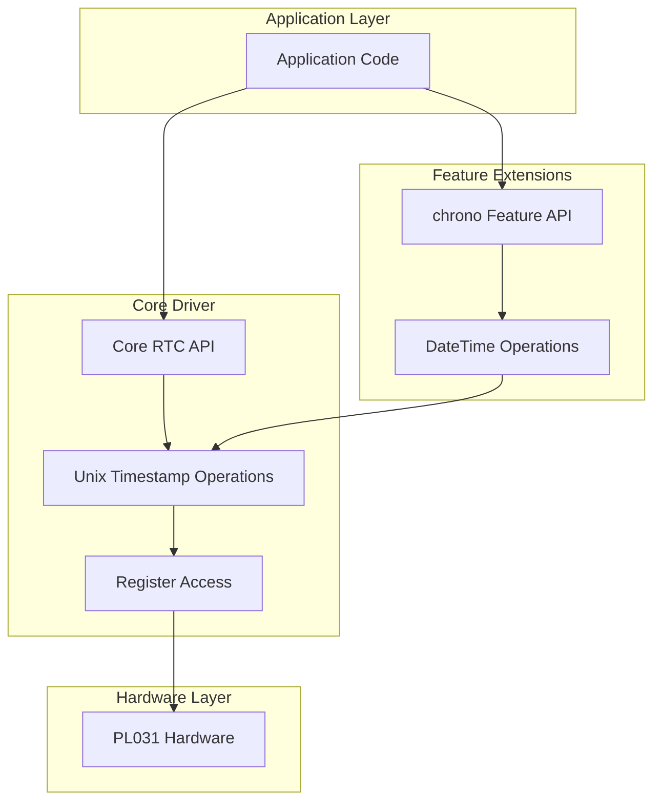
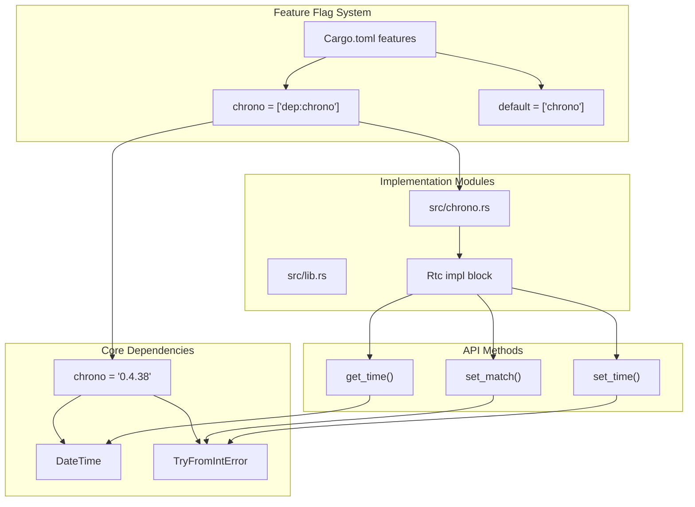
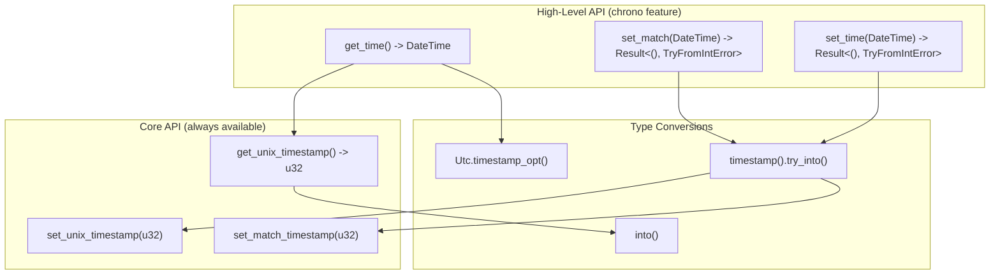

# Features and Extensions

> **Relevant source files**
> * [Cargo.toml](https://github.com/arceos-org/arm_pl031/blob/8cc6761d/Cargo.toml)
> * [src/chrono.rs](https://github.com/arceos-org/arm_pl031/blob/8cc6761d/src/chrono.rs)

This document covers the optional features and extensions available in the arm_pl031 crate. These features provide additional functionality beyond the core RTC driver implementation, allowing developers to choose the appropriate level of abstraction and functionality for their specific use cases.

For information about the core driver implementation and basic functionality, see [Core Driver Implementation](/arceos-org/arm_pl031/3-core-driver-implementation). For details about configuration and build options, see [Development and Contributing](/arceos-org/arm_pl031/5-development-and-contributing).

## Feature Overview

The arm_pl031 crate provides a modular architecture where additional functionality can be enabled through feature flags. This design keeps the core driver lightweight while allowing optional enhancements for improved developer experience.

### Available Features

|Feature|Description|Default|Dependencies|
| --- | --- | --- | --- |
|chrono|High-level date/time operations using chrono crate|Enabled|chrono v0.4.38|

The crate follows a minimal core approach where the base functionality requires no external dependencies, while optional features add convenience layers on top of the core API.

**Feature Architecture**

Sources: [Cargo.toml(L14 - L19)&emsp;](https://github.com/arceos-org/arm_pl031/blob/8cc6761d/Cargo.toml#L14-L19) [src/chrono.rs(L1 - L26)&emsp;](https://github.com/arceos-org/arm_pl031/blob/8cc6761d/src/chrono.rs#L1-L26)

## Feature Integration Architecture

The feature system in arm_pl031 uses Rust's conditional compilation to provide optional functionality without affecting the core driver when features are disabled.

### Chrono Feature Integration

Sources: [Cargo.toml(L15 - L19)&emsp;](https://github.com/arceos-org/arm_pl031/blob/8cc6761d/Cargo.toml#L15-L19) [src/chrono.rs(L1 - L4)&emsp;](https://github.com/arceos-org/arm_pl031/blob/8cc6761d/src/chrono.rs#L1-L4)

## API Layer Mapping

The feature system creates distinct API layers that build upon each other, allowing developers to choose the appropriate abstraction level.

### Method Resolution and Type Conversion

Sources: [src/chrono.rs(L6 - L25)&emsp;](https://github.com/arceos-org/arm_pl031/blob/8cc6761d/src/chrono.rs#L6-L25)

## Configuration and Build Integration

The feature system integrates with Cargo's dependency resolution and compilation process to provide clean separation between core and optional functionality.

### Dependency Management

The chrono feature demonstrates careful dependency management:

* **Optional Dependency**: The chrono crate is marked as `optional = true` in [Cargo.toml(L15)&emsp;](https://github.com/arceos-org/arm_pl031/blob/8cc6761d/Cargo.toml#L15-L15)
* **No Default Features**: chrono is imported with `default-features = false` to maintain minimal footprint
* **Feature Gate**: The `dep:chrono` syntax ensures the dependency is only included when the feature is enabled
* **Default Enabled**: The feature is enabled by default for convenience but can be disabled for minimal builds

### Build Configuration Matrix

|Feature State|Dependencies|API Available|Use Case|
| --- | --- | --- | --- |
|--no-default-features|None|Core timestamp API only|Minimal embedded systems|
|--features chrono|chrono v0.4.38|Core + DateTime API|Standard embedded applications|
|Default|chrono v0.4.38|Core + DateTime API|General purpose usage|

Sources: [Cargo.toml(L14 - L19)&emsp;](https://github.com/arceos-org/arm_pl031/blob/8cc6761d/Cargo.toml#L14-L19)

## Error Handling Strategy

The feature extensions implement consistent error handling patterns that integrate with the core driver's safety model.

### Error Type Integration

The chrono feature introduces `TryFromIntError` for handling timestamp conversion failures that can occur when converting between `DateTime<Utc>` (using `i64` timestamps) and the PL031's `u32` register format.

**Error Flow Pattern**:

1. `DateTime<Utc>` provides `timestamp()` returning `i64`
2. Conversion to `u32` via `try_into()` may fail for out-of-range values
3. Methods return `Result<(), TryFromIntError>` to propagate conversion errors
4. Core driver methods remain infallible for valid `u32` inputs

This design ensures that type safety is maintained across the feature boundary while preserving the core driver's simple error model.

Sources: [src/chrono.rs(L3)&emsp;](https://github.com/arceos-org/arm_pl031/blob/8cc6761d/src/chrono.rs#L3-L3) [src/chrono.rs(L15 - L17)&emsp;](https://github.com/arceos-org/arm_pl031/blob/8cc6761d/src/chrono.rs#L15-L17) [src/chrono.rs(L22 - L24)&emsp;](https://github.com/arceos-org/arm_pl031/blob/8cc6761d/src/chrono.rs#L22-L24)