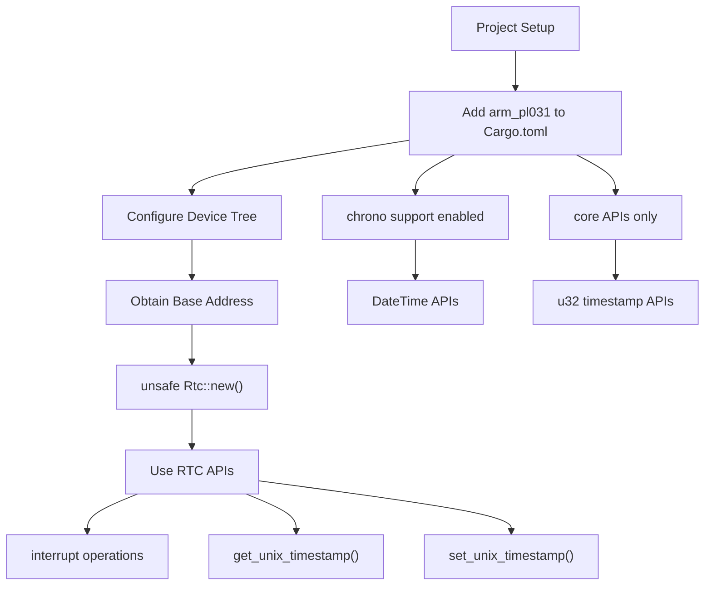
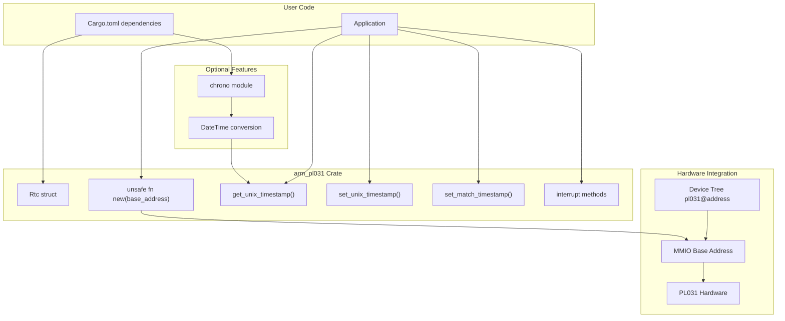

# Getting Started

> **Relevant source files**
> * [Cargo.toml](https://github.com/arceos-org/arm_pl031/blob/8cc6761d/Cargo.toml)
> * [README.md](https://github.com/arceos-org/arm_pl031/blob/8cc6761d/README.md)
> * [src/lib.rs](https://github.com/arceos-org/arm_pl031/blob/8cc6761d/src/lib.rs)

This page provides practical guidance for integrating and using the `arm_pl031` driver in your projects. It covers the essential steps to add the crate as a dependency, initialize the driver, and perform basic time operations. For detailed installation instructions and dependency management, see [Installation and Dependencies](/arceos-org/arm_pl031/2.1-installation-and-dependencies). For comprehensive usage examples and device tree configuration details, see [Basic Usage and Examples](/arceos-org/arm_pl031/2.2-basic-usage-and-examples).

## Integration Workflow

The following diagram shows the typical workflow for integrating the `arm_pl031` driver into an embedded project:



Sources: [Cargo.toml(L1 - L20)&emsp;](https://github.com/arceos-org/arm_pl031/blob/8cc6761d/Cargo.toml#L1-L20) [src/lib.rs(L46 - L60)&emsp;](https://github.com/arceos-org/arm_pl031/blob/8cc6761d/src/lib.rs#L46-L60) [README.md(L9 - L14)&emsp;](https://github.com/arceos-org/arm_pl031/blob/8cc6761d/README.md#L9-L14)

## Core Driver Components

This diagram maps the key components you'll interact with when using the driver:



Sources: [src/lib.rs(L42 - L44)&emsp;](https://github.com/arceos-org/arm_pl031/blob/8cc6761d/src/lib.rs#L42-L44) [src/lib.rs(L56 - L60)&emsp;](https://github.com/arceos-org/arm_pl031/blob/8cc6761d/src/lib.rs#L56-L60) [Cargo.toml(L14 - L19)&emsp;](https://github.com/arceos-org/arm_pl031/blob/8cc6761d/Cargo.toml#L14-L19) [README.md(L27 - L33)&emsp;](https://github.com/arceos-org/arm_pl031/blob/8cc6761d/README.md#L27-L33)

## Quick Start Example

Here's the minimal code needed to read the current time from a PL031 RTC:

Add the dependency to your `Cargo.toml`:

```
[dependencies]
arm_pl031 = "0.2.1"
```

Basic usage in your code:

```javascript
use arm_pl031::Rtc;

// Initialize with hardware base address from device tree
let rtc = unsafe { Rtc::new(0x901_0000 as *mut u32) };

// Read current time as Unix timestamp
let current_time = rtc.get_unix_timestamp();
```

Sources: [Cargo.toml(L2 - L3)&emsp;](https://github.com/arceos-org/arm_pl031/blob/8cc6761d/Cargo.toml#L2-L3) [README.md(L9 - L14)&emsp;](https://github.com/arceos-org/arm_pl031/blob/8cc6761d/README.md#L9-L14) [src/lib.rs(L56 - L67)&emsp;](https://github.com/arceos-org/arm_pl031/blob/8cc6761d/src/lib.rs#L56-L67)

## Essential Requirements

|Requirement|Details|Code Reference|
| --- | --- | --- |
|Base Address|Must point to PL031 MMIO registers|src/lib.rs53-55|
|Address Alignment|Must be 4-byte aligned|src/lib.rs55|
|Memory Mapping|Must be mapped as device memory|src/lib.rs53-54|
|Safety|Constructor requiresunsafedue to raw pointer|src/lib.rs51-56|
|Device Tree|Hardware address typically from device tree|README.md19-37|

## Device Tree Configuration

The PL031 device must be properly configured in your device tree. Here's a typical configuration:

```
pl031@9010000 {
    clock-names = "apb_pclk";
    clocks = <0x8000>;
    interrupts = <0x00 0x02 0x04>;
    reg = <0x00 0x9010000 0x00 0x1000>;
    compatible = "arm,pl031", "arm,primecell";
};
```

The `reg` property provides the base address (`0x9010000`) and size (`0x1000`) that you'll use when calling `Rtc::new()`.

Sources: [README.md(L27 - L33)&emsp;](https://github.com/arceos-org/arm_pl031/blob/8cc6761d/README.md#L27-L33)

## Feature Configuration

The crate supports optional features that can be controlled in your `Cargo.toml`:

|Feature|Default|Purpose|Dependencies|
| --- | --- | --- | --- |
|chrono|Enabled|DateTime conversion support|chrono = "0.4.38"|
|(none)|Core only|Unix timestamp operations only|None|

To use only core functionality without `chrono`:

```
[dependencies]
arm_pl031 = { version = "0.2.1", default-features = false }
```

To explicitly enable chrono support:

```
[dependencies]
arm_pl031 = { version = "0.2.1", features = ["chrono"] }
```

Sources: [Cargo.toml(L14 - L19)&emsp;](https://github.com/arceos-org/arm_pl031/blob/8cc6761d/Cargo.toml#L14-L19) [src/lib.rs(L10 - L11)&emsp;](https://github.com/arceos-org/arm_pl031/blob/8cc6761d/src/lib.rs#L10-L11)

## Next Steps

* For complete installation instructions and dependency management, see [Installation and Dependencies](/arceos-org/arm_pl031/2.1-installation-and-dependencies)
* For comprehensive usage examples and advanced configuration, see [Basic Usage and Examples](/arceos-org/arm_pl031/2.2-basic-usage-and-examples)
* For understanding the driver architecture, see [Core Driver Implementation](/arceos-org/arm_pl031/3-core-driver-implementation)
* For chrono DateTime integration details, see [Chrono Integration](/arceos-org/arm_pl031/4.1-chrono-integration)