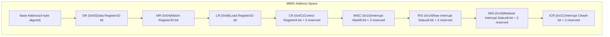
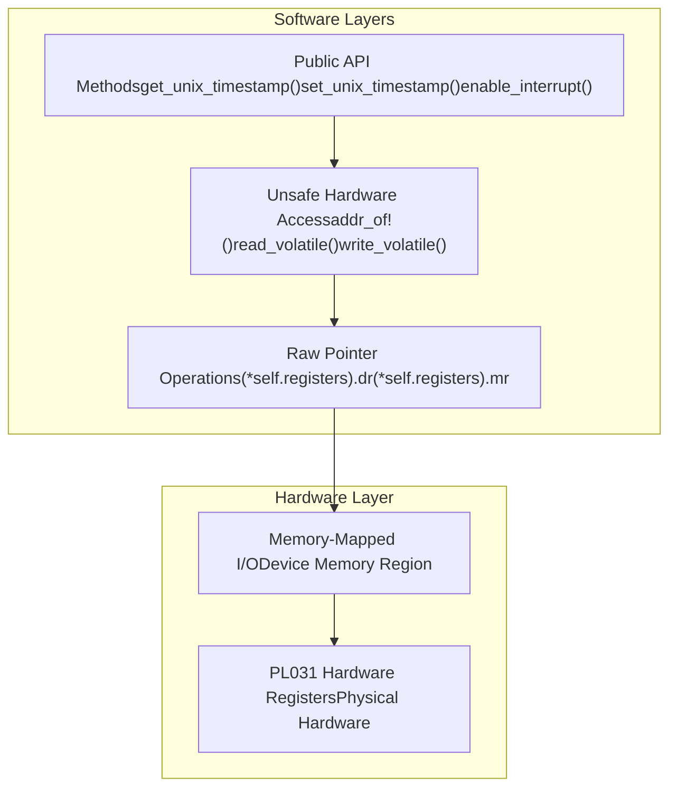
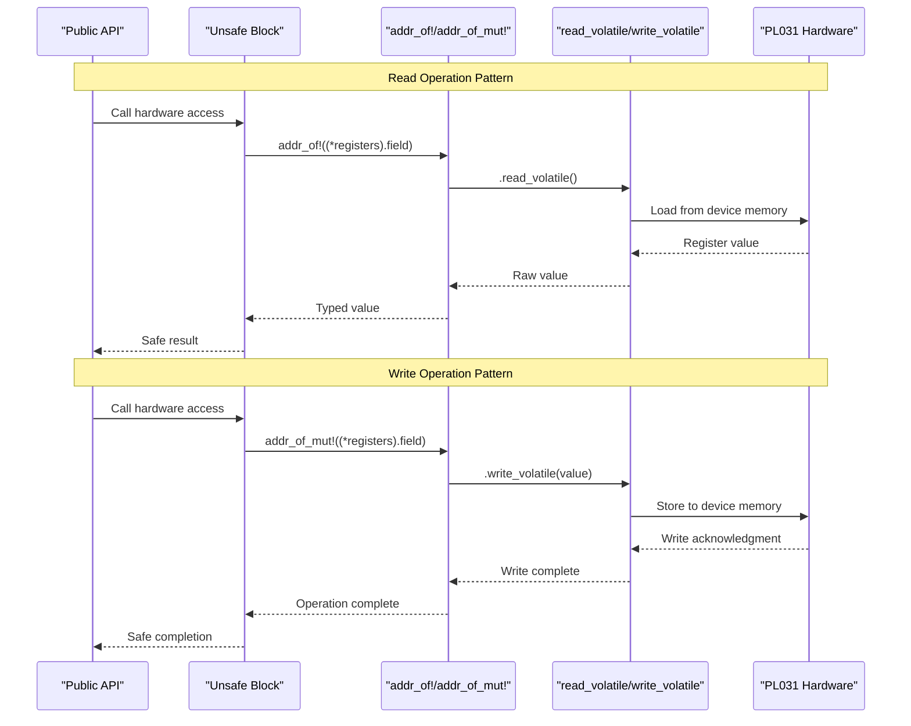
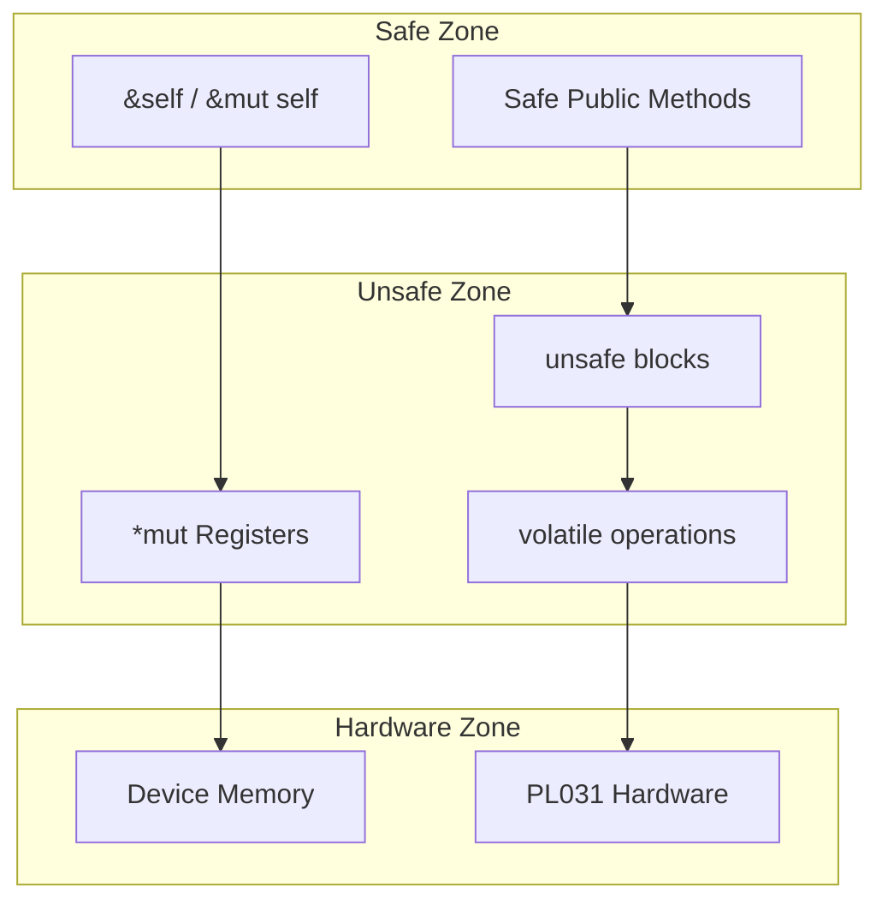
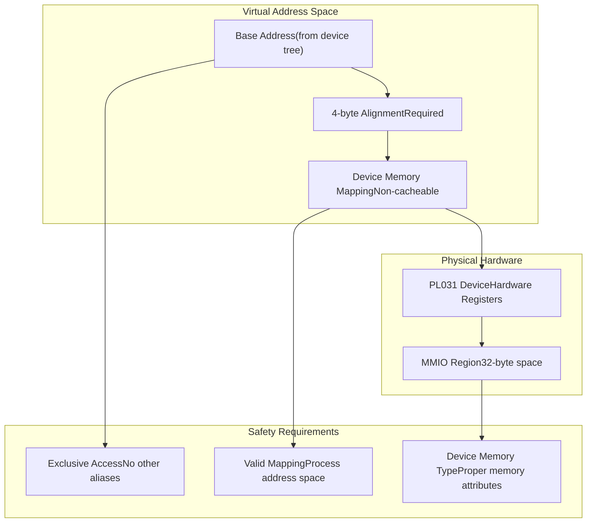

# Hardware Interface and MMIO

> **Relevant source files**
> * [src/lib.rs](https://github.com/arceos-org/arm_pl031/blob/8cc6761d/src/lib.rs)

This document details how the ARM PL031 RTC driver interfaces with the physical hardware through Memory-Mapped I/O (MMIO) operations. It covers the register layout, volatile access patterns, memory safety boundaries, and the hardware abstraction layer implementation.

For information about specific register operations and their meanings, see [Register Operations](/arceos-org/arm_pl031/3.3-register-operations). For details about the overall driver architecture, see [Driver Architecture and Design](/arceos-org/arm_pl031/3.1-driver-architecture-and-design).

## MMIO Register Layout

The PL031 hardware interface is accessed through a well-defined memory-mapped register layout represented by the `Registers` struct. This struct provides a direct mapping to the hardware register space with proper alignment and padding.

**PL031 Register Memory Layout**

The `Registers` struct enforces proper memory layout through careful use of padding and alignment directives. Each register is positioned according to the PL031 specification, with reserved bytes maintaining proper spacing between hardware registers.

Sources: [src/lib.rs(L15 - L39)&emsp;](https://github.com/arceos-org/arm_pl031/blob/8cc6761d/src/lib.rs#L15-L39)

## Hardware Access Abstraction

The driver implements a three-layer abstraction for hardware access, ensuring both safety and performance while maintaining direct hardware control.

**Hardware Access Layers**

The `Rtc` struct maintains a single `*mut Registers` pointer that serves as the bridge between safe Rust code and raw hardware access. All hardware operations go through volatile memory operations to ensure proper interaction with device memory.

Sources: [src/lib.rs(L42 - L44)&emsp;](https://github.com/arceos-org/arm_pl031/blob/8cc6761d/src/lib.rs#L42-L44) [src/lib.rs(L56 - L60)&emsp;](https://github.com/arceos-org/arm_pl031/blob/8cc6761d/src/lib.rs#L56-L60)

## Volatile Memory Operations

All hardware register access uses volatile operations to prevent compiler optimizations that could interfere with hardware behavior. The driver employs a consistent pattern for both read and write operations.

**MMIO Operation Patterns**

The driver uses `addr_of!` and `addr_of_mut!` macros to safely obtain field addresses from the raw pointer without creating intermediate references, avoiding undefined behavior while maintaining direct hardware access.

Sources: [src/lib.rs(L63 - L67)&emsp;](https://github.com/arceos-org/arm_pl031/blob/8cc6761d/src/lib.rs#L63-L67) [src/lib.rs(L70 - L74)&emsp;](https://github.com/arceos-org/arm_pl031/blob/8cc6761d/src/lib.rs#L70-L74) [src/lib.rs(L78 - L82)&emsp;](https://github.com/arceos-org/arm_pl031/blob/8cc6761d/src/lib.rs#L78-L82)

## Memory Safety Model

The hardware interface implements a carefully designed safety model that isolates unsafe operations while providing safe public APIs. The safety boundaries are clearly defined and documented.

|Operation Type|Safety Level|Access Pattern|Usage|
| --- | --- | --- | --- |
|Construction|Unsafe|Rtc::new()|Requires valid MMIO base address|
|Register Read|Safe|get_unix_timestamp()|Volatile read through safe wrapper|
|Register Write|Safe|set_unix_timestamp()|Volatile write through safe wrapper|
|Interrupt Control|Safe|enable_interrupt()|Masked volatile operations|

The `Rtc` struct implements `Send` and `Sync` traits with careful safety justification, allowing the driver to be used in multi-threaded contexts while maintaining memory safety guarantees.

**Safety Boundary Implementation**

Sources: [src/lib.rs(L51 - L60)&emsp;](https://github.com/arceos-org/arm_pl031/blob/8cc6761d/src/lib.rs#L51-L60) [src/lib.rs(L123 - L128)&emsp;](https://github.com/arceos-org/arm_pl031/blob/8cc6761d/src/lib.rs#L123-L128)

## Address Space Configuration

The hardware interface requires proper address space configuration to function correctly. The base address must point to a valid PL031 device memory region with appropriate mapping characteristics.

**Address Space Requirements**

The driver expects the base address to be obtained from platform-specific sources such as device tree configuration, and requires the caller to ensure proper memory mapping with device memory characteristics.

Sources: [src/lib.rs(L47 - L60)&emsp;](https://github.com/arceos-org/arm_pl031/blob/8cc6761d/src/lib.rs#L47-L60)