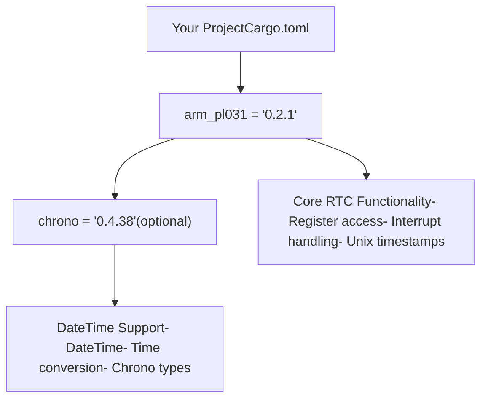
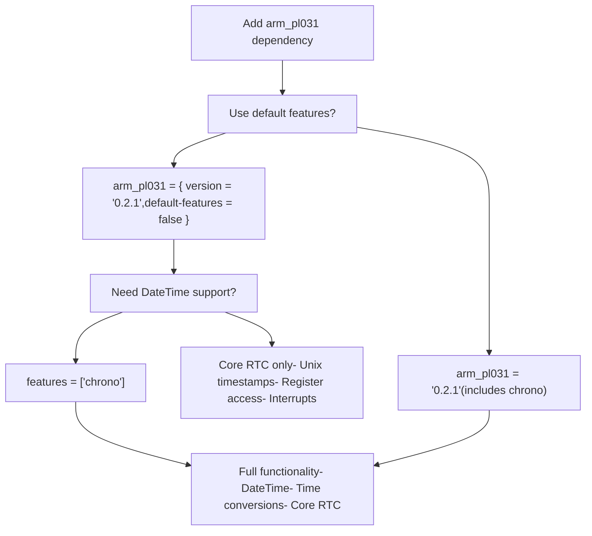
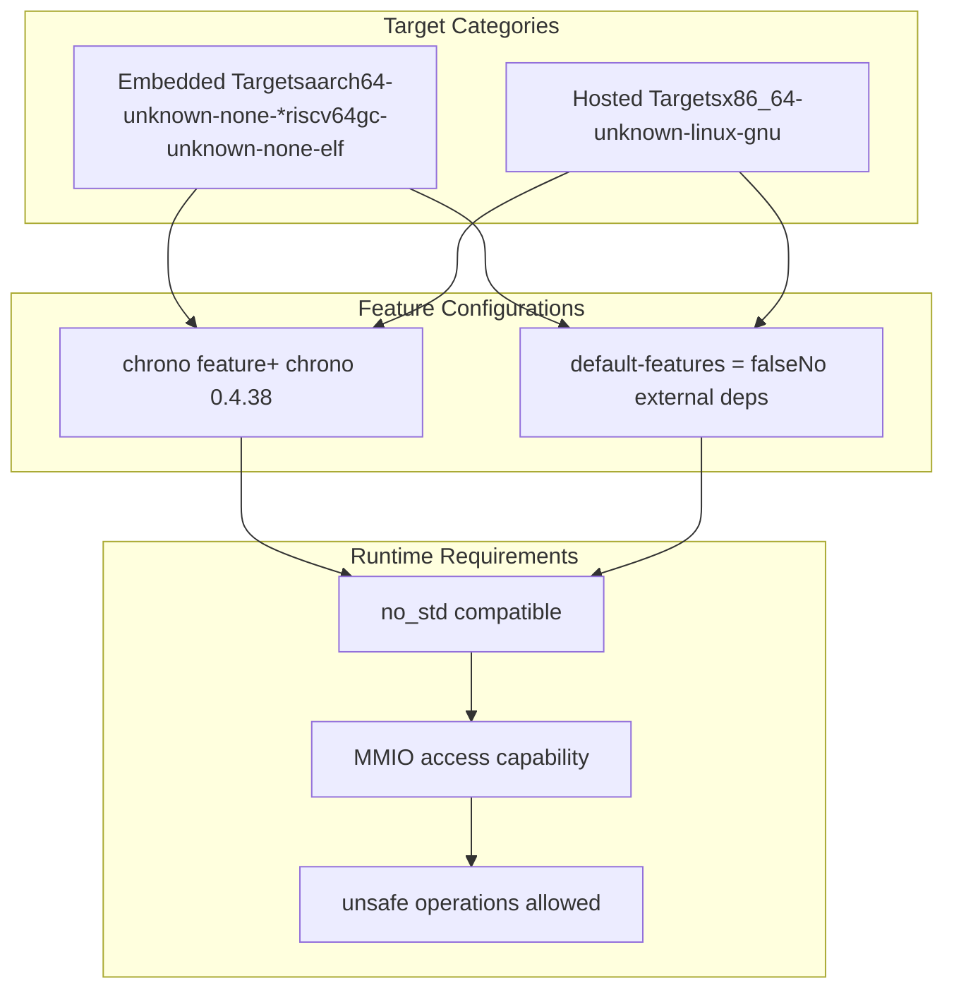

# Installation and Dependencies

> **Relevant source files**
> * [Cargo.toml](https://github.com/arceos-org/arm_pl031/blob/8cc6761d/Cargo.toml)

This section covers how to integrate the `arm_pl031` crate into your Rust project, configure optional features, and manage dependencies. It focuses on the practical aspects of adding the crate to your `Cargo.toml` and understanding the available configuration options.

For information about using the driver after installation, see [Basic Usage and Examples](/arceos-org/arm_pl031/2.2-basic-usage-and-examples). For detailed feature configuration and `no_std` compatibility, see [Feature Configuration](/arceos-org/arm_pl031/4.2-feature-configuration).

## Adding the Crate to Your Project

The `arm_pl031` crate is designed for embedded systems requiring ARM PL031 RTC functionality. Add it to your project's `Cargo.toml` dependencies section:

```
[dependencies]
arm_pl031 = "0.2.1"
```

The crate is published on crates.io with the identifier `arm_pl031` and follows semantic versioning. The current stable version provides the core RTC driver functionality with optional chrono integration.

**Dependency Graph**



Sources: [Cargo.toml(L1 - L20)&emsp;](https://github.com/arceos-org/arm_pl031/blob/8cc6761d/Cargo.toml#L1-L20)

## Feature Configuration

The crate provides feature-based configuration to balance functionality with dependency minimization. The available features are controlled through Cargo feature flags.

|Feature|Default|Purpose|Dependencies|
| --- | --- | --- | --- |
|chrono|✓|EnablesDateTime<Utc>support and time conversion utilities|chrono = "0.4.38"|

**Default Configuration**

By default, the `chrono` feature is enabled, providing high-level time handling capabilities:

```markdown
[dependencies]
arm_pl031 = "0.2.1"  # chrono feature included by default
```

**Minimal Configuration**

To minimize dependencies and use only core RTC functionality, disable default features:

```
[dependencies]
arm_pl031 = { version = "0.2.1", default-features = false }
```

**Custom Feature Selection**

Enable specific features explicitly:

```
[dependencies]
arm_pl031 = { version = "0.2.1", default-features = false, features = ["chrono"] }
```

**Feature Configuration Flow**



Sources: [Cargo.toml(L14 - L19)&emsp;](https://github.com/arceos-org/arm_pl031/blob/8cc6761d/Cargo.toml#L14-L19)

## Dependency Management

The crate maintains minimal external dependencies to support embedded environments and `no_std` targets.

**Direct Dependencies**

The only optional dependency is the `chrono` crate, configured with minimal features:

```
chrono = { version = "0.4.38", default-features = false, optional = true }
```

This configuration ensures:

* No standard library dependencies from chrono
* Compatible with `no_std` environments
* Minimal binary size impact when enabled
* Optional inclusion based on feature flags

**Platform Compatibility**

The crate is designed for multiple target architectures:

|Target|Support|Use Case|
| --- | --- | --- |
|aarch64-unknown-none-softfloat|✓|Bare metal ARM64|
|x86_64-unknown-linux-gnu|✓|Development/testing|
|x86_64-unknown-none|✓|Bare metal x86_64|
|riscv64gc-unknown-none-elf|✓|RISC-V embedded|

**No Standard Library Support**

The crate is `no_std` compatible by default, making it suitable for embedded environments:

```
#![no_std]  // Your embedded project
use arm_pl031::Rtc;
```

**Dependency Resolution Matrix**



Sources: [Cargo.toml(L12)&emsp;](https://github.com/arceos-org/arm_pl031/blob/8cc6761d/Cargo.toml#L12-L12) [Cargo.toml(L15)&emsp;](https://github.com/arceos-org/arm_pl031/blob/8cc6761d/Cargo.toml#L15-L15)

## License and Legal Requirements

The crate is available under multiple license options to accommodate different project requirements:

* `GPL-3.0-or-later` - GNU General Public License v3.0 or later
* `Apache-2.0` - Apache License 2.0
* `MulanPSL-2.0` - Mulan Permissive Software License v2

Projects can choose the most appropriate license for their specific use case and compliance requirements.

Sources: [Cargo.toml(L7)&emsp;](https://github.com/arceos-org/arm_pl031/blob/8cc6761d/Cargo.toml#L7-L7)