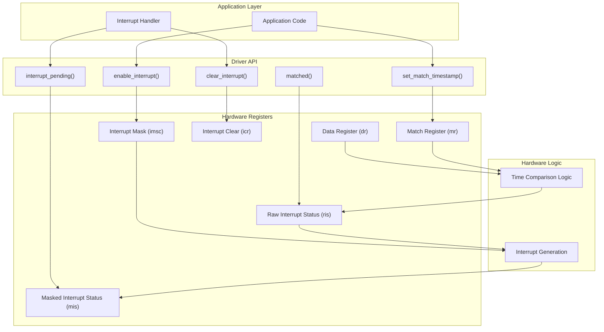
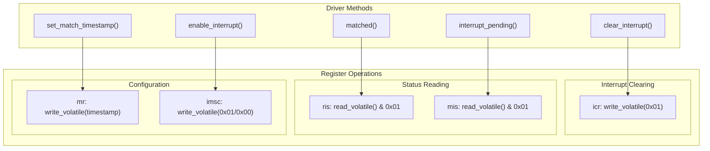
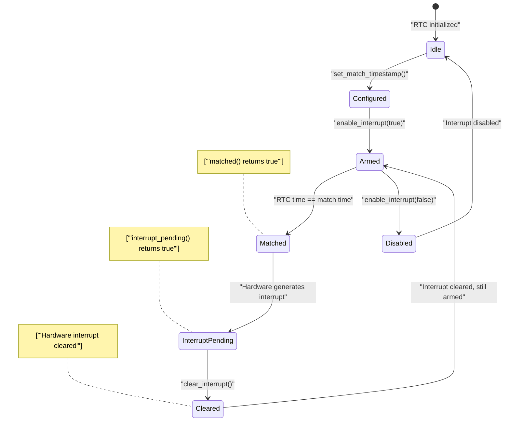
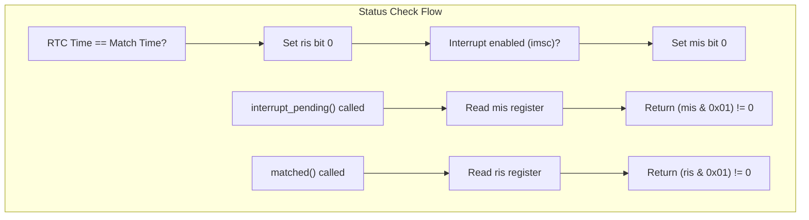

# Interrupt Handling

> **Relevant source files**
> * [src/lib.rs](https://github.com/arceos-org/arm_pl031/blob/8cc6761d/src/lib.rs)

This page covers the interrupt handling capabilities of the ARM PL031 RTC driver, including the interrupt registers, match-based interrupt generation, status checking, and interrupt management functions. The interrupt system allows applications to receive notifications when the RTC reaches a specific timestamp.

For general driver architecture and register operations, see [3.1](/arceos-org/arm_pl031/3.1-driver-architecture-and-design) and [3.3](/arceos-org/arm_pl031/3.3-register-operations). For memory safety considerations related to interrupt handling, see [3.5](/arceos-org/arm_pl031/3.5-memory-safety-and-concurrency).

## Interrupt System Overview

The PL031 RTC interrupt system is based on a timestamp matching mechanism. When the current RTC time matches a pre-configured match value, an interrupt is generated if enabled. The driver provides safe abstractions over the hardware interrupt registers to manage this functionality.



Sources: [src/lib.rs(L17 - L39)&emsp;](https://github.com/arceos-org/arm_pl031/blob/8cc6761d/src/lib.rs#L17-L39) [src/lib.rs(L78 - L120)&emsp;](https://github.com/arceos-org/arm_pl031/blob/8cc6761d/src/lib.rs#L78-L120)

## Interrupt Registers Layout

The PL031 interrupt system uses five dedicated registers within the `Registers` structure to manage interrupt functionality:

|Register|Offset|Size|Purpose|Access|
| --- | --- | --- | --- | --- |
|mr|0x04|32-bit|Match Register - stores target timestamp|Read/Write|
|imsc|0x10|8-bit|Interrupt Mask Set/Clear - enables/disables interrupts|Read/Write|
|ris|0x14|8-bit|Raw Interrupt Status - shows match status regardless of mask|Read|
|mis|0x18|8-bit|Masked Interrupt Status - shows actual interrupt state|Read|
|icr|0x1C|8-bit|Interrupt Clear Register - clears pending interrupts|Write|



Sources: [src/lib.rs(L17 - L39)&emsp;](https://github.com/arceos-org/arm_pl031/blob/8cc6761d/src/lib.rs#L17-L39) [src/lib.rs(L78 - L120)&emsp;](https://github.com/arceos-org/arm_pl031/blob/8cc6761d/src/lib.rs#L78-L120)

## Interrupt Lifecycle and State Management

The interrupt system follows a well-defined lifecycle from configuration through interrupt generation to clearing:



### Interrupt Configuration

The `set_match_timestamp()` method configures when an interrupt should be generated:

```rust
pub fn set_match_timestamp(&mut self, match_timestamp: u32)
```

This function writes the target timestamp to the match register (`mr`). When the RTC's data register (`dr`) equals this value, the hardware sets the raw interrupt status bit.

### Interrupt Enabling and Masking

The `enable_interrupt()` method controls whether interrupts are actually generated:

```rust
pub fn enable_interrupt(&mut self, mask: bool)
```

When `mask` is `true`, the function writes `0x01` to the interrupt mask register (`imsc`), enabling interrupts. When `false`, it writes `0x00`, disabling them.

Sources: [src/lib.rs(L78 - L82)&emsp;](https://github.com/arceos-org/arm_pl031/blob/8cc6761d/src/lib.rs#L78-L82) [src/lib.rs(L108 - L113)&emsp;](https://github.com/arceos-org/arm_pl031/blob/8cc6761d/src/lib.rs#L108-L113)

## Status Checking and Interrupt Detection

The driver provides two distinct methods for checking interrupt status, each serving different purposes:

### Raw Match Status (matched())

The `matched()` method checks the raw interrupt status register (`ris`) to determine if the match condition has occurred, regardless of whether interrupts are enabled:

```rust
pub fn matched(&self) -> bool
```

This method reads the `ris` register and returns `true` if bit 0 is set, indicating that the RTC time matches the match register value.

### Masked Interrupt Status (interrupt_pending())

The `interrupt_pending()` method checks the masked interrupt status register (`mis`) to determine if there is an actual pending interrupt:

```rust
pub fn interrupt_pending(&self) -> bool
```

This method returns `true` only when both the match condition is met AND interrupts are enabled. This is the method typically used in interrupt handlers.



Sources: [src/lib.rs(L86 - L91)&emsp;](https://github.com/arceos-org/arm_pl031/blob/8cc6761d/src/lib.rs#L86-L91) [src/lib.rs(L97 - L102)&emsp;](https://github.com/arceos-org/arm_pl031/blob/8cc6761d/src/lib.rs#L97-L102)

## Interrupt Clearing

The `clear_interrupt()` method resets the interrupt state by writing to the interrupt clear register (`icr`):

```rust
pub fn clear_interrupt(&mut self)
```

This function writes `0x01` to the `icr` register, which clears both the raw interrupt status (`ris`) and masked interrupt status (`mis`) bits. After clearing, the interrupt system can generate new interrupts when the next match condition occurs.

## Usage Patterns and Best Practices

### Basic Interrupt Setup

```
// Configure interrupt for specific timestamp
rtc.set_match_timestamp(target_time);
rtc.enable_interrupt(true);
```

### Interrupt Handler Pattern

```
// In interrupt handler
if rtc.interrupt_pending() {
    // Handle the interrupt
    handle_rtc_interrupt();
    
    // Clear the interrupt
    rtc.clear_interrupt();
    
    // Optionally set new match time
    rtc.set_match_timestamp(next_target_time);
}
```

### Polling Pattern (Alternative to Interrupts)

```
// Poll for match without using interrupts
rtc.enable_interrupt(false);
loop {
    if rtc.matched() {
        handle_rtc_event();
        // Set new match time or break
        rtc.set_match_timestamp(next_target_time);
    }
    // Other work...
}
```

Sources: [src/lib.rs(L78 - L120)&emsp;](https://github.com/arceos-org/arm_pl031/blob/8cc6761d/src/lib.rs#L78-L120)

## Thread Safety and Concurrency

The interrupt-related methods maintain the same thread safety guarantees as the rest of the driver. Reading methods like `matched()` and `interrupt_pending()` are safe to call concurrently, while writing methods like `set_match_timestamp()`, `enable_interrupt()`, and `clear_interrupt()` require mutable access to ensure atomicity.

The driver implements `Send` and `Sync` traits, allowing the RTC instance to be shared across threads with appropriate synchronization mechanisms.

Sources: [src/lib.rs(L123 - L128)&emsp;](https://github.com/arceos-org/arm_pl031/blob/8cc6761d/src/lib.rs#L123-L128)