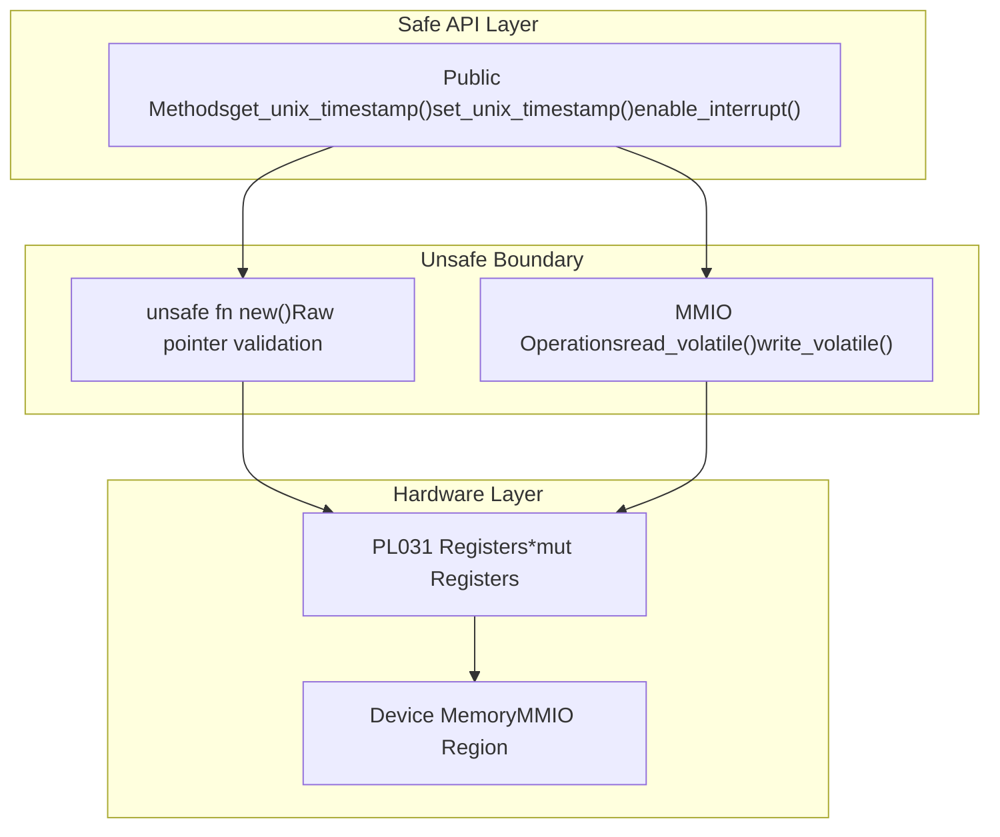
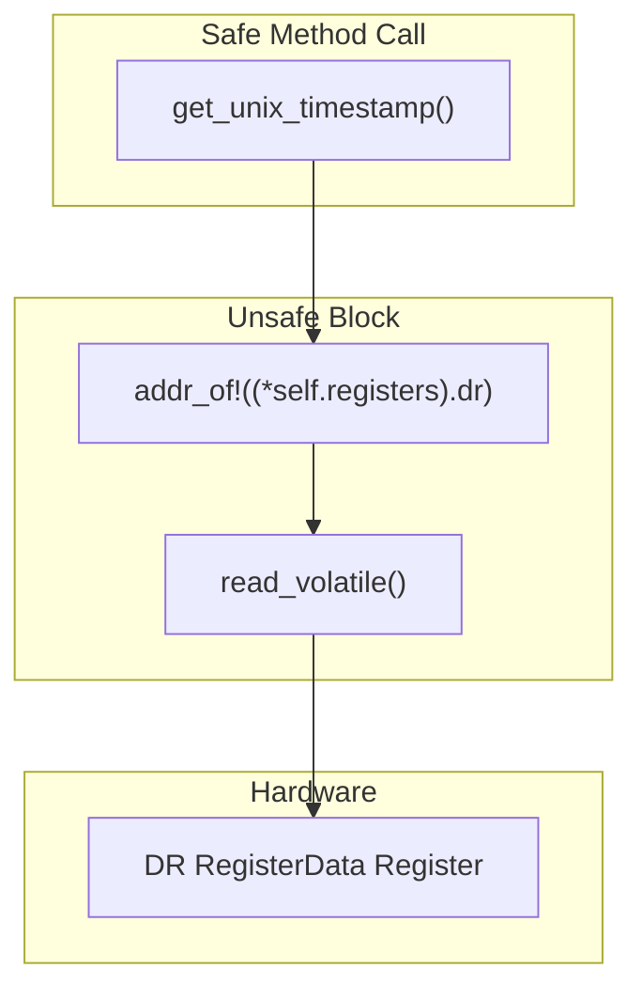
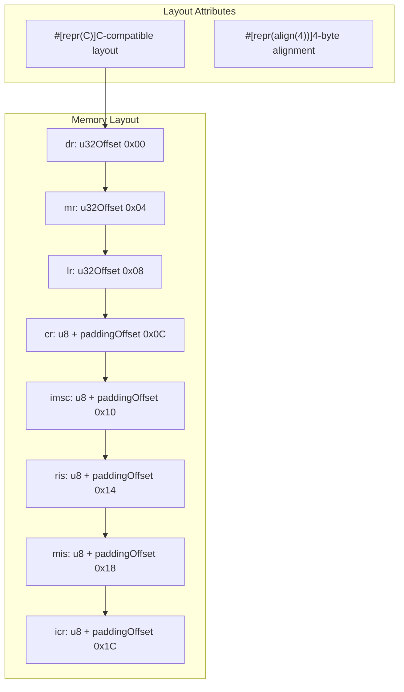
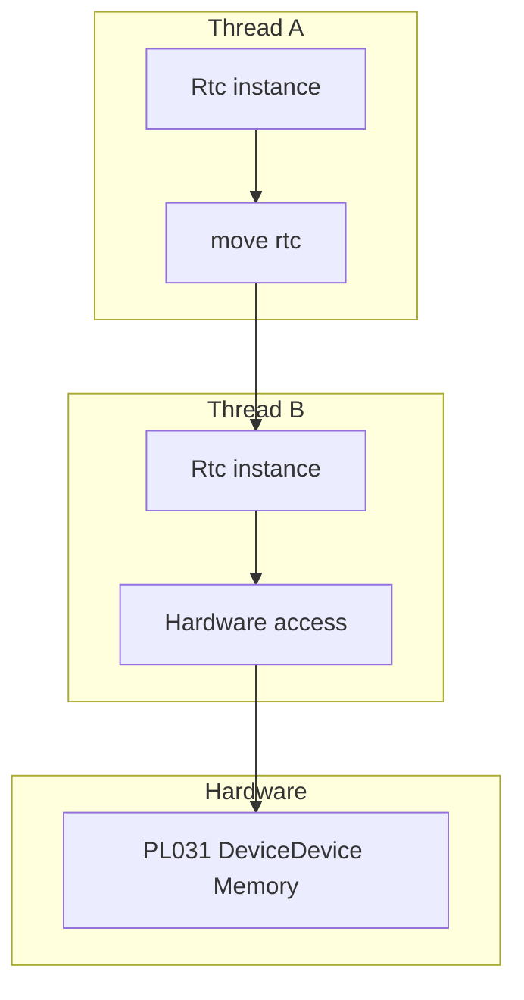
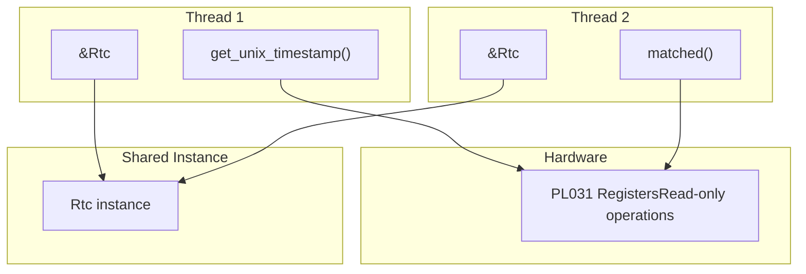
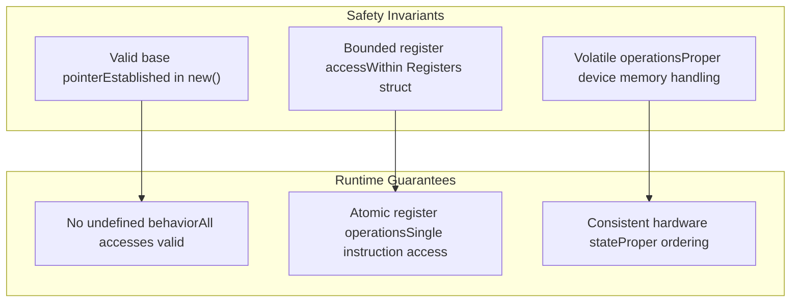

# Memory Safety and Concurrency

> **Relevant source files**
> * [src/lib.rs](https://github.com/arceos-org/arm_pl031/blob/8cc6761d/src/lib.rs)

This page covers the memory safety model and concurrency characteristics of the ARM PL031 RTC driver. It explains how the driver maintains safety while performing low-level hardware operations, the boundaries between safe and unsafe code, and the thread safety guarantees provided by the implementation.

For information about the core driver architecture, see [Driver Architecture and Design](/arceos-org/arm_pl031/3.1-driver-architecture-and-design). For details about hardware register operations, see [Register Operations](/arceos-org/arm_pl031/3.3-register-operations).

## Safety Model and Unsafe Boundaries

The arm_pl031 driver implements a layered safety model that encapsulates all unsafe hardware operations within well-defined boundaries while providing safe APIs to consumers.

### Unsafe Code Isolation

The driver concentrates all unsafe operations within the core `Rtc` implementation, creating a clear safety boundary:

Sources: [src/lib.rs(L46 - L60)&emsp;](https://github.com/arceos-org/arm_pl031/blob/8cc6761d/src/lib.rs#L46-L60) [src/lib.rs(L63 - L120)&emsp;](https://github.com/arceos-org/arm_pl031/blob/8cc6761d/src/lib.rs#L63-L120)

### Constructor Safety Requirements

The `unsafe fn new()` constructor establishes the fundamental safety contract for the entire driver. The caller must guarantee several critical invariants:

|Safety Requirement|Description|Validation|
| --- | --- | --- |
|Valid MMIO Mapping|Base address points to mapped PL031 registers|Caller responsibility|
|Exclusive Access|No other aliases to the memory region|Caller responsibility|
|Device Memory Type|Memory mapped as device memory, not normal memory|Caller responsibility|
|Alignment|Address aligned to 4-byte boundary|Enforced by#[repr(C, align(4))]|

Sources: [src/lib.rs(L51 - L60)&emsp;](https://github.com/arceos-org/arm_pl031/blob/8cc6761d/src/lib.rs#L51-L60)

## Hardware Register Access Safety

The driver uses specific patterns to ensure safe access to hardware registers while maintaining proper volatile semantics.

### Volatile Access Pattern

All register operations use volatile access through `addr_of!` and `addr_of_mut!` macros to prevent undefined behavior:

Sources: [src/lib.rs(L63 - L67)&emsp;](https://github.com/arceos-org/arm_pl031/blob/8cc6761d/src/lib.rs#L63-L67) [src/lib.rs(L70 - L74)&emsp;](https://github.com/arceos-org/arm_pl031/blob/8cc6761d/src/lib.rs#L70-L74)

### Register Layout Safety

The `Registers` struct uses precise memory layout control to match hardware expectations:

Sources: [src/lib.rs(L15 - L39)&emsp;](https://github.com/arceos-org/arm_pl031/blob/8cc6761d/src/lib.rs#L15-L39)

## Thread Safety and Concurrency Model

The driver implements explicit thread safety through manual `Send` and `Sync` trait implementations with documented safety reasoning.

### Send Implementation

The `Send` trait implementation allows the `Rtc` instance to be transferred between threads:

The implementation is safe because device memory can be accessed from any thread context.

Sources: [src/lib.rs(L123 - L124)&emsp;](https://github.com/arceos-org/arm_pl031/blob/8cc6761d/src/lib.rs#L123-L124)

### Sync Implementation

The `Sync` trait implementation allows shared references across threads:

The implementation is safe because shared references only allow read operations on device registers, which can be performed concurrently.

Sources: [src/lib.rs(L126 - L128)&emsp;](https://github.com/arceos-org/arm_pl031/blob/8cc6761d/src/lib.rs#L126-L128)

### Mutation Safety

Methods requiring `&mut self` ensure exclusive access for write operations:

|Method Category|Reference Type|Thread Safety|Hardware Impact|
| --- | --- | --- | --- |
|Read Operations|&self|Concurrent safe|Read-only register access|
|Write Operations|&mut self|Exclusive access|Register modification|
|Interrupt Management|&mut self|Exclusive access|Control register writes|

Sources: [src/lib.rs(L70 - L120)&emsp;](https://github.com/arceos-org/arm_pl031/blob/8cc6761d/src/lib.rs#L70-L120)

## Memory Safety Guarantees

The driver provides several layers of memory safety guarantees through its design:

### Pointer Validity

Once constructed with a valid base address, all register accesses are guaranteed to be within the mapped MMIO region:

Sources: [src/lib.rs(L56 - L60)&emsp;](https://github.com/arceos-org/arm_pl031/blob/8cc6761d/src/lib.rs#L56-L60) [src/lib.rs(L15 - L39)&emsp;](https://github.com/arceos-org/arm_pl031/blob/8cc6761d/src/lib.rs#L15-L39)

### Strict Safety Lints

The crate enforces strict safety requirements through compiler lints:

* `clippy::missing_safety_doc`: All unsafe functions must have safety documentation
* `clippy::undocumented_unsafe_blocks`: All unsafe blocks must have safety comments
* `unsafe_op_in_unsafe_fn`: Unsafe operations in unsafe functions must be explicit

Sources: [src/lib.rs(L4 - L8)&emsp;](https://github.com/arceos-org/arm_pl031/blob/8cc6761d/src/lib.rs#L4-L8)

This comprehensive safety model ensures that despite the low-level hardware interaction, the driver maintains Rust's memory safety guarantees while providing efficient concurrent access to the RTC hardware.